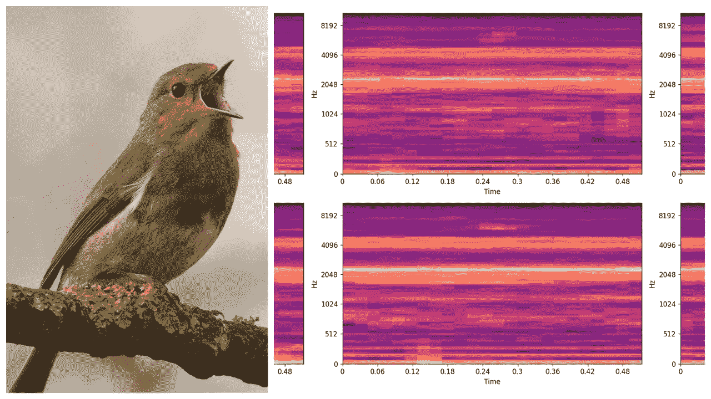
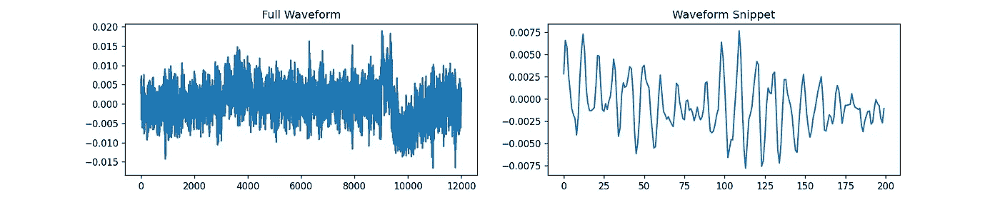
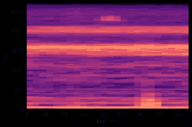

# "那是唧唧声吗？"在 PyTorch 上制作鸟类音频检测网络

> 原文：<https://towardsdatascience.com/was-that-a-chirp-making-a-bird-audio-detection-convnet-on-pytorch-88400450bb19?source=collection_archive---------32----------------------->

## 为什么鸟类声音探测对我们环境的未来如此重要

简·梅乌斯在 [Unsplash](https://unsplash.com?utm_source=medium&utm_medium=referral) 上拍摄的照片。由我编辑:)

# 介绍

> 你听说过自动语音识别，你听说过音乐标记和生成，但你听说过鸟类音频检测吗？

大约一年前，在我高二的时候，我第一次听说这种音频深度学习的用例。事实上，鸟音频检测(讽刺的缩写为 BAD，但我会尽量避免这个缩写😅)是我在深度学习和计算机科学方面做的第一批项目之一的主题。我参与了一个研究项目，在北阿拉斯加郊区使用纯音频探测鸟类的存在。*跃入其中，鸟音探测作为这样一个小众却又引人入胜的应用出现了！*在本文中，**我将向您展示如何在 BirdVox-70k 数据集上使用简单的卷积神经网络(CNN)来实现这一点。**

## 好吧，但是为什么鸟类音频检测很重要呢？

多年来，深度学习模型在鸟类音频检测应用中的使用一直在不断发展进步，有些人对此非常感兴趣是有原因的。首先，鸟类的移动速度很快，体型相对较小，已经很难追踪了。此外，不同种类的鸟类有自己独特的发声方式，这使得通过听觉和听觉来探测鸟类比亲眼目睹更为可取。最后，**由于鸟类是生态系统的一部分，它们的存在和迁徙模式通常是任何特定地区环境健康的警示信号。**

那么，为什么不录下一段音频片段，然后发送给人类，让他们稍后再听呢？*然而，让我们现实一点:*

> 手动标记音频既昂贵又繁琐，而且可能无法接近实时。

所以，这就是深度学习和 CNN 发挥作用的地方。如果我们的模型足够精确，我们可以通过在荒野周围设置麦克风来自动记录鸟类迁徙模式和跟踪鸟类物种。有了这些数据，我们可以更深入地了解我们世界的生态系统，并充分了解气候变化对我们环境的影响。

## 等等，上面那张图中那些很酷的情节是什么？

先说说声音的一切。声音基本上是由通过空气进入我们耳膜的奇特压力波组成的，可以用数字设备记录为信号。事实证明，我们可以将这个信号绘制如下:

音频信号/波形的示例图，没什么特别的。或者也许…

然而，这个长线图看起来并不特别吸引人，可以馈入任何深度学习模型，更不用说 CNN 了。事实上，如果我现在告诉你，上面的音频信号代表的是一只鸟的鸣叫，你会相信吗？很可能不是…你反而认为这是我随机创作的情节。 ***如果你认为鸟鸣声在第 10000 次滴答附近，如果我说鸟鸣声正好在中间，在第 6000 次滴答时呢？*** 重点是:

> 如果我们自己都不能对任何特定的信号图代表什么做出任何强有力的假设，我们怎么能指望深度学习模型做到这一点呢？

…我们并没有完全陷入困境。实际上还有另一种方式来表示音频:**频谱图**。频谱图是通过在一个小的时间窗口中记录频率的存在和各自的强度，沿着 x 轴(由时间单位表示)堆叠，直到频谱图覆盖音频信号的总持续时间而制成的。当时间窗在谱图创建过程中移动时，时间窗自身重叠是常见的，并且通常频率强度(音量或响度)用颜色表示，或者用数字表示，较高/较低值。

从上面显示的完全相同的波形伪造的声谱图。x 轴、y 轴和绘图颜色分别代表时间单位、频率(单位为赫兹)和频率强度。现在，你能清楚地分辨出这只鸟是不是在叫，什么时候叫吗？

给定来自上方的信号的频谱图，如果和当鸟鸣叫时，它应该更清楚。具体来说“只是因为”，你可以在 250 ms 标记处看到 6000 Hz 左右的独特活动；那是鸟鸣声。因此， **CNN 音频分类器通常将频谱图作为输入，鸟类音频检测模型也不例外。**

# 准备

## 数据集

为此，我使用了来自 BirdVox 的 [BirdVox-70k](https://zenodo.org/record/1226427) 数据集，它包含半秒(500 毫秒)的记录/波形，包含或不包含鸟啁啾声。该数据集来自其更大的兄弟，BirdVox-full-night，两者都是在 2015 年秋季在美国纽约伊萨卡记录的。每个波形的标签作为最后一位数字包含在每个文件名中(或者是`0`或者是`1`)。尽管 70k 数据集拥有大约 70，000 个数据片段(因此得名)，但我将只使用其中的三分之二(更确切地说，大约 50，000 个)，因为我的 [Paperspace](https://www.paperspace.com/) 帐户中的持久存储空间越来越少😦。

数据被捆绑在单独的 HDF5 文件中，这意味着我计划使用的已经减少的 50，000 个样本实际上被分成 4 个不同的. hdf5 文件。为了增加融合，每个波形被存储到一个有自己的“文件名”标签的组中，所有这些被存储到另一个称为“波形”的组中。即使在阅读了 [h5py 文档](https://h5py.readthedocs.io/en/stable/quick.html)之后，我还没有看到如上所述的这种安排。这些发现已经让我做了两个最糟糕的数据准备噩梦。几乎没有存储空间了，我无法改变已经给我的数据格式。这给我留下了最后一个选择:创建一个非常定制的 PyTorch 数据集类，这样我就可以继续了。

> 但在我继续之前，让我们听一些简短的音频样本，以及对数据集的一些简单数据分析(**警告—降低音量，因为样本可能比预期的更响**):

一些鸟积极的音频片段供您欣赏

一些鸟负面的音频片段供您欣赏

事实证明，在将所有文件组合在一起后，bird 阳性音频样本的比例正好是 50%，正如他们在[网站](https://wp.nyu.edu/birdvox/codedata/)中承诺的那样。每个鸟正波形的文件名还包括鸟叫的频率。综合所有这些，以下是我的发现:

我预计许多电话会相当高。 ***很大一部分样本都是如此，但绝大多数实际上更接近低频(2000–3500Hz)。*** 挺惊喜的！

## 数据集和数据加载器类

好了，我们知道有单独的. hdf5 文件要处理成一个“数据集”，每个文件都有一个有点笨拙的数据结构。**这些条件肯定需要一个定制的 PyTorch 数据集类来正确地加载我们的音频数据，以便稍后进行训练。**数据集类主要需要`__init__`和`__getitem__`函数(还有`__len__`，但这很简单)。以下是我计划每个人要做的事:

`**def __init__():**`

*   遍历所有四个文件中每个波形的每个组名&将它所属的文件和 HDF5 组添加到属于该类的列表中。
*   获取波形的标签(文件/组名的最后一位)并添加到属于该类的另一个列表中。例如，文件名`unit03_012712228_00000_0`表示没有任何鸟类发声。
*   准备一个应用于波形的变换函数，将其转换为声谱图(特别是 mel 缩放的声谱图)，并允许其他增强技术。

`**def __getitem__():**`

*   先前初始化的两个列表的索引
*   通过列表接收到波形的位置后，打开该波形的 HDF5 文件。所有 HDF5 I/O 将使用 python 库`h5py`进行处理
*   将其转换为 PyTorch 张量，并应用任何变换，包括频谱图变换。
*   将物品返还给呼叫者。

下面，我将这些想法转化为数据集类的代码:

呀，这个太长了！如果太多了，只要相信我上面描述的任何功能都是在这里实现的。但是往好的方面看，基本上这次努力最难的障碍已经被超越了！

我们定义数据集文件的目录，以及文件名本身。我决定使用 4 个文件中的 3 个作为测试数据，最后一个作为验证/测试集来测量模型的性能，为后者留下最小的文件。由于每个文件的所有记录设备都设置得相对靠近(在伊萨卡的同一个城市)，我相信绕过随机分割不会引入大量偏差。

用上面列出的三个文件制作一列火车

从最后一个(也是最小的)文件创建验证集

设置好数据集后，就该定义数据加载器了:

批量

定义数据加载器，它将成批返回数据。在意识到使用 PyTorch 和 HDF5 文件时存在一个 bug 之前，我已经尝试过设置多个“num_workers”

# 模型

## 模型创建

我为我的模型设置了任何必要的辅助函数，以便稍后进行训练:

定义多个函数，稍后可以使用这些函数来训练继承该类的 PyTorch 模型。

此函数在上述类的 val_step 函数中短暂使用，以确定验证数据加载器上模型的%(百分比)准确性，而不仅仅是验证损失。

并定义用于拟合/训练模型并在验证数据集上测试模型的主要函数:

定义训练/验证循环

最后， ***这是我们一直在等待的简单 CNN 模型*** :

相对简单，考虑到 ResNets 和其他流行的网络模型都比这个大很多很多！

我利用了多个卷积层，正如我们之前的理论推断建议我们为模型所做的那样，使用一些最大池层，然后是一个非常简单的全连接网络来进行实际分类。令人惊讶的是，这个架构后来表现得相当好，甚至超过了我自己的预期。

## 利用 GPU

如今，几乎每个人都需要一个 GPU 来训练比普通前馈神经网络更复杂的东西。幸运的是，PyTorch 使我们能够轻松利用可用 GPU 的能力。首先，我们将 cuda 设备定义为关键字`device`，以便于访问:

我们还确保如果没有 GPU，将使用 CPU 来代替。

这里还有另一个技巧:

这有助于提高你的训练速度(如果你的输入在大小/形状上没有变化的话)

显然，您可以“告诉”PyTorch 在反复训练时优化自己，只要训练输入在大小和形状方面保持不变。它会知道为你的特定硬件(GPU)使用最快的算法。你知道的越多！

然后，我们定义助手函数，将数据加载器、张量和我们的模型移动到我们的 GPU 设备。

各种助手功能，以确保我们总是在使用我们的 GPU。

# 培养

## 培训先决条件

使用我们的设备助手函数，我们将所有东西移动到我们的 GPU，如下所示:

我们的数据加载器-> GPU

型号-> GPU

我们还指定了我们的学习率和我们的纪元数量，这花了我很长的时间来为这两者找到一个好的值。

在我的实验中，我发现这些超参数是最有效的。

现在， ***起！***

## 好了，我们终于开始训练了！

我们发现模型在任何训练之前的表现:

很明显，我们在准确性上有点幸运，开始时有点有利，但根据几次试验，最终结果将非常相似，如果不是相同的话。

接下来，我们使用我们之前定义的`fit`函数来训练我们简单的`Classifier`模型实例:

忽略' HBox '文物，我知道我不应该使用 tqdm！

在看到准确性略有下降后，我决定再训练一点点，以将模型重定向回正确的方向:

啊，更多的盒子！但是，看那准确性！

总而言之，以下是我们在用于训练的 11 个时期内的训练统计数据:

总的来说，我们的模型训练得很好，从表面上看，我们可能已经找到了模型损失的相对最小值。

## 等等，一个更复杂的模型或者使用不同的变换怎么样？

相信我，在我简单的`Classifier()`第一次尝试成功后不久，我也尝试过这两种方法。我决定不包括两者的细节，因为我发现他们的结果实际上比我们已经取得的结果更糟糕*，很奇怪。*

> **如果你想看看我是如何尝试实现这两者的，请直接来看我贴在这里的笔记本:*[*https://jovian.ml/richardso21/bird-audio-detection*](https://jovian.ml/richardso21/bird-audio-detection)*。**

*对于额外的声谱图转换，我尝试了随机时移和噪声注入。长话短说，它似乎根本没有提高验证的准确性。此后，我对此进行了推理，因为数据集规范明确指出，所有啁啾都将位于音频记录的中间处*，因此**随机移动频谱图以实现更好的模型泛化实际上可能会损害其性能**。然而，我还没有尝试只有随机噪声注入。**

*我还试图训练一个 ResNet50 模型，希望进一步提高验证的准确性。这里是最令人难以置信的部分: ***我从未得到过超过 50%准确率的模型*** ！*当我写这篇文章的时候，我还不确定我到底做错了什么，所以如果其他人可以看看我上面的笔记本并帮助我，我非常乐意接受任何意见或建议！**

# *结论*

*总的来说，我会说这是一次非常有趣的尝试，值得花些时间去隔离。首先，我不得不重温我去年夏天调查过的东西，这确实有一种怀旧的感觉。更重要的是，**我们学习了如何为一个很可能是真实世界的场景实现一个 PyTorch 数据集类，在这个场景中，数据不一定是按照您所期望的那样设置的**。最后，*大约 84%的最终验证分数对于我在运行中构建的这样一个简单的网络架构来说是相当不错的。**

*然而，我希望你喜欢这篇文章，就像我喜欢做它一样！一如既往，快乐编码！*(这是* ***真的*** *开始成为我在媒体上的流行语……)**

> *如果你想要这篇文章中所有代码示例的源代码/笔记本，你可以访问[https://jovian.ml/richardso21/bird-audio-detection](https://jovian.ml/richardso21/bird-audio-detection)。*