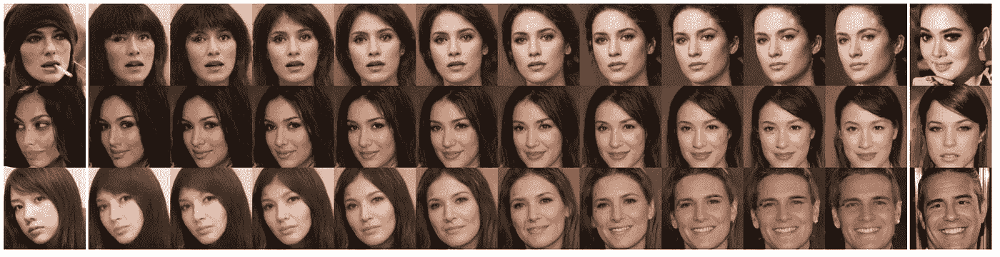

# 如何稳定甘训练

> 原文：<https://towardsdatascience.com/wasserstein-distance-gan-began-and-progressively-growing-gan-7e099f38da96?source=collection_archive---------16----------------------->

# Wasserstein 距离、边界平衡和渐进生长 GAN

gan 主导图像生成和图像翻译等深度学习任务。

在之前的[帖子](https://theaisummer.com/gan-computer-vision-object-generation/)中，我们已经了解了不成对的图像到图像的转换。然而，在你实现你自己的超级酷的深度 GAN 模型之前，有一些真正重要的概念你必须理解。

在这一部分，我们将看看一些基础性的工作。我们将看到**最常见的 GAN 距离函数**及其工作原理。然后，我们会把甘斯的训练感知为试图寻找一个两人博弈的均衡。最后，我们将看到渐进式训练的革命性成果，首次实现了**逼真的百万像素图像分辨率**。

图片来自作者。希腊某地的日出。如果你的 GAN 模特训练得像日出一样流畅岂不是很好？

我们将探索的研究主要解决**模式崩溃**和训练不稳定性。一些从未训练过 GAN 的人会很容易地认为我们总是指这两个轴。在现实生活中，**为一个新问题训练一个大规模的 GAN 可能是一场噩梦**。

如果你开始阅读和实施最新的方法，在新问题中训练新手几乎是不可能成功的。其实就像中了彩票一样。

> 当你离开最常见的数据集(CIFAR、MNIST、CELEBA)时，你已经陷入混乱。

> 这个评论系列的目标是像我们这样的人，他们超级有野心，但不想花所有的时间阅读该领域的所有参考书目。

通常情况下，您试图在调试时直观地理解学习曲线，以便猜测可能工作得更好的超参数。但是 GAN 训练是如此不稳定，以至于这个过程经常是浪费时间。这个可爱的工作是第一个为甘训练计划提供广泛理论依据的工作之一。有趣的是，他们发现了分布之间所有现存距离的模式。

# 核心理念

**核心思想**是有效测量**模型分布与真实分布**的接近程度。因为选择如何测量距离会直接影响模型的收敛。正如我们现在所知道的，GANs 可以表示来自低维流形的分布(噪声 z)。

> 直觉上，这个距离越弱，就越容易定义从参数空间(θ-空间)到概率空间的映射，因为已经证明分布更容易收敛。

我们有理由要求这种连续映射。主要是因为可以定义一个连续函数来满足这个连续映射，这个连续映射给出了期望的概率空间或生成的样本。

出于这个原因，这项工作引入了一个新的距离，称为**瓦瑟斯坦-甘**。它是[推土机(EM)距离](https://jeremykun.com/2018/03/05/earthmover-distance/)的近似值，理论上表明它可以逐步优化 GAN 的训练。令人惊讶的是，不需要在训练期间平衡 D 和 G，也不需要网络架构的特定设计。这样，减少了 GANs 中固有的模式崩溃。

# 理解 Wasserstein 距离

在我们深入讨论拟议损失之前，让我们先来看一些数学计算。正如 [wiki](https://en.wikipedia.org/wiki/Infimum_and_supremum) 中完美描述的，部分**有序**集合的子集的**上确界** ( **sup)** 是大于或等于的所有元素中的最小元素。因此，上确界也被称为最小**上界。**我个人把它称为 **T** 中能找到的所有可能组合的子集的最大值。

现在，让我们在 GAN 术语中引入这个概念。 **T** 是我们可以从 **G** 和 **D** 中得到的所有可能的配对函数近似值 f。S 将是那些函数的子集，我们将约束这些函数以使训练更好(某种正则化)。排序将自然地来自计算的损失函数。基于以上所述，我们最终可以看到 Wasserstein 损失函数，其测量两个分布 Pr 和 Pθ之间的距离。

图片由作者提供，最初用 Latex 编写。

这个严格的数学约束被称为 K-Lipschitz 函数以得到子集。但是如果它被广泛证明，你不需要知道更多的数学。但是我们如何引入这种约束呢？

> 处理这种情况的一种方法是通过训练一个神经网络，使其权重位于一个**紧凑空间中，来粗略地近似这个约束。为了达到这一点，最简单的方法就是将砝码固定在一个固定的范围内。**

就是这样，重量剪裁如我们所愿！因此，每次梯度更新后，我们将 w 范围削波至[0.01，0.01]。这样，我们显著地加强了 Lipschitz 约束。简单，但我可以向你保证它的工作！

事实上，有了这个距离损失函数，它当然是连续的和可微的，我们现在可以用提出的标准**训练 **D** 直到最优**，而其他距离饱和。饱和意味着鉴频器的损耗为零，生成的样本仅在某些情况下有意义。所以现在，饱和(自然导致模式崩溃)得到了缓解，我们可以在所有训练范围内使用更线性风格的梯度进行训练。让我们看一个例子来阐明这一点:

图片由 WGAN paper[https://arxiv.org/abs/1701.07875]提供

*WGAN 标准在空间的所有部分提供了清晰的梯度。*

为了在实践中看到所有以前的数学，我们在 [Pytorch](https://github.com/The-AI-Summer/GANs-in-Computer-Vision/blob/master/snippets/wgan_code_part_3.py) 中提供了 WGAN 编码方案。您可以直接修改您的项目以包含此损失标准。通常在真实的[代码](https://github.com/The-AI-Summer/GANs-in-Computer-Vision/blob/master/snippets/wgan_code_part_3.py)里看比较好。值得一提的是，为了保存子集并获取上限，这意味着我们必须获取许多对。这就是为什么你会看到我们每隔一段时间就训练一次生成器，以便鉴别器得到更新。这样，我们就有了定义上确界的集合。注意，为了接近上确界，我们也可以在升级 **D** 之前为 **G** 做很多步骤。

在后来的[工作](https://arxiv.org/pdf/1704.00028.pdf)中，事实证明，即使这个想法是可靠的，重量削减也是一种加强期望约束的可怕方式。使函数成为 [K-Lipschitz](http://math.univ-lyon1.fr/~begnac/articles/LipTM.pdf) 的另一种方法是**梯度惩罚**。

> 关键的想法是一样的:**将重量保持在紧凑的空间**。然而，他们通过**约束评论家的输出相对于其输入的梯度规范**来做到这一点。

我们不会讨论这篇文章，但是为了一致性和方便用户实验，我们提供了代码[作为普通 wgan 的改进替代方案。](https://github.com/The-AI-Summer/GANs-in-Computer-Vision/blob/master/snippets/wgan_code_part_3.py)

# 结果和讨论

在我们简短的描述之后，我们现在可以进入一些结果。看到 GAN 在训练中如何学习是很美好的，如下图所示:

图片由 WGAN paper[https://arxiv.org/abs/1701.07875]提供

使用 DCGAN 发生器的 Wasserstein 损耗准则。如您所见，损耗快速稳定下降，同时样品质量提高。这项工作被认为是 GANs 理论方面的基础，可以总结为:

# TL；速度三角形定位法(dead reckoning)

*   瓦瑟斯坦准则允许我们训练 **D** 直到最优。当准则达到最佳值时，它只是向生成器提供一个损耗，我们可以像训练任何其他神经网络一样训练该损耗。
*   我们不再需要适当地平衡 **G** 和 **D** 容量。
*   Wasserstein 损失导致训练 **G** 的梯度质量更高。
*   据观察，对于发电机和超参数调谐的架构选择，WGANs 比普通 gan 更加鲁棒

的确，我们确实提高了优化过程的稳定性。然而，没有什么是零成本的。WGAN 训练变得不稳定[基于动量的优化器](https://ruder.io/optimizing-gradient-descent/)如 Adam，以及高学习率。这是合理的，因为标准损失是高度不稳定的，所以基于动量的优化器似乎表现更差。这就是他们使用 [RMSProp](https://ruder.io/optimizing-gradient-descent/) 的原因，众所周知 RMSProp 在非平稳问题上表现出色。

最后，理解本文的一个直观方式是与层内激活函数历史上的梯度进行类比。特别是，sigmoid 和 tanh 激活的梯度消失，有利于 ReLUs，因为在整个数值范围内梯度得到了改善。

# [始于](https://arxiv.org/abs/1703.10717)(边界均衡生成对抗网络 2017)

我们经常看到，鉴频器在刚开始训练的时候进步太快。然而，平衡鉴别器和生成器的收敛是一个现有的挑战。

这是第一个能够控制图像多样性和视觉质量之间的**平衡的作品。利用简单的模型架构和标准的训练方案，获得高分辨率图像。**

为了实现这一点，作者引入了一个技巧来平衡生成器和鉴别器的训练。BEGAN 的核心思想是这种新的强制平衡与描述的 Wasserstein 距离相结合。为此，他们训练了一个基于自动编码器的鉴别器。有趣的是，**由于 D 现在是一个** [**自动编码器，它产生图像**](https://theaisummer.com/Autoencoder/) **作为输出，而不是标量。在我们继续之前，让我们记住这一点！**

正如我们所见，匹配误差分布比直接匹配样本分布更有效。一个关键点是，这项工作旨在优化自动编码器损耗分布之间的 Wasserstein 距离，而不是样本分布之间的 wasser stein 距离。begin 的一个优点是**不明确要求鉴别器受 K-Lipschitz 约束**。自动编码器通常用 L1 或 L2 范数来训练。

# 两人博弈均衡的形成

为了用[博弈论](https://www.youtube.com/watch?v=0fpUZT0Pvd4)来表达问题，增加了一个平衡鉴别器和生成器的平衡项。假设我们可以理想地生成不可区分的样本。那么，它们的误差分布应该是相同的，包括它们的期望误差，也就是我们在处理每一批后测量的误差。完美平衡的训练将导致 L(x)和 L(G(z)的期望值相等。然而，从来不是这样！由此开始决定**量化平衡定额**，定义为:

图片由作者提供，最初用 Latex 编写

这个量在网络中被建模为超参数。因此，新的训练方案涉及两个相互竞争的目标:a)自动编码真实图像和 b)辨别

真实来自生成的图像。γ项让我们平衡这两个目标。**γ值越低，图像多样性越低**，因为鉴别器更侧重于自动编码真实图像。但是，当预期损失变化时，如何控制这个超参数呢？

# 边界平衡 GAN(开始)

答案很简单:我们只需引入另一个落入[0，1]范围内的变量 kt。这个变量将被设计来控制在训练期间放在 L(G(z))上的焦点。

图片由作者提供，最初用 Latex 编写

它初始化为 k0 = 0，λ_k 也被定义为本研究中 **k** (使用 0.001)的比例增益。这可以被视为闭环反馈控制的一种形式，其中 kt 在每一步都被调整，以保持所选超参数γ的期望平衡。

注意，在早期训练阶段， **G** 倾向于为 **D** 生成易于重建的数据。同时，真实的数据分布还没有被准确地获知。基本上就是 L(x) > L(G(z))。与许多 GANs 相反，BEGAN 不需要预训练，可以用 Adam 进行优化。最后，通过使用平衡概念，导出收敛的全局度量。

本质上，可以将收敛过程公式化为**寻找 a)最接近的重构 L(x)和 b)控制算法| |γL(x)—L(G(z))| |的最低绝对值**。将这两项相加，我们就可以知道网络何时收敛。

# 模型架构

模型架构非常简单。一个主要的区别是引入了指数线性单位而不是 ReLUs。他们使用带有深度编码器和解码器的自动编码器。超参数化旨在避免典型的 GAN 训练技巧。

图片来自 https://arxiv.org/abs/1703.10717 报纸。模型架构

使用 U 形结构，没有[跳过连接](https://theaisummer.com/skip-connections/)。下采样被实现为核为 3、步长为 2 的子采样卷积。另一方面，上采样是通过最近邻插值完成的。在编码器和解码器之间，经过处理的数据的张量通过完全连接的层被映射，没有任何非线性。

# 结果和讨论

在下面的 128x128 插值图像中可以看到一些呈现的视觉效果:

图片由 begin[https://arxiv . org/ABS/1703.10717]提供。由 BEGAN 生成的插值 128x128 图像

值得注意的是，观察到**变化随着γ增加，但伪像(噪声)也增加。**可以看出，插值显示出良好的连续性。在第一行，头发过渡和发型被改变。同样值得注意的是，左图中的一些特征消失了(香烟)。第二行和最后一行显示简单的旋转。虽然旋转是平滑的，但是我们可以看到侧面照片没有被完美地捕捉。

最后一点，使用 BEGAN 平衡法，网络收敛到多样的视觉愉悦的图像。这在 128x128 分辨率下仍然适用，只需稍加修改。训练是稳定的、快速的，并且对于小的参数变化是鲁棒的。

但是让我们看看**真的高分辨率**会发生什么！

# [渐进 GAN](https://arxiv.org/abs/1710.10196)(2017 年为提高质量、稳定性和变化而渐进生长 GAN)

到目前为止，我们所描述的方法可以产生清晰的图像。然而，它们只能以相对较小的分辨率生成图像，并且变化有限。**分辨率低的原因之一是训练不稳定。**如果您已经部署了自己的 GAN 模型，您可能知道由于计算空间的复杂性，大分辨率需要较小的小批量。以这种方式，时间复杂性的问题也增加了，这意味着你需要几天来训练一个 GAN。

# 增量增长架构

为了解决这些问题，作者**从低到高分辨率图像开始，逐步增加生成器和鉴别器**。

> 直觉是，随着训练的进行，新添加的层旨在捕捉对应于高分辨率图像的更高频率的细节。

但是是什么让这种方法如此好呢？

答案很简单:模型首先发现大规模(全局)结构，然后发现局部细粒度细节，而不是必须同时学习所有规模**。增量训练自然以此为目标。值得注意的是，在整个训练过程中，所有层都是可训练的，并且网络架构是对称的(镜像)。下面描述了所描述的体系结构的图示:**

甘斯纸业[https://arxiv.org/abs/1710.10196]逐步增长的图像

然而，由于不健康的竞争，模式崩溃**仍然存在，这增加了 **G** 和 **D** 中误差信号的幅度。**

# 在过渡之间引入平滑层

这项工作的关键创新是新增层的**平滑过渡**到**稳定训练**。但是每次转变之后会发生什么呢？

图片由甘斯纸业逐步成长而来，链接:[https://arxiv.org/abs/1710.10196](https://arxiv.org/abs/1710.10196)

真正发生的是图像分辨率翻倍。因此在 **G** 和 **D** 上新增一层。这就是奇迹发生的地方。在过渡期间，在较高分辨率上操作的层被用作剩余的[跳跃连接](https://theaisummer.com/skip-connections/)块，其权重(α)从 0 线性增加到 1。一个意味着跳过连接被丢弃。

所描绘的 **toRGB** 块代表**层，该层将一维特征向量投影和整形**为 RGB 颜色。它可以被视为总是以正确的形状带来图像的连接层。并行地，来自 RGB 的**执行相反的操作，而两者都使用 1 × 1 卷积。真实图像被相应地缩小以匹配当前尺寸。**

> 有趣的是，在转换过程中，作者在真实图像的两种分辨率之间进行插值，以模拟 GANs 式学习。此外，对于渐进式 GAN，大多数迭代都是在较低的分辨率下执行的，从而导致 2 到 6 次训练加速。因此，这是第一个达到百万像素分辨率的作品，即 **1024x1024** 。

与遇到协方差偏移的下游任务不同，**gan 表现出越来越大的误差信号幅度和竞争问题**。为了解决这些问题，他们使用正态分布初始化和每层[权重归一化](https://mlexplained.com/2018/01/13/weight-normalization-and-layer-normalization-explained-normalization-in-deep-learning-part-2/)，通过每批动态计算的标量。这被认为是使模型学习尺度不变性。为了进一步限制信号幅度，它们还将逐像素特征向量归一化为生成器中的单位长度。**这防止了特征地图的升级，同时不会显著恶化结果。**附带的[视频](https://youtu.be/G06dEcZ-QTg)可能有助于理解设计选择。官方代码发布在 TensorFlow [这里](https://github.com/tkarras/progressive_growing_of_gans)。

# TL；DR:结果和讨论

结果可总结如下:

1)网络容量的逐渐增加解释了收敛速度的提高**。**直觉上，现有的层学习较低的尺度，因此在过渡之后，引入的层仅负责通过逐渐变小的尺度效果来改进表示。

2)渐进增长的**加速随着输出分辨率的增加而增加**。这使得第一次能够生成 1024x1024 的清晰图像。

3)即使实现这样的架构真的很难，并且缺少很多培训细节(即何时进行过渡以及为什么)，但它仍然是我个人崇拜的不可思议的作品。

GANs 渐进生长图像，百万像素分辨率，链接:[https://arxiv.org/abs/1710.10196](https://arxiv.org/abs/1710.10196)

# 结论

在这篇文章中，我们遇到了一些至今仍在使用的最先进的训练理念。我们关注这些重要培训方面的原因是为了能够进一步展示更高级的应用程序。如果你想从游戏理论的角度来看甘斯，我们强烈建议你去看[达斯卡拉基斯的谈话](https://www.youtube.com/watch?v=0fpUZT0Pvd4)。最后，对于我们的数学爱好者来说，这里有一篇精彩的文章，它更详细地介绍了向 WGAN 的过渡。

总之，我们已经找到了几种方法来处理模式崩溃、大规模数据集和百万像素分辨率的增量训练。欲了解整个文章系列，请访问[艾夏。](https://theaisummer.com/)

# 参考

[1]阿尔乔夫斯基，m .，钦塔拉，s .，&博图，L. (2017)。瓦瑟斯坦·甘。 *arXiv 预印本 arXiv:1701.07875* 。

[2]贝特洛博士、舒姆博士和梅斯博士(2017 年)。开始:边界平衡生成对抗网络。 *arXiv 预印本 arXiv:1703.10717* 。

[3]t . Karras，t . Aila，t . Laine，s .，& Lehtinen，J. (2017)。为了提高质量、稳定性和多样性而逐步种植甘蔗。 *arXiv 预印本 arXiv:1710.10196* 。

[4]达斯卡拉基斯，c .，a .，西尔格卡尼斯，v .，&曾，H. (2017)。[乐观地训练甘斯](https://arxiv.org/abs/1711.00141)。 *arXiv 预印本 arXiv:1711.00141* 。

[5]古尔拉贾尼、艾哈迈德、阿尔乔夫斯基、杜穆林和库维尔(2017 年)。改进了瓦瑟斯坦·甘斯的训练。在*神经信息处理系统的进展*(第 5767–5777 页)。

*原载于 2020 年 4 月 21 日 https://theaisummer.com**T21*[。](https://theaisummer.com/gan-computer-vision-incremental-training/)