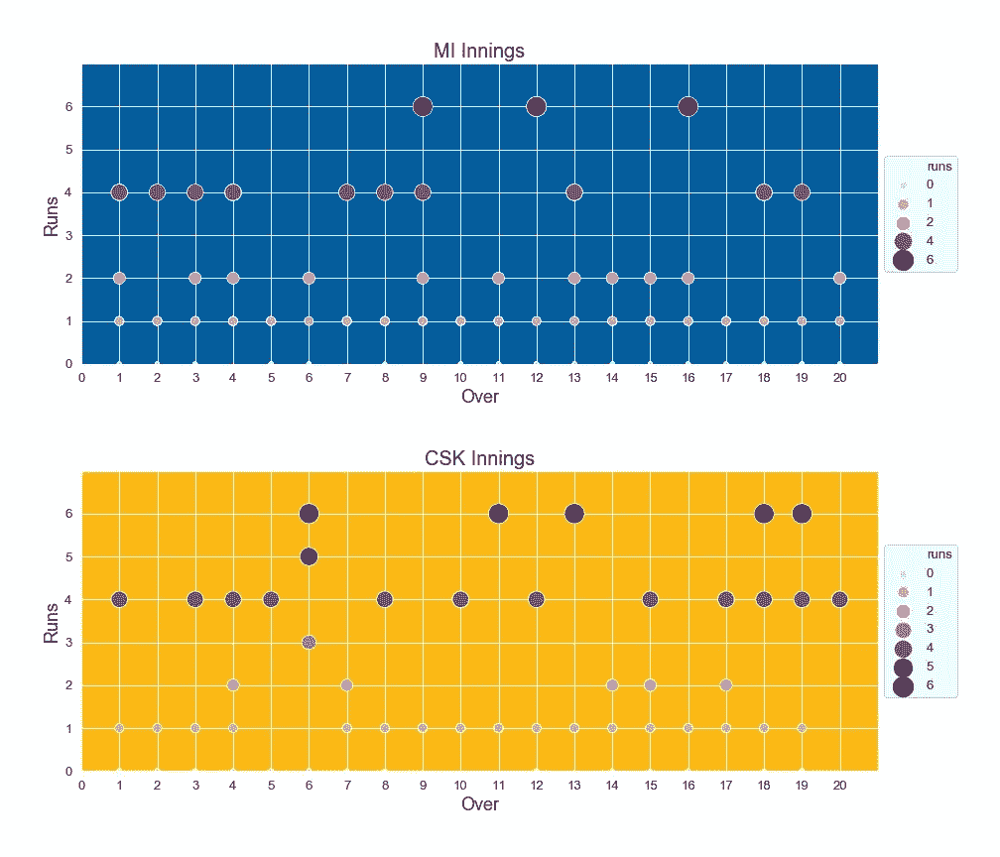

# 通过 Seaborn 和 Matplotlib 观看板球比赛

> 原文：<https://towardsdatascience.com/watch-a-cricket-game-through-seaborn-and-matplotlib-7047c82b380?source=collection_archive---------41----------------------->

## *印度超级联赛 T20 板球比赛数据点的可视化——孟买印度人队对钦奈超级国王队*

[阿克什·亚达夫](https://unsplash.com/@aksh1802?utm_source=medium&utm_medium=referral)在 [Unsplash](https://unsplash.com?utm_source=medium&utm_medium=referral) 上的照片

现代板球比赛产生大量统计数据和用户生成的数据。教练和性能分析师利用这些信息为未来的比赛设计策略，并寻找新的人才。在本文中，我使用 Seaborn 和 Matplotlib 库可视化了最近结束的[印度超级联赛(IPL)](https://www.iplt20.com/) T20 比赛的数据。这个练习的动机是探索和理解各种数据点，并识别可能的机器学习用例的不同特征。

# 资料组

我使用了来自[https://www.espncricinfo.com](https://www.espncricinfo.com/series/8048/game/1216492/mumbai-indians-vs-chennai-super-kings-1st-match-indian-premier-league-2020-21)的公开数据进行 IPL 2020 赛季揭幕战——2020 年 9 月 19 日[孟买印度人(MI) vs 钦奈超级国王(CSK)](https://www.espncricinfo.com/series/8048/game/1216492/mumbai-indians-vs-chennai-super-kings-1st-match-indian-premier-league-2020-21) @阿布扎比。

更新:2020 年 12 月——这里使用的数据是我在 Kaggle 发布的综合数据集的一部分。请 [***参考这里的***](https://www.kaggle.com/rajsengo/indian-premier-league-ipl-all-seasons/)

# 为什么？

我是钦奈超级国王队的狂热粉丝，CSK vs 米是 IPL 中的激烈战斗，这两支球队在世界范围内都有大量的粉丝。这是 IPL 的“El Clásico”，IPL 的利物浦 vs 曼联，Dhoni 女士又名“Thala”&“酷队长”是 CSK 的杰拉德。

# 让我们来玩吧！

## 条形图、计数图和分布图

首先，让我们用柱状图和计数图来看看两个队的得分。

运行 per over-MI vs CSK(图片由作者提供)

赛跑的种类——米对 CSK(图片由作者提供)

运行分发(图片由作者提供)

前两个图显示了每场比赛的得分，接下来的两个图显示了每支球队得分的得分类型。计数图(跑垒次数)和分布图确实表明两局得分类型相似，只有很小的差异。然而，条形图(每回合得分)描绘了两局之间的重要对比。米在开始的几局力量比赛中表现抢眼，随后是几局下滑，而 CSK 的力量比赛令人不安，并在力量比赛结束时(6 局后)加快了速度，并保持稳定的速度，直到比赛结束。

## 线形图

下一组线图显示了游戏从开始到结束的过程(从超过 1 到 20)

游戏进度——米 vs(线条图——作者图片)

从这些情节中得出的主要结论是，尽管 CSK 的总得分直到比赛结束时都低于米，但随着比赛的进行，他们的得分率比米高得多，而米的得分率却在下降(这要归功于队长 [MSD](https://www.espncricinfo.com/india/content/player/28081.html) 指挥的 CSK 的精彩保龄球表演)。很明显，CSK 在生死关头加快了他们的得分速度(像往常一样！)并在最后经过 m1(如上面的第二和第三线图所示)

## 热图

让我们用热图来想象击球手和投球手的表现。

击球手 vs 投球手——米 vs(图片由作者提供)

## 小提琴情节

让我们看看每个击球手对特定保龄球攻击得分的分布。使用小提琴的节奏和旋转

击球手跑垒分布(图片由作者提供)

## 返回条形图

现在让我们看看每个击球手对特定保龄球攻击的总得分。步伐和旋转

击球手的跑位与保龄球的类型(图片由作者提供)

## 更多热图

下面的热图提供了 CSK 保龄球表现的详细直观表示。

CSK 保龄球线和长度(作者图片)

CSK 保龄球线和长度米击球手(图片由作者)

## 还有更多热图！

CSK 保龄球线和长度与击球(图片由作者提供)

保龄球手 vs 击球风格(作者图片)

## 散点图

散点图有助于了解谁在局的不同部分得分以及他们得分了多少分。正如我们在下面所看到的，MI 击球手在强力击球时得分更多，而 CSK 击球手在临近结束时得分更多。

随着比赛的进行，球队得分(图片由作者提供)

每局比赛中击球手的分数(图片由作者提供)

上面的散点图显示了[安巴蒂·拉尤杜](https://www.espncricinfo.com/india/content/player/33141.html)和 F [阿夫·杜·普莱西](https://www.espncricinfo.com/southafrica/content/player/44828.html)通过轮换击球来构建他们的局，承担计算好的风险来得分，以跟上游戏进行中所需的跑分率——这是他们建立的伟大合作关系的可视化。

## 词云

最后，让我们来看看游戏期间 www.espncricinfo.com 记分卡[中显示的用户评论的词云表示。它很好地总结了这场比赛，公平地回应了公众的情绪](https://www.espncricinfo.com/series/8048/game/1216492/mumbai-indians-vs-chennai-super-kings-1st-match-indian-premier-league-2020-21)

游戏过程中来自用户评论的文字云(图片由作者提供)

# 接下来呢？

观看 CSK 今年在 COVID 的情况下比赛是一种美妙的体验。甚至很高兴看到 MSD 领导这支伟大的球队，做他最擅长的事情。玩这些数据，帮助我在探索数据可视化和体育分析方面的同时，重温了这场伟大的比赛。可以做进一步的工作来开发数据集和建立机器学习模型，以预测影响游戏甚至游戏结果的各种数据点。更多即将推出…

[我的 GitHub 链接到 Jupyter 笔记本](https://github.com/sengorajkumar/Cricket-Game-Data-Analysis)

链接到数据集— [Kaggle](https://www.kaggle.com/rajsengo/indian-premier-league-ipl-all-seasons/)

# 参考资料:

[https://www.espncricinfo.com](https://www.espncricinfo.com)—数据抓取

 [## Matplotlib: Python 绘图— Matplotlib 3.3.2 文档

### Matplotlib 是一个全面的库，用于在 Python 中创建静态、动画和交互式可视化…

matplotlib.org](https://matplotlib.org)  [## 用户指南和教程— seaborn 0.11.0 文档

### 编辑描述

seaborn.pydata.org](https://seaborn.pydata.org/tutorial.html)