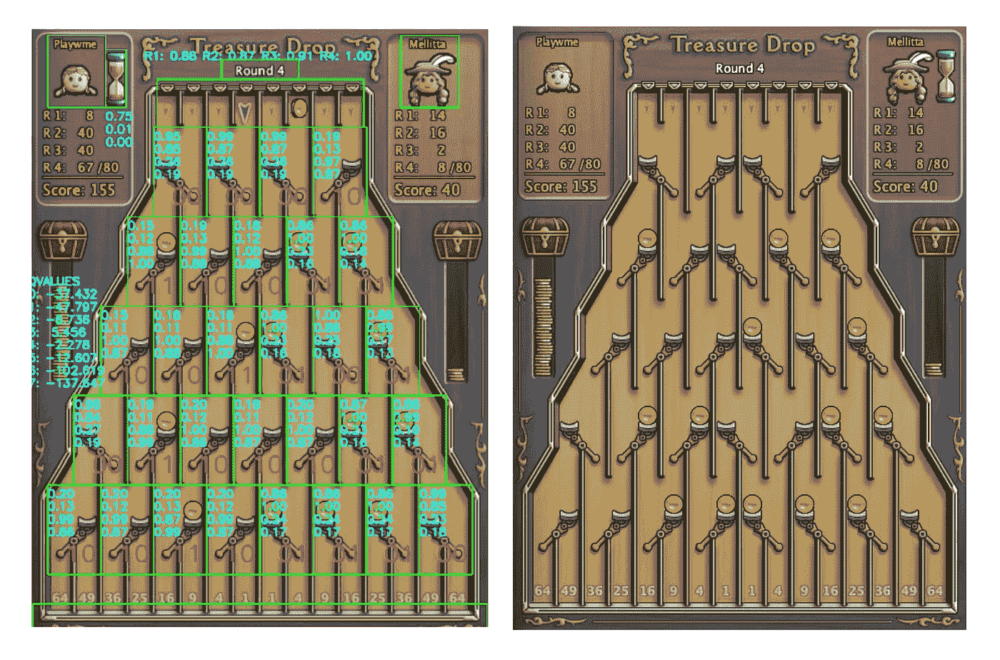

# 观看这个人工智能算法在一个在线游戏中击败玩家

> 原文：<https://towardsdatascience.com/watch-this-ai-algorithm-beating-players-in-an-online-game-video-27fde513333e?source=collection_archive---------64----------------------->

## 艾玩拼图

这是代理在与其他玩家在线对战时“看到”的内容。

这是一篇三篇文章的最后一篇，在这篇文章中，我走过了这个 AI 算法的训练。随意退房:[第一部](https://medium.com/p/2eb789c2ff5e)、[第二部](https://medium.com/p/e7097478d402)、[第三部](https://medium.com/p/e4a2992112a1)。

在训练过程中，代理通过与自己对抗，挑战自己的知识来学习如何玩游戏。以下是代理与其他玩家在线对战的结果:

*   人工智能对人类 172-117 赢了
*   [人工智能对人类 185–94 赢了](https://youtu.be/88im5nrpRcE)
*   [人工智能对人类 191–69 赢了](https://youtu.be/NxOomGWppvY)
*   [人工智能对人类 138–179 输了](https://youtu.be/mwMR28FmEqA)
*   [人工智能对人类 189–164 赢了](https://youtu.be/yH559pas0A0)
*   [人工智能对人类 228–69 赢了](https://youtu.be/nh2FqoDW_Bk)
*   [人工智能对人类 213–167 赢了](https://youtu.be/RacWwYijzzM)
*   人工智能对人类 73-169 输了
*   [人工智能对人类 271–58 韩元](https://youtu.be/cfqhyZNBw5c)
*   [AI 对人类 150–195 输了](https://youtu.be/P6bgT0WcZIk)
*   [人工智能对人类 89–223 输了](https://youtu.be/dmzyJBAkrqw)
*   人工智能对人类以 192-109 获胜
*   [人工智能对人类 268–21 获胜](https://youtu.be/Qk8-rEPKwBQ)
*   [人工智能对人类 110–207 输了](https://youtu.be/8h9f5-qn2eQ)
*   [人工智能对人类 182–166 赢了](https://youtu.be/HoBBw0EQDgo)
*   [人工智能对人类 107–58 赢了](https://youtu.be/Cl7Uoi5yo1I)
*   [AI 对人类 102–160 输了](https://youtu.be/g2wej9Q_1kM)

# 为什么 AI 一直赢不了？

我想通过解释为什么经纪人会输给一些球员来说明最后一点。

简称 Agent，是一种通过深度强化学习训练的 AI 算法。代理能够击败一些球员，但不能击败其他人。看不到敌人何时“把代理人推到边缘”，迫使它不可避免地做出糟糕的举动。此外，有时代理人执行一个荒谬的行动，让对手得到很多分。

在训练过程中，代理通过与自己对抗，挑战自己的知识来学习如何玩游戏。请注意，这将产生一个不同的训练数据，而不是代理人为了训练而与人对弈的情况。总是有可能存在一个策略来对抗代理的策略。从理论上讲，如果代理被迫对训练中没有遇到的状态做出决策，它很可能会做出糟糕的决策。

> “我们对强化学习问题的框架迫使我们满足于近似。然而，它也为我们提供了一些获得有用近似值的独特机会。例如，在逼近最优行为时，可能有许多状态，代理面临的概率如此之低，以至于为它们选择次优行动对代理接收的奖励量几乎没有影响。例如，Tesauro 的西洋双陆棋玩家具有非凡的技能，尽管它可能会在棋盘配置上做出非常糟糕的决定，而这种情况在与专家的游戏中从来不会发生。事实上，TD-Gammon 有可能在游戏的大部分状态设置中做出错误的决定。强化学习的在线性质使得有可能以这样的方式逼近最优策略，即以较少的努力用于不经常遇到的状态为代价，将更多的努力用于学习以便为经常遇到的状态做出好的决策。这是强化学习区别于其他近似求解 MDP 的方法的一个关键特性。”
> 
> —萨顿&巴尔托，《强化学习导论》，2018 年

简而言之，打败人工智能算法是可能的。也有可能训练出一种比我们现有的算法更接近无敌的算法。

# 伦理学

从其他玩家的角度来看，与人工智能算法比赛可能是一次令人生畏的经历。作为我的辩护，打败人工智能是可能的，就像我和其他玩家一样。因此，这并不像和我比赛那样令人畏惧，如果 AI 不在的话，他们会和我比赛。此外，游戏是在游戏内货币的赌注上进行的。正因为如此，赌注保持在很小的范围内，每次代理人赢了另一个玩家，赢得的钱会立即退还。

# 想了解更多信息吗？

这是一篇三篇文章的最后一篇，在这篇文章中，我走过了这个 AI 算法的训练。随意退房:[第一部](https://medium.com/p/2eb789c2ff5e)、[第二部](https://medium.com/p/e7097478d402)、[第三部](https://medium.com/p/e4a2992112a1)。

# 关于我

我是一名数据科学家，住在旧金山。热衷于使用用户生成的数据。在 Linkedin 上找到我:[mer sakar ya](http://linkedin.com/in/sakarya)