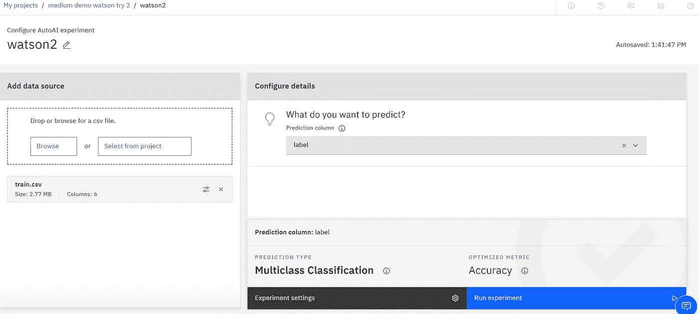

# 沃森·奥塔伊

> 原文：<https://towardsdatascience.com/watson-autoai-7fb1e82471ea?source=collection_archive---------50----------------------->

## autoML 系列的第六部:蓝色巨人给人留下了互动进步的印象

图片由[皮克斯拜](https://pixabay.com/?utm_source=link-attribution&utm_medium=referral&utm_campaign=image&utm_content=3763668)的 Gerd Altmann 提供

惊讶！令人惊喜的是，这是 m autoML 系列的第六次安装。虽然我几年前使用过 IBM 的数据科学云平台，但我之前从未接触过 Watson Studio 或他们的 AutoAI 产品。我不确定我会找到什么，但我对我所看到的很满意。对于那些希望(需要)在训练过程中不断得到进度反馈的人来说，我喜欢所提供的大量信息。精确度不如 DataRobot 或 H2O 无人驾驶人工智能，但基于价格的巨大差异(每年数万美元)，这是可以预期的。

# 为什么选择 IBM Watson Studio AutoAI？

蓝色巨人不仅仅是大型机和 SPSS。我几年前用过 IBM 数据科学云笔记本环境。沃森在 IBM 有一段传奇历史。虽然你没有运行“华生”,但声誉带来了权威。

# 成本

我可以免费进行这个实验。对于数据科学家个人来说，[定价等级](https://www.ibm.com/cloud/watson-studio/pricing)非常合理。

作者定价截图

# 设置

[试试 IBM Watson Studio](https://www.ibm.com/cloud/watson-studio/autoai)

“这些功能是针对 IBM Cloud 上的数据服务的完全托管的 Cloud Pak 初始集的一部分。立即免费提供 Watson Studio 和 Watson Machine Learning 的集成精简版，作为 Cloud Pak for Data as a Service 的一部分。”

上面的链接会带你到 Watson Studio 上的“尝试 AutoAI”按钮。AutoAI 是一个托管云解决方案，因此建立一个新项目的过程非常简单。

进入 Watson Studio 后，您可以添加一个 AutoAI 资产。

作者截图

从那里，你可以建立一个新的实验。

作者截图

# 数据

为了保持本系列中各种工具的平等性，我将坚持使用 Kaggle 培训文件。[矛盾，我亲爱的华生。使用 TPUs](https://www.kaggle.com/c/contradictory-my-dear-watson/data) 检测多语言文本中的矛盾和蕴涵。在这个入门竞赛中，我们将句子对(由一个前提和一个假设组成)分为三类——蕴涵、矛盾或中性。

6 列 x 13k+行—斯坦福 NLP [文档](https://nlp.stanford.edu/projects/snli/)

*   身份证明（identification）
*   前提
*   假设
*   朗 abv
*   语言
*   标签

# 加载数据

再简单不过了。

作者截图

# 训练您的模型

配置和运行实验的界面非常简单。在实验设置下还有一些其他选项，但是我想尽可能简单地运行它。选择你的标签，点击运行实验。

作者截图

这就是乐趣所在！有一个互动的可视化，让你看到你在实验过程中的位置。我喜欢这个！您还可以在培训期间查看排行榜。

作者训练 gif

# 评估培训结果

有一个小指标表明实验已经完成。我本以为会有更引人注目的东西，但我很高兴它在合理的时间内完成，22 分钟。

作者截图

排行榜提供了关于准确性和其他成功指标的信息，以及模型类型和所做的改进(如功能工程)。我没有看到各种各样的模型尝试，因此培训时间很短。

作者截图

作者截图

对于 Pipeline 3，我研究了工程特性。你必须研究细节，因为‘new feature _ 2’不是很能说明问题。

作者截图

# 结论

有趣的是，在培训结束后，我看到一个弹出窗口，介绍对多个数据集的特征工程。肯定的，要调查的东西！如果他们能够识别数据集之间的关系，并创建新的功能，那将是惊人的。

总的来说，我很喜欢 Watson AutoAI 体验本身。这个过程运行得很快(22 分钟，而 H2O 无人驾驶人工智能的时间超过 4 小时)，但代价是开箱即用的模型多样性和准确性。将需要额外的实验装置。但对于比 DataRobot 和 H2O 无人驾驶人工智能低 7.8 万美元的价格来说，这可能是一个可以接受的权衡。

我鼓励你考虑使用 AutoAI。这个 IBM 产品是一个价格合理的 autoML 工具。

如果您错过了本系列中的一篇文章，这里有链接。

 [## AWS Sagemaker Studio 自动驾驶仪准备好迎接黄金时段了吗？

### 带有一些评论的自动驾驶界面演示

towardsdatascience.com](/is-aws-sagemaker-studio-autopilot-ready-for-prime-time-dcbca718bae7)  [## 免费体验 Google autoML 表格

### autoML 工具用户体验评论系列之二。

towardsdatascience.com](/experience-google-automl-tables-for-free-d5648ae3d0e5)  [## Azure Automated ML 倾听他们的设计师

### 本 autoML 系列的第 3 部分，微软，绝地大师

towardsdatascience.com](/azure-automated-ml-listens-to-their-designers-7f1c68d19eb4)  [## 数据机器人让生活变得简单

### 汽车系列之四——设计之美

towardsdatascience.com](/datarobot-makes-life-easy-8505637241e5)  [## H2O 无人驾驶人工智能

### autoML 系列的第五名—可视化和可解释性的第一名

towardsdatascience.com](/h2o-driverless-ai-71414b441425)