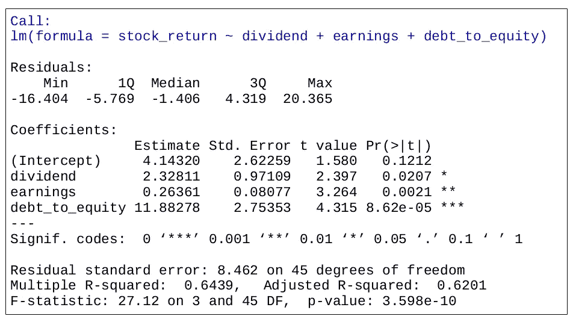

# 与 Python 相比，R 的优势何在

> 原文：<https://towardsdatascience.com/ways-r-still-excels-compared-to-python-34835e6071ee?source=collection_archive---------24----------------------->

## 虽然 Python 和 R 曾经是数据科学的两大主流语言，但前者已经让后者黯然失色了一段时间。然而，R 似乎正在强势回归。

当查看 R 的 TIOBE 指数时，我们可以看到，在 2018 年 1 月达到收视率峰值后，该语言在该点后出现了明显的下降。然而，很明显，自 3 月份以来，收视率一直在回升。

资料来源:www.tiobe.com

这是什么原因呢？

其中一个重要原因是新冠肺炎激发了人们对统计学的强烈兴趣。

到目前为止，数据科学领域一直在回避这个领域，而倾向于更“性感”的话题，如自然语言处理、计算机视觉等。

然而，正在进行的疫情重新点燃了围绕统计分析在分析和最终抗击这种病毒中必须发挥的作用的辩论。

鉴于比较不同国家之间的统计数据的性质，人们对对数图表及其在比较不同尺度的数据时的用途特别感兴趣，如下文所示:

资料来源:twitter.com

因此，显而易见的是，如果想要快速进行有效的统计分析，就需要一个直观的统计环境来运行这些数字。证据表明 R 在这里仍然占优势。

然而，在我同时使用 Python 和 R 的经历中，以下是我关于后者如何仍然优于前者的经历。

## 1.在分析时间序列数据时，r 仍然可以胜过 Python

如果你以前做过时间序列分析，你很可能熟悉所谓的 **ARIMA(自回归综合移动平均)模型**。

这是一种可用于根据时间序列的结构进行预测的模型。ARIMA 模型由坐标(p，d，q)组成:

*   **p** 代表自回归项的数量，即用于预测未来值的过去时间值的观测值的数量。例如，如果 p 的值是 2，那么这意味着序列中的两个先前的时间观察被用于预测未来趋势。
*   **d** 表示使时间序列稳定所需的差异数(即具有恒定均值、方差和自相关的时间序列)。例如，如果 d = 1，则意味着必须获得级数的一阶差分，才能将其转换为平稳的级数。
*   **q** 代表我们模型中之前预测误差的移动平均值，或者误差项的滞后值。例如，如果 q 的值为 1，那么这意味着我们在模型中有一个误差项的滞后值。

然而，R 和 Python 都允许基于最佳拟合自动选择这些坐标。这可以使用 R 中的 **auto.arima** 和 Python 中的**金字塔**来完成。金字塔中的 auto_arima 函数基于原始的 R 函数，即 R 是第一种能够自动选择 p，d，q 坐标的语言。

在另一篇文章(可从下面的参考资料部分获得)中，我比较了 R 和 Python 使用该函数预测天气数据的能力——R 显示出做出准确预测的能力明显更强，相对于实际情况，百分比误差低于 10%的预测数量超过了 **70%** 。在 Python 的例子中， **40%** 的预测与实际相差在 10%以内。

资料来源:RStudio

## 2.回归分析

说到回归分析，与 Python 相比，R 可以使用更少的代码行来运行分析。

我们举个例子。假设我们正在运行一个回归来预测基于各种因素的股票回报，例如公司股息、收益和债转股。

现在，假设我们希望测试**多重共线性**，即测试是否有任何独立变量彼此显著相关，从而导致结果偏斜。回归( *reg1* )运行如下。

现在，我们需要计算方差膨胀因子。计算方法如下:

然而，我们不需要在 r 中手动计算。相反，使用 **car** 库，VIF 函数可以如下调用:

VIF 统计数据远低于常用的阈值 **5** 和 **10** ，这表明模型中不存在多重共线性

然而，使用 Python 的过程稍微复杂一些。

使用 sklearn 时，我们分别获取每个变量的 VIF。例如，让我们试着找出**股息**变量的 VIF 值。

在上述示例中，必须首先手动计算 R 平方统计量，然后只计算一个变量的 VIF 统计量:

我们已经获得了这一变量的 VIF，但还需要采取更多的步骤才能获得。此外，为了找到其他两个变量的 VIF 值，必须对每个变量重复这一过程。

从这个角度来看，在快速生成统计洞察时，R 仍然可以证明更加直观。

## 3.闪亮的直观统计分析

Python 中的 **pyplot** 和 **seaborn** 等库在生成统计图方面已经变得相当流行。

然而，R 快速生成统计洞察的能力，加上**闪亮**的交互可视化能力，构成了一个强大的组合。

这是一个在 Shiny 中生成的累积二项式概率图的示例，通过它可以操纵左边的滑块(个体概率),以计算某一事件在指定次数的试验中发生的累积概率。

资料来源:RStudio

对于那些可能不擅长编写代码，但正在寻找一种有效的方法来操作统计数据和快速生成见解的人来说，这样的工具具有巨大的价值。此外，Shiny 本身就是一个非常直观的 R 包，并不难学！

这个闪亮的网络应用程序可以在下面的 GitHub 库中[获得。](https://github.com/MGCodesandStats/shiny-web-apps/tree/master/probability)

要操作该应用程序，只需:

1.  下载存储库
2.  点击 *shiny web app* 文件夹，打开 **ui。R** 和**服务器。RStudio 中的 R** 文件。
3.  完成后，只需选择“运行应用程序”按钮，上面的应用程序将会显示:

资料来源:RStudio

# 结论

Python 擅长机器学习，在通用编程方面将继续主导 R。从技术上讲，R 不是一种编程语言——它是一种统计环境。

然而，统计学作为一个领域已经存在——因此 r 也是。

*免责声明:本文是在“原样”的基础上编写的，没有任何担保。本文旨在提供数据科学概念的概述，不应以任何方式解释为专业建议。*

# 参考

*   [带 R 和闪亮的累积二项式概率分析](https://github.com/MGCodesandStats/cumulative-binomial-probability-r-shiny)
*   [SARIMA:用 Python 和 R 预测季节性数据](https://medium.com/analytics-vidhya/sarima-forecasting-seasonal-data-with-python-and-r-2e7472dfad83)
*   [R 的 TIOBE 指数](https://www.tiobe.com/tiobe-index/r/)