# 评估回归模型的方法

> 原文：<https://towardsdatascience.com/ways-to-evaluate-regression-models-77a3ff45ba70?source=collection_archive---------0----------------------->

## 评估模型最简单的方法是考虑 R 平方值。假设我得到 95%的 R 平方，这样够好了吗？通过这个博客，让我们试着了解评估你的回归模型的方法。


图片来源:Shravankumar Hiregoudar

评估指标；

1.  预测的平均值/中值
2.  预测的标准偏差
3.  预测范围
4.  **决定系数(R2)**
5.  相对标准偏差/变异系数(RSD)
6.  相对平方误差
7.  **平均绝对误差**
8.  相对绝对误差(RAE)
9.  均方误差
10.  **预测均方根误差(RMSE/RMSEP)**
11.  归一化均方根误差(范数 RMSEP)
12.  相对均方根误差

> 让我们考虑一个预测片剂中活性药物成分(API)浓度的例子。使用近红外光谱的吸光度单位，我们预测片剂中的 API 水平。片剂中的 API 浓度可以是 0.0、0.1、0.3、0.5、1.0、1.5、2.0、2.5、3.0。我们应用偏最小二乘法(PLS)和支持向量回归机(SVR)来预测 API 水平。
> 
> 注意:指标可用于比较多个模型或一个模型与不同的模型

# 预测的平均值/中值

我们可以使用预测值的算术平均值来了解两个模型之间的预测偏差。

*例如，API 为 0.5 的预测值的平均值是通过将 API 为 0.5 的预测值的总和除以 API 为 0.5 的样本总数来计算的。*

```
np.mean(predictedArray)
```

在图 1 中，我们可以理解 PLS 和 SVR 如何执行 wrt 均值。SVR 比 PLS 更好地预测 0.0 API，而 PLS 比 SVR 更好地预测 3.0 API。我们可以根据对 API 级别的兴趣来选择模型。

*缺点:均值受离群值影响。当预测值中有异常值时使用中位数*

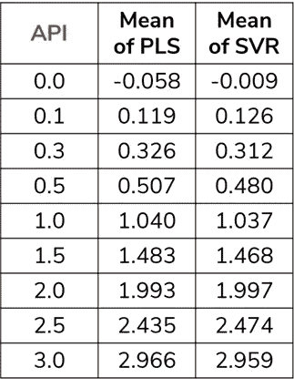

图 1 .比较两种模型预测值的平均值

# 预测的标准偏差

标准差(SD)是一组值的变化量或离差的度量。较低的标准差表示这些值倾向于接近集合的平均值(也称为期望值)。相反，高标准偏差表明这些值分布在更大的范围内。预测值的标准差有助于理解不同模型中值的离差。

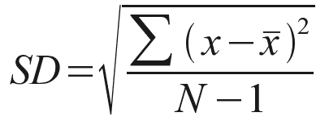

标准差公式

```
np.std(predictedArray)
```

在图 2 中，SVR 中预测值的离差小于 PLS。因此，当我们考虑 SD 度量时，SVR 表现得更好。

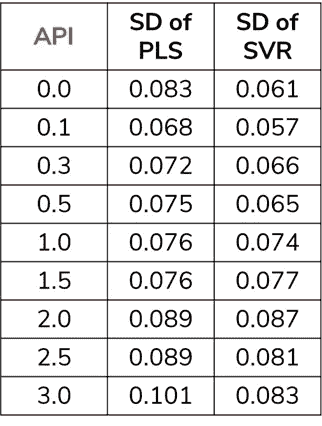

图 1 .比较两种模型预测值的标准偏差

# 预测范围

预测的范围是预测值中的最大值和最小值。偶数范围有助于我们理解模型之间的离散度。

# 决定系数(R2)

r 平方(R2)是一种统计测量方法，表示由回归模型中的一个或多个自变量解释的因变量方差的比例。相关性解释了自变量和因变量之间的关系强度，而 R 平方解释了一个变量的方差在多大程度上解释了第二个变量的方差。因此，如果模型的 R2 是 0.50，那么大约一半的观察到的变化可以用模型的输入来解释。

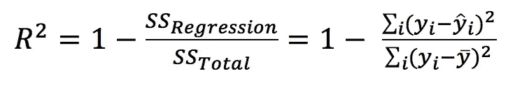

r 平方公式

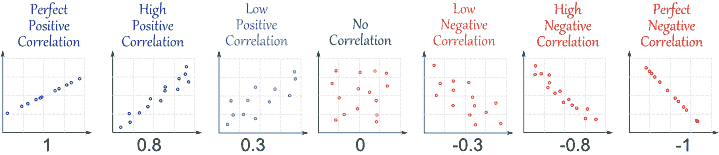

r(相关性)(资料来源:[http://www.mathsisfun.com/data/correlation.html](http://www.mathsisfun.com/data/correlation.html)

```
from sklearn.metrics import r2_score
r2_score(Actual, Predicted)
```

*缺点:R2 不考虑过度合身。* [*了解更多详情*](http://www.johnmyleswhite.com/notebook/2016/07/23/why-im-not-a-fan-of-r-squared/) *。*

# 相对标准偏差(RSD) /变异系数(CV)

有一种说法是，苹果不应该与桔子相比较，或者换句话说，不要比较实际上不可比较的两个或一组项目。但是，如果这两个项目或组别以某种方式标准化或放在同一尺度上，缺乏可比性是可以克服的。例如，当比较总体上非常不同的两组的方差时，例如蓝鳍金枪鱼和蓝鲸的大小的方差，变异系数(CV)是选择的方法:CV 简单地表示通过其组均值标准化的每个组的方差

变异系数(CV)，也称为相对标准偏差(RSD)，是概率分布或频率分布离差的标准化度量。它有助于我们理解两个不同测试中的数据是如何分布的

标准差是单个数据集可变性的最常见度量。但是为什么我们还需要另一个度量，比如变异系数？嗯，比较两个不同数据集的标准差是没有意义的，但是比较变异系数是有意义的。

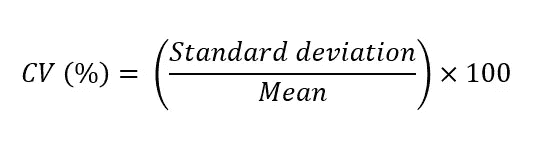

变异系数公式

```
from scipy.stats import variation
variation(data)
```

*例如，如果我们考虑两个不同的数据；*

数据 1:平均值 1 = 120000 : SD1 = 2000

数据 2:均值 2 = 900000 : SD2 = 10000

*让我们计算两个数据集的 CV*

CV1 = SD1/平均值 1 = 1.6%

CV2 = SD2/均值 2 = 1.1%

我们可以得出结论，数据 1 比数据 2 更分散

# 相对平方误差

相对平方误差(RSE)是相对于使用简单预测器时的误差而言的。更具体地说，这个简单的预测值只是实际值的平均值。因此，相对平方误差采用总平方误差，并通过除以简单预测值的总平方误差对其进行归一化。可以在误差以不同单位测量的模型之间进行比较。

在数学上，单个模型 *i* 的相对平方误差 *Ei* 由以下等式评估:

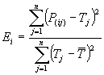

相对平方误差公式

其中 *P* ( *ij* )是单个模型 *i* 对记录 *j* (来自 *n* 条记录)的预测值； *Tj* 是记录 *j 的目标值，* Tbar 由公式给出:

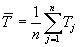

对于完美的拟合，分子等于 0 并且 *Ei* = 0。因此， *Ei* 指数的范围从 0 到无穷大，0 对应于理想值。

# 平均绝对误差

在统计学中，平均绝对误差(MAE)是表达同一现象的成对观察值之间误差的度量。 *Y* 与 *X* 的例子包括预测与观察、后续时间与初始时间的比较，以及一种测量技术与另一种测量技术的比较。它与原始数据具有相同的单位，并且它只能在以相同单位测量误差的模型之间进行比较。它的震级通常与 RMSE 相似，但略小一些。MAE 的计算公式为:

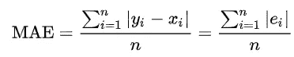

平均绝对误差公式

```
from sklearn.metrics import mean_absolute_error
mean_absolute_error(actual, predicted)
```

因此，它是绝对误差的算术平均值，其中 yi 是预测值，是实际值。注意，替代公式可以包括相对频率作为权重因子。平均绝对误差使用与被测数据相同的标度。这被称为依赖于尺度的精度度量，因此不能用于在使用不同尺度的系列之间进行比较。

注意:如你所见，所有的统计数据都是将真实值与估计值进行比较，但方式略有不同。它们都告诉你，你的估计值与真实值“有多远”。有时使用平方根，偶尔使用绝对值——这是因为使用平方根时，极值对结果的影响更大(参见 [*为什么在标准差中求差的平方而不是取绝对值？*](https://stats.stackexchange.com/questions/118/why-square-the-difference-instead-of-taking-the-absolute-value-in-standard-devia) *或*[*math overflow*](https://mathoverflow.net/questions/1048/why-is-it-so-cool-to-square-numbers-in-terms-of-finding-the-standard-deviation)*)。*

*在《梅和 RMSE》中，你只需查看这两个值之间的“平均差异”。因此，您将它们与您的变量规模进行比较(即，1 点的 MSE 是预测值与实际值之间 1 点的差异)。*

*在 RAE 和相对 RSE 中，您将这些差异除以实际值的变化，因此它们的范围从 0 到 1，如果您将该值乘以 100，您将获得 0-100 范围内的相似性(即百分比)。*

*∑(MeanofActual—actual)或∑|MeanofActual — actual|的值告诉您实际值与其平均值相差多少——因此您可以知道实际值与其自身相差多少(比较* [*方差*](http://en.wikipedia.org/wiki/Variance) *)。正因为如此，这些度量被命名为“相对的”——它们给出与实际规模相关的结果。*

# 相对绝对误差(RAE)

相对绝对误差(RAE)是一种衡量预测模型性能的方法。不要将 RAE 与相对误差相混淆，相对误差是钟表、尺子或天平等仪器的精度或准确度的一般度量。它表示为一个比率，将平均误差(残差)与平凡或简单模型产生的误差进行比较。一个好的预测模型会产生一个接近于零的比率；一个差的模型(比简单模型更差的模型)会产生一个大于 1 的比率。

它与相对平方误差非常相似，因为它也与简单的预测值相关，而简单的预测值只是实际值的平均值。不过，在这种情况下，误差只是总绝对误差，而不是总平方误差。因此，相对绝对误差采用总绝对误差，并通过除以简单预测器的总绝对误差对其进行归一化。

在数学上，单个模型 *i* 的相对绝对误差 *Ei* 由以下等式评估:

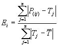

相对绝对误差(RAE)公式

其中 *P* ( *ij* )是单个模型 *i* 对记录 *j* (来自 *n* 条记录)的预测值； *Tj* 是记录 *j 的目标值，* Tbar 由公式给出:


对于完美的拟合，分子等于 0 并且 *Ei* = 0。因此， *Ei* 指数的范围从 0 到无穷大，0 对应于理想值。

# 均方误差

估计量的均方误差(MSE)或均方偏差(MSD )(用于估计未观察到的量的过程)测量误差平方的平均值，即估计值和实际值之间的平均平方差。MSE 是一个风险函数，对应于平方误差损失的期望值。MSE 几乎总是严格为正(且不为零)的事实是因为随机性或者因为估计器没有考虑可以产生更精确估计的信息。

MSE 评估预测值(即，将任意输入映射到某个随机变量的样本值的函数)或估计值(即，将数据样本映射到从中采样数据的总体参数估计值的数学函数)的质量。根据描述的是预测值还是估计值，MSE 的定义是不同的。

MSE 是对估计量质量的一种度量，它总是非负的，值越接近零越好。

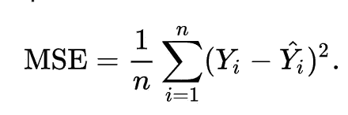

均方差(MSE)公式

```
from sklearn.metrics import mean_squared_error
mean_squared_error(actual, predicted)
```

我们来分析一下这个等式实际上是什么意思。

*   在数学中，看起来像怪异 E 的字符被称为求和(希腊文 sigma)。它是一系列数字的总和，从 i=1 到 n。让我们把它想象成一个点的数组，我们遍历所有的点，从第一个(i=1)到最后一个(i=n)。
*   对于每个点，我们取该点的 y 坐标和 y '-坐标。我们从 y '坐标值中减去 y 坐标值，并计算结果的平方。
*   第三部分是取所有(y-y’)值之和，除以 n，这将给出平均值。

我们的目标是最小化这个平均值，这将为我们提供通过所有点的最佳直线。[了解更多信息](https://www.freecodecamp.org/news/machine-learning-mean-squared-error-regression-line-c7dde9a26b93/)。

# **预测均方根误差(RMSE / RMSEP)**

在统计建模尤其是回归分析中，测量模型拟合质量的一种常用方法是 RMSE(也称为均方根偏差)，由下式给出

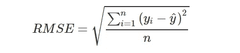

RMSE 公式

```
from sklearn.metrics import mean_squared_error
mse = mean_squared_error(actual, predicted)
rmse = sqrt(mse)
```

其中，yi 是 y 的第 I 个观测值，*是给定模型的预测 y 值。如果预测响应非常接近真实响应，RMSE 将会很小。如果预测的和真实的响应相差很大(至少对于某些观测来说), RMSE 将会很大。零值表示与数据完全吻合。由于 RMSE 是在与 y 相同的比例和单位下测量的，因此可以预计 68%的 y 值在 1 RMSE 以内-假设数据呈正态分布。*

> *注:RMSE 关注的是与真实值的偏差，而 S 关注的是与平均值的偏差。*

*所以计算 MSE 有助于比较基于相同 y 观测值的不同模型。但是如果*

1.  *人们想要比较不同响应变量的模型拟合？*
2.  *响应变量 *y* 在某些模型中被修改，例如标准化或 sqrt-或 log-transformed？*
3.  *并且将数据分成训练和测试数据集(在修改之后)以及基于测试数据的 RMSE 计算对点 1 有影响吗？第二。？*

*前两点是比较生态指标性能时的典型问题，而后者，即所谓的*验证集方法*，在统计和机器学习中非常常见。克服这些障碍的一个解决方案是计算**归一化** RMSE。*

# *归一化均方根误差(范数 RMSEP)*

*归一化 RMSE 有助于不同比例的数据集或模型之间的比较。然而，你会在文献中发现各种不同的 RMSE 归一化方法:*

*您可以通过以下方式进行标准化*

*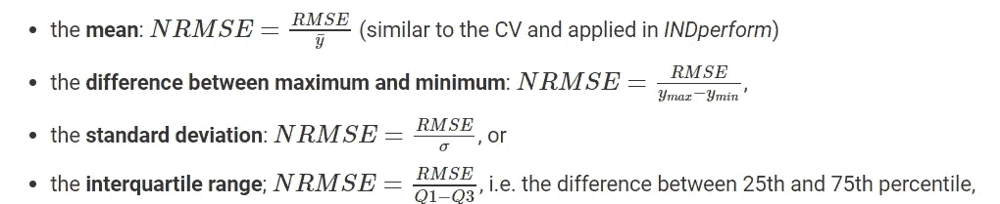*

*如果响应变量很少有极值，选择四分位范围是一个好的选择，因为它对异常值不太敏感。*

> *RRMSEP 标准差称为**相对均方根误差***
> 
> ***1/RRMSEP** 也是一个度量。大于 2 的值被认为是好的。*

*还有一些主要用于化学计量学的术语，如预测的标准误差(SEP)和预测的标准误差与标准偏差之比(RPD)。*

*我希望这篇博客能帮助你理解评估你的回归模型的不同标准。我使用了多种资源来理解和撰写这篇文章。谢谢你的时间。*

*[](https://www.buymeacoffee.com/shravanh)*

**参考文献:**

*)(我)(们)(都)(不)(知)(道)(,)(我)(们)(还)(不)(知)(道)(,)(我)(们)(还)(不)(知)(道)(,)(我)(们)(还)(不)(知)(道)(,)(我)(们)(还)(不)(知)(道)(,)(我)(们)(还)(不)(知)(道)(,)(我)(们)(还)(不)(知)(道)(,)(我)(们)(们)(还)(不)(知)(道)(,)(我)(们)(们)(还)(不)(知)(道)(。*