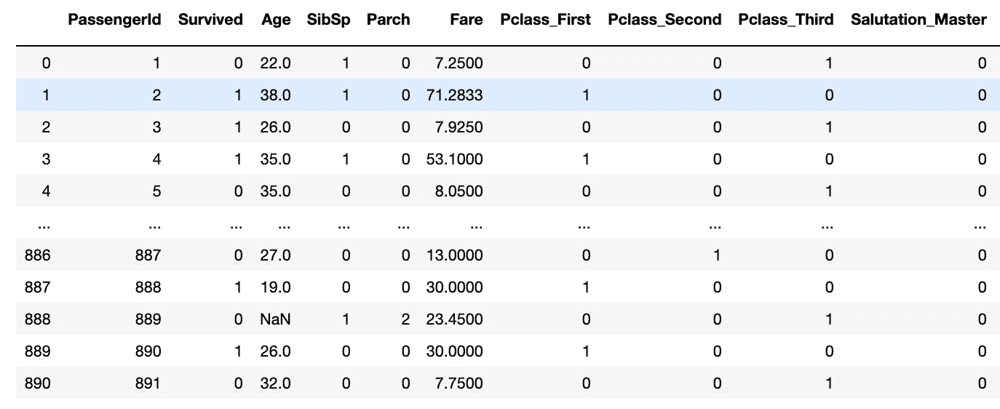
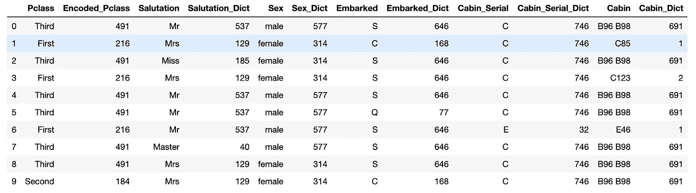
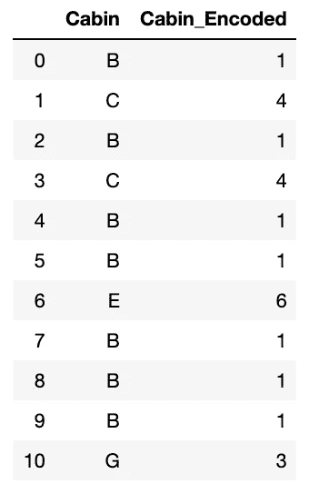
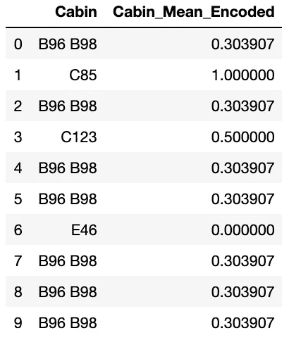
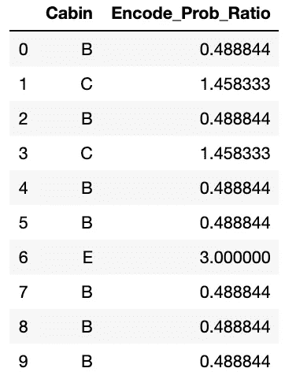

# 用实现处理分类数据的方法

> 原文：<https://towardsdatascience.com/ways-to-handle-categorical-data-before-train-ml-models-with-implementation-ffc213dc84ec?source=collection_archive---------5----------------------->

## 使用 Python 实现了流行的技术

在我的上一篇博客中，我解释了[类型的缺失值](https://medium.com/@g.dhasade16/missing-data-its-types-9f59e897843f)以及处理[连续](https://medium.com/swlh/ways-to-handle-continous-column-missing-data-its-implementations-4704f52ac9c3)和[分类](https://medium.com/analytics-vidhya/ways-to-handle-categorical-column-missing-data-its-implementations-15dc4a56893)缺失值的不同方法和实现。

处理完数据集中的缺失值后，下一步是处理分类数据。在这篇博客中，我将解释处理分类特征/列的不同方法以及使用 python 的实现。


图片作者:[altum code](https://unsplash.com/@altumcode)|[Unsplash.com](https://unsplash.com/)

**简介:**所有的机器学习模型都是某种需要数字进行运算的数学模型。分类数据有可能的值(类别)，它可以是文本形式。比如性别:男/女/其他，职级:1/2/3 等。

在处理完数据集的缺失值后，在从事数据科学项目时。下一步工作是在应用任何 ML 模型之前处理数据集中的分类数据。

首先，让我们了解分类数据的类型:

1.  **标称数据:**标称数据称为 ***标注/命名为*** 数据。允许改变类别的顺序，顺序的改变不影响它的值。比如性别(男/女/其他)、年龄组(年轻/成年/年老)等。
2.  **序数数据:**离散地表示 ***，有序地表示单位*** 。与名义数据相同，但有顺序/等级。不允许改变类别的顺序。比如排名:第一/第二/第三，学历:(高中/本科/研究生/博士)等。

处理分类特征的方法:

用来解释的数据集是 Titanic ( [Kaggle dataset](https://www.kaggle.com/c/titanic) ):

```
import pandas as pd
import numpy as np
Data = pd.read_csv("train.csv")
Data.isnull().sum()
```


数据类型-对象是数据集中的分类要素。

1.  **制造假人**

***描述:*** 为对象/类别类型特征中的每个类别创建虚拟或二进制类型列。如果该类别在每行中可用，则该行的值为 1，否则为 0。使用 pandas get_dummies()函数创建虚拟模型。

***实现:***

```
DataDummies = pd.get_dummies(Data)
DataDummies
```



示例:乘客类别创建 3 个新列。

***优点:***

*   易于使用和快速的方法来处理分类列值。

***劣势:***

*   当数据有许多分类列时，get_dummies 方法没有用。
*   如果类别列有许多类别，会导致向数据集中添加许多要素。

因此，这种方法仅在数据的分类列较少且类别较少时有用。

**2。序数编码**

***描述:*** 当分类变量为序数时，最简单的方法是根据秩用某个序数替换每个标签/类别。在我们的数据中，Pclass 是具有值第一、第二、第三的顺序特征，因此每个类别分别由它的等级，即 1、2、3 代替。

***实现:***

步骤 1:创建一个字典，以关键字作为类别，以值作为等级。

第 2 步:创建一个新列，并用创建的字典映射 ordinal 列。

第三步:删除原来的列。

```
# 1\. 
PClassDict =   {   'First':1,
                    'Second':2,
                     'Third':3,              
                }# 2\. 
Data['Ordinal_Pclass'] = Data.Pclass.map(PClassDict)# Display result

      Data[['PassengerId', 'Pclass', 'Ordinal_Pclass']].head(10)# 3.Data = Data.drop('Pclass', axis = 1)
```

***优点:***

*   处理数据集中序号要素的最简单方法。

***缺点:***

*   不适用于数据集中的名义类型要素。

**3。计数/频率编码**

***描述:*** 用类别在该列中出现频率/次数替换每个类别。

***实现:***

第一步。创建字典，以关键字作为类别名称，以类别计数作为值，即该类别在每个分类列中的频率。

第二步。创建一个新列，作为该类别的权重，并映射到相应的字典。

第三步。删除原始列。

```
# 1.Pclass_Dict = Data['Pclass'].value_counts()
Salutation_Dict = Data['Salutation'].value_counts()
Sex_Dict = Data['Sex'].value_counts()
Embarked_Dict = Data['Embarked'].value_counts()
Cabin_Serial_Dict = Data['Cabin_Serial'].value_counts()
Cabin_Dict = Data['Cabin'].value_counts()# 2.Data['Encoded_Pclass'] = Data['Pclass'].map(Pclass_Dict)
Data['Salutation_Dict'] = Data['Salutation'].map(Salutation_Dict)
Data['Sex_Dict'] = Data['Sex'].map(Sex_Dict)
Data['Embarked_Dict'] = Data['Embarked'].map(Embarked_Dict)
Data['Cabin_Serial_Dict'] = Data['Cabin_Serial'].map(Cabin_Serial_Dict)
Data['Cabin_Dict'] = Data['Cabin'].map(Cabin_Dict)# Display ResultData[['Pclass','Encoded_Pclass','Salutation','Salutation_Dict','Sex'       ,'Sex_Dict','Embarked','Embarked_Dict','Cabin_Serial','Cabin_Serial_Dict','Cabin','Cabin_Dict']].head(10)# 3\. 
Data = Data.drop(['Pclass','Salutation','Sex','Embarked','Cabin_Serial','Cabin'], axis = 1)
```



每个类别及其频率计数。

***优点:***

*   向东实施。
*   不增加任何额外的功能。

***缺点:***

*   无法处理相同数量的类别，即向两个类别提供相同的值。

**4。目标/导向编码**

***描述:*** 此处，列的类别已被替换为其相对于目标列的依赖连接概率排名。

***实现:*** 显示我正在使用的关于幸存目标列的 Cabin 列的实现。相同的步骤适用于数据集中的任何顺序列。

第一步。用客舱名称的第一个字符替换原始客舱值。

第二步。基于目标列值计算每个类别的联合概率。

第三步。创建一个按连接概率升序排列索引的列表。

第四步。创建一个字典，其中键作为类别名，值作为联合概率排名。

第五步。创建一个新列，并使用字典联合概率排名映射客舱值。

第六步。删除原始客舱栏。

```
*# 1.*Data['Cabin'] = Data['Cabin'].astype(str).str[0]*# 2.*Data.groupby(['Cabin'])['Survived'].mean()*# 3.*Encoded_Lables = Data.groupby(['Cabin'])  ['Survived'].mean().sort_values().index*# 4.*Encoded_Lables_Ranks = { k:i for i, k in enumerate(Encoded_Lables, 0) }# 5.Data['Cabin_Encoded'] = Data['Cabin'].map(Encoded_Lables_Ranks)# 6.Data = Data.drop('Cabin', axis = 1)
```



具有相对于目标列的连接概率等级的客舱值。

***优点:***

*   它不会影响数据量，即不会添加任何额外的功能。
*   帮助机器学习模型更快地学习。

***缺点:***

*   通常，均值或联合概率编码导致过拟合。
*   因此，为了避免过度拟合，大多数时候需要交叉验证或其他方法。

**5。平均编码**

***描述:*** 与目标/导向编码类似，唯一的区别是这里我们用目标列的平均值替换类别。在这里，我们还实现了与客舱和幸存目标列。

***实现:***

第一步。计算客舱列中每个类别相对于目标列(幸存)的平均值。

第二步。创建一个新列并替换为平均值，即使用其编码的平均值字典映射客舱列类别。

第三步。丢弃原始座舱立柱

```
# 1.Encoded_Mean_Dict = Data.groupby(['Cabin'])['Survived'].mean().to_dict()# 2.Data['Cabin_Mean_Encoded'] = Data['Cabin'].map(Encoded_Mean_Dict)# Display resultData[['Cabin','Cabin_Mean_Encoded']].head()# 3.Data = Data.drop('Cabin', axis = 1)
```



客舱类别及其相对于目标列的相应含义。

***优点:***

*   捕获标签或类别中的信息，提供更多预测功能。
*   在自变量和目标变量之间建立单调的关系。

***缺点:***

*   可能会导致模型过拟合，为了克服这个问题，大多数时候使用交叉验证。

6。概率比编码

***描述:*** 这里列的类别被替换为相对于目标变量的概率比。在这里，我使用船舱作为一个独立变量，其类别被替换为每个船舱中幸存人员与死亡人员的概率比。

***实现:***

第一步。用客舱名称的第一个字符替换原始客舱值。

第二步。找出在特定船舱中幸存的人的百分比(%)，并存储到新的数据帧中。

第三步。在幸存概率数据框中创建一个新列，列出在特定船舱中死亡的概率。

第四步。在幸存概率数据框中再创建一个新列，即幸存概率与死亡概率之比。

第五步。创建一个带有概率比列的字典。

第六步。在数据中创建新列，并用其编码的概率比字典映射客舱列类别。

第七步。放下原来的座舱立柱。

```
#1\. Data['Cabin']  = Data['Cabin'].astype(str).str[0]# 2\. Probability_Survived = Data.groupby(['Cabin'])['Survived'].mean()
Probability_Survived = pd.DataFrame(Probability_Survived)# 3.Probability_Survived['Died'] = 1 - Probability_Survived['Survived']# 4.Probability_Survived['Prob_Ratio'] = Probability_Survived['Survived'] / Probability_Survived['Died']# 5.Encode_Prob_Ratio = Probability_Survived['Prob_Ratio'].to_dict()# 6.Data['Encode_Prob_Ratio'] = Data['Cabin'].map(Encode_Prob_Ratio)# Display resultData[['Cabin','Encode_Prob_Ratio']].head(10)# 7.Data = Data.drop('Cabin', axis = 1)
```



客舱类别及其相应的生存概率比。

***优点:***

*   不增加任何额外的功能。
*   捕捉标签或类别中的信息，从而创建更多预测功能。
*   创建变量和目标之间的单调关系。所以它适用于线性模型。

***缺点:***

*   分母为 0 时未定义。
*   与上述两种方法相同，会导致过度拟合，为了避免和验证，通常会进行交叉验证。

**结论:**

因此，在这篇博客中，我试图解释在为机器学习准备数据时处理分类变量的最广泛使用的方法。实际代码笔记本可从[https://github . com/GDhasade/medium . com _ Contents/blob/master/Handle _ categorial _ data . ipynb](https://github.com/GDhasade/Medium.com_Contents/blob/master/Handle_Categorical_Data.ipynb)获得

欲了解更多信息，请访问[http://contrib . sci kit-learn . org/category _ encoders/index . html](http://contrib.scikit-learn.org/category_encoders/index.html)。

参考资料:

1.  Scikit-learn.org(2019)。*sk learn . preprocessing . onehotencoder—scikit-learn 0.22 文档*。[在线]可从以下网址获得:[https://sci kit-learn . org/stable/modules/generated/sk learn . preprocessing . onehotencoder . html](https://scikit-learn.org/stable/modules/generated/sklearn.preprocessing.OneHotEncoder.html.)
2.  ‌contrib.scikit-learn.org(未标明)。*类别编码器——类别编码器 2.2.2 文件*。[在线]见:[http://contrib . sci kit-learn . org/category _ encoders/index . html](http://contrib.scikit-learn.org/category_encoders/index.html.)
3.  克里斯·纳伊克(2019)。*特征工程-如何对多分类变量进行一次热编码*。YouTube 。可在:[https://www.youtube.com/watch?v=6WDFfaYtN6s&list = plzotaelrmxvpwyge 2 pxd 3 x 0 bfknr0cjn&ab _ channel = KrishNaik](https://www.youtube.com/watch?v=6WDFfaYtN6s&list=PLZoTAELRMXVPwYGE2PXD3x0bfKnR0cJjN&ab_channel=KrishNaik)【2020 年 9 月 10 日获取】。

‌