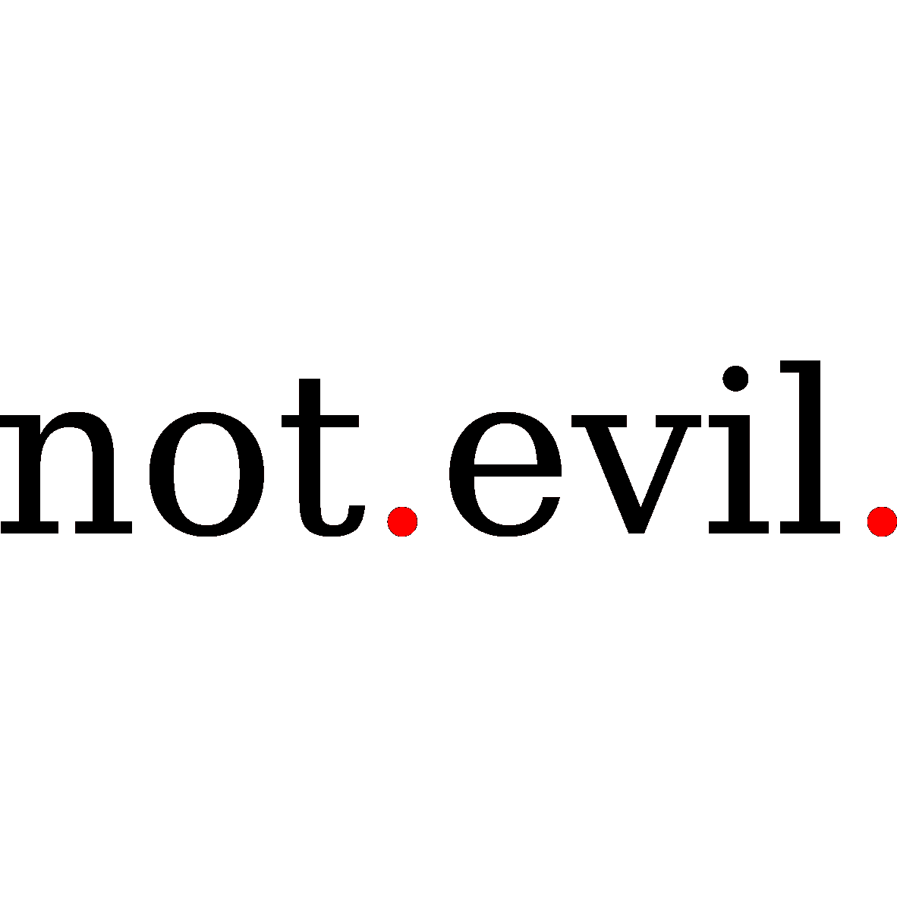

# 我们不邪恶

> 原文：<https://towardsdatascience.com/we-are-not-evil-4c294a1e743e?source=collection_archive---------53----------------------->

## 人工智能及其创造者正在让世界变得更好，而不是更糟。

我们不邪恶。(来源:作者)

人工智能是由全世界的程序员、数据科学家和数学家共同努力推动的。总的来说，这种特殊的全球亚文化(我自己也算在内)大多是乐观的，相信进步，并最终希望通过技术来改善世界。

关注这条新闻，你可能会看到一幅不同的艾和他背后的人的画面。当班卓琴的故事爆发时[1]，我们了解到整个人工智能历史上的主要人物都是白人至上主义者[2]。自从 COMPAS 丑闻[3]以来，我们几乎在任何主要的人工智能系统中都读到了性别和种族偏见。就在几天前，IBM、亚马逊和谷歌绝望地拔掉了他们面部识别软件的插头[4-6]，看不到其他方法来防止对少数民族的不公平待遇。更糟糕的是，统计学，所有现代机器学习和数据科学背后的数学学科，现在也被怀疑是种族主义的，因为它在很大程度上是由优生学家开发的[7，8]。

尽管统计学就像一般的科学一样，肯定充满了伦理污染(借用朗·霍华德的一个术语[9])，但它本身并不邪恶。我们也不是，来自世界各地的绝大多数热情的数据科学家和机器学习工程师，他们在我们做的一切事情中都依赖于统计数据。

不，统计数据不是问题，而是解决问题的关键。它是揭露任何地方的歧视和不公正的一个必要工具。只有通过系统的数据分析和统计，才能揭示当今公司和机构中普遍存在的不公平做法。统计使我们能够量化不公正，并监测我们是否在减少不公正方面取得进展。

ProPublica 是如何揭露 COMPAS 丑闻的？利用统计学和数据科学，从他们的代号可以看出[。我们怎么知道 AI 研发存在多样性问题？通过观察——你猜对了——统计数据[10]。凯茜·奥尼尔](https://www.propublica.org/datastore/dataset/compas-recidivism-risk-score-data-and-analysis)怎么可能写出“数学毁灭武器”？利用她作为数学家和数据科学家的知识和经验。她是我们中真正关心的人之一。

> 问题不在于学习了你不道德行为的 AI。首先，问题是你的行为不道德！

的确，像 COMPAS 丑闻这样的事件表明 AI 做出了不道德的决定。但是，亲爱的公司和机构，问题不在于学习了你们不道德行为的 AI。首先，问题是你的行为不道德！

为了识别和纠正这一点，做了大量的工作。伦理人工智能已经成为一个活跃的研究领域，产生了新的工具、方法和最佳实践来实现数据透明和算法可解释性。是的，对一些公司和机构来说，可解释人工智能的时代将是不舒服的，因为随着透明度的增加，会有更多的审查。然而，最终还是别无选择。将通过统计的贡献来系统地发现、衡量和打击不平等现象。

而我们，你和我，将成为实现这一目标的人。

# 参考

[1] M. Stroud，[监视公司 Banjo 的首席执行官曾经帮助三 k 党领导人枪杀了一个犹太教堂](https://onezero.medium.com/ceo-of-surveillance-firm-banjo-once-helped-kkk-leader-shoot-up-synagogue-fdba4ad32829) (2020)，OneZero

[2] S. Myers West， [AI 和极右翼:一段我们不能忽视的历史](https://medium.com/@AINowInstitute/ai-and-the-far-right-a-history-we-cant-ignore-f81375c3cc57) (2020)

[3]朱莉娅·安格温等著，[机器偏见](https://www.propublica.org/article/machine-bias-risk-assessments-in-criminal-sentencing) (2016)，ProPublica

[4] L. Hirsch， [IBM 退出面部识别业务，呼吁国会推进解决种族不公正的政策](https://www.cnbc.com/2020/06/08/ibm-gets-out-of-facial-recognition-business-calls-on-congress-to-advance-policies-tackling-racial-injustice.html) (2020)，美国消费者新闻与商业频道

[5] A. Levy，[微软表示，除非有一部以人权为基础的国家法律，否则不会向警方出售面部识别软件](https://www.cnbc.com/2020/06/11/microsoft-says-will-not-sell-facial-recognition-software-to-police.html)，(2020)，美国消费者新闻与商业频道

[6] K. Weise 和 N. Singer，[亚马逊暂停警方使用其面部识别软件](https://www.nytimes.com/2020/06/10/technology/amazon-facial-recognition-backlash.html)，(2020 年)，《纽约时报》

[7] K. Evans，[统计学是种族主义的吗？](https://medium.com/@mkevinevans/is-statistics-racist-a8f29b188b6e)

[8]d . cle ther，[统计学是种族主义的吗？](https://medium.com/swlh/is-statistics-racist-59cd4ddb5fa9)，(2020)，启动

[9] S .拉哈，[伦理污染](https://medium.com/@somikr/ethical-contamination-34dc9e98ad5b)

[10] K. Paul，[《卫报》研究发现，人工智能行业多样性的“灾难性”缺乏延续了偏见](https://www.theguardian.com/technology/2019/apr/16/artificial-intelligence-lack-diversity-new-york-university-study) (2019)

(来源:作者)