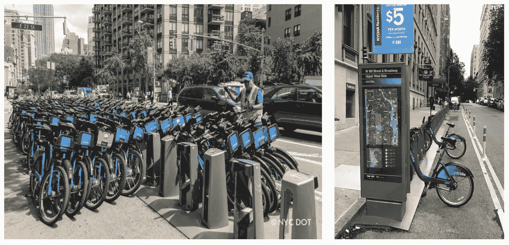
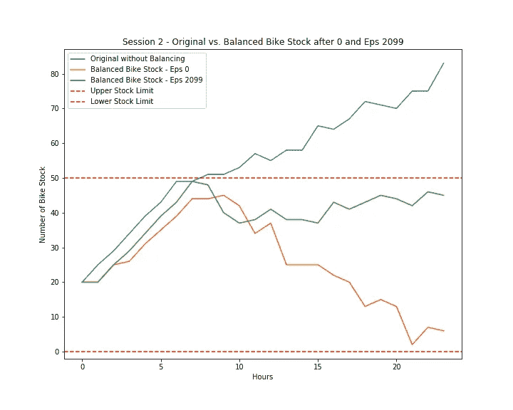
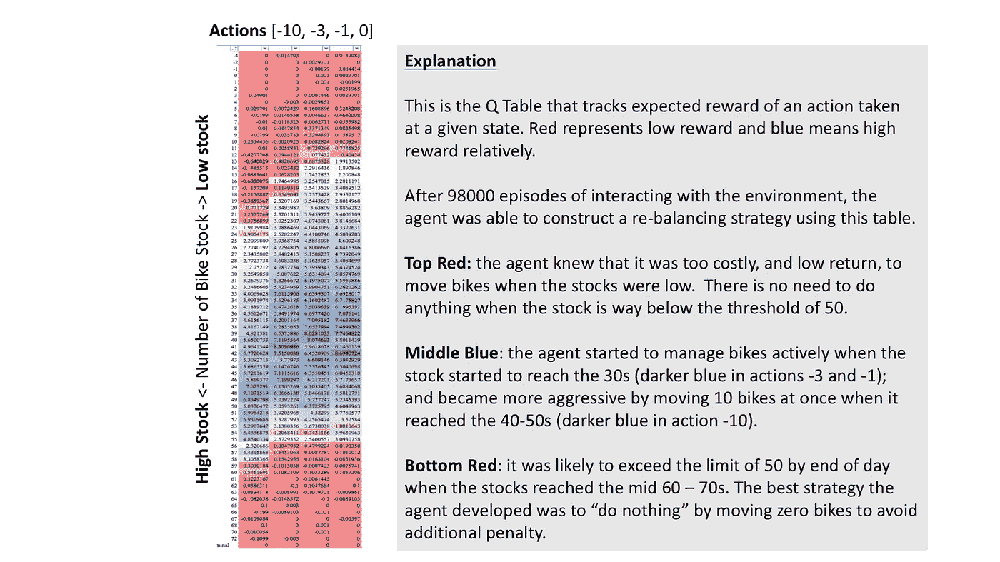
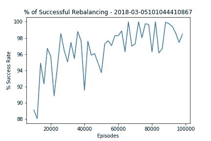
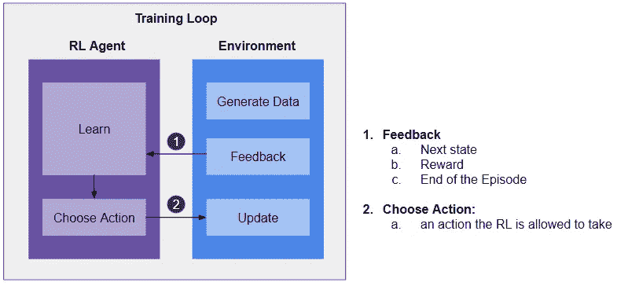

# 我们创造了一个懒惰的人工智能

> 原文：<https://towardsdatascience.com/we-created-a-lazy-ai-5cea59a2a749?source=collection_archive---------28----------------------->

## 如何为现实世界设计和实现强化学习

[丁薇](https://unsplash.com/@weiding22?utm_source=unsplash&utm_medium=referral&utm_content=creditCopyText)在 [Unsplash](https://unsplash.com/t/experimental?utm_source=unsplash&utm_medium=referral&utm_content=creditCopyText) 上拍照

**TLDR:** 许多文章解释了强化学习(RL)的概念，但没有多少文章讨论如何在现实世界中实际设计和实现强化学习。在本文中，我将分享为纽约市实施 RL 解决方案的范式转变经验、一些见解和一个通用参考架构。

***喜欢读什么？*** *跟我上* [*中*](https://medium.com/@ianxiao) *，* [*领英*](https://www.linkedin.com/in/ianxiao/) *，或者* [*推特*](https://twitter.com/ian_xxiao) *。*

*:感谢亚历克斯·香农、阿邦库王子和布雷顿·阿纳博尔迪，他们是我在 NYU 的出色队友，是他们的贡献和成就了这一切。*

# *但是，先喝一杯？*

*我以为你在一个派对上。你有点(或很)醉了。你自愿玩喝酒游戏来给一个(或多个)有魅力的熟人留下深刻印象。*

*[来源](https://media.giphy.com/media/149EV8wlV75ZQc/giphy.gif)*

*有人蒙住你的眼睛，给你一个玻璃杯和一瓶啤酒，喊:“开始倒！”*

*你会怎么做？*

*你大概有以下反应:sh*t，我该怎么办！？我怎么赢！？如果我输了会怎么样！？*

*原来规则是这样的:你需要在 10 秒钟内把啤酒灌到尽可能接近杯子上的一个标记。可以倒啤酒进出。*

***欢迎来到我们的 RL 解决方案的头脑**他面临着类似的任务，但为了一个更高尚和更有意义的目的。*

# *现实世界中的啤酒问题*

*我们的环保自行车共享业务存在一个大问题。一整天，每个**自行车站**(玻璃杯)可以有太少或太多**自行车**(啤酒)。*

**

*纽约的缺货([左](https://www.google.com/url?sa=i&source=images&cd=&cad=rja&uact=8&ved=2ahUKEwjOmcC89YDmAhXNi54KHZBTAc8QjRx6BAgBEAQ&url=%2Furl%3Fsa%3Di%26source%3Dimages%26cd%3D%26ved%3D%26url%3Dhttps%253A%252F%252Fbklyner.com%252Fciti-bike-infill-north-brooklyn%252F%26psig%3DAOvVaw1r2Xr_mC4EtgZtN7lvTprI%26ust%3D1574618512495304&psig=AOvVaw1r2Xr_mC4EtgZtN7lvTprI&ust=1574618512495304))和缺货([右](https://www.google.com/url?sa=i&source=images&cd=&cad=rja&uact=8&ved=2ahUKEwi7_LfA9IDmAhWVjp4KHYjmCpcQjRx6BAgBEAQ&url=%2Furl%3Fsa%3Di%26source%3Dimages%26cd%3D%26ved%3D%26url%3Dhttps%253A%252F%252Fwww.westsiderag.com%252F2019%252F03%252F16%252Fciti-bike-shortages-persist-but-new-bikes-are-coming-and-an-additional-e-bike-charge%26psig%3DAOvVaw1iegeNbZ8e6XWI-yxjWsrn%26ust%3D1574618140735493&psig=AOvVaw1iegeNbZ8e6XWI-yxjWsrn&ust=1574618140735493))车站*

*这对骑自行车的人来说非常不方便，并且需要花费数百万美元来管理运营。不久前，我在 NYU 的团队受命提出一个人工智能解决方案**,以最少的人工干预来帮助管理自行车库存。***

***目标:**全天保持每个自行车站的库存在 1 到 50 之间(想想玻璃上的标记)。这在共享经济中被称为*再平衡问题*。*

***约束**:由于操作限制，团队在一天中的每个小时只能移动 1、3 或 10 辆自行车(你可以倒入或倒出的啤酒量)。当然，他们可以选择什么都不做。团队移动的自行车越多，价格就越贵。*

# *我们的惰性 RL 解决方案*

***我们决定使用 RL** ，因为它克服了传统方法的许多限制(例如基于规则和预测)。*

*如果您想了解 RL 是什么以及它的一些关键概念， [Jonathan Hui](https://medium.com/u/bd51f1a63813?source=post_page-----5cea59a2a749--------------------------------) 写了一篇非常好的[简介](https://medium.com/@jonathan_hui/rl-introduction-to-deep-reinforcement-learning-35c25e04c199)和 [Thomas Simonini](https://medium.com/u/5178b198735a?source=post_page-----5cea59a2a749--------------------------------) 更详细地解释了 [Q-Learning](https://medium.com/free-code-camp/diving-deeper-into-reinforcement-learning-with-q-learning-c18d0db58efe) ，一种在我们的解决方案中使用的 RL 算法。*

*结果是，我们创造了一个非常懒惰的人工智能。当自行车库存超过 60 辆时，它通常会选择什么都不做或最小化(移动 1 或 3 辆自行车)。这似乎有悖常理，但却非常明智。*

*[来源](https://media.giphy.com/media/eoiPSYR7elWuY/giphy.gif)*

*根据人类的直觉，我们可能会移动尽可能多的自行车，使其保持在 50 辆以下，尤其是当加油站越来越满的时候。但是，RL 认识到移动自行车的成本(移动的自行车越多，成本越高)以及在某些情况下成功的机会。考虑到还剩多少时间，根本不可能实现目标。它知道最好的选择是“放弃”。所以，**有时候放弃比继续尝试更好。***

*[来源](https://media.giphy.com/media/eoiPSYR7elWuY/giphy.gif)*

*有不同的方法来“轻推”人工智能以避免懒惰。这与我们如何设计奖励函数有关。我们将在下一篇文章中讨论这个问题，所以现在请继续阅读。*

***那又怎样？**类似于谷歌 Alpha Go 著名的[棋 37 和 78](https://www.wired.com/2016/03/two-moves-alphago-lee-sedol-redefined-future/) ，当人工智能做出非常规决策时，它们挑战我们的偏见，帮助打破知识的诅咒，并将我们推向未知的道路。*

> *创造人工智能既是一项发明，也是一次探索我们大脑内部运作的旅程。—戴密斯·哈萨比斯，DeepMind 创始人，[经济学人上的 2020 年世界](https://worldin.economist.com/article/17385/edition2020demis-hassabis-predicts-ai-will-supercharge-science?utm_medium=pr&utm_source=inf-a&utm_campaign=worldin)*

***但是，要谨慎。没有什么可以取代人类的价值体系，这样我们才不会掉下悬崖或迷路。***

# *让我们现实一点*

***RL 如何管理自行车站？**下图显示了自行车库存从第 0 小时到第 23 小时(有和没有 RL)的变化。*

*   *蓝色是没有 RL 的自行车股的走势。*
*   *黄色是一个天真的女孩。它只是不停地移走自行车。成本很高。*
*   *格林和一个受过更好训练的女孩在一起。它移除刚好足够的自行车来满足目标。它更注重成本。*

**

*[作者分析](https://github.com/ianxxiao/reinforcement_learning_project)*

*RL 如何决定做什么？以下是我们的 RL 解决方案在 98，000 次训练后的 Q 表快照。它解释了给定一个站点(垂直)有多少辆自行车，我们的 RL 如何决定做什么(水平)。RL 不太可能选择做任何红色的事情。看看底部的红色区域。*

**

*[作者分析](https://github.com/ianxxiao/reinforcement_learning_project)*

***RL 能变得多聪明？**以下是 RL 管理自行车站的情况。随着更多的学习，RL 能够将整体成功率逐渐提高到令人印象深刻的 98%。*

**

*[作者分析](https://github.com/ianxxiao/reinforcement_learning_project)*

***这看起来棒极了，我们的解决方案是如何工作的？**这里是高层架构。对于大多数 RL 应用来说，这是一个通用的设计。每个 RL 解决方案需要有以下三个基本组件:训练循环、代理和环境。*

**

*作者的分析*

***训练循环:**循环便于剧集的运行。每一集意味着一个事件的端到端过程(在这种情况下，它意味着一轮寻宝的开始和结束)。该程序可以运行数千集(或你想要的任何数量)来训练 RL 代理。*

***RL 代理:**RL 代理有两个主要功能。 ***学习*** 允许智能体从每次与环境的交互中学习，并将学习带到新的一集。“大脑”有不同的设计。最简单的是通过使用 Q 学习。Alpha Go 使用深度神经网络。代理 ***基于学习和环境提供的情况选择动作*** 。*

***环境:**这是给定应用的世界的表示。在我们的例子中，这是自行车在城市中行驶的方式。该环境基于代理的动作提供反馈。反馈包括奖励或惩罚以及环境的最新状态。我们稍后将更详细地讨论这一点。*

# *下一步是什么*

*我希望你喜欢这篇文章，并且对 RL 在现实世界中的能力和潜力感到兴奋。取决于本文的表现，我们将在下一篇文章中深入研究设计、权衡，并进行详细的代码演练。*

*与此同时，如果你想了解更多关于开发 RL 的基础知识，请查看我的新 [**RL 教程**](https://bizanalyticsbootcamp.squarespace.com/rl-mini-course) 。我们将用大约 100 行代码制作一个有趣的寻宝程序，熟悉上面讨论的一般 RL 架构，并构建一个演示包。*

****喜欢读什么？*** *跟我上* [*中*](https://medium.com/@ianxiao)*[*LinkedIn*](https://www.linkedin.com/in/ianxiao/)*，或者*[*Twitter*](https://twitter.com/ian_xxiao)*。***

**下次见。**

**伊恩**

**喜欢你读的书吗？你可能也会喜欢我这些受欢迎的文章:**

** [## 最有用的 ML 工具 2020

### 每个懒惰的全栈数据科学家都应该使用的 5 套工具

towardsdatascience.com](/the-most-useful-ml-tools-2020-e41b54061c58)  [## 被遗忘的算法

### 用 Streamlit 探索蒙特卡罗模拟

towardsdatascience.com](/how-to-design-monte-carlo-simulation-138e9214910a)  [## 越狱

### 我们应该如何设计推荐系统

towardsdatascience.com](/how-to-design-search-engines-24e9e2e7b7d0)  [## 12 小时 ML 挑战

### 如何使用 Streamlit 和 DevOps 工具构建和部署 ML 应用程序

towardsdatascience.com](/build-full-stack-ml-12-hours-50c310fedd51)  [## 数据科学很无聊

### 我如何应对部署机器学习的无聊日子

towardsdatascience.com](/data-science-is-boring-1d43473e353e)  [## 抵御另一个人工智能冬天的最后一道防线

### 数字，五个战术解决方案，和一个快速调查

towardsdatascience.com](/the-last-defense-against-another-ai-winter-c589b48c561)  [## 人工智能的最后一英里问题

### 许多数据科学家没有充分考虑的一件事是

towardsdatascience.com](/fixing-the-last-mile-problems-of-deploying-ai-systems-in-the-real-world-4f1aab0ea10)  [## ML 和敏捷注定的联姻

### Udacity 的创始人巴斯蒂安·特龙毁了我的 ML 项目和婚礼

towardsdatascience.com](/a-doomed-marriage-of-ml-and-agile-b91b95b37e35)**