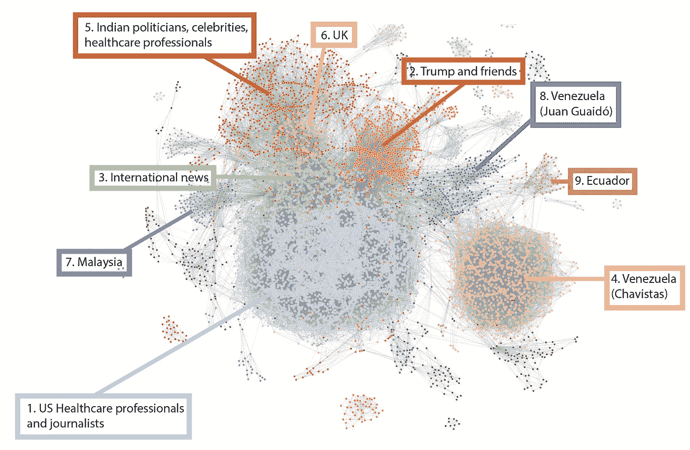
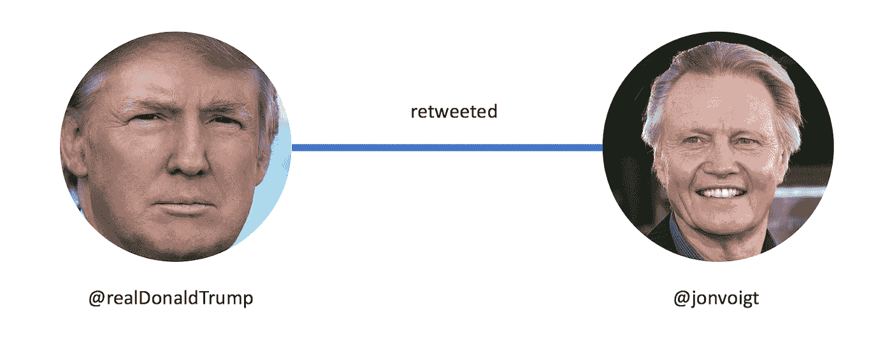
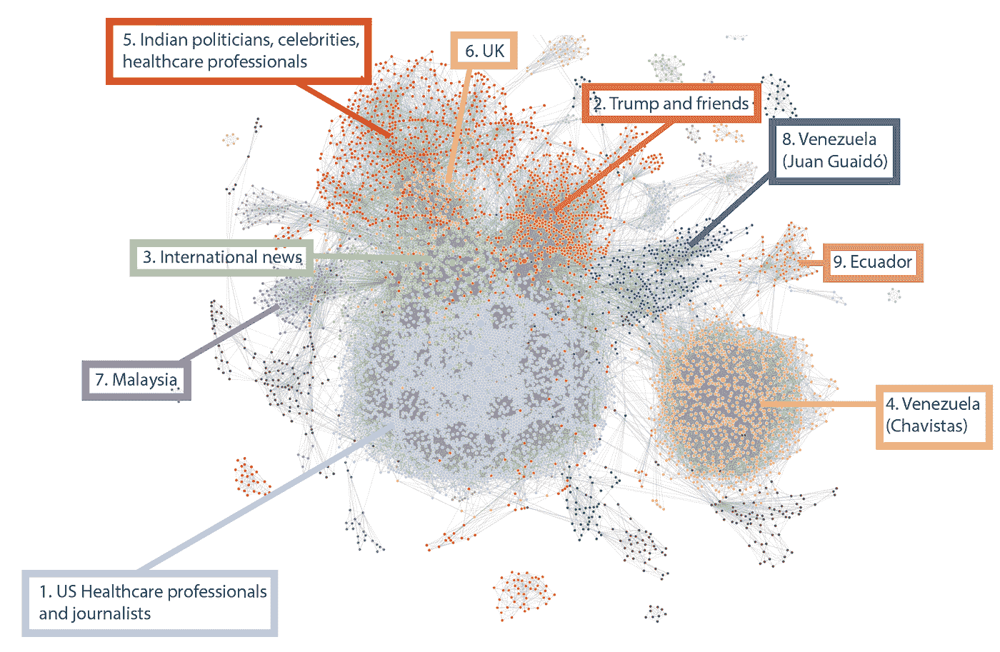
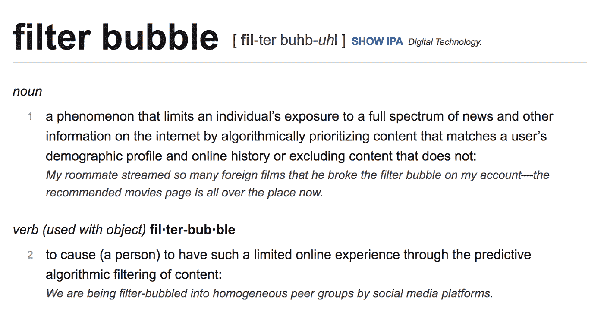

# 我们整个周末都在推特上追踪 COVID。这是你错过的。

> 原文：<https://towardsdatascience.com/we-tracked-covid-on-twitter-all-weekend-heres-what-you-missed-e3203dc7f41c?source=collection_archive---------50----------------------->

由史蒂夫·赫登和大卫·波尔分别担任

为了进行这项分析，我们在整个周末(美国东部时间 7 月 24 日晚 7 点至 7 月 26 日中午)流式传输了所有与 COVID 相关的推文。我们从这些数据中提取了一个网络，使用个人 Twitter 账户作为节点，RTs 或提及作为链接。

下面演示了网络是如何创建的。@realDonaldTrump 和@jonvoigt 代表节点。既然@realDonaldTrump 转推了@jonvoigt，那两者之间就有联系了。

在过滤了网络中最有影响力的节点之后，我们创建了一个总结网络。

7 月 24 日—26 日周末 COVID 相关推特汇总网络。

图中的每个节点(气泡)代表一个 Twitter 用户，每个链接代表与另一个用户的连接。如果在时间间隔内的任何时间点，两个账户彼此交互或者与同一个中间账户紧密交互，则这两个账户是关联的。每个节点的大小对应于它们的度中心性——用户拥有的连接越多，它们的中心性越高。节点的颜色对应于它们的社区或组。当用户之间的互动多于他们社区之外的用户时，社区就形成了。

# 主要要点

从上面的视频可以看出，Twitter 上的 COVID 对话揭示了几个不同的社区。这些人在周末定期进行互动，无论是通过直接转发和提及，还是通过转发相同的推文或提及相同的用户。这些社区的详细信息(顶级影响者、关键词、总体情绪)将在下面详细解释，但是存在这样的独特社区本身就很重要。在网络分析术语中，我们可以说这是一个非常模块化的图，具有密集连接的节点的不同集群。用外行的话来说，我们有一群人，他们彼此之间有很多互动，但他们不经常与他们圈子之外的人互动。这可能是因为大多数人的 Twitter 订阅由他们关注的用户的推文主导，Twitter 建议他们关注其他类似的用户，这被称为“过滤泡沫”。

来自 Dictionary.com[https://www.dictionary.com/browse/filter-bubble?s=t](https://www.dictionary.com/browse/filter-bubble?s=t)

由于语言和时区的差异，这些社区看起来也很独特。例如，有巨大的西班牙语社区，尤其是来自委内瑞拉的社区。在那个半球的白天，也有不同的印度和马来西亚社区出现和成长。

# 周末热门推文(截至 7 月 26 日周日晚的转发数)

1.  来自@ alsoto_7，转发约 153，000 条

2.来自@ davenewworld_2，转发量约为 107，000 次

3.来自@ TristanTaylor88，转发量约为 66K

4.来自@ Theresa_Chappie，转发量约 51K

5.来自@ JoeBiden，转发量约为 32K

6.来自@ kylegriffin1，转发量约 20000 条

7.来自@ funder，转发量约为 1.6 万

8.来自@ jsolomonReports，转发量约为 16K

# 顶级群体

有几个不同的团体在这段时间内一直存在。以下是对群组的一些高级描述，包括顶级影响者(基于每个用户的程度中心性)、群组的关键词和总体情绪。使用自然语言处理(NLP)来计算关键词和情感。对于关键词，我们确定了该组所有推文中最常用的名词。这种情绪有好有坏。大多数推文相当负面(毕竟，我们在谈论一个全球性的疫情)。

## 第 1 组——美国医疗保健专业人员、记者和政治家

**最有影响力的人**

1.  埃里克·费格丁博士(@德瑞克丁)
2.  CNN (@ CNN)
3.  凯尔·格里芬(@ kylegriffin1)
4.  安迪·斯拉维特(@阿斯拉维特)
5.  丹尼尔·乌尔菲尔德(@ DWUhlfelderLaw)

**关键词:**佛罗里达州，川普，冠状病毒，得克萨斯州，美国

**总体情绪:** -0.21(负面)

这是迄今为止网络中最大的社区。顶级成员在整个周末都在变化，但美国科学家联合会高级研究员、流行病学家和健康经济学家 Eric Feigl-Ding 博士始终是最有影响力的人之一。他周末最热门的推文实际上是在周四下午发出的:

同样，CNN 也有一些重要的推文。周末转发量最大的一条也是在周四发出的:

凯尔·格里芬(Kyle Griffin)周五晚上在推特上警告说，辛克莱广播集团准备播放一部纪录片，声称福奇博士对冠状病毒负责:

格里芬的这条推文获得了如此多的关注，以至于他们推迟了这部纪录片的发布，这部纪录片本身就是我们网络中的一个重大事件:

安迪·斯拉维特在推特上讲述了疾控中心的衰落程度:

以及德州州长 Abbott 如何需要立即采取激烈的行动:

丹尼尔·乌尔菲尔德(Daniel Uhlfelder)报道称，阿肯色州参议员杰森·雷佩特(Jason Rapert)因 COVID:

上周末，该社区的其他顶级影响者包括斯蒂芬·金、卡玛拉·哈里斯、乔·斯卡伯勒、特里萨·查普尔博士、乔伊·里德和乔·拜登。

# 第二组——特朗普和他的朋友们

## 顶级影响者

1.  唐纳德·特朗普(@ realDonaldTrump)
2.  贾尼斯·迪恩(@ JaniceDean)
3.  约翰·所罗门(@ jsolomonReports)
4.  大卫·萨马迪博士(@ drdavidsamadi)
5.  汤姆·菲顿(@汤姆菲顿)

**关键词:** CCP，佛罗里达州，美国，60 万美国，参议院

**总体情绪:** -0.27(负面)

特朗普周末的第一条推文是在周五晚上，当时他回应了斯科特拒绝内华达州一所教堂增加教堂容量的上诉的消息:

贾尼丝·迪恩宣传了她关于科莫“致命”养老院政策的文章:

约翰·所罗门宣传羟氯喹是“击败”病毒的关键:

大卫·萨马迪博士分享最多的推文比较了各国人均因 COVID 导致的死亡人数:

他还称新冠肺炎为“CCP 病毒”，大概是在中国共产党之后。术语“CPP”获得了足够的关注，它从 NLP 中脱颖而出，成为这个社区中所有推文中的顶级名词之一。

汤姆·菲顿也对罗伯茨法官不允许内华达教堂增加容量的决定表示反对:

下面，我们列出了我们定义的每个剩余社区的前 5 名影响者。

请记住，这些社区在不断变化。对于实时更新，我们建议您使用 [covidtwitternetwork](http://www.covidtwitternetwork.com/) 亲自探索对话及其主要参与者。

# 第三组—国际新闻

## 顶级影响者

1.  路透社(@路透社)
2.  电晕更新机器人(@电晕更新机器人)
3.  哥伦比亚广播公司新闻(@ CBSNews)
4.  彭博(@商业)
5.  小山(@ thehill)

# 第 4 组—委内瑞拉(查韦斯主义者)

## 顶级影响者

1.  VTV 运河 8 (@ VTVcanal8)
2.  委内瑞拉统一社会党
3.  大众通信和信息部(@ Mippcivzla)
4.  Con El Mazo Dando (@ ConElMazoDando)
5.  patria rebel de RR(@ ronel Rodriguez 6)

# 第 5 组—印度政治家、名人、医疗保健专业人士

## 顶级影响者

1.  shiv Raj Singh Chou Han(@ ChouhanShivraj)
2.  阿尼(@阿尼)
3.  索努·苏德(@ SonuSood)
4.  Kumar Vishvas 博士(@ DrKumarVishwas)
5.  总部新闻(@ ABPNews)

# 第 6 组—英国

## 顶级影响者

1.  莎拉·墨菲(@ 13 莎拉·墨菲)
2.  德里克·詹姆斯(@ derekjames150)
3.  戈登财富#FBPE (@戈登 _ 财富)
4.  理查德·科比特(@ RichardGCorbett)
5.  詹姆斯·梅尔维尔(@詹姆斯·梅尔维尔)

# **第 7 组——马来西亚**

## 顶级影响者

1.  KKMPutrajaya (@ KKMPutrajaya)
2.  anep (@ hanifjamals)
3.  哈里安地铁(@ hmetromy)
4.  伯纳玛(@ bernamadotcom)
5.  贝里塔·哈里安(@ bharianmy)

# 第八组—委内瑞拉(胡安·瓜伊德)

## 顶级影响者

1.  胡安·瓜伊多(@ jguaido)
2.  全国通讯中心
3.  雨果·洛佩斯-盖特尔·拉米雷斯(@赫尔盖特尔)
4.  Reporte Ya (@ ReporteYa)
5.  尼尔森·博卡兰达 S. (@尼尔森·博卡兰达)

# 第 9 组——厄瓜多尔

## 顶级影响者

1.  El Comercio (@ elcomerciocom)
2.  El Universo (@ eluniversocom)
3.  厄瓜多尔人(@厄瓜多尔人)
4.  tele amazonas(@ tele amazonas sec)
5.  CNN en 西班牙语(@ CNNEE)

我们将继续使用 [covidtwitternetwork](http://www.covidtwitternetwork.com/) 来分析 Twitter 上正在进行的与新冠肺炎有关的对话。该应用程序仍在开发中，因此我们欢迎任何评论或反馈。

感谢[杰西卡·雷蒂格](https://medium.com/u/a0fb65e09a67?source=post_page-----e3203dc7f41c--------------------------------)的反馈和支持:)