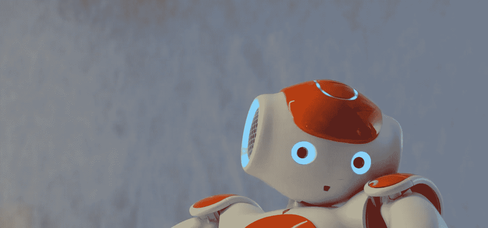

# 我们不会被机器取代

> 原文：<https://towardsdatascience.com/we-will-not-be-replaced-by-machines-f1d1a8664c59?source=collection_archive---------45----------------------->

## 这个故事是关于合作而不是竞争

在 [Unsplash](https://unsplash.com/s/photos/robot?utm_source=unsplash&utm_medium=referral&utm_content=creditCopyText) 上[尔汗·阿斯塔姆](https://unsplash.com/@vaultzero?utm_source=unsplash&utm_medium=referral&utm_content=creditCopyText)的照片

在以前的文章中，我们已经讨论了在不同研究领域工作的专家之间合作的重要性。现实世界中的问题往往不完全属于某个特定的研究领域——我们需要学会一起面对问题，不仅要分享我们所知道的，还要愿意倾听——仔细倾听他人的想法 *—* 。我们需要保持足够的开放，承认我们没有所有的答案，其他人可能有我们没有的知识和观点。

我想我们都同意，协作是一件好事，我们的综合思维大于其各个部分的总和。那么，当涉及到与人工智能合作时，我们为什么会觉得有必要采取不同的观点呢？

# 我们对他们

科学论文不断将他们的人工智能算法在解决某些特定问题时的性能与专家的性能进行比较。它被视为超越人类的战利品，即使只是狭义的。虽然这可能是一个有用的基准，将研究的成就和意义放入上下文中，但我认为它也不知不觉地建立了一种对立的关系。突然变成了竞争。我们对抗机器。

人类和他们的人工智能作品之间的竞争和最终冲突已经成功地抓住了我们社会的集体想象力。我们在文学和电影中戏剧化地表现了这个想法，产生了巨大的影响。这当然是发人深省的材料，并提出了许多非常好(也非常困难)的伦理问题，我们绝对应该尽早思考。

但硬币的另一面是，这种魅力也导致了一种广泛的观点，即人工智能在某种程度上反对我们。粗心的科学家盲目追求他们的研究进展，而牺牲了我们的其他生计。我们害怕有一天我们被机器人取代，而这正是我们花了大半辈子学习的事情。

很容易理解为什么这让我们如此恐惧。当我们觉得工作过度、报酬过低时，我们可能会抱怨，但我们内心深处还是有一部分喜欢工作。我们喜欢工作，也喜欢贡献。我们希望感受到他人的重视。我们从工作中获得自我价值。我们从工作中获得认同感。在许多方面，我们*是*我们的工作。如果我们觉得我们的工作——以及我们的*自我*——受到了威胁，我们就会努力工作。我们变得有防御性。这是对我们所珍视的东西的攻击。

被算法淘汰的前景似乎意味着我们所做的不再有价值，这理所当然地让我们感到不安。然而，我们不应该让我们的想象力战胜我们。在我们决定必须不惜一切代价阻止人工智能研究的无情前进之前，让我们检查一下现实。

# 人为因素的情况

人类将永远保持机器所不具备的灵活性。诚然，在简单和重复的决策方面，我们远远胜过他人——但是人类学习、适应以及更普遍的对新奇事物做出适当反应的能力*是无法用代码行复制的。在历史上，我们对未知事物的成功探索行为使我们人类比地球上任何其他生物都更强大、更成功。*

在出现异常信息时，我们可以(只要我们愿意面对它)推导出它的含义，并将我们需要知道的信息整合到我们现有的决策过程中。虽然算法在某种意义上确实“学习”,但我们还远远没有开发出像通用智能那样可以模仿人类能力的东西。

本质上:在未来很长一段时间里，我们将与人工智能一起工作，而不是与之竞争。

我们的工作将因人工智能而得到加强。通过处理工作中枯燥、重复的部分，我们将能够把注意力集中在工作中更有趣、更重要、更有影响力的方面。每个人都有那些他们知道他们应该做的事情，那些我们知道如果我们做了会对我们和我们的组织有好处的重要但不紧急的任务，但我们似乎就是不能去做。我们会陷入所有不太重要但最终更紧迫的事情中。

想象一下，如果你组织中的每个人都只做重要的事情。为，像，*连续一年。在那段时间里，事情会发生怎样的变化？流程的效率会提高多少？工作质量会提高多少？你的客户会有多开心呢？会有更多的事情要做。*

或者也许人工智能确实在你工作的某个关键方面胜过你。下一个问题是:如果你和机器一起工作，你会取得什么成就？你们如何弥补对方的弱点？人工智能能帮助你处理特别模糊的情况吗？你能掩盖机器的故障模式吗？

# *选择*不要害怕

重点是这个。替换*可怕的*问题:

> “这项技术会取代我们吗？”

…带着*协作*问题:

> “如果我们一起努力，我们能取得什么成就？”

**不是机器人对人类。是机器人和人类对抗问题。重大而令人挠头的问题。**

我们越早开始这样思考——从与人工智能合作而不是对抗的角度来看——我们就能越快实现目标。

# 学分和更多信息

**Andrew Hetherington** 是英国伦敦的一名见习精算师和数据爱好者。

*   在我的[网站](https://www.andrewhetherington.com/)上查看我的更多作品。
*   在 [LinkedIn](https://www.linkedin.com/in/andrewmhetherington/) 上与我联系。
*   看看我在 GitHub 上摆弄什么。

[尔汗阿斯塔姆](https://unsplash.com/@vaultzero?utm_source=unsplash&utm_medium=referral&utm_content=creditCopyText)在 [Unsplash](https://unsplash.com/s/photos/robot?utm_source=unsplash&utm_medium=referral&utm_content=creditCopyText) 上拍照。