# 弱自我监督学习—第一部分

> 原文：<https://towardsdatascience.com/weakly-and-self-supervised-learning-part-1-8d29fce2dd92?source=collection_archive---------15----------------------->

## [FAU 讲座笔记](https://towardsdatascience.com/tagged/fau-lecture-notes)关于深度学习

## 从类到像素

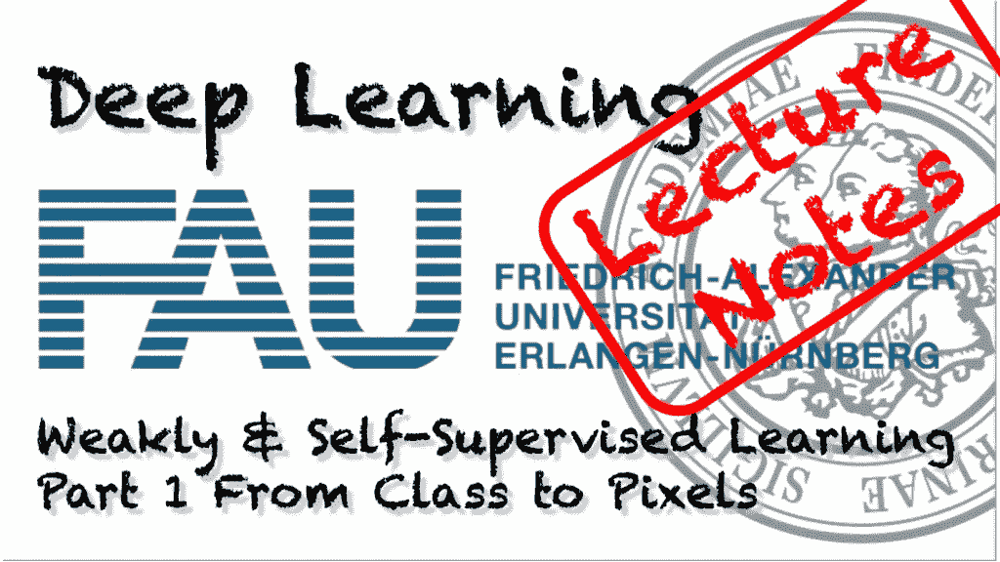

FAU 大学的深度学习。下图 [CC BY 4.0](https://creativecommons.org/licenses/by/4.0/) 来自[深度学习讲座](https://www.youtube.com/watch?v=p-_Stl0t3kU&list=PLpOGQvPCDQzvgpD3S0vTy7bJe2pf_yJFj&index=1)

**这些是 FAU 的 YouTube 讲座** [**深度学习**](https://www.youtube.com/watch?v=p-_Stl0t3kU&list=PLpOGQvPCDQzvgpD3S0vTy7bJe2pf_yJFj&index=1) **的讲义。这是与幻灯片匹配的讲座视频&的完整抄本。我们希望，你喜欢这个视频一样多。当然，这份抄本是用深度学习技术在很大程度上自动创建的，只进行了少量的手动修改。** [**自己试试吧！如果您发现错误，请告诉我们！**](http://autoblog.tf.fau.de/)

# 航行

[**上一讲**](/segmentation-and-object-detection-part-5-4c6f70d25d31) **/** [**观看本视频**](https://youtu.be/Vj_JeSZG1EA) **/** [**顶级**](/all-you-want-to-know-about-deep-learning-8d68dcffc258) **/** [**下一讲**](/weakly-and-self-supervised-learning-part-1-ddfdf8377f1d)

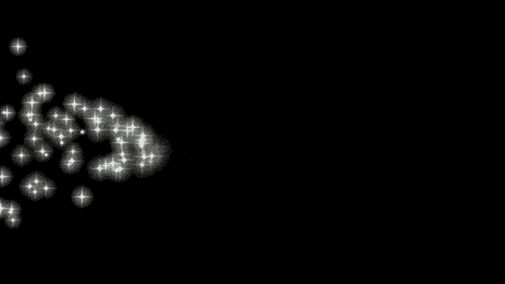

弱监督训练也可以利用非常粗糙的注释。使用 [gifify](https://github.com/vvo/gifify) 创建的图像。来源: [YouTube](https://youtu.be/CX1hEOV9tlo) 。

欢迎回到深度学习！所以，今天我想和你们谈谈几个高级的话题，特别是研究稀疏标注。我们知道数据质量和注释是极其昂贵的。在接下来的几个视频中，我们想谈谈如何保存注释的一些想法。主题是弱监督学习和自我监督学习。

监督训练的标签似乎很多。 [CC 下的图片来自](https://creativecommons.org/licenses/by/4.0/)[深度学习讲座](https://www.youtube.com/watch?v=p-_Stl0t3kU&list=PLpOGQvPCDQzvgpD3S0vTy7bJe2pf_yJFj&index=1)的 4.0 。

好吧。那么，让我们看一下幻灯片，看看我为你准备了什么。题目是弱自监督学习。我们今天从有限的注释和一些定义开始。稍后，我们将研究代表学习的自我监督学习。那么，用有限的注解学习有什么问题呢？目前为止。我们有监督学习，我们已经看到这些令人印象深刻的结果是通过大量的训练数据和一致的高质量注释实现的。这里，你可以看到一个例子。我们有基于实例的分段的注释，并且我们简单地假设所有这些注释都在那里。我们可以使用它们，甚至可以公开获得。所以，没什么大不了的。但实际上，在大多数情况下，这是不正确的。

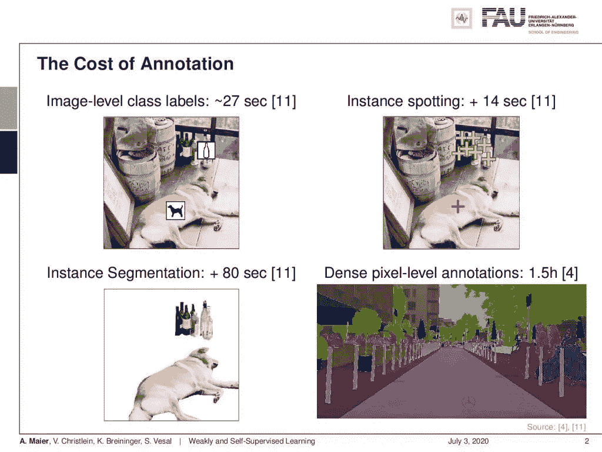

其实标注很贵的。来自[深度学习讲座](https://www.youtube.com/watch?v=p-_Stl0t3kU&list=PLpOGQvPCDQzvgpD3S0vTy7bJe2pf_yJFj&index=1)的 [CC BY 4.0](https://creativecommons.org/licenses/by/4.0/) 下的图片。

通常，您必须进行注释，而注释是非常昂贵的。如果查看图像级别的分类标签，每个样本大约需要 20 秒。这里，你可以看到一只狗的图像。也有想法，我们试图让它更快。例如你在[11]中看到的例子。如果你接着去实例分割，你实际上必须画出轮廓，这是你必须在这里花费的每个注解至少 80 秒。如果您继续进行密集像素级注释，您可以轻松地花费一个半小时来注释这样的图像。你可以在[4]中看到。

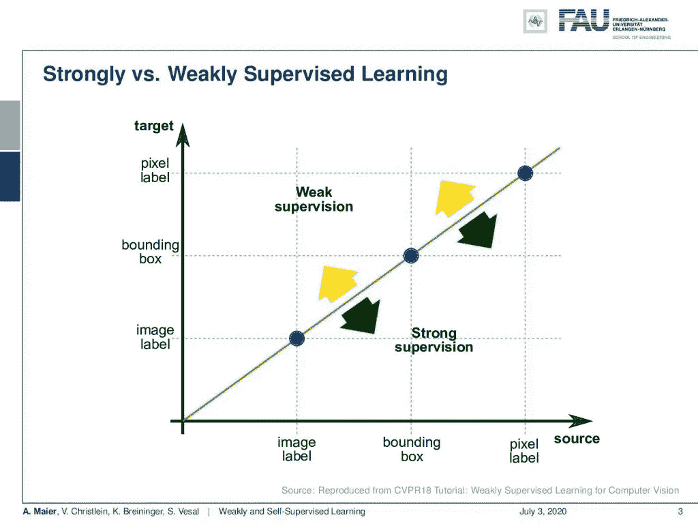

监管不力试图充分利用你的标签。 [CC 下的图片来自](https://creativecommons.org/licenses/by/4.0/)[深度学习讲座](https://www.youtube.com/watch?v=p-_Stl0t3kU&list=PLpOGQvPCDQzvgpD3S0vTy7bJe2pf_yJFj&index=1)的 4.0 。

现在，弱监督学习和强监督学习的区别，你可以在这个图表中看到。这里你看到如果我们有图像标签，当然可以对图像标签进行分类，进行训练。这基本上是监督学习:训练边界框以预测边界框，训练像素标签以预测像素标签。当然，您也可以从像素级标签抽象到边界框，或者从边界框抽象到图像标签。那都将是强有力的监督。现在，弱监督学习的想法是，你从图像标签开始，然后去包围盒，或者你从包围盒开始，然后尝试预测像素标签。

弱标签的例子。 [CC 下的图片来自](https://creativecommons.org/licenses/by/4.0/)[深度学习讲座](https://www.youtube.com/watch?v=p-_Stl0t3kU&list=PLpOGQvPCDQzvgpD3S0vTy7bJe2pf_yJFj&index=1)的 4.0 。

这是弱监督学习的核心思想。不知何故，您希望使用稀疏注释，然后创建更强大的预测器。弱监督学习的关键要素是使用先验知识。你使用关于形状、大小和对比度的显性和隐性先验。此外，运动可以用来，例如，移动边界框。类别分布告诉我们，有些类别比其他类别更频繁。此外，图像间的相似性也有帮助。当然，您也可以使用像图像标签、边界框和图像标题这样的提示作为弱监督标签。稀疏时态标签随时间传播。对象内部的涂鸦或点击也是合适的。这里有几个关于涂鸦和点击的稀疏注释的例子。

从标签到本地化的第一种方法。来自[深度学习讲座](https://www.youtube.com/watch?v=p-_Stl0t3kU&list=PLpOGQvPCDQzvgpD3S0vTy7bJe2pf_yJFj&index=1)的 [CC BY 4.0](https://creativecommons.org/licenses/by/4.0/) 下的图片。

有一些通用的方法。从标签到本地化的一个方法是使用预先训练好的分类网络。然后，举例来说，你可以使用一些技巧，就像在视觉化的讲座中一样。你就产生了一个定性的分割图。所以在这里，我们有这样一个想法，将类标签反向传播到图像域中，以产生这样的标签。现在，问题是这个分类器从来没有被训练用于局部决策。第二个问题是好的分类器不会自动产生好的地图。所以，让我们看看另一个想法。这里的关键思想是使用全球平均池。因此，让我们重新思考一下全卷积网络以及我们一直在做的事情。

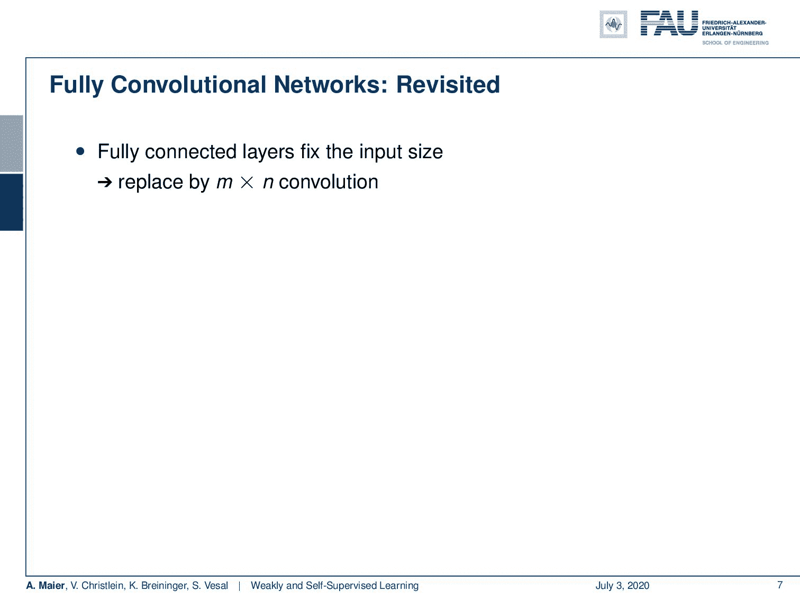

全卷积处理概述。 [CC 下的图片来自](https://creativecommons.org/licenses/by/4.0/)[深度学习讲座](https://www.youtube.com/watch?v=p-_Stl0t3kU&list=PLpOGQvPCDQzvgpD3S0vTy7bJe2pf_yJFj&index=1)的 4.0 。

你记得我们可以用 M 乘以 N 的卷积来替换只有固定输入大小的完全连接的层。如果你这样做，我们会看到，如果我们有一些输入图像，我们与张量卷积，那么本质上我们得到一个输出。现在，如果我们有多个张量，那么我们就有多个通道。如果我们现在开始跨图像域移动卷积掩模，可以看到，如果输入图像更大，输出也会相对于输出域增长。我们已经看到，为了解决这个问题，我们可以使用全局平均池方法来为每个实例生成类标签。

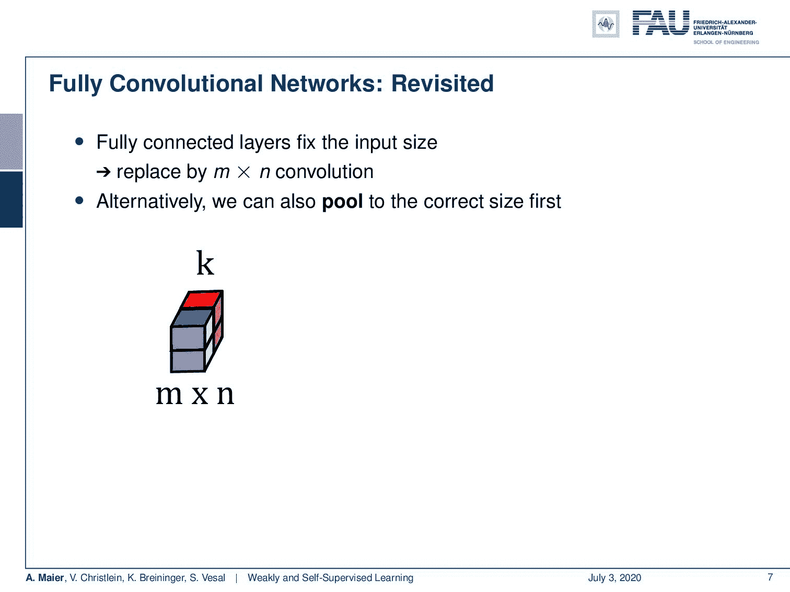

让我们重新排序汇集和分类。来自[深度学习讲座](https://www.youtube.com/watch?v=p-_Stl0t3kU&list=PLpOGQvPCDQzvgpD3S0vTy7bJe2pf_yJFj&index=1)的 [CC BY 4.0](https://creativecommons.org/licenses/by/4.0/) 下的图片。

现在，你可以做的另一个选择是，你首先汇集到正确的大小。比方说，这是您的输入，然后您首先汇集，这样您就可以应用您的分类网络。然后，转到全连接层中的类。因此，您实际上交换了全连接层和全局平均池的顺序。你先全局平均池，然后产生类。我们现在可以使用它来生成一些标签。

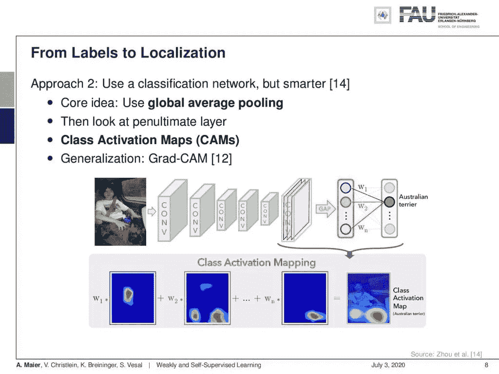

对于类激活图，我们在倒数第二层汇集以获得像素级的类标签。 [CC 下的图片来自](https://creativecommons.org/licenses/by/4.0/)[深度学习讲座](https://www.youtube.com/watch?v=p-_Stl0t3kU&list=PLpOGQvPCDQzvgpD3S0vTy7bJe2pf_yJFj&index=1)的 4.0 。

这个想法是，现在我们看看倒数第二层，我们产生类激活图。所以，你可以看到我们有两个完全连接的层来产生类预测。我们基本上有输入特征地图，我们可以放大到原始图像大小。然后，我们使用分配给倒数第二层输出的权重，相应地缩放它们，然后为每个输出神经元生成一个类激活图。您可以在底部看到这种情况，顺便提一下，还有一种概括，即 Grad-CAM，您可以在[12]中查看。因此，有了这个，我们可以生成类激活映射，并将其用作本地化的标签。

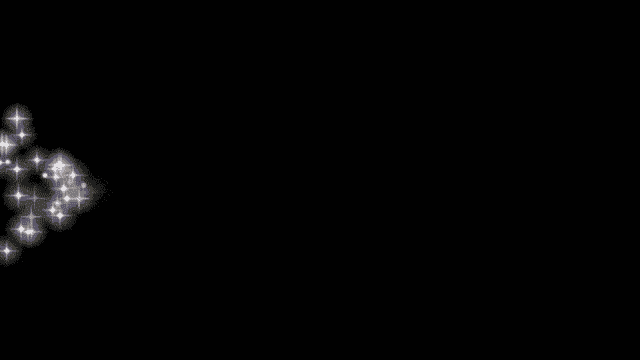

GradCAM 可视化示例。使用 [gifify](https://github.com/vvo/gifify) 创建的图像。来源: [YouTube](https://youtu.be/CX1hEOV9tlo) 。

我们也可以从包围盒到分割。这里的想法是，我们希望用边界框取代昂贵的注释、完全监督的训练，因为它们不那么单调乏味。

我们能从包围盒到像素标签吗？来自[深度学习讲座](https://www.youtube.com/watch?v=p-_Stl0t3kU&list=PLpOGQvPCDQzvgpD3S0vTy7bJe2pf_yJFj&index=1)的 [CC BY 4.0](https://creativecommons.org/licenses/by/4.0/) 下的图片。

它们可以更快地被注释，当然，这会降低成本。现在的问题是，我们能使用那些廉价的标注和弱监督来产生好的分割吗？实际上有一篇论文研究了这个想法。

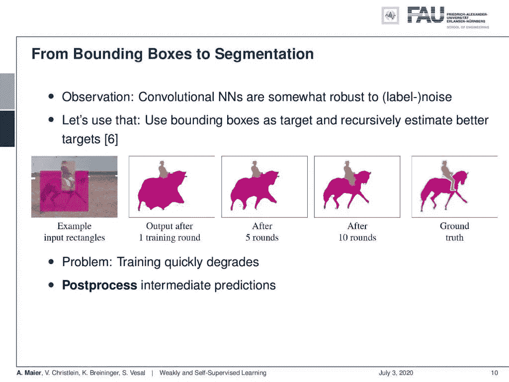

自举训练程序怎么样？ [CC 下的图片来自](https://creativecommons.org/licenses/by/4.0/)[深度学习讲座](https://www.youtube.com/watch?v=p-_Stl0t3kU&list=PLpOGQvPCDQzvgpD3S0vTy7bJe2pf_yJFj&index=1)的 4.0 。

你可以在[6]中看到。关键的想法是你从输入矩形开始。然后，你对卷积神经网络进行一轮训练。您可以看到，卷积神经网络对标签噪声有一定的鲁棒性，因此，如果您重复该过程，并在迭代过程中优化标签，您可以看到，每一轮训练和优化标签都会获得更好的预测。所以在右手边，你可以看到地面真相，以及我们如何逐渐接近它。现在，实际上有一个问题，因为训练很快就会退化。唯一能让它实际工作的方法是在中间预测中使用后处理。

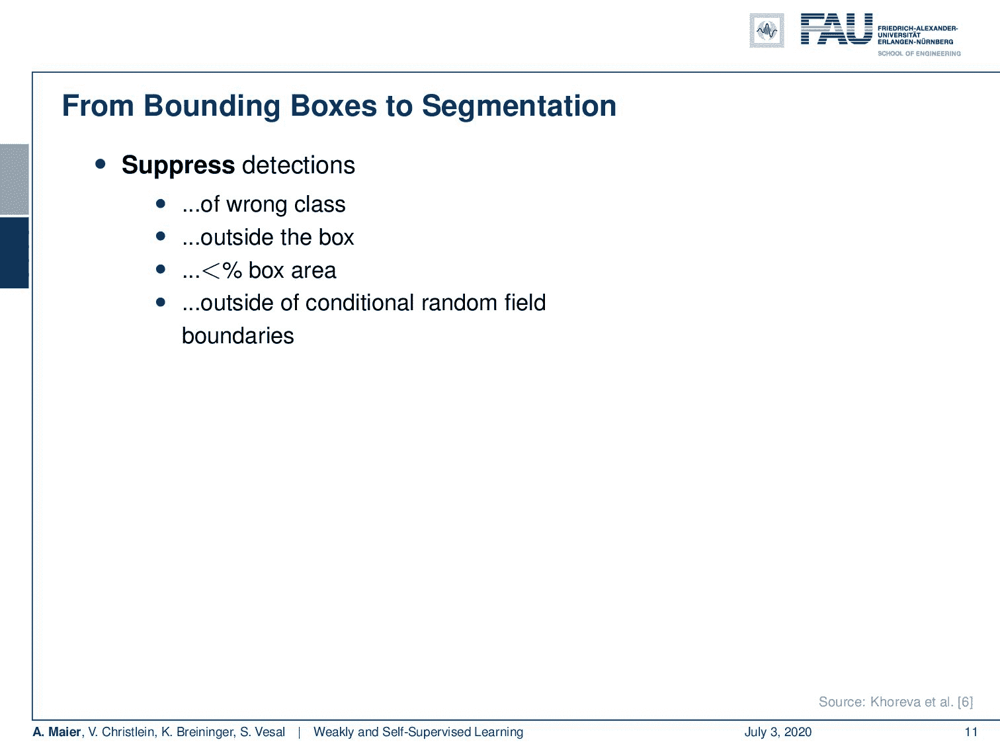

对于迭代训练，你需要使用一些技巧。 [CC 下的图片来自](https://creativecommons.org/licenses/by/4.0/)[深度学习讲座](https://www.youtube.com/watch?v=p-_Stl0t3kU&list=PLpOGQvPCDQzvgpD3S0vTy7bJe2pf_yJFj&index=1)的 4.0 。

他们使用的想法是他们抑制例如错误的检测。因为你有边界框，所以你可以确定在这个边界框中，它不可能有一个非常不同的类。然后，您还可以删除边界框之外的所有预测。它们可能不准确。此外，您还可以检查它是否小于盒子面积的某个百分比，这可能也不是一个准确的标签。此外，您可以使用条件随机字段边界的外部。我们本质上运行一种传统的分割方法，使用边缘信息来细化边界。您可以使用它，因为没有信息来完善您的标签。如果您使用较小的盒子，还可以做进一步的改进。平均来说，物体是有点圆的，因此角和边包含最少的真阳性。这是一些图像的例子，然后你可以定义带有未知标签的区域。

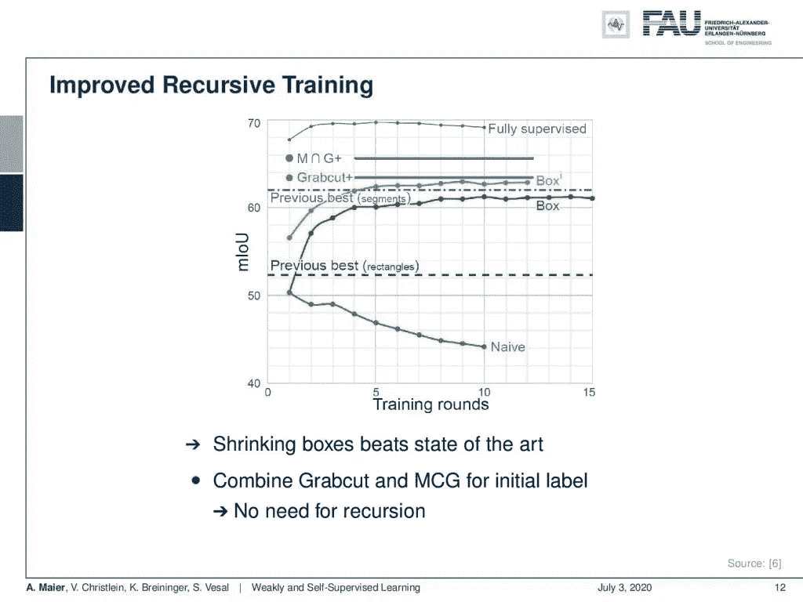

这些技巧有助于提高性能。不需要训练的传统分割方法消除了迭代的需要。来自[深度学习讲座](https://www.youtube.com/watch?v=p-_Stl0t3kU&list=PLpOGQvPCDQzvgpD3S0vTy7bJe2pf_yJFj&index=1)的 [CC BY 4.0](https://creativecommons.org/licenses/by/4.0/) 下的图片。

以下是一些结果。你可以看到，如果我们不对标签进行任何细化，只是一遍又一遍地训练网络，那么你最终会出现在这条红线中。在训练轮数的天真方法中，你实际上降低了分类的准确性。所以网络退化了，标签也退化了。这不起作用，但如果你使用的技巧与细化的标签与框和排除离群值，你真的可以看到两条绿色曲线出现。经过一轮又一轮的迭代，你实际上在进步。老实说，如果你只是使用 GrabCut+，那么你可以看到，仅仅一轮迭代就已经比应用程序的多次重新运行要好。如果你将 GrabCut+与所谓的 MCG 算法(多尺度组合分组)结合起来，你甚至可以在一轮训练中获得更好的结果。因此，使用启发式方法也有助于将标签从包围盒改进为像素标签。如果你看看这个，完全监督的方法仍然更好。做完整的注释仍然是有意义的，但是如果我们使用这些弱监督的方法之一，我们已经可以在性能方面非常接近了。这确实取决于您的目标应用程序。如果你已经接受了联合中 65%的平均交集，那么你可能会对弱监督方法感到满意。当然，这比生成非常昂贵的基本事实注释要便宜得多。

在这个深度学习讲座中，更多令人兴奋的事情即将到来。 [CC 下的图片来自](https://creativecommons.org/licenses/by/4.0/)[深度学习讲座](https://www.youtube.com/watch?v=p-_Stl0t3kU&list=PLpOGQvPCDQzvgpD3S0vTy7bJe2pf_yJFj&index=1)的 4.0 。

所以下一次，我们想继续讨论我们的弱监督的想法。在下一堂课中，我们不仅会研究二维图像，还会研究体积，并了解一些关于如何使用弱注释来生成体积三维分割算法的巧妙想法。非常感谢大家的聆听，下节课再见。拜拜。

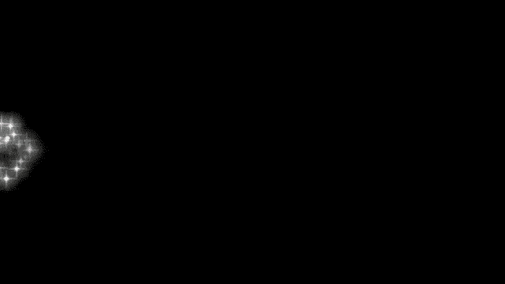

使用弱注释的更多结果。使用 [gifify](https://github.com/vvo/gifify) 创建的图像。来源: [YouTube](https://youtu.be/CX1hEOV9tlo) 。

如果你喜欢这篇文章，你可以在这里找到更多的文章，或者看看我们的讲座。如果你想在未来了解更多的文章、视频和研究，我也会很感激关注 [YouTube](https://www.youtube.com/c/AndreasMaierTV) 、 [Twitter](https://twitter.com/maier_ak) 、[脸书](https://www.facebook.com/andreas.maier.31337)或 [LinkedIn](https://www.linkedin.com/in/andreas-maier-a6870b1a6/) 。本文以 [Creative Commons 4.0 归属许可](https://creativecommons.org/licenses/by/4.0/deed.de)发布，如果引用，可以转载和修改。如果你有兴趣从视频讲座中获得文字记录，试试[自动博客](http://autoblog.tf.fau.de/)。

# 参考

[1] Özgün Çiçek, Ahmed Abdulkadir, Soeren S Lienkamp, et al. “3d u-net: learning dense volumetric segmentation from sparse annotation”. In: MICCAI. Springer. 2016, pp. 424–432.
[2] Waleed Abdulla. Mask R-CNN for object detection and instance segmentation on Keras and TensorFlow. Accessed: 27.01.2020\. 2017.
[3] Olga Russakovsky, Amy L. Bearman, Vittorio Ferrari, et al. “What’s the point: Semantic segmentation with point supervision”. In: CoRR abs/1506.02106 (2015). arXiv: 1506.02106.
[4] Marius Cordts, Mohamed Omran, Sebastian Ramos, et al. “The Cityscapes Dataset for Semantic Urban Scene Understanding”. In: CoRR abs/1604.01685 (2016). arXiv: 1604.01685.
[5] Richard O. Duda, Peter E. Hart, and David G. Stork. Pattern classification. 2nd ed. New York: Wiley-Interscience, Nov. 2000.
[6] Anna Khoreva, Rodrigo Benenson, Jan Hosang, et al. “Simple Does It: Weakly Supervised Instance and Semantic Segmentation”. In: arXiv preprint arXiv:1603.07485 (2016).
[7] Kaiming He, Georgia Gkioxari, Piotr Dollár, et al. “Mask R-CNN”. In: CoRR abs/1703.06870 (2017). arXiv: 1703.06870.
[8] Sangheum Hwang and Hyo-Eun Kim. “Self-Transfer Learning for Weakly Supervised Lesion Localization”. In: MICCAI. Springer. 2016, pp. 239–246.
[9] Maxime Oquab, Léon Bottou, Ivan Laptev, et al. “Is object localization for free? weakly-supervised learning with convolutional neural networks”. In: Proc. CVPR. 2015, pp. 685–694.
[10] Alexander Kolesnikov and Christoph H. Lampert. “Seed, Expand and Constrain: Three Principles for Weakly-Supervised Image Segmentation”. In: CoRR abs/1603.06098 (2016). arXiv: 1603.06098.
[11] Tsung-Yi Lin, Michael Maire, Serge J. Belongie, et al. “Microsoft COCO: Common Objects in Context”. In: CoRR abs/1405.0312 (2014). arXiv: 1405.0312.
[12] Ramprasaath R. Selvaraju, Abhishek Das, Ramakrishna Vedantam, et al. “Grad-CAM: Why did you say that? Visual Explanations from Deep Networks via Gradient-based Localization”. In: CoRR abs/1610.02391 (2016). arXiv: 1610.02391.
[13] K. Simonyan, A. Vedaldi, and A. Zisserman. “Deep Inside Convolutional Networks: Visualising Image Classification Models and Saliency Maps”. In: Proc. ICLR (workshop track). 2014.
[14] Bolei Zhou, Aditya Khosla, Agata Lapedriza, et al. “Learning deep features for discriminative localization”. In: Proc. CVPR. 2016, pp. 2921–2929.
[15] Longlong Jing and Yingli Tian. “Self-supervised Visual Feature Learning with Deep Neural Networks: A Survey”. In: arXiv e-prints, arXiv:1902.06162 (Feb. 2019). arXiv: 1902.06162 [cs.CV].
[16] D. Pathak, P. Krähenbühl, J. Donahue, et al. “Context Encoders: Feature Learning by Inpainting”. In: 2016 IEEE Conference on Computer Vision and Pattern Recognition (CVPR). 2016, pp. 2536–2544.
[17] C. Doersch, A. Gupta, and A. A. Efros. “Unsupervised Visual Representation Learning by Context Prediction”. In: 2015 IEEE International Conference on Computer Vision (ICCV). Dec. 2015, pp. 1422–1430.
[18] Mehdi Noroozi and Paolo Favaro. “Unsupervised Learning of Visual Representations by Solving Jigsaw Puzzles”. In: Computer Vision — ECCV 2016\. Cham: Springer International Publishing, 2016, pp. 69–84.
[19] Spyros Gidaris, Praveer Singh, and Nikos Komodakis. “Unsupervised Representation Learning by Predicting Image Rotations”. In: International Conference on Learning Representations. 2018.
[20] Mathilde Caron, Piotr Bojanowski, Armand Joulin, et al. “Deep Clustering for Unsupervised Learning of Visual Features”. In: Computer Vision — ECCV 2018\. Cham: Springer International Publishing, 2018, pp. 139–156\. A.
[21] A. Dosovitskiy, P. Fischer, J. T. Springenberg, et al. “Discriminative Unsupervised Feature Learning with Exemplar Convolutional Neural Networks”. In: IEEE Transactions on Pattern Analysis and Machine Intelligence 38.9 (Sept. 2016), pp. 1734–1747.
[22] V. Christlein, M. Gropp, S. Fiel, et al. “Unsupervised Feature Learning for Writer Identification and Writer Retrieval”. In: 2017 14th IAPR International Conference on Document Analysis and Recognition Vol. 01\. Nov. 2017, pp. 991–997.
[23] Z. Ren and Y. J. Lee. “Cross-Domain Self-Supervised Multi-task Feature Learning Using Synthetic Imagery”. In: 2018 IEEE/CVF Conference on Computer Vision and Pattern Recognition. June 2018, pp. 762–771.
[24] Asano YM., Rupprecht C., and Vedaldi A. “Self-labelling via simultaneous clustering and representation learning”. In: International Conference on Learning Representations. 2020.
[25] Ben Poole, Sherjil Ozair, Aaron Van Den Oord, et al. “On Variational Bounds of Mutual Information”. In: Proceedings of the 36th International Conference on Machine Learning. Vol. 97\. Proceedings of Machine Learning Research. Long Beach, California, USA: PMLR, Sept. 2019, pp. 5171–5180.
[26] R Devon Hjelm, Alex Fedorov, Samuel Lavoie-Marchildon, et al. “Learning deep representations by mutual information estimation and maximization”. In: International Conference on Learning Representations. 2019.
[27] Aaron van den Oord, Yazhe Li, and Oriol Vinyals. “Representation Learning with Contrastive Predictive Coding”. In: arXiv e-prints, arXiv:1807.03748 (July 2018). arXiv: 1807.03748 [cs.LG].
[28] Philip Bachman, R Devon Hjelm, and William Buchwalter. “Learning Representations by Maximizing Mutual Information Across Views”. In: Advances in Neural Information Processing Systems 32\. Curran Associates, Inc., 2019, pp. 15535–15545.
[29] Yonglong Tian, Dilip Krishnan, and Phillip Isola. “Contrastive Multiview Coding”. In: arXiv e-prints, arXiv:1906.05849 (June 2019), arXiv:1906.05849\. arXiv: 1906.05849 [cs.CV].
[30] Kaiming He, Haoqi Fan, Yuxin Wu, et al. “Momentum Contrast for Unsupervised Visual Representation Learning”. In: arXiv e-prints, arXiv:1911.05722 (Nov. 2019). arXiv: 1911.05722 [cs.CV].
[31] Ting Chen, Simon Kornblith, Mohammad Norouzi, et al. “A Simple Framework for Contrastive Learning of Visual Representations”. In: arXiv e-prints, arXiv:2002.05709 (Feb. 2020), arXiv:2002.05709\. arXiv: 2002.05709 [cs.LG].
[32] Ishan Misra and Laurens van der Maaten. “Self-Supervised Learning of Pretext-Invariant Representations”. In: arXiv e-prints, arXiv:1912.01991 (Dec. 2019). arXiv: 1912.01991 [cs.CV].
33] Prannay Khosla, Piotr Teterwak, Chen Wang, et al. “Supervised Contrastive Learning”. In: arXiv e-prints, arXiv:2004.11362 (Apr. 2020). arXiv: 2004.11362 [cs.LG].
[34] Jean-Bastien Grill, Florian Strub, Florent Altché, et al. “Bootstrap Your Own Latent: A New Approach to Self-Supervised Learning”. In: arXiv e-prints, arXiv:2006.07733 (June 2020), arXiv:2006.07733\. arXiv: 2006.07733 [cs.LG].
[35] Tongzhou Wang and Phillip Isola. “Understanding Contrastive Representation Learning through Alignment and Uniformity on the Hypersphere”. In: arXiv e-prints, arXiv:2005.10242 (May 2020), arXiv:2005.10242\. arXiv: 2005.10242 [cs.LG].
[36] Junnan Li, Pan Zhou, Caiming Xiong, et al. “Prototypical Contrastive Learning of Unsupervised Representations”. In: arXiv e-prints, arXiv:2005.04966 (May 2020), arXiv:2005.04966\. arXiv: 2005.04966 [cs.CV].