# 弱自我监督学习——第四部分

> 原文：<https://towardsdatascience.com/weakly-and-self-supervised-learning-part-4-2fbfd10280b3?source=collection_archive---------39----------------------->

## [FAU 讲座笔记](https://towardsdatascience.com/tagged/fau-lecture-notes)关于深度学习

## 对比损失

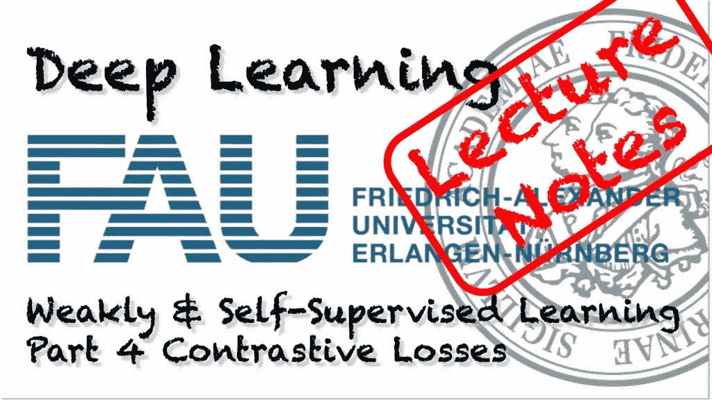

FAU 大学的深度学习。下图 [CC BY 4.0](https://creativecommons.org/licenses/by/4.0/) 来自[深度学习讲座](https://www.youtube.com/watch?v=p-_Stl0t3kU&list=PLpOGQvPCDQzvgpD3S0vTy7bJe2pf_yJFj&index=1)

**这些是 FAU 的 YouTube 讲座** [**深度学习**](https://www.youtube.com/watch?v=p-_Stl0t3kU&list=PLpOGQvPCDQzvgpD3S0vTy7bJe2pf_yJFj&index=1) **的讲义。这是与幻灯片匹配的讲座视频&的完整抄本。我们希望，你喜欢这个视频一样多。当然，这份抄本是用深度学习技术在很大程度上自动创建的，只进行了少量的手动修改。** [**自己试试吧！如果您发现错误，请告诉我们！**](http://autoblog.tf.fau.de/)

# 航行

[**上一讲**](/weakly-and-self-supervised-learning-part-3-b8186679d55e) **/** [**观看本视频**](https://youtu.be/zIDdTstAqWU) **/** [**顶级**](/all-you-want-to-know-about-deep-learning-8d68dcffc258) **/** [**下一讲**](/graph-deep-learning-part-1-e9652e5c4681)

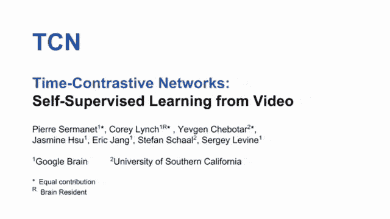

通过视频学习进行自我监督。使用 [gifify](https://github.com/vvo/gifify) 创建的图像。来源: [YouTube](https://youtu.be/b1UTUQpxPSY) 。

欢迎回到深度学习！所以，今天我们想在最后一部分讨论弱自我监督学习:一些新的损失也可以帮助我们进行自我监督。那么，让我们看看幻灯片上有什么:今天是第四部分，主题是对比自我监督学习。

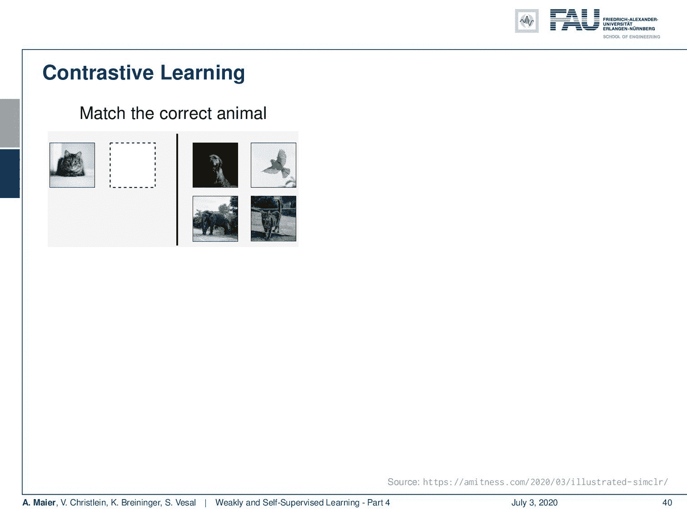

对比学习导论。 [CC 下的图片来自](https://creativecommons.org/licenses/by/4.0/)[深度学习讲座](https://www.youtube.com/watch?v=p-_Stl0t3kU&list=PLpOGQvPCDQzvgpD3S0vTy7bJe2pf_yJFj&index=1)的 4.0 。

在对比学习中，你试图把学习问题公式化为一种匹配方法。这里，我们有一个监督学习的例子。这样做的目的是将正确的动物与其他动物相匹配。学习的任务是动物是相同的还是不同的。这实际上是一种非常强大的训练形式，因为你可以避免生成模型或上下文模型中的一些缺点。例如，像素级损失可能过度集中于基于像素的细节，而基于像素的目标通常假定像素无关。这降低了模拟相关性或复杂结构的能力。在这里，我们基本上可以建立抽象模型，这些模型也是以一种分层的方式建立的。现在，我们有了这个受监督的示例，当然，这也适用于我们之前看到的许多不同的伪标签。

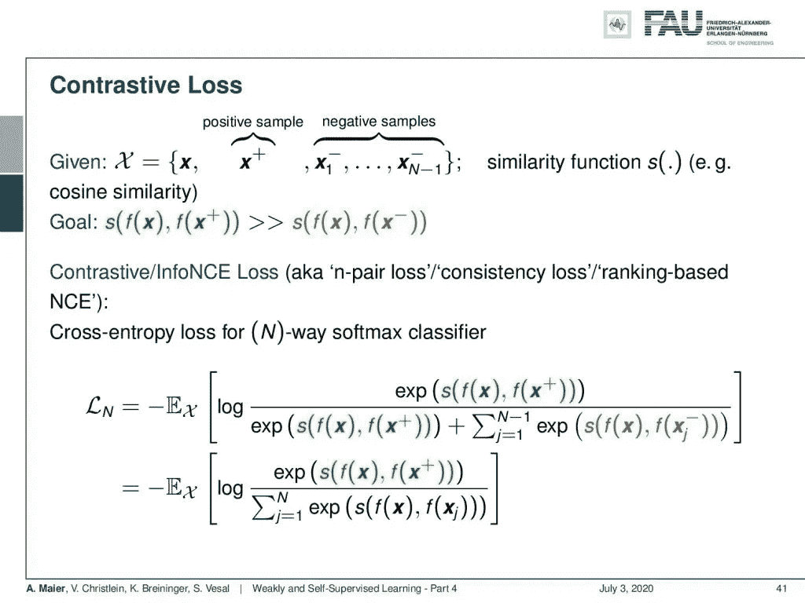

数学实现。来自[深度学习讲座](https://www.youtube.com/watch?v=p-_Stl0t3kU&list=PLpOGQvPCDQzvgpD3S0vTy7bJe2pf_yJFj&index=1)的 [CC BY 4.0](https://creativecommons.org/licenses/by/4.0/) 下的图片。

然后我们可以建立这种对比损失。我们所需要的是当前样本 **x** 一些正样本 **x** plus，然后是来自不同类别的负样本。此外，我们需要一个相似度函数 s，例如，这可以是余弦相似度。你也可以有一个可训练的相似性函数，但一般来说，你也可以使用一些我们在这节课中已经讨论过的标准相似性函数。此外，您希望应用网络 f( **x** )并计算相似性。目标是在阳性样本和考虑中的样本以及所有阴性样本之间具有更高的相似性。这就导致了对比损失。它有时也被称为信息归一化交叉熵损失。在文献中也有其他名称:n 对损失，一致性损失，和基于 NCE 的排名。对于 n 路 softmax 分类器来说，这本质上是交叉熵损失。这里的想法是，你基本上有正面的例子，然后这被所有的例子标准化。这里，我将第一行中的两个样本进行拆分，但您可以看到，拆分实际上是所有样本的总和。这就产生了一种 softmax 分类器。

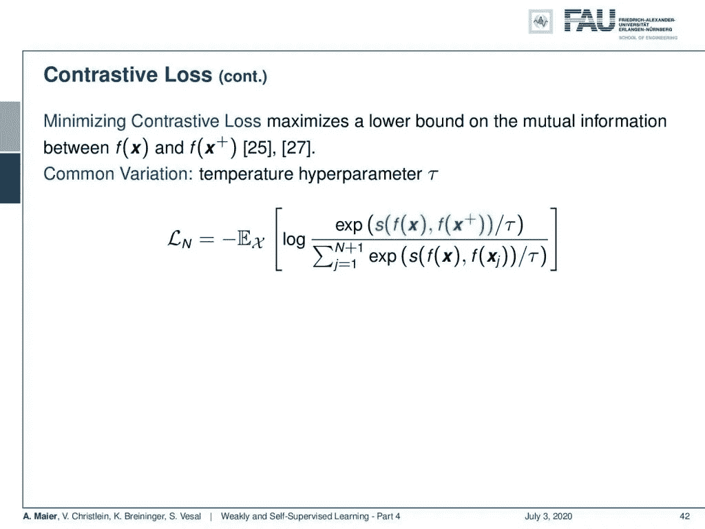

对比损耗也可以包括温度参数。 [CC 下的图片来自](https://creativecommons.org/licenses/by/4.0/)[深度学习讲座](https://www.youtube.com/watch?v=p-_Stl0t3kU&list=PLpOGQvPCDQzvgpD3S0vTy7bJe2pf_yJFj&index=1)的 4.0 。

因此，最小化对比损失实际上最大化了 f( **x** )和 f( **x** plus)之间的互信息的下限，如这两个参考文献所示。还有一个常见的变化是引入温度超参数，如本例所示。所以，你除以一个额外的τ。

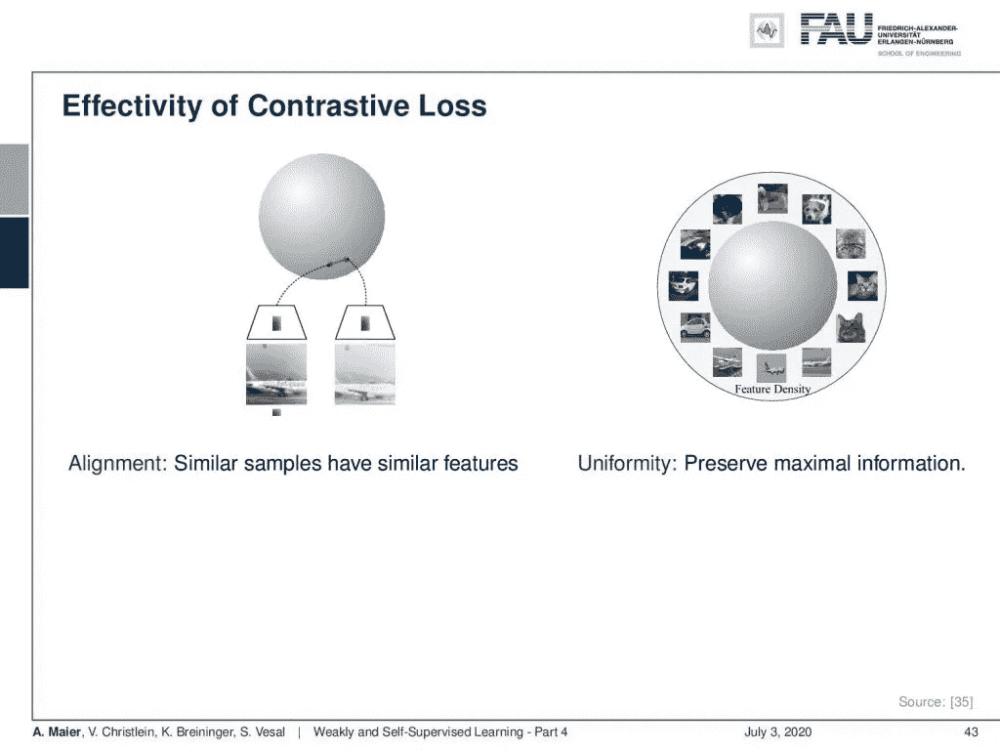

对比损失的两个重要性质。 [CC 下的图片来自](https://creativecommons.org/licenses/by/4.0/)[深度学习讲座](https://www.youtube.com/watch?v=p-_Stl0t3kU&list=PLpOGQvPCDQzvgpD3S0vTy7bJe2pf_yJFj&index=1)的 4.0 。

对比损失是非常有效的，它们有两个非常有用的性质。一方面，它们是一致的。所以，相似的样本有相似的特征。另一方面，它们创造了一致性，因为它们保留了最大限度的信息。

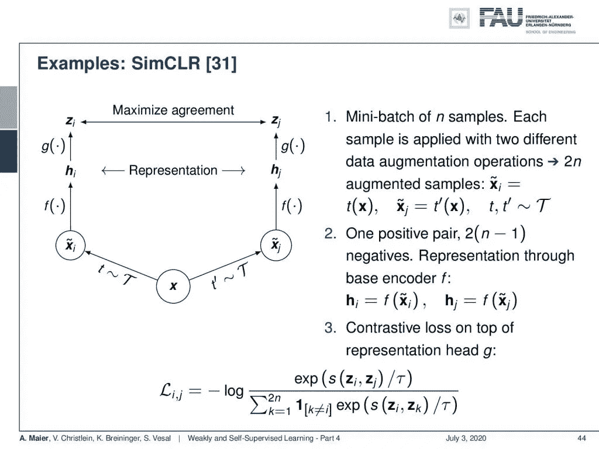

SimCLR 中的设置。来自[深度学习讲座](https://www.youtube.com/watch?v=p-_Stl0t3kU&list=PLpOGQvPCDQzvgpD3S0vTy7bJe2pf_yJFj&index=1)的 4.0CC 下的图片。

让我们来看一个如何构建的例子。这是出自[31]。在这里，您可以看到，我们可以从一些样本 **x** 开始。假设你从一个小批量的 n 个样本开始。然后，用两种不同的数据扩充操作来转换每个样本。这导致 2n 个扩充样本。因此，对于该批次中的每个样本，您会得到两个不同的增量。这里，我们将 t 和 t '应用于同一个样本。然后，这个样本是相同的，并且你的变换 t 和 t '取自一组扩充 t。现在，你最终得到每个样本的一个正对和 2(n-1)个负对。因为它们都是不同的样本，所以您可以通过基本编码器 f( **x** )计算一个表示，然后产生一些 **h** ，这是我们感兴趣的实际特征表示。f( **x** )的一个例子可以是 ResNet-50。在此之上，我们有一个表示头 g，然后进行额外的降维。注意 g 和 f 在两个分支中都是相同的。所以，你可以说这种方法和所谓的连体网络有很多相似之处。因此，您可以从 g 中获得两个不同的集合 z 下标 I 和 z 下标 j。利用这些 **z** ，您可以计算对比损失，然后将其表示为两个 **z** 在温度参数τ上的相似性。你看，这基本上是我们之前已经看到的相同的对比损失。

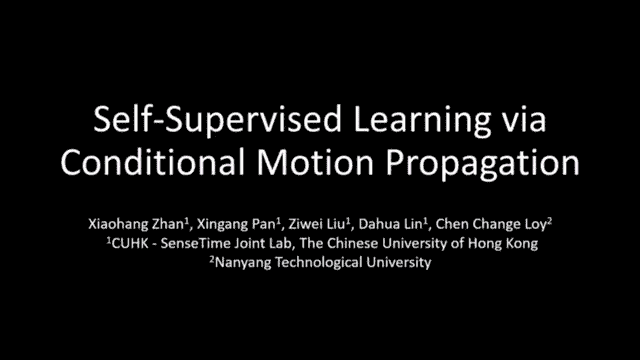

通过运动传播的自我监督学习。使用 [gifify](https://github.com/vvo/gifify) 创建的图像。来源: [YouTube](https://youtu.be/6R_oJCq5qMw) 。

当然，对比损失也可以在监督下合并。这就导致了有监督的对比学习。这里的想法是，如果你只是进行自我监督的对比，你会有正面的例子和负面的例子。有了监督对比损失，你还可以嵌入额外的类信息。

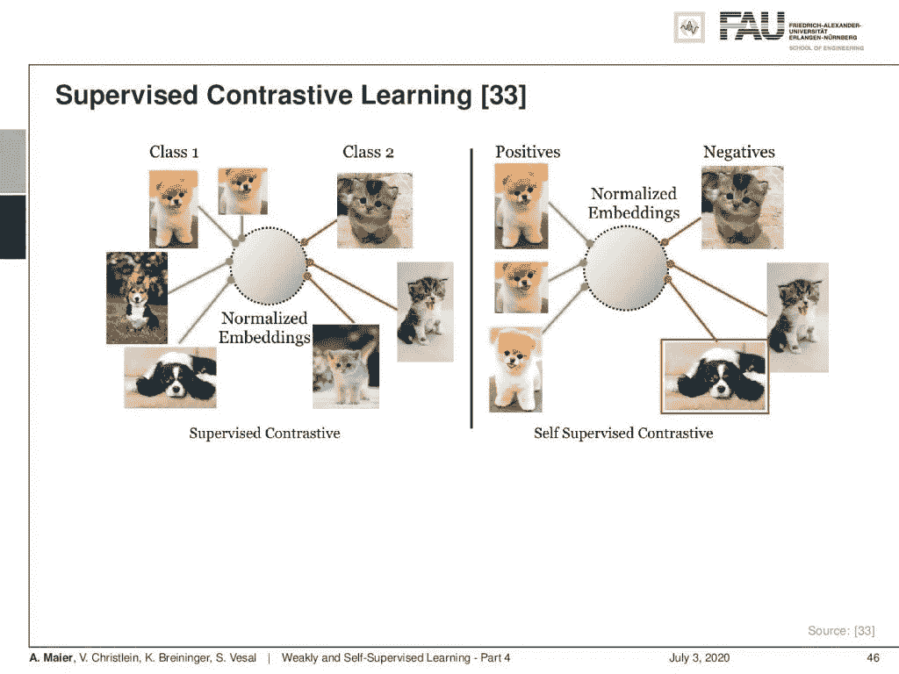

监督与自我监督的对比学习。来自[深度学习讲座](https://www.youtube.com/watch?v=p-_Stl0t3kU&list=PLpOGQvPCDQzvgpD3S0vTy7bJe2pf_yJFj&index=1)的 4.0CC 下的图片。

所以，这有额外的积极影响。让我们看看这是如何应用的。我们基本上保持训练两个耦合网络的相同想法。

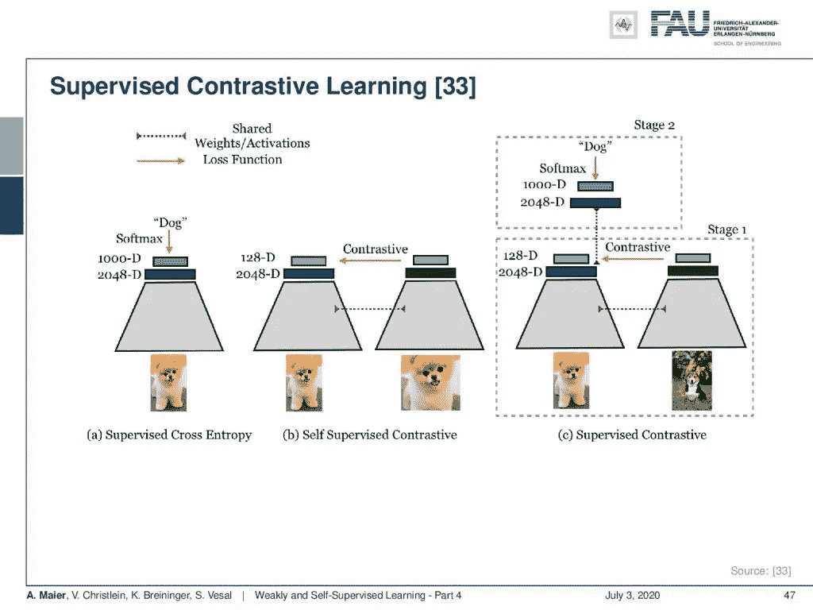

自我监督和监督对比损失是兼容的。 [CC 下的图片来自](https://creativecommons.org/licenses/by/4.0/)[深度学习讲座](https://www.youtube.com/watch?v=p-_Stl0t3kU&list=PLpOGQvPCDQzvgpD3S0vTy7bJe2pf_yJFj&index=1)的 4.0 。

所以让我们总结一下对比学习和监督对比学习的区别。在监督学习中，你基本上有你的编码器，这里显示为这个灰色块。然后，你最终得到一些描述，这是一个 2048 维向量，你进一步训练一个分类头，使用经典的交叉熵损失产生类别 dog。现在，在对比学习中，你可以扩展这个。基本上你会有两个耦合的网络，你有两个补片，它们要么相同，要么不同，使用不同的增强技术。你训练这些耦合的重量共享网络来产生 2048 维的表现。在顶部，你有这个表现头部，你使用表现层本身的对比损失。现在，如果将监督损失和对比损失两者结合起来，基本上与对比损失的设置相同，但在表示层，您可以增加一个严格监督的额外损失。这里，你仍然有典型的 softmax，比如说一千个类，在这个例子中预测 dog。你把它耦合到表示层来融合对比损失和监督损失。

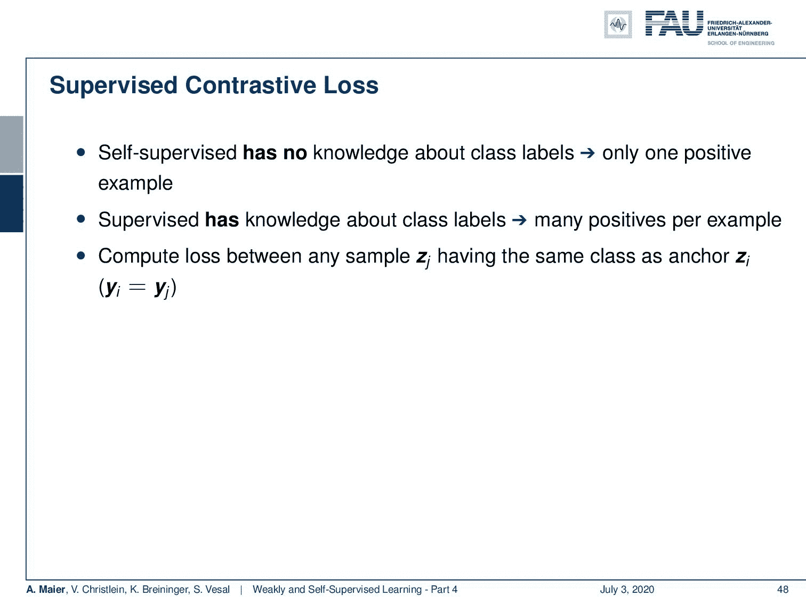

监督对比损失。来自[深度学习讲座](https://www.youtube.com/watch?v=p-_Stl0t3kU&list=PLpOGQvPCDQzvgpD3S0vTy7bJe2pf_yJFj&index=1)的 [CC BY 4.0](https://creativecommons.org/licenses/by/4.0/) 下的图片。

因此，自我监督不知道类别标签，它只知道一个正例。被监督的人知道所有的类别标签，并且每个例子都有许多优点。然后可以将其合并，并计算具有相同类别锚的任何样本 **z** 之间的损耗。然后，这允许你计算任何样本 **z** 下标 j 与锚 **z** 下标 I 具有相同类别之间的损耗。因此，这两个类别是相同的。这导致了下面的损失:你可以看到这仍然是基于这种对比损失。现在，我们明确地使用余弦相似度，仅仅使用两个向量的内积。此外，您可以看到，我们在这里添加了红色术语，告诉我们只使用有不同样本的情况。所以 I 不等于 j，我们想在这个损失中使用样本，我们想在这个损失中使用样本，实际的类成员是相同的。

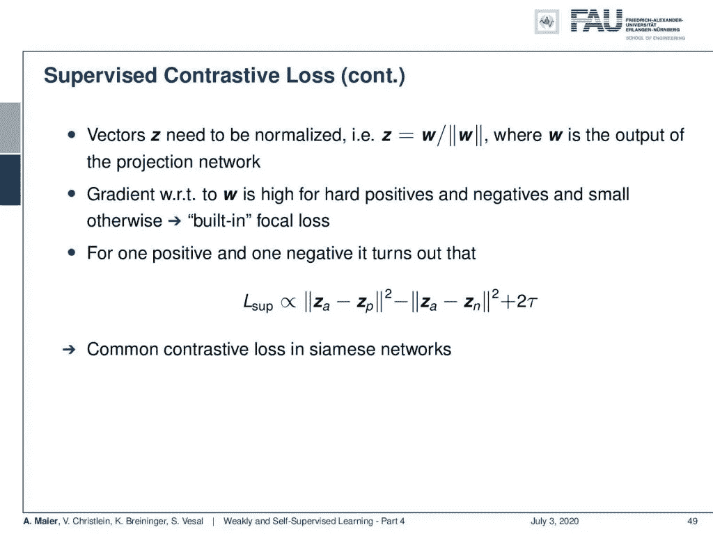

监督对比损失的性质。来自[深度学习讲座](https://www.youtube.com/watch?v=p-_Stl0t3kU&list=PLpOGQvPCDQzvgpD3S0vTy7bJe2pf_yJFj&index=1)的 4.0CC 下的图片。

有几件额外的事情你必须记住。向量 **z** 需要被归一化。这意味着您想要引入一个缩放比例，其中这个 **w** 实际上是投影网络的输出，您对其进行缩放，使其具有单位范数。这实质上导致了某种你可以解释为内置焦损失的东西，因为相对于 **w** 的梯度对于硬正片和负片来说会很高，否则会很小。顺便说一下，对于一个正的和一个负的，这个损失与实际观测值和正的欧几里德距离的平方成正比，减去实际观测值和负的欧几里德距离的平方。顺便说一下，这也是暹罗网络中非常常见的对比损失。

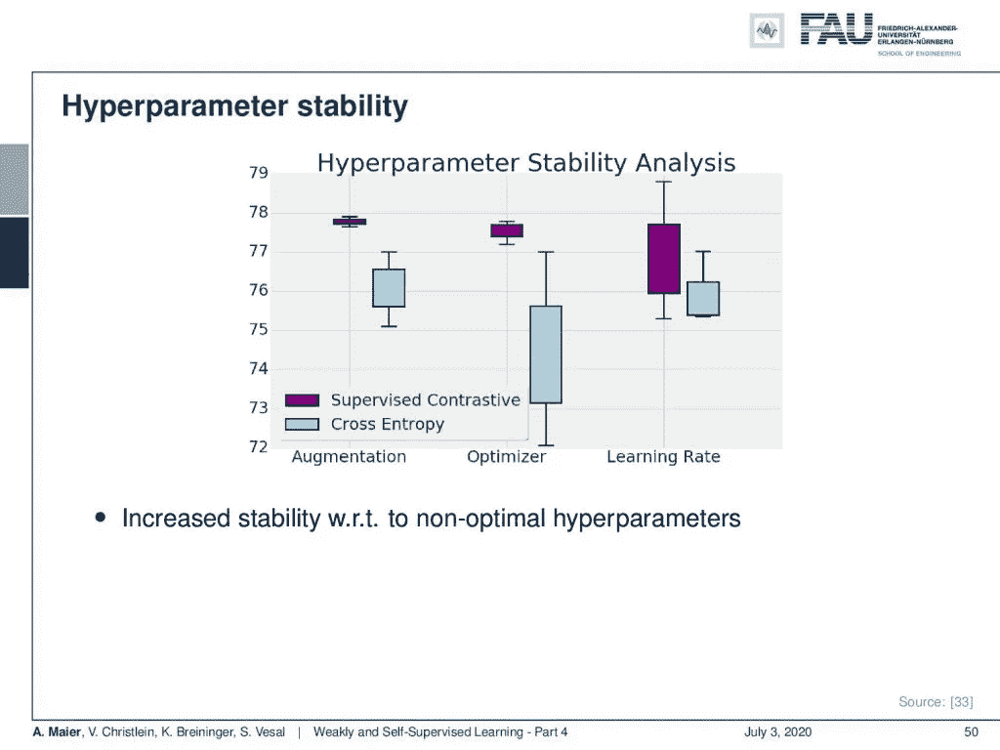

根据[33]，监督对比损失相对于超参数而言相当稳定。来自[深度学习讲座](https://www.youtube.com/watch?v=p-_Stl0t3kU&list=PLpOGQvPCDQzvgpD3S0vTy7bJe2pf_yJFj&index=1)的 4.0CC 下的图片。

让我们来看看超参数。事实证明，对于超参数，监督对比损失也非常稳定，就学习速率、优化器以及增强而言，您不会看到这些大的变化，就好像您只使用监督交叉熵损失一样。如果你对确切的实验细节感兴趣，请看看[33]。

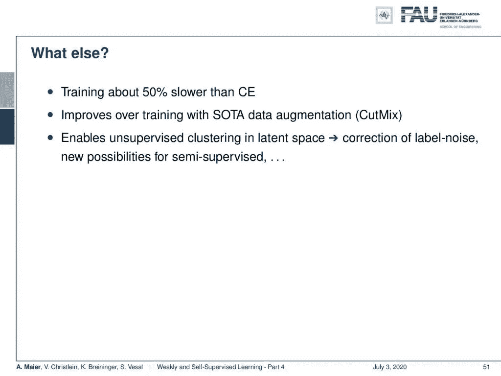

你应该知道的关于对比损失的其他一些事情。 [CC 下的图片来自](https://creativecommons.org/licenses/by/4.0/)[深度学习讲座](https://www.youtube.com/watch?v=p-_Stl0t3kU&list=PLpOGQvPCDQzvgpD3S0vTy7bJe2pf_yJFj&index=1)的 4.0 。

还有什么？嗯，训练比交叉熵损失慢 50%左右。它确实通过 CutMix 等最先进的数据增强技术改进了训练，并且支持潜在空间中的无监督聚类。这允许他们校正标签噪声。它还为半监督学习等引入了新的可能性。

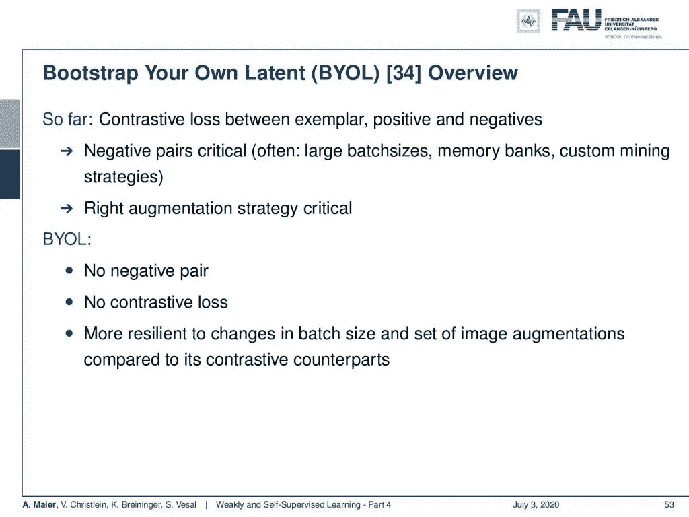

引导你自己的潜能使用其他学习方式的技巧。来自[深度学习讲座](https://www.youtube.com/watch?v=p-_Stl0t3kU&list=PLpOGQvPCDQzvgpD3S0vTy7bJe2pf_yJFj&index=1)的 [CC BY 4.0](https://creativecommons.org/licenses/by/4.0/) 下的图片。

嗯，是这样吗？没有别的想法了吗？嗯，还有一个有趣的想法是自我监督学习。你可以说这是一个范式的转变。这是一篇非常新的论文，但我把它放在这里是因为它有一些非常有趣的想法，与对比损失非常不同。所以这叫做“引导你自己的潜能”(BYOL)，他们观察到的问题是，配对的选择是至关重要的。因此，为了得到正确的配对，通常需要大批量、内存库和定制挖掘策略。你还需要有正确的增强策略。在引导你自己的潜能时，他们不需要消极的一对。它们不需要对比损失，并且与对比对应的图像相比，它们对批量大小和图像增强集的变化更有弹性。

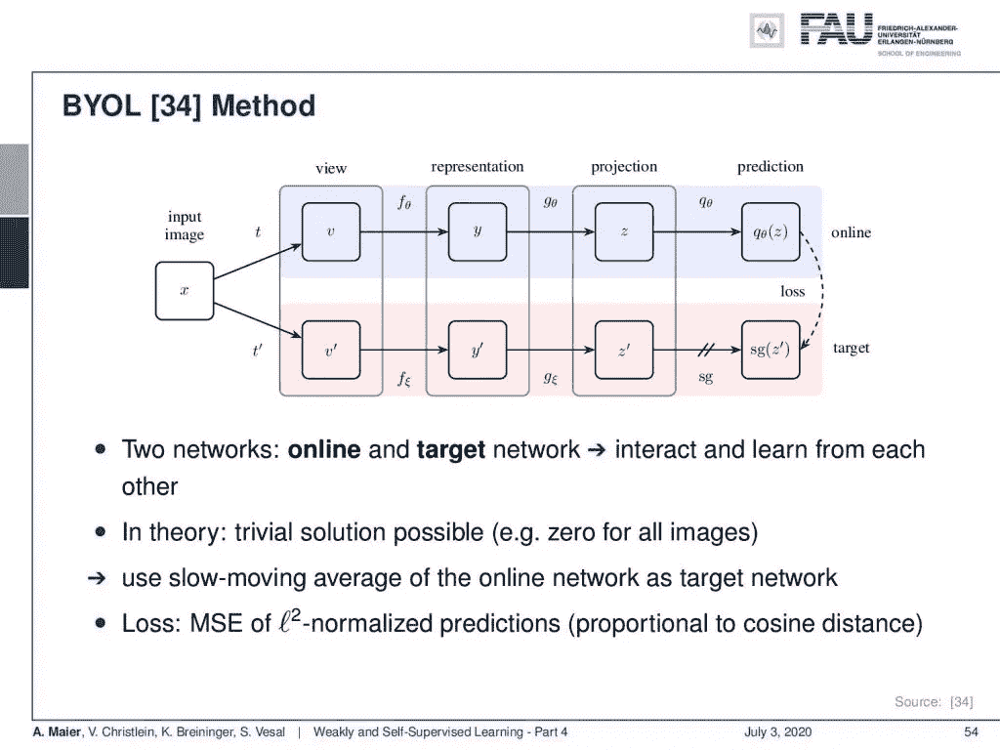

该架构从在线网络和目标网络构建损耗。 [CC 下的图片来自](https://creativecommons.org/licenses/by/4.0/)[深度学习讲座](https://www.youtube.com/watch?v=p-_Stl0t3kU&list=PLpOGQvPCDQzvgpD3S0vTy7bJe2pf_yJFj&index=1)的 4.0 。

有什么想法？他们这里也有类似的设置。他们有这种网络来进行观察、表现、投射和预测。现在，他们有了一个在线网络和一个目标网络。他们相互影响，相互学习。现在，当然，这是有问题的，因为理论上有一个微不足道的解决方案，比如对所有图像都是零。因此，他们用在线网络的慢速移动平均值作为目标网络来应对。这可以防止塌陷或重量很快变为零。作为损失，他们使用 l2 归一化预测的均方误差。这与余弦距离成正比。

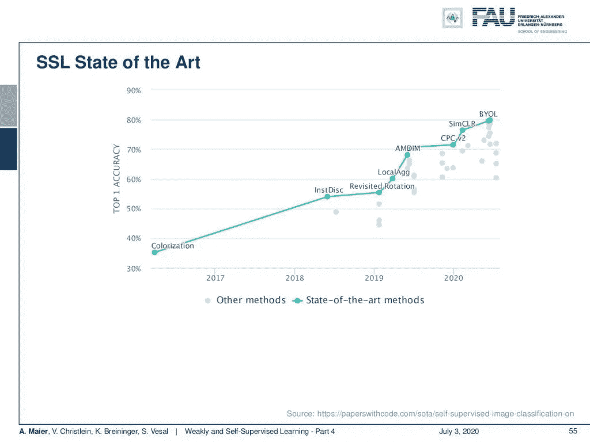

BYOL 超越了最先进的性能。 [CC 下的图片来自](https://creativecommons.org/licenses/by/4.0/)[深度学习讲座](https://www.youtube.com/watch?v=p-_Stl0t3kU&list=PLpOGQvPCDQzvgpD3S0vTy7bJe2pf_yJFj&index=1)的 4.0 。

非常有趣的是，通过这个非常简单的想法，他们实际上胜过了最先进的和自我监督的学习方法。因此，你可以在这里看到我们在开始和 simCLR 中谈到的着色和不同的想法。他们用他们的方法胜过他们。他们甚至超过了 simCLR。

就性能与参数而言，BYOL 也接近监督学习。来自[深度学习讲座](https://www.youtube.com/watch?v=p-_Stl0t3kU&list=PLpOGQvPCDQzvgpD3S0vTy7bJe2pf_yJFj&index=1)的 [CC BY 4.0](https://creativecommons.org/licenses/by/4.0/) 下的图片。

有趣的是，就参数数量而言，它们非常接近监督学习，在 ImageNet 上的图像精度排名第一。因此，他们用非常简单的方法就能非常接近最先进的性能。事实上，我很想知道这是否也可以转移到 ImageNet 之外的其他领域。特别是，例如，在医学数据上研究这种方法将是有趣的。你可以看到，有了自我监督学习，我们非常非常接近最先进的水平。这是一个非常活跃的研究领域。所以，让我们看看这些结果在接下来的几个月和几年里会如何发展，以及在几个月后哪些方法会被认为是最先进的方法。

在这个深度学习讲座中，更多令人兴奋的事情即将到来。 [CC 下的图片来自](https://creativecommons.org/licenses/by/4.0/)[深度学习讲座](https://www.youtube.com/watch?v=p-_Stl0t3kU&list=PLpOGQvPCDQzvgpD3S0vTy7bJe2pf_yJFj&index=1)的 4.0 。

当然，我们现在正慢慢接近我们的讲座的尾声。但是下次还是会有一些事情出现。特别是，下次我们要讨论如何处理图形。还有一个非常好的概念，叫做图卷积，我想在下一个视频中向你们介绍这个主题。我仍然想展示的另一个新兴方法是如何避免从头开始学习一切以及如何将特定的先验知识嵌入深度网络的想法。也有一些非常酷的方法，我认为值得在这个讲座中展示。所以，我下面有很多参考资料。非常感谢您的收听，期待在下一段视频中与您见面。拜拜。

如果你喜欢这篇文章，你可以在这里找到更多的文章，或者看看我们的讲座。如果你想在未来了解更多的文章、视频和研究，我也会很感激关注 [YouTube](https://www.youtube.com/c/AndreasMaierTV) 、 [Twitter](https://twitter.com/maier_ak) 、[脸书](https://www.facebook.com/andreas.maier.31337)或 [LinkedIn](https://www.linkedin.com/in/andreas-maier-a6870b1a6/) 。本文以 [Creative Commons 4.0 归属许可](https://creativecommons.org/licenses/by/4.0/deed.de)发布，如果引用，可以转载和修改。如果你有兴趣从视频讲座中获得文字记录，试试[自动博客](http://autoblog.tf.fau.de/)。

# 参考

[1] Özgün Çiçek, Ahmed Abdulkadir, Soeren S Lienkamp, et al. “3d u-net: learning dense volumetric segmentation from sparse annotation”. In: MICCAI. Springer. 2016, pp. 424–432.
[2] Waleed Abdulla. Mask R-CNN for object detection and instance segmentation on Keras and TensorFlow. Accessed: 27.01.2020\. 2017.
[3] Olga Russakovsky, Amy L. Bearman, Vittorio Ferrari, et al. “What’s the point: Semantic segmentation with point supervision”. In: CoRR abs/1506.02106 (2015). arXiv: 1506.02106.
[4] Marius Cordts, Mohamed Omran, Sebastian Ramos, et al. “The Cityscapes Dataset for Semantic Urban Scene Understanding”. In: CoRR abs/1604.01685 (2016). arXiv: 1604.01685.
[5] Richard O. Duda, Peter E. Hart, and David G. Stork. Pattern classification. 2nd ed. New York: Wiley-Interscience, Nov. 2000.
[6] Anna Khoreva, Rodrigo Benenson, Jan Hosang, et al. “Simple Does It: Weakly Supervised Instance and Semantic Segmentation”. In: arXiv preprint arXiv:1603.07485 (2016).
[7] Kaiming He, Georgia Gkioxari, Piotr Dollár, et al. “Mask R-CNN”. In: CoRR abs/1703.06870 (2017). arXiv: 1703.06870.
[8] Sangheum Hwang and Hyo-Eun Kim. “Self-Transfer Learning for Weakly Supervised Lesion Localization”. In: MICCAI. Springer. 2016, pp. 239–246.
[9] Maxime Oquab, Léon Bottou, Ivan Laptev, et al. “Is object localization for free? weakly-supervised learning with convolutional neural networks”. In: Proc. CVPR. 2015, pp. 685–694.
[10] Alexander Kolesnikov and Christoph H. Lampert. “Seed, Expand and Constrain: Three Principles for Weakly-Supervised Image Segmentation”. In: CoRR abs/1603.06098 (2016). arXiv: 1603.06098.
[11] Tsung-Yi Lin, Michael Maire, Serge J. Belongie, et al. “Microsoft COCO: Common Objects in Context”. In: CoRR abs/1405.0312 (2014). arXiv: 1405.0312.
[12] Ramprasaath R. Selvaraju, Abhishek Das, Ramakrishna Vedantam, et al. “Grad-CAM: Why did you say that? Visual Explanations from Deep Networks via Gradient-based Localization”. In: CoRR abs/1610.02391 (2016). arXiv: 1610.02391.
[13] K. Simonyan, A. Vedaldi, and A. Zisserman. “Deep Inside Convolutional Networks: Visualising Image Classification Models and Saliency Maps”. In: Proc. ICLR (workshop track). 2014.
[14] Bolei Zhou, Aditya Khosla, Agata Lapedriza, et al. “Learning deep features for discriminative localization”. In: Proc. CVPR. 2016, pp. 2921–2929.
[15] Longlong Jing and Yingli Tian. “Self-supervised Visual Feature Learning with Deep Neural Networks: A Survey”. In: arXiv e-prints, arXiv:1902.06162 (Feb. 2019). arXiv: 1902.06162 [cs.CV].
[16] D. Pathak, P. Krähenbühl, J. Donahue, et al. “Context Encoders: Feature Learning by Inpainting”. In: 2016 IEEE Conference on Computer Vision and Pattern Recognition (CVPR). 2016, pp. 2536–2544.
[17] C. Doersch, A. Gupta, and A. A. Efros. “Unsupervised Visual Representation Learning by Context Prediction”. In: 2015 IEEE International Conference on Computer Vision (ICCV). Dec. 2015, pp. 1422–1430.
[18] Mehdi Noroozi and Paolo Favaro. “Unsupervised Learning of Visual Representations by Solving Jigsaw Puzzles”. In: Computer Vision — ECCV 2016\. Cham: Springer International Publishing, 2016, pp. 69–84.
[19] Spyros Gidaris, Praveer Singh, and Nikos Komodakis. “Unsupervised Representation Learning by Predicting Image Rotations”. In: International Conference on Learning Representations. 2018.
[20] Mathilde Caron, Piotr Bojanowski, Armand Joulin, et al. “Deep Clustering for Unsupervised Learning of Visual Features”. In: Computer Vision — ECCV 2018\. Cham: Springer International Publishing, 2018, pp. 139–156\. A.
[21] A. Dosovitskiy, P. Fischer, J. T. Springenberg, et al. “Discriminative Unsupervised Feature Learning with Exemplar Convolutional Neural Networks”. In: IEEE Transactions on Pattern Analysis and Machine Intelligence 38.9 (Sept. 2016), pp. 1734–1747.
[22] V. Christlein, M. Gropp, S. Fiel, et al. “Unsupervised Feature Learning for Writer Identification and Writer Retrieval”. In: 2017 14th IAPR International Conference on Document Analysis and Recognition Vol. 01\. Nov. 2017, pp. 991–997.
[23] Z. Ren and Y. J. Lee. “Cross-Domain Self-Supervised Multi-task Feature Learning Using Synthetic Imagery”. In: 2018 IEEE/CVF Conference on Computer Vision and Pattern Recognition. June 2018, pp. 762–771.
[24] Asano YM., Rupprecht C., and Vedaldi A. “Self-labelling via simultaneous clustering and representation learning”. In: International Conference on Learning Representations. 2020.
[25] Ben Poole, Sherjil Ozair, Aaron Van Den Oord, et al. “On Variational Bounds of Mutual Information”. In: Proceedings of the 36th International Conference on Machine Learning. Vol. 97\. Proceedings of Machine Learning Research. Long Beach, California, USA: PMLR, Sept. 2019, pp. 5171–5180.
[26] R Devon Hjelm, Alex Fedorov, Samuel Lavoie-Marchildon, et al. “Learning deep representations by mutual information estimation and maximization”. In: International Conference on Learning Representations. 2019.
[27] Aaron van den Oord, Yazhe Li, and Oriol Vinyals. “Representation Learning with Contrastive Predictive Coding”. In: arXiv e-prints, arXiv:1807.03748 (July 2018). arXiv: 1807.03748 [cs.LG].
[28] Philip Bachman, R Devon Hjelm, and William Buchwalter. “Learning Representations by Maximizing Mutual Information Across Views”. In: Advances in Neural Information Processing Systems 32\. Curran Associates, Inc., 2019, pp. 15535–15545.
[29] Yonglong Tian, Dilip Krishnan, and Phillip Isola. “Contrastive Multiview Coding”. In: arXiv e-prints, arXiv:1906.05849 (June 2019), arXiv:1906.05849\. arXiv: 1906.05849 [cs.CV].
[30] Kaiming He, Haoqi Fan, Yuxin Wu, et al. “Momentum Contrast for Unsupervised Visual Representation Learning”. In: arXiv e-prints, arXiv:1911.05722 (Nov. 2019). arXiv: 1911.05722 [cs.CV].
[31] Ting Chen, Simon Kornblith, Mohammad Norouzi, et al. “A Simple Framework for Contrastive Learning of Visual Representations”. In: arXiv e-prints, arXiv:2002.05709 (Feb. 2020), arXiv:2002.05709\. arXiv: 2002.05709 [cs.LG].
[32] Ishan Misra and Laurens van der Maaten. “Self-Supervised Learning of Pretext-Invariant Representations”. In: arXiv e-prints, arXiv:1912.01991 (Dec. 2019). arXiv: 1912.01991 [cs.CV].
33] Prannay Khosla, Piotr Teterwak, Chen Wang, et al. “Supervised Contrastive Learning”. In: arXiv e-prints, arXiv:2004.11362 (Apr. 2020). arXiv: 2004.11362 [cs.LG].
[34] Jean-Bastien Grill, Florian Strub, Florent Altché, et al. “Bootstrap Your Own Latent: A New Approach to Self-Supervised Learning”. In: arXiv e-prints, arXiv:2006.07733 (June 2020), arXiv:2006.07733\. arXiv: 2006.07733 [cs.LG].
[35] Tongzhou Wang and Phillip Isola. “Understanding Contrastive Representation Learning through Alignment and Uniformity on the Hypersphere”. In: arXiv e-prints, arXiv:2005.10242 (May 2020), arXiv:2005.10242\. arXiv: 2005.10242 [cs.LG].
[36] Junnan Li, Pan Zhou, Caiming Xiong, et al. “Prototypical Contrastive Learning of Unsupervised Representations”. In: arXiv e-prints, arXiv:2005.04966 (May 2020), arXiv:2005.04966\. arXiv: 2005.04966 [cs.CV].