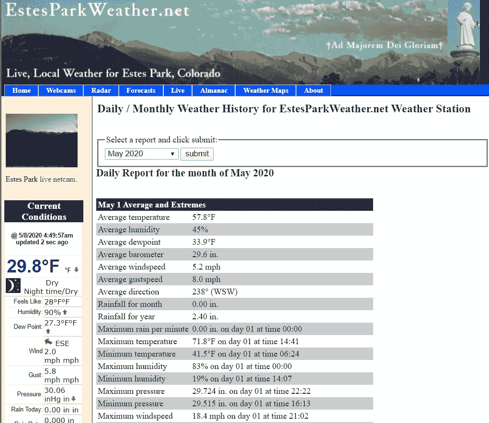
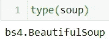
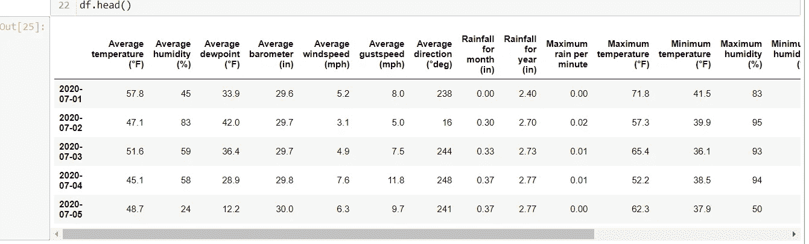

# 天气数据收集:使用 Python 进行网络搜集

> 原文：<https://towardsdatascience.com/weather-data-collection-web-scraping-using-python-a4189e7a2ee6?source=collection_archive---------10----------------------->


[图像来源](https://unsplash.com/photos/z4H9MYmWIMA)

在这篇博客中，我将讨论如何从网站上收集数据。希望你已经使用 API 参观了我的数据收集技术[。在现实世界中，我们可能会遇到不同的数据源，如数据库、日志文件、结构化文件、服务或 API 等。这些来源可能包含记录、图表或文本形式的数据。因此，数据随处可见，为了执行不同的创新数据科学技术，我们需要解析这些数据。我们知道维基百科是文本形式数据的最大来源之一。](/covid-19-data-collection-a-python-api-story-347aafa95e69)

> 如何解析这些类型的文本数据？

这里网页抓取进入图片！这是一种使用 HTML 标签提取数据的技术。这里我将讨论从 [EstesPark 天气网站](https://www.estesparkweather.net/index.php)获取天气数据的技术。这个网站主要是为科罗拉多州埃斯蒂斯帕克附近的居民提供公共服务。下面是网站截图。你可以点击链接进入网站。



来源:[https://www.estesparkweather.net/archive_reports.php?日期=202005 年](http://www.estesparkweather.net/archive_reports.php?date=202005)

一些关于网站的有用信息

1.  该网站包含日期方面的天气数据，如平均温度、平均湿度、平均露点等。这些数据存储在 HTML web 表中。
2.  有一个下拉框，你可以自由选择月份和年份来查看天气数据。
3.  每次您更改下拉选择时，日期值将根据所选的月份和年份进行更改，但采用 ***yyyymm*** 格式。参考上图，我选择**2020 年 5 月，链接中的**，日期值改为 202005。

> [https://www.estesparkweather.net/archive_reports.php?日期=202005 年](http://www.estesparkweather.net/archive_reports.php?date=202005)

首先导入案例研究所需的所有库

```
import bs4
from bs4 import BeautifulSoup
import requests
import pandas as pd
from datetime import datetime
```

让我们来理解这段代码。

```
url=‘https://www.estesparkweather.net/archive_reports.phpdate=202005'
page = requests.get(url)
print(page)
soup =  BeautifulSoup(page.content,'html.parser')
print(soup)
```

**requests** 库允许您轻松地发送 HTTP 请求，并且不需要手动向您的 url 添加查询字符串，或者对您的帖子数据进行格式编码。requests 模块中的 urllib3 模块使 url 处于保持活动状态，您可以连续地将数据放入池中。

一个有效的 url 会给你一个状态码 200。这意味着网址工作正常。

BeautifulSoup 库帮助您解析网页上的 HTML 内容和 XML 文件中的 XML 内容。BeautifulSoup 的文档字符串如下。

> 您将在 BeautifulSoup 对象上调用的大多数方法都继承自
> PageElement 或 Tag。
> 
> 在内部，这个类定义了在将 HTML/XML 文档转换成数据
> 结构时由
> 树构建器调用的基本接口。该接口抽象出了
> 解析器之间的差异。要编写一个新的树构建器，你需要从整体上理解
> 这些方法。
> 
> 这些方法将被 BeautifulSoup 构造函数调用:
> * reset()
> * feed(markup)
> 
> 树构建器可以从其 feed()实现中调用这些方法:
> * handle_starttag(name，attrs) #参见关于返回值的注释
> * handle _ end tag(name)
> * handle _ data(data)#追加到当前数据节点
> * endData(containerClass) #结束当前数据节点

节目结束时，您应该能够使用“开始标记”事件、“结束标记”事件、“数据”事件和“完成数据”事件构建一个树。

在 BeautifulSoup 构造函数中，我输入了 url 的 HTML 内容，并给出了命令“html.parser”。这将给我网页的 HTML 内容。对于 XML，可以使用' lxml '。


版权所有 Somesh

> 那汤是什么？

这是一个漂亮的组对象，它有专门用于处理 HTML 内容的方法。



版权所有 Somesh

正如我前面提到的，网站上的天气数据是 HTML 网页表格的形式。因此，我们在 HTML 内容中查找表格，并分析行和列。

```
table = soup.find_all(‘table’)raw_data = [row.text.splitlines() for row in table]
raw_data = raw_data[:-9]for i in range(len(raw_data)):
 raw_data[i] = raw_data[i][2:len(raw_data[i]):3]
print(raw_data)
```

在下拉列表中，当我们选择 2020 年 5 月时，它将为您提供单独的表，其中包含每天的所有天气属性值。因此，我们将拆分表中的行并追加到一个列表中。最后，你会得到一个列表列表。值得注意的是，每个子列表都包含特定月份的天气属性及其值。

> 如何获取其他月份的天气数据？

如前所述，该链接包含页面值等于下拉值，但格式为 yyyymm。因此，您创建了一个日期范围，将日期分解成所需的格式，并与字符串 URL 连接起来。

```
Dates_r = pd.date_range(start = ‘1/1/2009’,end = ‘08/05/2020’,freq = ‘M’)
dates = [str(i)[:4] + str(i)[5:7] for i in Dates_r]
dates[0:5]for k in range(len(dates)):
    url = "[http://www.estesparkweather.net/archive_reports.php?date=](http://www.estesparkweather.net/archive_reports.php?date=)"
    url += dates[k]
```

现在，您可以执行字符串剥离技术来创建数据集。下面是一个例子。

```
for u in url:
 for i in range(len(raw_data)):
 c = [‘.’.join(re.findall(“\d+”,str(raw_data[i][j].split()[:5])))for j in range(len(raw_data[i]))]
 df_list.append(c)
 index.append(dates[k] + c[0])
 f_index = [index[i] for i in range(len(index)) if len(index[i]) > 6]
 data = [df_list[i][1:] for i in range(len(df_list)) if len(df_list[i][1:]) == 19]
```

要将日期作为数据集的索引，可以使用下面的代码。

```
final_index = [datetime.strptime(str(f_index[i]), ‘%Y%m%d’).strftime(‘%Y-%m-%d’) for i in range(len(f_index))]
```

您可以为列名制作一个天气属性列表，如湿度、温度、降雨量，或者为数据选择自定义列名。

> 恭喜你！！！你离创建一个数据框架还差得很远。

在 DataFrame()中，您将赋予 ***数据*** 值作为您为所有天气属性值所做的数据， ***列*** 等于包含自定义列名的列表变量，最后 ***索引*** 值将成为日期的列表变量。



样本输出版权所有 Somesh

这不是结束，而是开始。你可以用这个概念来抓取电子报、歌曲网站等的数据。

> 在下一篇博客中，我将提出不同的数据收集技术。我希望你已经喜欢了自然语言处理第一部分 & [第二部分](/natural-language-processing-a-beginners-guide-part-ii-54a1bf8c0497)。
> 
> 我很乐意听到对上述分析的任何评论——欢迎在下面留言，或者通过 [LinkedIn](https://www.linkedin.com/in/somesh-kumar-routray/) 和 [twitter](https://twitter.com/RoutraySomesh) @RoutraySomesh 联系我！！！