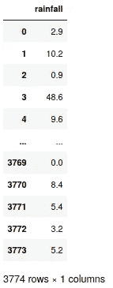

# 天气预报:深度学习方法

> 原文：<https://towardsdatascience.com/weather-forecasting-a-deep-learning-approach-7ecddff0fa71?source=collection_archive---------16----------------------->

## 利用印尼 10 年的数据集和 LSTM 模式预测天气


由 [SHAH Shah](https://unsplash.com/@drjay93?utm_source=unsplash&utm_medium=referral&utm_content=creditCopyText) 在 [Unsplash](https://unsplash.com/s/photos/raining?utm_source=unsplash&utm_medium=referral&utm_content=creditCopyText) 上拍摄的照片

天气不仅与我们息息相关，而且对我们的生存至关重要。不利的天气可能会摧毁我们吃的食物、我们依赖的商业和我们依赖的福祉。因此，必须准确及时地预报天气，以便我们能够采取必要的预防措施，最大限度地减少与天气相关的风险。

在本文中，我们将了解如何利用印度尼西亚遍布群岛的 70 多个气象站的 10 年每日降水记录来提前预测天气，特别是降雨量。我们将建立一个基于**长短期网络(LSTM)的模型。**

# LSTM:概述

LSTM 通常适用于时间序列数据(如我们的降水数据集)，因为它能够“记住”来自称为**单元状态**的特征的长期相关性/信息。这种细胞状态在整个网络中运行，并向下(或向上)传递信息，例如，来自一个序列的早期信息可以影响后来输入的预测。这种信息传递对于时间序列天气数据至关重要，因为每个输入都依赖于不同时间点的其他输入。

存储、删除、修改和传递的信息由**门**控制。下面的图 1 展示了 LSTM 模型的一般架构。本文假设读者熟悉 LSTM，但不会涉及网络架构的具体细节。如果你想了解更多，你可以访问这本简明扼要的 LSTM 简介。


图 1: LSTM 单个细胞的架构

# 天气预报:数据准备

既然我们已经解释了基本网络，让我们开始导入数据集。你可以在这里找到我们的雨量 CSV 数据[的清理版本。](https://drive.google.com/open?id=1CL1l38xkg9NJTxUpq-i7CeMNjkp3BKIh)

```
import numpy as np
import matplotlib.pyplot as plt
import pandas as pd
from keras.models import Sequential
from keras.layers import LSTM, Dense, Dropout, BidirectionalDATA_DIR = './dataset/rainfall.csv'
dataset = pd.read_csv(DATA_DIR)
rainfall_df = dataset[['rainfall']]rainfall_df
```

CSV 的摘要可以在下面的*图 2* 中看到。



图 2:降雨量数据框汇总

然后，我们将按照 90:10 的比例分割训练集和测试集。

```
train_split= 0.9
split_idx = int(len(rainfall_df) * 0.9)training_set = rainfall_df[:split_idx].values
test_set = rainfall_df[split_idx:].values
```

我们的想法是利用过去 30 天的数据，预测未来 5 天的**。为此，我们需要创建一个训练数据集，其中 x 值是 30 天的窗口化数据，相应的 y 值是未来 5 天的后续降雨量数据。**

```
# 5-day prediction using 30 days datax_train = []
y_train = []
n_future = 5 #Next 5 days rainfall forecast
n_past = 30 #Past 30 daysfor i in range(0, len(training_set) - n_past - n_future + 1):
 x_train.append(training_set[i : i + n_past, 0])
 y_train.append(training_set[i + n_past : i + n_past + n_future, 0])
```

在为训练集生成 x 和 y 之后，我们将确保数据类型是正确的，并且形状符合模型的要求。

```
x_train , y_train = np.array(x_train), np.array(y_train)
x_train = np.reshape(x_train, (x_train.shape[0] , x_train.shape[1], 1))
```

# 天气预报:模型定义

现在我们已经有了我们的训练集，我们将利用 LSTM 架构来定义我们的预测器。我们有以下内容:

1.  **双向**:确保序列前一部分的信息对后一部分可用，反之亦然。
2.  **LSTM** **(x3)层**:30 个单元代表 30 天窗口化的历史数据集，而 *return_sequences* 参数指定每个单元的输出将作为下一层的输入。
3.  **Dropout (p=0.2)** :用于正则化效果，防止网络过拟合训练集。
4.  **密集层**:有 5 个预测神经元，每个神经元代表未来的一天。

```
EPOCHS = 500
BATCH_SIZE = 32regressor = Sequential()regressor.add(Bidirectional(LSTM(units=30, return_sequences=True, input_shape = (x_train.shape[1], 1))))
regressor.add(Dropout(0.2))
regressor.add(LSTM(units= 30, return_sequences=True))
regressor.add(Dropout(0.2))
regressor.add(LSTM(units= 30, return_sequences=True))
regressor.add(Dropout(0.2))
regressor.add(LSTM(units= 30))
regressor.add(Dropout(0.2))
regressor.add(Dense(units = n_future, activation=’relu’))regressor.compile
(
optimizer=’adam’, 
loss=’mean_squared_error’, 
metrics=[‘acc’]
)regressor.fit
(
x_train, 
y_train, 
epochs=EPOCHS, 
batch_size=BATCH_SIZE
)
```

# 天气预报:推论

既然模型已经被训练了 500 个时期，我们就可以在准备好的测试集上进行推论了。

```
x_test = test_set[: n_past, 0]
y_test = test_set[n_past : n_past + n_future, 0]x_test, y_test = np.array(x_test), np.array(y_test)
x_test = np.reshape(x_test, (1, x_test.shape[0], 1))predicted_temperature = regressor.predict(x_test)print('Predicted temperature {}'.format(predicted_temperature))
print('Real temperature {}'.format(y_test))
```

如果我们对样本数据集中的 30 天进行采样，预测结果及其对应的实际温度将打印如下:

```
Predicted temperature 
[[47.51087   11.603558   2.5133722  0\.         2.019637 ]]Real temperature 
[9.8 6.6 0.2 0\.  0\. ]
```

# 讨论和结论

我们的初始预测器似乎对极端降水水平(如 47 毫米)表现不佳。可以通过以下方式进行一些改进:

1.  调整历史窗口期以说明季节性(如 120 天而不是 30 天)。
2.  通过增加更多的 LSTM 层、改变损失函数和增加丢失概率来改进架构，以更好地正则化训练数据。

总之，在天气预报(一般来说，时间序列数据集)的情况下，使用 LSTM 作为改进的基于 RNN 的架构是有趣的。并且能够以及时有效的方式进行天气预报不仅是有益的，而且对于直接或间接依赖好天气的大众来说是至关重要的。

**注意**:本文提供的数据已经被清理并合并成一个 CSV 文件。如果你想获得 70+印度尼西亚的天气信息，你可以随时 PM 我！

***做订阅我的邮件简讯:***[*https://tinyurl.com/2npw2fnz*](https://tinyurl.com/2npw2fnz)****在这里我定期用通俗易懂的语言和漂亮的可视化方式总结 AI 研究论文。****

# *参考*

*[1] [了解 https://colah.github.io/posts/2015-08-Understanding-LSTMs/ LSTM 网](https://colah.github.io/posts/2015-08-Understanding-LSTMs/)*

*[2]【https://www.bmkg.go.id/ 印尼气象局:印尼*