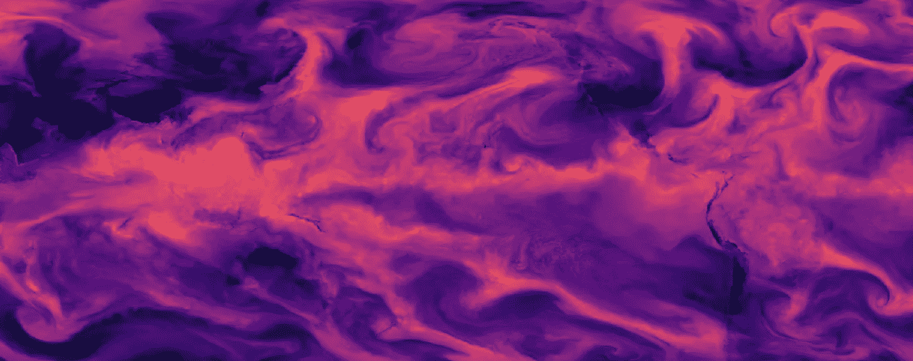
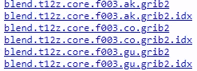
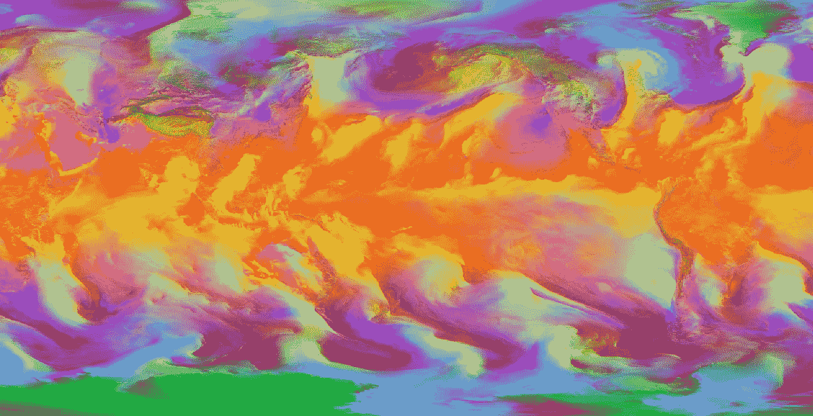
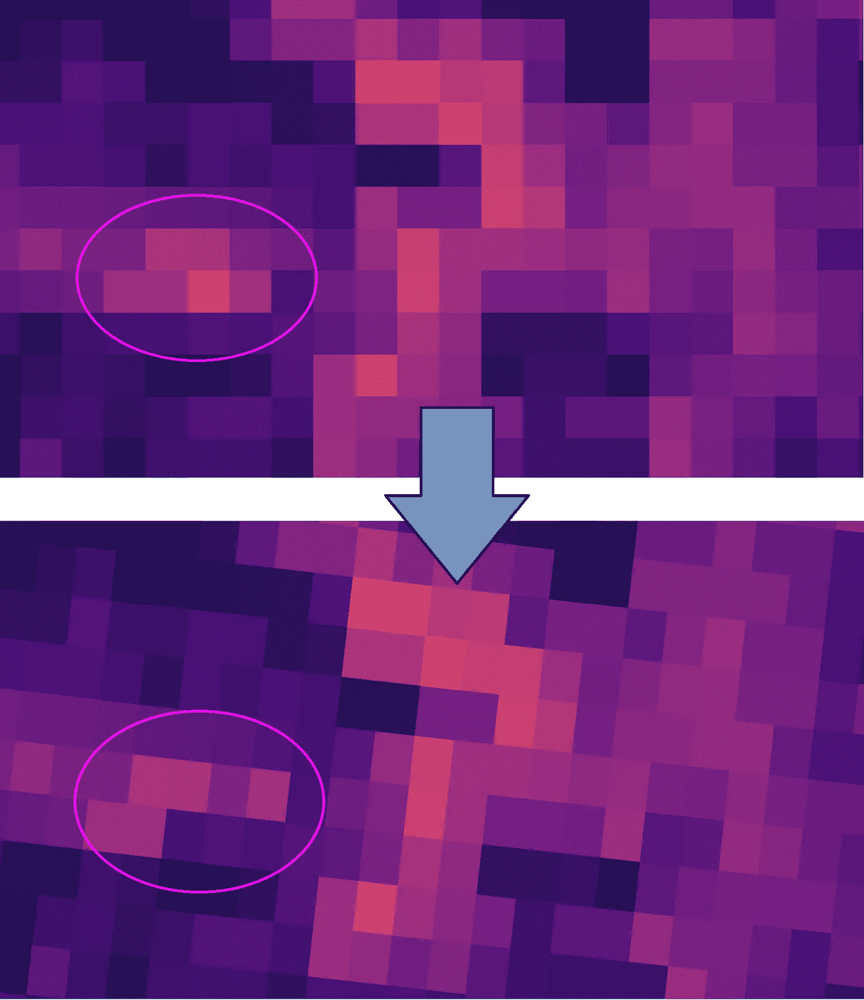
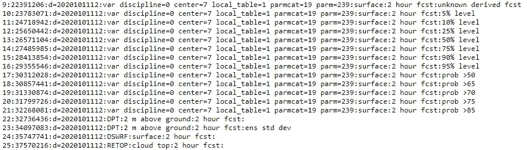
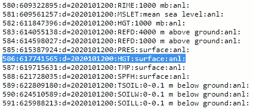
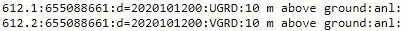

# 使用 FOSS4G 和 JavaScript 处理天气模型:最佳实践

> 原文：<https://towardsdatascience.com/weather-model-processing-with-foss4g-and-javascript-best-practices-d583e6dde201?source=collection_archive---------53----------------------->

作者图片

## 使用免费开源地理软件(FOSS4G)和/或 JavaScript 检索、处理和管理天气模型数据的技巧和诀窍。

一年前我写了《用 FOSS4G 自动化天气模型处理 [***:经验教训***](https://medium.com/swlh/automated-weather-model-processing-with-foss4g-lessons-learned-8aaaeda1e3bc) ，概述了我创建一个使用开源地理软件自动检索、处理和管理天气模型数据的系统的旅程。我已经用这个系统工作了一年，包括为科罗拉多州发布了一个最先进的天气预报网站，并有机会向商业和学术天气预报领域的关键人物学习。

作为分发和使用原始天气模型数据的常见范例的介绍，原始文章中的发现仍然很有用。后续文章在此基础上进行扩展，涵盖了处理这些数据的最佳实践和技术，仅使用免费和开源地理软件(FOSS4G)。还有一些使用 JavaScript 处理这些数据的技巧和诀窍，JavaScript 正在成为一种更普遍的语言，包括在地理信息系统(GIS)领域。

本文假设您已经安装了 [GDAL](https://gdal.org/) ，并且已经知道从哪里下载天气模型文件以及它们通常是如何构造的。“索引文件”会经常被引用，也就是您经常看到的伴随着`grib2`文件的`.idx`文件:

这些文件对于管理大型栅格和可变波段排序非常有用，您应该尽可能地利用它们。

作者图片

## 1.使用梯度

不直接推荐这一点的原因是它偏离了本文的主题-已经有大量的人在使用 GIS 和地理空间栅格做令人难以置信的事情，目标是帮助在该领域更容易地访问天气模型数据并利用现有的人才。

然而，如果你的重点是纯粹的气象学或更科学的学科，你可能只想使用[处理天气模型和其他科学数据的行业标准——GRaDS](http://cola.gmu.edu/grads/)。该软件有自己的脚本语言，它需要大量的工作来制作看起来像普通桌面 GIS 应用程序中可以轻松生成的质量的地图，因此它代表了一种可能超出 GIS 学科范围的用例。

## 2.除非需要在 web 地图上绘制数据，否则不要重新投影数据

天气模型有各种各样的投影(通常是某种形式的朗伯共形圆锥曲线)，如果不丢失数据或强制插值，就不容易重新投影到 EPSG:4326 或 Web 墨卡托。如果查询重新投影的数据，与原始模型数据相比，您可能会得到不准确的预测。

顶部栅格(NAM 3km 模型)处于其原始投影中。底部栅格是重新投影到 EPSG 的结果:4326。忽略倾斜(底部的图像仍然用顶部图像的投影绘制在地图上)，注意原始数据是如何未被充分表示的，例如画圈的像素簇。图片作者。

## 3.基于 JavaScript 的投影库(如 Proj4js)不能正确地重新投影大多数天气模型的坐标

如果您正在使用 Node.js 查询地理空间栅格(使用类似于 [Geotiff.js](https://geotiffjs.github.io/) 的东西)，并且您希望在查询纬度/经度坐标时将它们保留在原始投影中，那么 GDAL 提供的 Proj4 和 WKT 字符串可以传递给 [proj4js](http://proj4js.org/) —但是您会注意到重新投影后出现了一些非常严重的空间误差(许多英里，而不是几英尺)。有些转换是 proj4js 做不到的，似乎大多数天气模型预测都属于这一类。

您将需要使用 gdal 绑定( [gdal-js](https://www.npmjs.com/package/gdal-js) —不理想，因为它们需要旧版本的 GDAL)或者调用一个 shell 来调用 GDAL 的`gdaltransform`以获得更精确的重新投影——或者 JavaScript 之外的另一个重新投影库。为了简单起见，您可以将 grib2 文件加载到 QGIS 中，并使用“提取投影”工具导出一个可以传递给`gdaltransform`的`.prj`文件。

## 4.使用 PostGIS out-db 栅格来管理大量文件

如果您以任何程度的规律性处理天气模型数据，您将拥有大量的地理空间栅格，其中包含许多波段。 [PostGIS for PostgreSQL](https://postgis.net/) 是一个很好的工具来组织这些数据，但是在读取/写入数据本身时太慢了——但是，您可以将栅格作为文件系统上的 GeoTIFF(或任何东西)保存，并从 PostGIS 中将其作为 [out-db 栅格进行引用。](https://postgis.net/docs/RT_reference.html#outdb)

## 5.对于制作处理地理空间天气模型数据的 API 来说，Node.js 是一个不错的选择

使用其他语言作为后端或 API 有很多好处(比如 python，[及其 GDAL 绑定](https://pypi.org/project/GDAL/))，但是 Node.js 越来越流行，它是处理这些数据的可行选择。如果您使用 Postgres 和 GeoTIFF 文件，这是一个可以接受的解决方案，但是如果您预计有巨大的并发需求，您可能会希望采用不同的方法，使用原始二进制文件或极端的缓存技术。对于基于 JS 的方法，您可以使用 Geotiff.js 加载天气模型 GeoTIFF 文件，并以不错的性能查询它们。[我写了一篇文章，详细介绍了这里的细节。](/geotiff-coordinate-querying-with-javascript-5e6caaaf88cf)

## 6.识别未知波段

NOAA 的 NCEP(通常负责开发和传播天气模型的美国机构)与 GRIB2 格式的使用并不完全一致，这导致了各种 GRIB 解码器，包括 NOAA 自己创建的一些解码器！在撰写本文时，NBMv4 模型显示了未知的谱带，甚至在 NCEP 自己的索引查找文件中也是如此:

然而，GDAL 似乎比其他一些库更难识别波段，因此您的栅格中可能有许多“未知”波段。如果元数据似乎无法描述天气模型参数和/或级别，则尝试找出波段所属的工作流程如下:

1.  试着在附随里找。grib2 文件的 idx 文件。
2.  使用美国宇航局的[全景数据查看器](https://www.giss.nasa.gov/tools/panoply/)，它似乎比其他 GRIB 解码器如 degrib 更成功。
3.  使用 [wgrib2](https://www.cpc.ncep.noaa.gov/products/wesley/wgrib2/) ，这是标准的(也是 GRaDS 中使用的一个选项)，但可能很难使用。

Grib2 文件在历史上被辛勤工作的 GDAL 贡献者忽略了一点，但它们在修复我最近在更新的天气模型(如 NBMv4)中发现的一些错误方面非常棒。这些模型应该在 GDAL >3.1 中完全工作，但是旧版本，比如一些 Linux 发行版中的当前上游版本(3.0.4)，在处理一些参数(比如积雪)时会出现阻塞。如果您注意到其他问题，请联系 gdal listserv！

## 7.订阅游牧者列表服务

天气模型的主要分发服务器——NCEP 游牧部落——往往会以相当惊人的频率经历中断，但通常会被排除或很快在列表服务器上发布中断通知。其他重要的通知包括对模型的更改以及对它们的添加或删除，这可能会破坏您的脚本。

## 8.优化服务器的读/写速度和 RAM，而不是 CPU 速度

一般来说，如果您只是执行天气模型数据的基本转换和简单的分析或查询，那么您将受到在磁盘上读/写数据和将大型栅格文件加载到 RAM 中的能力的限制，而您的 CPU 大部分时间都处于空闲状态。你肯定应该使用固态硬盘。如果你正在做大量的光栅文件重投影，CPU 将会更重要。如果你要存储全球天气模型或者一些更高级的模型(比如 NAM 或者 HRRR ),你需要几兆字节的硬盘空间。

## 9.“表面”高度完全取决于模型的分辨率

在不同空间分辨率的模型之间比较表面上的两个值(例如温度)是不公平的比较，尤其是在崎岖的地形中。每个模型都有一个基本的 DEM，通常可以从“分析”预测小时(也就是零)中提取。例如，根据相应的索引文件，此数据在`fh00` / analysis 的 NAM 模型中可用:

## 10.索引文件可能会将两个变量视为同一字节范围的一部分

你可能会在风的`ugrd`和`vgrd`分量中遇到这种情况。

您只能同时获得这两个变量，这意味着如果您的检索/处理脚本完全依赖于索引文件中每一行的一个变量，事情将会出错。当您检索这个字节范围时，您将得到一个双波段栅格，第一个波段属于`ugrd`，第二个属于`vgrd`。

## 11.有些模型的投影经度范围为 0 到 360 度

这似乎是全球通用的模式，如 GFS 和 GEFS。当你开始使用这个投影时，奇怪的事情会发生。在处理这些数据之前，您可能想用`--config CENTER_LONG 0`(或者 Python 绑定中的`config=["CENTER_LONG 0"]`)调用`gdalwarp`。