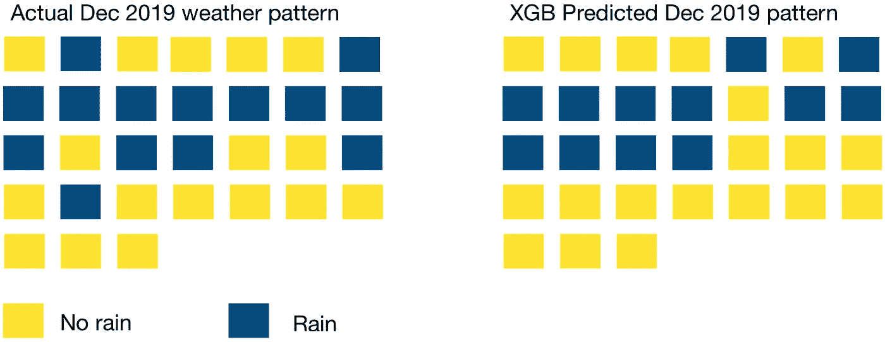
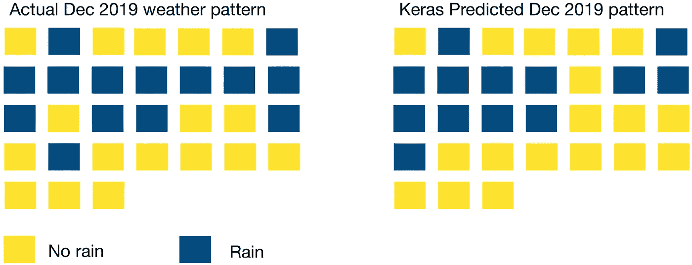
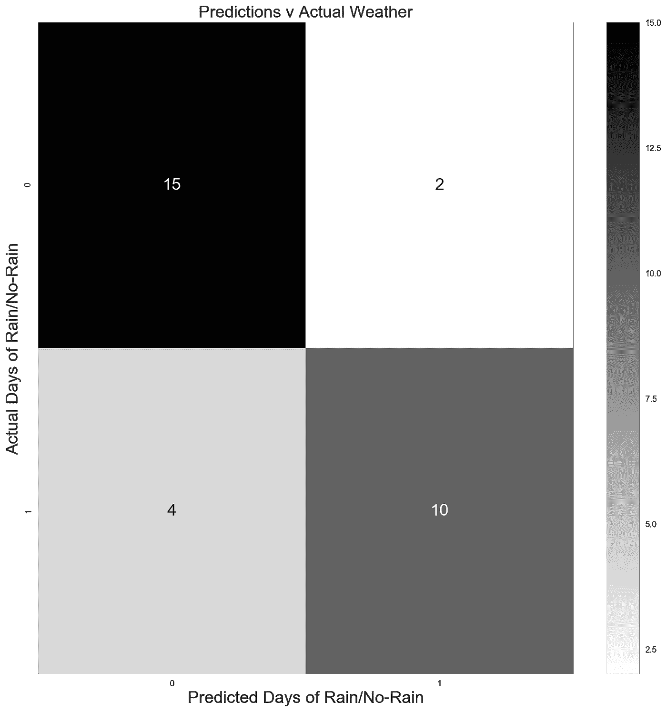
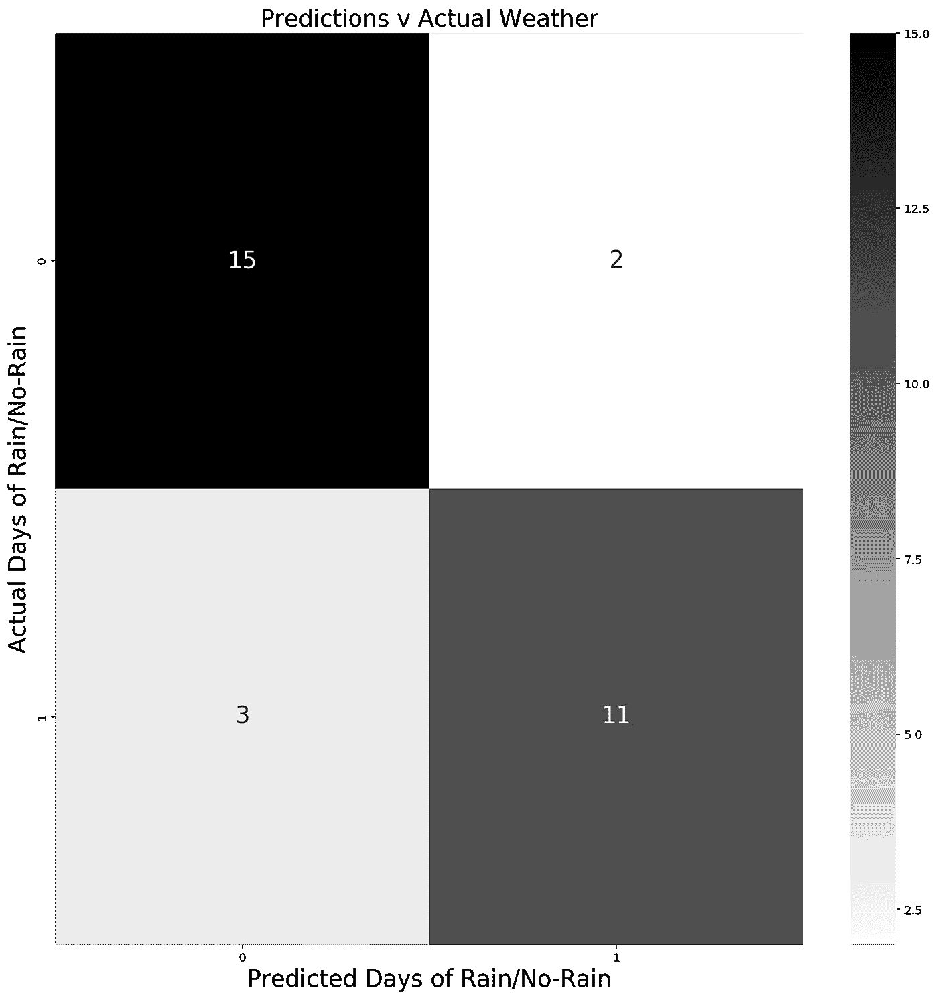
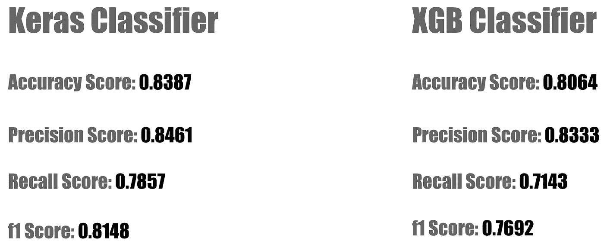
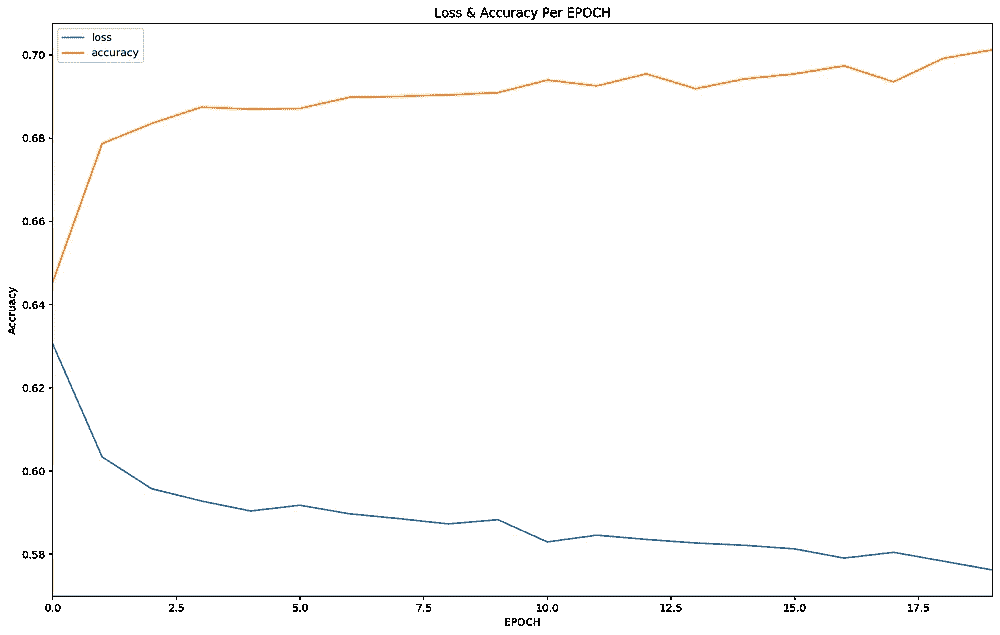
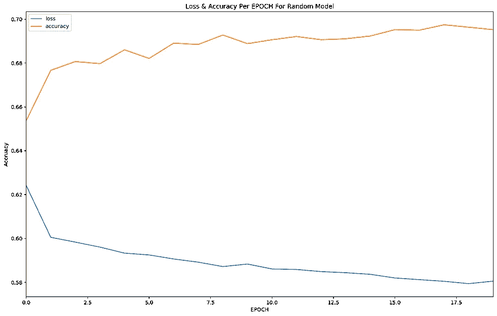

# 天气预测:“经典”机器学习模型 Vs Keras

> 原文：<https://towardsdatascience.com/weather-predictions-classic-machine-learning-models-vs-keras-41604f8553e2?source=collection_archive---------25----------------------->

*在深度学习中应用管道和网格搜索等有用的 Scikit-learn 功能的实际例子。*

照片:蔡展汉

在花了 2019 年的大部分时间学习机器学习的基础知识后，我热衷于开始尝试一些基本的深度学习。

虽然不缺乏像 Keras 这样的用户友好型库入门的伟大教程，但要找到通过展示管道和网格搜索等 Scikit-learn 功能如何在深度学习中发挥作用来为初学者连接这些点的**例子要难得多。**

因此，我决定将我在这个主题上找到的材料收集在一起，并匆匆制作了一系列笔记本，希望能够帮助那些希望投身深度学习的新来者。

在这些笔记本中，我使用了机器学习和深度学习技术的混合，试图预测 2019 年 12 月新加坡的降雨模式。这些模型是根据新加坡从 1983 年 1 月 1 日到 2019 年 1 1 月底 37 年的天气数据进行训练的。

# **笔记本、数据和假设**

这是我正在进行的一系列数据科学项目的 Github repo ,使用的是新加坡的历史天气数据。这个帖子的具体笔记本可以在[这里](https://github.com/chuachinhon/weather_singapore_cch/blob/master/notebooks/5.0_data_prep_cch.ipynb)，这里[这里](https://github.com/chuachinhon/weather_singapore_cch/blob/master/notebooks/5.1_ml_LR_XGB_cch.ipynb)，这里[这里](https://github.com/chuachinhon/weather_singapore_cch/blob/master/notebooks/5.2_dl_keras_gridsearch_cch.ipynb)，这里[这里](https://github.com/chuachinhon/weather_singapore_cch/blob/master/notebooks/5.3_dl_keras_tuner_cch.ipynb)找到。

为了简洁起见，我不会在这篇文章上粘贴任何代码。这些笔记本简单易懂，在 Github 上或通过直接下载更容易阅读。

这篇文章的数据来自新加坡气象局的网站。为了保持项目的简单，它被保持为一个二元分类问题，以预测某一天是多雨(1)还是干燥(0)。我还选择不丢弃离群值，以便将模型暴露给尽可能多的数据。

我使用的数据集跨越了 37 年，但它包含了不到 13，500 行数据。有理由问你是否需要像这样的数据集进行深度学习，它是否一定会产生更好的结果。

这些都是合理的担忧，尤其是考虑到所需的额外时间和资源。但是我决定把它们放在一边，因为这里的目标是实验和学习。

# 结果

我讨厌仅仅为了看到结果而滚动冗长的博客帖子，所以让我们快速看一下 XGB 模型在预测 2019 年 12 月新加坡的降雨/无雨模式时如何对抗 Keras 分类器:

Keras 模型比 XGB 模型表现稍好，在 31 天中正确地将 26 天划分为下雨/不下雨。XGB 模型管理了 31 个中的 25 个。

Keras 和 XGB 模型在回忆分数方面都有相同的弱点(与 precision 和 f1 分数相比相对较低)，即正确分类雨天的能力。

尽管如此，总的来说还不算太差。有了更丰富的气象数据，如湿度和大气压力，我们可能会得到更准确的预测。

现在，让我们分别深入研究每种方法。

# 使用逻辑回归和 XGB 分类器的“经典”机器学习方法

预测建模包括尝试许多不同的模型，看看哪一个效果最好，以及微调每个模型的超参数，以获得最佳组合。

Scikit-learn 的管道和网格搜索功能允许您有效地组织这两项任务并一次运行它们。在[笔记本 5.1](https://github.com/chuachinhon/weather_singapore_cch/blob/master/notebooks/5.1_ml_LR_XGB_cch.ipynb) 中，我选择用逻辑回归模型对抗 XGB 分类器。

您可以在同一管道中包含更多的模型，或者增加 [XGB 超参数的数量来调优](https://xgboost.readthedocs.io/en/latest/parameter.html)。但是时间和资源的权衡是你必须仔细权衡的。我选择了 LogReg 和 XGB 模型来说明在这些任务中可能遇到的权衡取舍的极端情况。

LogReg 模型只需要几秒钟就可以完成一次像样的网格搜索，而 XGB 分类器需要 7 个小时(在 6 核 2018 Mac Mini 上)才能完成超过 5 个超参数的网格搜索。

XGB 模型给出了稍微好一点的分数，并且可能通过更彻底的网格搜索得到改进。但是这 0.02 分的提升值得付出额外的努力吗？在这种情况下很有争议。

在任何情况下，我都继续使用 XGB 模型，尽管它的性能只比 LogReg 模型稍好一点。让我们来看看 XGB 对 2019 年 12 月预测的困惑矩阵:

XGB 模型正确地将 31 天中的 25 天划分为多雨/干旱天，准确率为 0.8。

模型错误地预测两天后会下雨，而实际上是晴天(误报)。它还错误地预测了 4 个晴天，而实际上这几天有雨(假阴性)。

就回忆分数而言，XGB 模型是最弱的，在这种情况下，这意味着它正确识别雨天的能力(14 分中的 10 分)。深度学习模型能做得更好吗？

# **带网格搜索的 Keras 分类器**

人们可以通过多种方式开始尝试深度学习模型。我想从小处着手，看看我是否能把我在 Scikit-learn 中学到的东西与新技术结合起来。

鉴于 Scikit-learn API (用于分类和回归)的两个包装器[，Keras 很快成为一个不错的选择。我还依靠两个优秀的在线帖子(](https://keras.io/scikit-learn-api/)[这里](https://machinelearningmastery.com/grid-search-hyperparameters-deep-learning-models-python-keras/)和[这里](https://www.curiousily.com/posts/hackers-guide-to-hyperparameter-tuning/))来指导我的[笔记本 5.2](https://github.com/chuachinhon/weather_singapore_cch/blob/master/notebooks/5.2_dl_keras_gridsearch_cch.ipynb) 的代码。

工作流本质上类似于常规的 Scikit-learn 方法，尽管有一个新步骤需要一点反复试验:定义创建和返回 Keras 顺序模型的函数。

根据您想要优化的超参数的数量，函数的结构必须相应地进行调整。在这篇文章中，我选择调整隐藏层的数量、神经元的数量、优化器、退出率、批量大小和时期的数量。

pipeline/gridsearch 结构本质上是相同的，只是需要将您定义的 Keras 函数传递给 Keras 分类器的“build_fn”参数。

在我的机器上用这些设置进行网格搜索花了 18 个多小时(仅限 CPU)。如果你想要更快的审判，相应地调整。让我们看看优化的 Keras 分类器预测的混淆矩阵:

Keras 模型比 XGB 模型表现得更好，它正确地预测了多一天的多雨天气，即它正确地将 31 天中的 26 天划分为多雨/少雨天，而 XGB 模型为 25 天。

模型错误地预测两天后会下雨，而实际上是晴天(误报)。它还错误地预测了 3 个晴天，而实际上这几天有雨(假阴性)。

与 XGB 模型一样，Keras 模型在回忆分数方面也是最弱的，在这种情况下，这意味着它正确识别雨天的能力(14 分中的 11 分)。让我们在验证集(2019 年 12 月的天气数据)上比较 XGB 和 Keras 模型的预测指标:

Keras 模型明显优于 XGB 版本，但网格搜索花费的时间是 XGB 的两倍多。在现实世界中，性能的提高意味着那个月的 31 天天气预报正确率增加了一天。

我最近发现了关于 [Keras Tuner](https://keras-team.github.io/keras-tuner/) 的情况，并渴望看到它是否能提供比 Scikit-learn/grid 搜索方法更好的结果。

# Keras 调谐器

至少有 4 个调谐器可供选择，但我选择尝试只 Hyperband 和 RandomSearch 调谐器。我还选择使用 HyperModel 子类方法，这使得两个调谐器的测试更加有效。

我改编了两个有用的在线帖子[和](https://github.com/PyDataBlog/Python-for-Data-Science/blob/master/Tutorials/divorce_tuner.py)[的代码。我选择了以下参数进行调整:隐藏层数、辍学率、学习率和动量。两个调谐器的性能水平相当:](https://www.curiousily.com/posts/hackers-guide-to-hyperparameter-tuning/)

带 Hyperband 的 Keras 调谐器(左)和带 RandomSearch 的 Keras 调谐器(右)

与通过 Scikit-learn 的网格搜索过程相比，Keras Tuner 非常快。不幸的是，尽管进行了几轮试错，我还是无法让精度水平超过 0.7。

可能还有很多我不知道的使用 Keras 调谐器的艺术，但我将不得不把它留给将来的更合适的数据集。

# 结束注释

正如许多在线文章所表明的那样，你正在处理的数据的性质和数量在很大程度上决定了你是采用“经典”的机器学习模型还是使用深度学习方法。

但是，很难获得一个大规模的真实世界数据集，它很容易进行深度学习。大规模数据集所需的时间和计算资源对初学者来说可能也不实际。

简而言之，不要让完美妨碍了美好。在这一点上，学习过程比结果更重要。在从事这个项目的过程中，我获得了一些好的经验，希望这些[笔记本](https://github.com/chuachinhon/weather_singapore_cch/tree/master/notebooks)能够帮助任何想要尝试深度学习的人。

和往常一样，如果您发现代码中有任何错误，请 ping 我@

推特: [@chinhon](https://twitter.com/chinhon)

领英:【www.linkedin.com/in/chuachinhon 

如果你对研究新加坡的天气数据集感兴趣，这里是我使用相同记录的早期项目:

*   [检测天气异常值](/detecting-abnormal-weather-patterns-with-data-science-tools-5fae48586469)
*   [可视化变化的天气模式](/visualising-singapores-changing-weather-patterns-1983-2019-a78605fadbdf?source=---------9------------------)
*   [Q3 烤焦器](/scorcher-as-global-records-tumbled-spore-baked-under-one-of-the-warmest-q3-ever-436837cb5b0?source=---------2------------------)