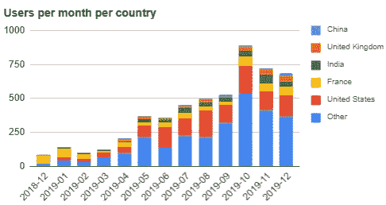

# 网络分析数据仓库:谷歌分析和搜索

> 原文：<https://towardsdatascience.com/web-analytics-data-warehouse-google-analytics-and-search-f2d244e110c9?source=collection_archive---------18----------------------->


在本教程中，我们将看到如何创建一个数据仓库和一个依赖于 SEO(搜索引擎优化)的内容营销仪表板。它将利用和混合来自[谷歌分析](https://analytics.google.com/)(跟踪你网站的流量)和[谷歌搜索控制台](http://search.google.com/search-console)(你的网站在谷歌搜索上的表现)的数据。

结果将是[这个 Google Sheet dashboard](https://docs.google.com/spreadsheets/d/1AKg6_smd5c7lpXhjjHut5TEnUMoZI4TVmzTQk9wVkNw/edit?usp=sharing) (你可以点击链接或者看下面的截图)自动更新。这是来自我的博客[DataIntoResults.com](https://dataintoresults.com/)的直播，它运行在 WordPress 上，但是任何内容营销平台都可以。


这篇文章将包含许多主题:设置数据仓库和 ETL 基础设施，从 Google Analytics 和 Google Search 获取数据到数据仓库，对数据建模以便使用，以及在 Google Sheets 中设置一个漂亮的仪表板。

**我们开始吧！**

# 什么是网络分析数据仓库？

我们需要问自己的第一个问题是，我们想要实现什么？建立 web analytics 数据仓库的全部意义在于能够获得完全符合您需求的定制报告。如果没有，你也可以使用谷歌分析前端。

在这里，我将把我的兴趣缩小到两个问题上:什么与我的受众相关，以及如何让我的文章更加 SEO 友好。尽管如此，这篇文章的目的是让你有足够的数据来更加关注你的具体情况。

# 内容是否与受众相关？

哪些内容是观众感兴趣的？我不做 clickbait，所以我的文章往往比较长。因此，怀疑兴趣的一个方法是看有多少访问者阅读了整篇文章，而不是那些在文章开始就停下来的访问者。在 Medium 中有一个很酷的特性叫做读取率(见下面的截图)。我们将与谷歌分析这个功能。


第二个感兴趣的指标是谷歌搜索上显示的内容的点击率(CTR)。如果你的内容被推到人们面前，但他们没有点击，这可能是因为你的主题不正确，或者你的标题和描述不够有趣。

# 内容搜索引擎优化准备好了吗？

有相关的内容是很好的，但是如果没有一种方法把它放在观众面前，它是没有用的。 **SEO 营销的基础是让人们正在寻找的一些关键词的内容处于有利位置**。

例如，这些天我在搜索“postgresql 数据科学”上排名很好(在 DuckDuckGo 上排名第一)。这是一个合理的关键字组合，流量和排名第一有助于推动游客。


尽管如此，总的来说，该页面位于第 27 位。挖掘了一下，我发现了一些既相关又有一些流量(新内容创作的机会)的关键词组合。

# 设置数据仓库基础设施

现在我们知道了我们想要什么，我们需要在基础设施上花些时间。[需要帮助的话可以联系我](https://dataintoresults.com/contact/)。让我们为您未来的发展打下坚实的基础。

我们将使用一个 [PostgreSQL 数据仓库](https://dataintoresults.com/post/postgresql-for-data-science-pro-and-cons/)(开源)和[数据酿酒厂 ETL](https://databrewery.co/) (我的一个产品，也是开源的)。PostgreSQL 将是存储和处理数据的地方，而 Data Brewery 将把数据从谷歌服务转移到数据库并管理工作流。

有两个数据源，Google Analytics 和 Google Search 将存储在 PostgreSQL 数据仓库中(每个都在一个特定的模块中)。然后，我们将把它们融合到一个名为*内容营销*的新模块中。最后，我们将数据放入 Google 工作表中。这里没什么特别的。


你可以在 GitHub 上找到完整的 Data Brewery 项目[(在文件夹 v1 中)。](https://github.com/dataintoresults/web-analytics-data-warehouse)

我不会详细讨论实现，但是数据存储目录包含数据源的视图。例如，下面是谷歌搜索的数据存储。它定义了一个名为 seo_pages 的表(虚拟的),该表将包含一些关于过去 10 天的信息(有多少印象，点击和每页每天的平均位置)。


然后，数据被集成到归档模块中。


运行该流程(使用 shell 命令`ipa run-process update`)后，将填充表 google_search.seo_pages。


Google Sheets 数据存储用于输出数据，每个表都有一个 SQL 查询要在数据仓库中执行，以便填充 Google Sheets 中的相应区域。

如果你想了解更多关于整合配置的信息，你可以阅读来自 [Data Brewery](https://databrewery.co/) 的 [Google Analytics](https://databrewery.co/docs/reference/stores/google/google_analytics.html) 、 [Google Search](https://databrewery.co/docs/reference/stores/google/google_search.html) 和 [Google Sheets](https://databrewery.co/docs/reference/stores/google/google_sheets.html) 文档页面。

# 数据建模

既然我们在 web analytics 数据仓库中有了原始数据，我们可能希望在仪表板中很好地呈现它。为此，我们将利用 SQL 语言(大多数数据库的说法)。

# 第一次查询

让我们从一些简单的东西开始(但绝不简单)，每个国家每月的用户图表。



你可能会看到，我们将展示的国家数量限制为五个，并将其余的国家重新组合在另一个国家。这对可读性很重要。但是你必须定义你如何选择五个重要的国家。它可以是静态选择，也可以是动态选择。在这种情况下，我选择了前一个月最大的 5 个国家。

正如您在下面看到的, *user_country* 部分(第一个选择)很简单，其余的只是 5 个国家的选择。

正如您在[数据—用户国家表](https://docs.google.com/spreadsheets/d/1AKg6_smd5c7lpXhjjHut5TEnUMoZI4TVmzTQk9wVkNw/edit#gid=234352901)中看到的，栏 A 到栏 C 由 ETL 填充。在此基础上，我们使用交叉表来生成图表。


正如你所看到的，这并不简单，因为我们想展示一些好的东西，我们操纵原始数据，最后是因为谷歌工作表是有限的。

但是让我们变点魔法吧。

# 读取比率

请记住，阅读率是阅读整个内容的访问者数量除以该内容的访问者数量。第二部分很简单，因为它在谷歌分析上是默认提供的。

对于第一部分，阅读全文的访问者数量，我们将使用 Google Analytics 的事件机制。我推荐使用[谷歌标签管理器](https://tagmanager.google.com/#/home)，它允许轻松配置谷歌分析事件。

我定义了下面的标签(参见截图)。我们将有一个名为 Scroll 的事件类别，它将在页面滚动时被触发(我已经设置了 25、50、75 和 90%)。参数{{UA DataIntoResults}}是我的 Google Analytics 视图 ID。


在*Google _ analytics . events*表中，我们将找到这些事件。


请注意，动作值与页面相同。这是因为我们将使用 unique_events 列。如果动作是一个像“滚动”一样的常量，那么 unique_event 将在每次访问时只计算一次，即使访问者阅读了许多完整的帖子。

现在，开始行动，或者 SQL 查询。我想强调三件事:

*   原始数据必须清理一点，页面有时有参数。例如，`/mypage`和`/mypage?parameter=1`不是谷歌分析的同一个页面。从商业角度来看，大多数时候都是一样的。代码`regexp_replace(page, '[?&].*$', '')`将会清除它(第 4 行和第 9 行)。
*   我们过滤数据，只保留 2020 年 1 月 15 日之后的数据。滚动跟踪是在那一天实现的(第 20 和 29 行)。
*   我们使用 75%的阈值来定义一篇文章为已读。合适的值取决于你的网站布局(第 18 行)。

这是我们的阅读率:


# 最后一个焦点:那些迷你图

我是爱德华·塔夫特的超级粉丝，他在探索信息密度的过程中发明了迷你图这个术语。迷你图无需占用太多空间即可提供时间上下文。

例如，我们使用印象指标(节选如下),它反映了在谷歌搜索上看到每个页面的人数。通过为过去 13 个月的趋势添加迷你图，我们提供了更多价值。我们可以看到，虽然第二篇文章( [PostgreSQL for Data Science](https://dataintoresults.com/post/postgresql-for-data-science-pro-and-cons/) )上升缓慢，但第一篇文章( [Jupyter for Complex Python 和 Scala Spark project](https://dataintoresults.com/post/jupyterlab-for-complex-python-and-scala-spark-projects/))却迅速获得了更多的印象。最后一个([数据仓库宣言](https://dataintoresults.com/post/data-warehouse-manifesto/))，印象不多，从来没有过。这只是不是搜索引擎优化的好内容。


现在坏消息是，每页绘制 13 个数据点需要 13 列，这在 SQL 中有点麻烦。我们首先创建一个参考表，提供每个月(过去 13 个月)的订单(从 1 到 13)。这是在第 8 到 11 行完成的。然后，从第 42 行开始，我们用一个关于月份的条件来聚集数据。这允许将数据从行旋转到列。

现在每个指标有 13 列(浏览量、浏览量、点击量和位置)用于每个页面(每个页面是一行)，我们可以在 Google Sheet 中绘制这些小的迷你图。


请注意，除了数据点选择之外，您还可以传递参数来控制行为。你可以在 [Google Sheets 文档](https://support.google.com/docs/answer/3093289?hl=en)中阅读更多关于迷你图的内容。

# 初始化并自动刷新

默认配置从谷歌分析和谷歌搜索中查找最近 10 天的信息。当您有一份过去 13 个月的报告时，这显然不方便(您需要等待 13 个月)。

因此，我们将使用 init.conf(见下文)来使用`ipa run-module -c init.conf update`引导数据仓库。这将需要一些时间，因为我们要获取最近 400 天的数据。


最后，我们希望 web 分析数据仓库在没有人工交互的情况下被刷新。最简单的方法是使用调度程序，例如 Linux 下的 cron。在下面，您可以看到每天在 UTC 时间早上 5 点更新数据仓库的命令。

```
# m h dom mon dow command 0 5 * * * cd ~/dwh/web-analytics-data-warehouse/v1 &amp;&amp; ~/app/ipa/bin/ipa run-process update
```

因此，我们的 Google Sheet dashboard 每天都会更新(每天不会有太大变化，因为它是一份月度报告)。


**恭喜，我们现在有了一个完全可操作的 web 分析数据仓库！你会添加什么使它更相关？**

*原载于 2020 年 1 月 22 日*[](https://dataintoresults.com/post/web-analytics-data-warehouse-google-analytics-and-search/)**。**