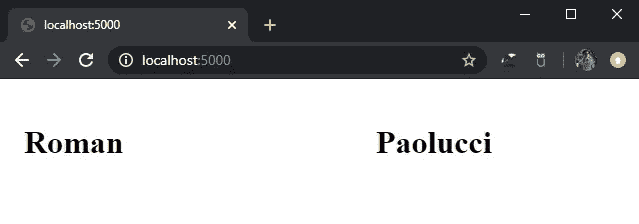

# 用 Python 开发 Web 应用程序

> 原文：<https://towardsdatascience.com/web-app-development-in-python-469e1cf2116b?source=collection_archive---------17----------------------->

## 构建前端用户体验简介

[来自 Unsplash 的照片](https://unsplash.com/photos/hpjSkU2UYSU)

# 烧瓶是什么？

Flask 是一个帮助我们开发 web 应用程序的轻量级 Python 库。我已经在个人项目中使用 Flask 来构建交易仪表板，并在专业环境中为医院部署人工智能工作流管理系统。在本文中，我想介绍 Flask，并演示开始构建自己的 web 应用程序是多么容易。

# 按指定路线发送

理解 Flask 如何工作的最好方法是亲自动手使用它。之后，您将了解如何构建 web 应用程序的各个部分。首先，让我们导入并创建一个 Flask 实例。

当我们最终运行 Flask 实例并在浏览器中连接到它时，它将拥有一个默认主机( *127.0.0.1* 或 *localhost* )和一个默认端口( *5000* )。要在浏览器中连接到我们的 web 应用程序，我们需要键入 URL 和端口(localhost:5000)以及一个规则来帮助我们检索适当的内容。因此，让我们创建一个新的 URL 规则，这基本上相当于一个主页。当我们在浏览器中键入 localhost:5000 时，它将检索该函数返回的数据。

现在我们需要一些东西来展示。

# 模板

模板是 HTML，它将由伴随 URL 规则的函数呈现并返回给用户。在这种情况下，home 函数将负责呈现和返回主页模板。所有模板都应该存储在名为 *templates* 的文件夹中，该文件夹与保存 Flask 实例的脚本位于同一文件夹中。HTML 可以是您喜欢的任何东西，对于这个例子，我将创建一个简单的网格布局，类似于我用来构建交易仪表板的布局。

为了让 home 函数呈现并返回这个模板，我们可以将下面的代码添加到 home 函数中。

每当我们到达主页(localhost:5000)时，home 函数将呈现并返回 home HTML 模板。

## 将 Python 变量传递给 HTML

拥有 Python 后端的全部目的是在前端向用户显示相关数据。为此，我们可以使用 Jinja。Jinja 允许我们轻松地引用 Python 变量，并编写 Python 代码来控制我们选择如何在 HTML 中显示这些变量。首先，我将在 Python 中创建两个变量: *first_name* 和 *last_name* 。然后我将通过我们的 home 函数中的 render_template 把它们传递给模板。我将把 Python 变量传递给 *fn* 和*ln*——这就是我们在 HTML 中引用 *first_name* 和 *last_name* 的方式。

我想在第一列显示*名*变量，在第二列显示*姓*变量。为此，我将把对这些变量的引用， *fn* 和 *ln，*用花括号( *{{ fn }}，{{ ln }}* )包装起来，向 HTML 表明它们将从 Python 传递到模板。

这将使用 Python 变量呈现主 HTML 模板。

# 发射

要启动我们的 web 应用程序，我们所要做的就是运行 Flask 的实例。

运行 Python 脚本后，在浏览器中输入 localhost:5000。

我把我的文本放在 h1 标签中以提高可视性

这就是你用 Python 和 Flask 构建的第一个 web 应用程序。

# 实时部署

一个非常典型的问题出现了:我们如何在线部署 Python web 应用程序？有很多方法可以做到这一点。然而，如果你正在寻找一个具体的答案，我会建议看看亚马逊网络服务的弹性豆茎。这就是我部署所有 web 应用程序的方式。

 [## AWS 弹性 Beanstalk -部署 Web 应用程序

### 易于开始，不可能超越 AWS 弹性 Beanstalk 是一个易于使用的服务，用于部署和扩展 web…

aws.amazon.com](https://aws.amazon.com/elasticbeanstalk/)