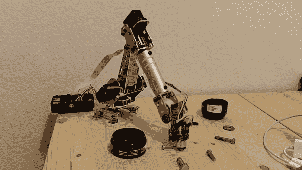
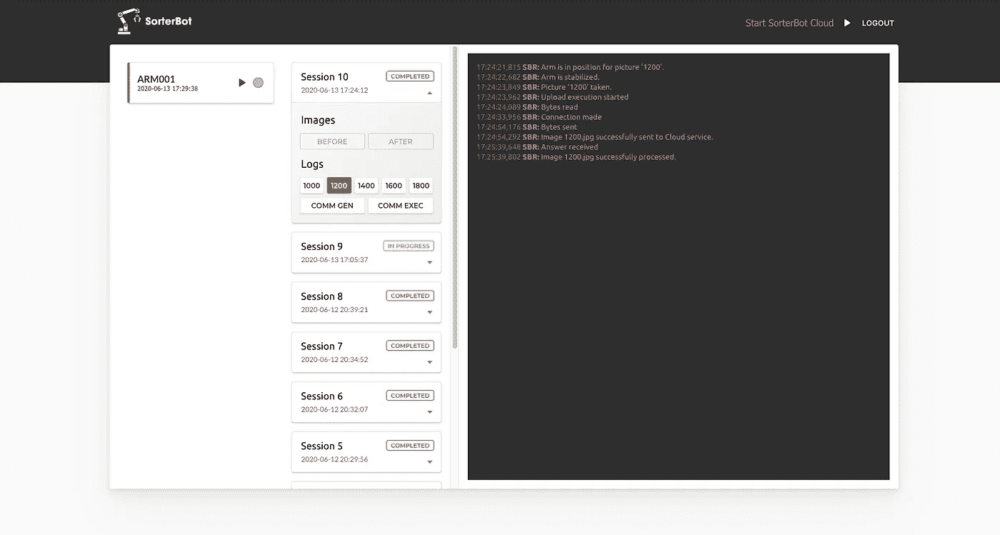
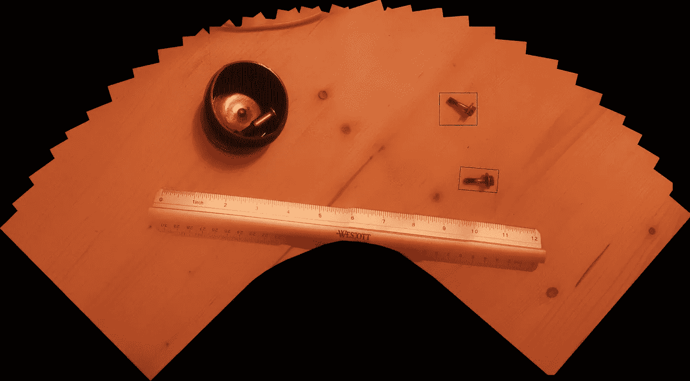
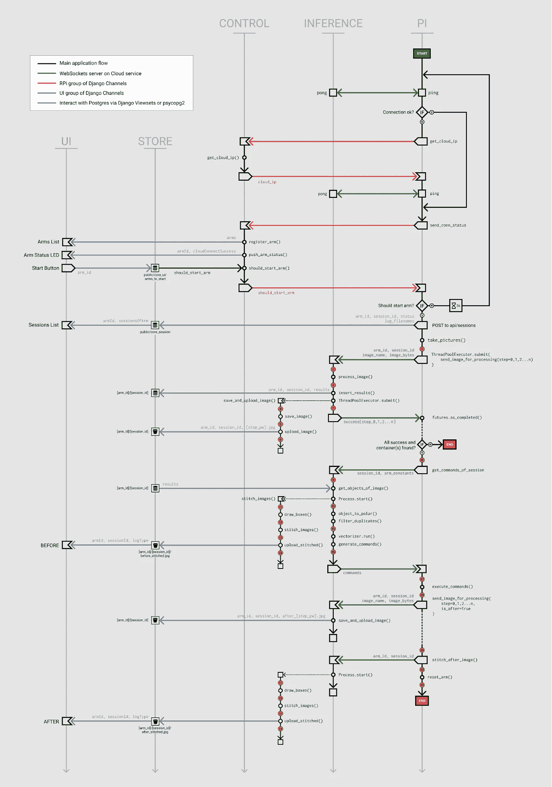
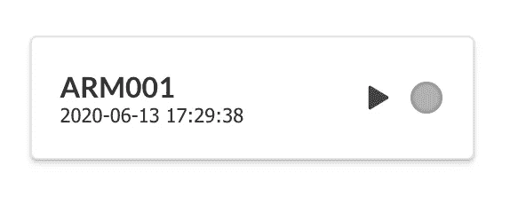
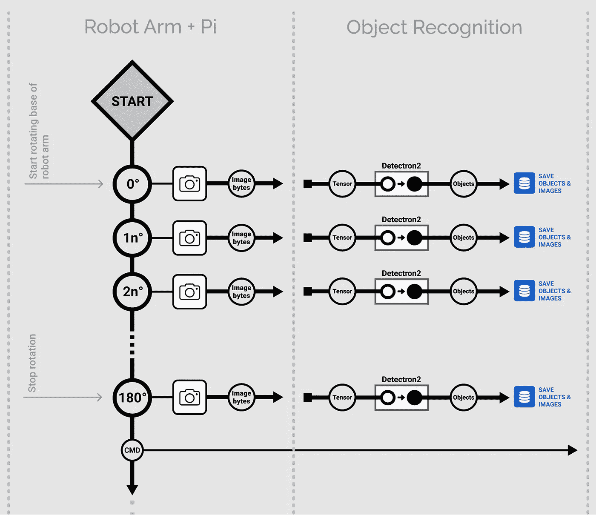
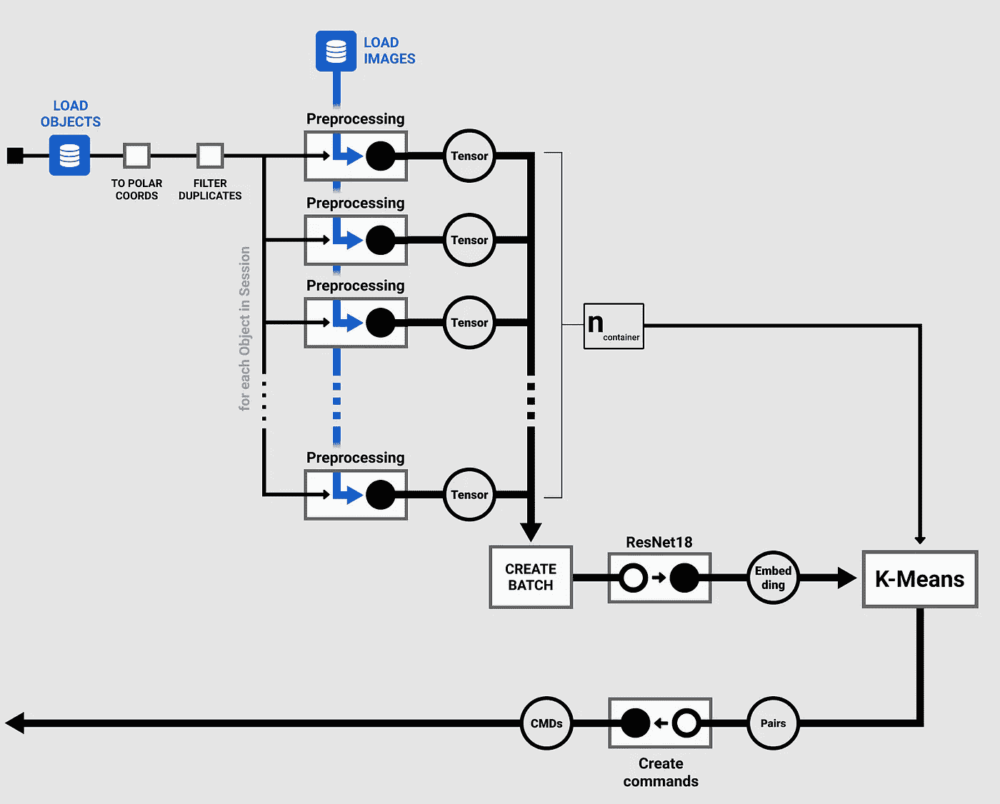
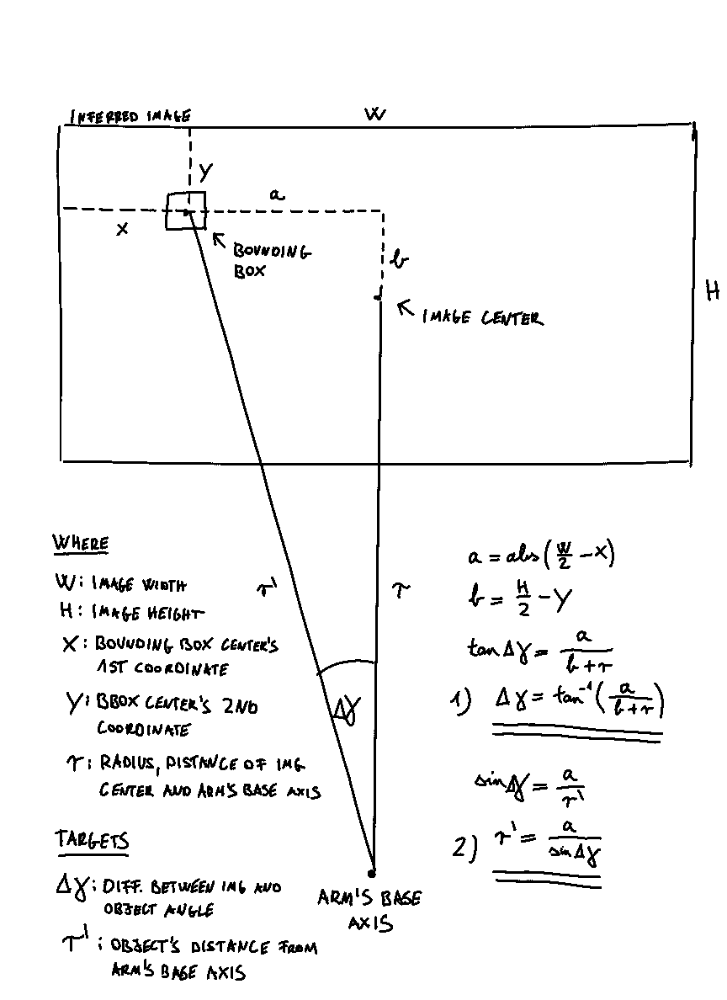
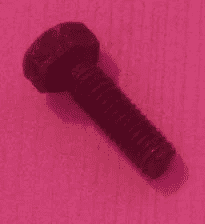

# 分拣机器人—第 1 部分

> 原文：<https://towardsdatascience.com/web-application-to-control-a-swarm-of-raspberry-pis-with-an-ai-enabled-inference-engine-b3cb4b4c9fd?source=collection_archive---------34----------------------->

## *一个基于网络的解决方案，用于控制一群覆盆子 pi，具有实时仪表盘、深度学习推理机、一键式云部署和数据集标记工具。*

这是由三部分组成的 SorterBot 系列的第一篇文章。

*   第 1 部分——项目概述和网络应用
*   [第二部分——控制机械臂](https://medium.com/@simon.szalai/web-application-to-control-a-swarm-of-raspberry-pis-with-an-ai-enabled-inference-engine-part-2-73804121c98a)
*   [第 3 部分—迁移学习和云部署](https://medium.com/@simon.szalai/web-application-to-control-a-swarm-of-raspberry-pis-with-an-ai-enabled-inference-engine-part-3-77836f9fc4c2)

GitHub 上的源代码:

*   [控制面板](https://github.com/simonszalai/sorterbot_control) : Django 后端和 React 前端，运行在 EC2 上
*   [推理机](https://github.com/simonszalai/sorterbot_cloud):运行在 ECS 上的 PyTorch 对象识别
*   [树莓](https://github.com/simonszalai/sorterbot_raspberry):控制机械臂的 Python 脚本
*   [安装程序](https://github.com/simonszalai/sorterbot_installer) : AWS CDK、GitHub 动作和一个 bash 脚本来部署解决方案
*   [标签工具](https://github.com/simonszalai/sorterbot_labeltool):使用 Python 和 OpenCV 的数据集标签工具

我最近在 SharpestMinds 完成了一个人工智能导师项目，其核心要素是建立一个项目，或者更好的是一个完整的产品。我选择后者，在这篇文章中，我写了我构建了什么，我是如何构建的，以及我一路走来学到了什么。在我们开始之前，我想特别感谢我的导师托马斯·巴贝吉(CTO@ProteinQure)在这段旅程中给予的宝贵帮助。

在考虑构建什么的时候，我想到了一个基于网络的解决方案来控制一群树莓 pi，它具有实时仪表盘、深度学习推理引擎、一键云部署和数据集标记工具。Raspberry Pis 可以连接任何传感器和执行器。他们收集数据，将其发送到推理引擎，推理引擎对数据进行处理，并将其转化为执行器可以执行的命令。还包括一个控制面板来管理和监控系统，同时子系统使用 WebSockets 或 REST API 调用相互通信。

作为上述总体思想的实现，我构建了 SorterBot，其中传感器是一个摄像头，执行器是一个机械臂和一个电磁铁。该解决方案能够根据金属物品的外观对其进行自动分类。当用户开始一个会话时，手臂扫描它前面的区域，找到它所及范围内的物体和容器，然后自动将物体分成与找到的容器一样多的组。最后，它将对象移动到它们对应的容器中。

SorterBot 自动拾取对象(图片由作者提供)

为了处理手臂摄像头拍摄的图像，我基于脸书 AI 的 [Detectron2](https://github.com/facebookresearch/detectron2) 框架构建了一个推理机。当图片到达进行处理时，它在该图像上定位项目和容器，然后将边界框保存到数据库。在给定会话中的最后一张图片被处理之后，项目被聚类到与找到的容器一样多的组中。最后，推理引擎生成命令，这些命令指示手臂将相似外观的项目移动到同一个容器中。

为了更容易控制和监控系统，我构建了一个控制面板，前端使用 React，后端使用 Django。前端显示已注册的 arm 列表，允许用户启动会话，还显示现有会话及其状态。在每个会话下，用户可以访问逻辑分组的日志，以及工作区的前后概览图像。为了避免为 AWS 资源支付不必要的费用，用户还可以选择使用标题中的按钮来启动和停止运行推理引擎的 ECS 集群。

控制面板的用户界面(图片由作者提供)

为了让用户更容易看到手臂在做什么，我使用 OpenCV 将相机在会话期间拍摄的照片拼接在一起。此外，在手臂将物体移动到容器后拍摄另一组照片，因此用户可以看到该区域的前/后概览，并验证手臂实际上将物体移动到容器。

由会议图像拼接而成的概览图像(作者提供的图像)

后端通过 WebSockets 和 REST 调用与 Raspberry Pis 通信，处理数据库并控制推理引擎。为了能够在更新发生时从后端进行实时更新，前端还通过 WebSockets 与后端进行通信。

由于该解决方案由许多不同的 AWS 资源组成，手动提供它们非常繁琐，所以我利用 [AWS CDK](https://aws.amazon.com/cdk/) 和一个冗长的 [bash 脚本](https://github.com/simonszalai/sorterbot_installer/blob/master/scripts/deploy_prod.sh)自动化了部署过程。要部署该解决方案，必须设置 6 个环境变量，并且必须运行一个 bash 脚本。该过程完成后(大约需要 30 分钟)，用户可以从任何 web 浏览器登录到控制面板，并开始使用该解决方案。

# Web 应用程序

从概念上讲，通信协议有两个部分。第一部分是一个重复的心跳序列，arm 定期运行该序列，以检查是否为启动会话做好了一切准备。第二部分是会话序列，负责跨子系统协调整个会话的执行。

说明解决方案不同部分如何相互通信的图表(图片由作者提供)

## 心跳序列

第一部分开始执行的点用绿色矩形标记。作为第一步，Raspberry Pi ping web socket 连接到推理引擎。如果连接是健康的，它会跳到下一部分。如果推理引擎显示为脱机，它会从控制面板请求其 IP 地址。在控制面板返回 IP(或者如果推理引擎实际上是离线的，则返回“假”)之后，它试图建立与新地址的连接。这种行为使得推理引擎在不使用时可以关闭，从而大大降低了成本。它还简化了手臂的设置，这在使用多个手臂时尤其重要。

不管与新 IP 的连接是否成功，结果都会与 arm 的 ID 一起报告给控制面板。当控制面板接收到连接状态时，它首先检查数据库中是否已经注册了 arm ID，并在需要时进行注册。之后，连接状态被推送到 UI，其中状态 LED 以绿色或橙色亮起，分别表示连接是否成功。

出现在用户界面上的手臂，带有开始按钮和状态灯(图片由作者提供)

在用户界面上，状态 LED 旁边有一个“播放”按钮。当用户点击该按钮时，手臂的 ID 被添加到数据库的列表中，该列表包含应该开始会话的手臂的 ID。当 arm 检查连接状态，并且该状态为绿色时，它会检查其 ID 是否在该列表中。如果是，ID 将被删除，一个响应将被发送回 arm 以启动会话。如果不是，则发送回一个响应来重新启动心跳序列，而不启动会话。

## 会话序列

手臂的首要任务是拍照进行推断。为此，手臂移动到推断位置，然后开始在其底部旋转。它每隔一段时间就停下来，然后相机拍一张照片，直接以字节的形式发送给推理机，使用 WebSocket 连接。

推理机的高层图(图片由作者提供)

当从 Raspberry Pi 接收到图像数据时，图像处理开始。首先，从字节解码图像，然后产生的 NumPy 数组用作 Detectron2 对象识别器的输入。该模型输出已识别对象的边界框坐标以及它们的类别。坐标是距图像左上角的相对距离，以像素为单位。这里只进行二元分类，这意味着一个对象可以是一个项目或一个容器。项目的进一步聚类在后面的步骤中完成。在处理结束时，结果被保存到 PostgreSQL 数据库，然后图像被写入磁盘供矢量器使用，并存档到 S3 供以后参考。保存和上传图像不在关键路径中，所以它们在一个单独的线程中执行。这降低了执行时间，因为序列可以在上载完成之前继续。

当在 Detectron2 的 model zoo 中评估模型时，我选择了更快的 R-CNN R-50 FPN，因为与其他可用的架构相比，它提供了最低的推理时间(43 ms)、最低的训练时间(0.261s/迭代)和最低的训练内存消耗(3.4 GB)，而没有放弃太多的准确性(41.0 box AP，是最佳网络的 box AP 的 92.5%)。

矢量器的高级图(图片由作者提供)

在所有的会话图像已经被处理并且生成会话命令的信号到达之后，将这些图片拼接在一起在单独的过程中开始，为用户提供“之前”的概览。与此同时，从数据库中加载属于当前会话的所有图像处理结果。首先，使用随请求发送的特定于 arm 的常数将坐标转换为绝对极坐标。常数 **r** 代表图像中心和手臂基轴之间的距离。相对坐标( **x** 和 **y** 在下图中)是距离图像左上角的像素距离。图像拍摄的角度用 **γ** 表示。**δγ**表示给定项目与图像中心之间的角度差，可以使用下图中的公式 **1)** 计算。项目的第一个绝对极坐标(角度， **γ'** )，可以简单地用这个等式计算:**γ' =γ+δγ**。第二个坐标(半径，**r’)，**可以用图上的公式 **2)** 计算。

用于将相对坐标转换为绝对极坐标的绘图和方程(图片由作者提供)

在坐标转换之后，属于相同物理对象的边界框由它们的平均绝对坐标代替。

在矢量器的预处理步骤中，加载前一步骤中保存到磁盘的图像，然后围绕每个对象的边界框进行裁剪，从而生成每个项目的小图片。

围绕其边界框裁剪的对象示例(作者提供的图像)

这些图片被转换成张量，然后添加到 PyTorch 数据加载器中。一旦所有的图像被裁剪，所创建的批次由矢量器网络处理。选择的架构是 ResNet18 模型，它适合这些小尺寸的图像。PyTorch 钩子被插入到最后一个完全连接的层之后，因此在该层的每个推理步骤的输出中，512 维特征向量被复制到网络外部的张量。在矢量器处理了所有的图像之后，得到的张量被直接用作 K-Means 聚类算法的输入。对于其他所需的输入，即要计算的聚类数，从数据库中插入已识别容器的简单计数。这一步输出一组配对，表示哪个项目进入哪个容器。最后，这些配对被替换为发送到机械臂的绝对坐标。

这些命令是表示项目和容器的坐标对。机械臂一个接一个地执行这些动作，利用电磁铁将物体移动到容器中。

物体被移动后，手臂拍摄另一组照片进行拼接，作为手术后的景观概览。最后，机械臂复位到初始位置，会话完成。

感谢您的阅读，如果您有任何问题、意见或建议，请告诉我！

在下一部分，我将写关于装配和控制机械臂。

[*未完待续第二部……*](https://medium.com/@simon.szalai/web-application-to-control-a-swarm-of-raspberry-pis-with-an-ai-enabled-inference-engine-part-2-73804121c98a)