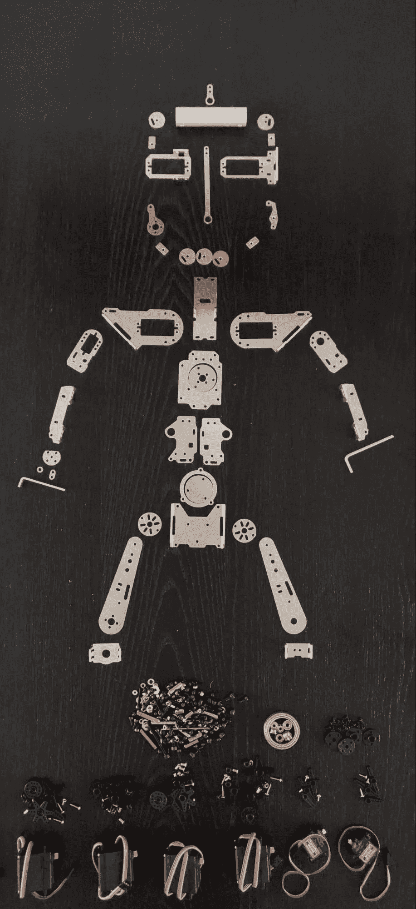
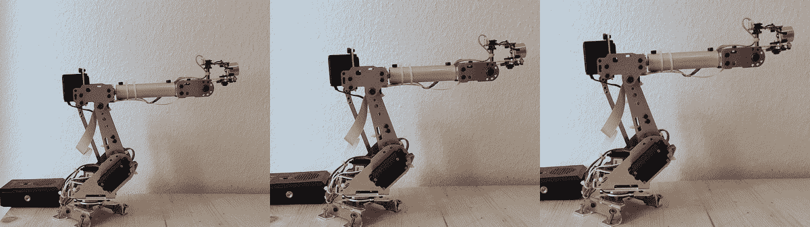
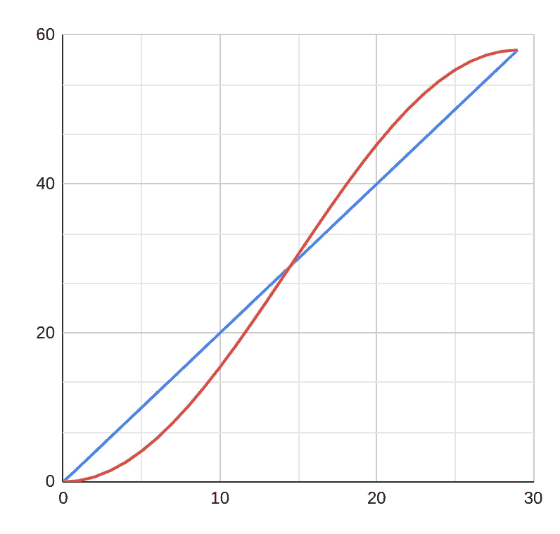
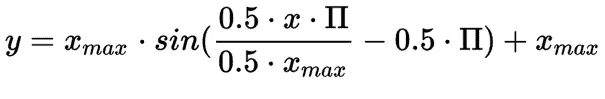
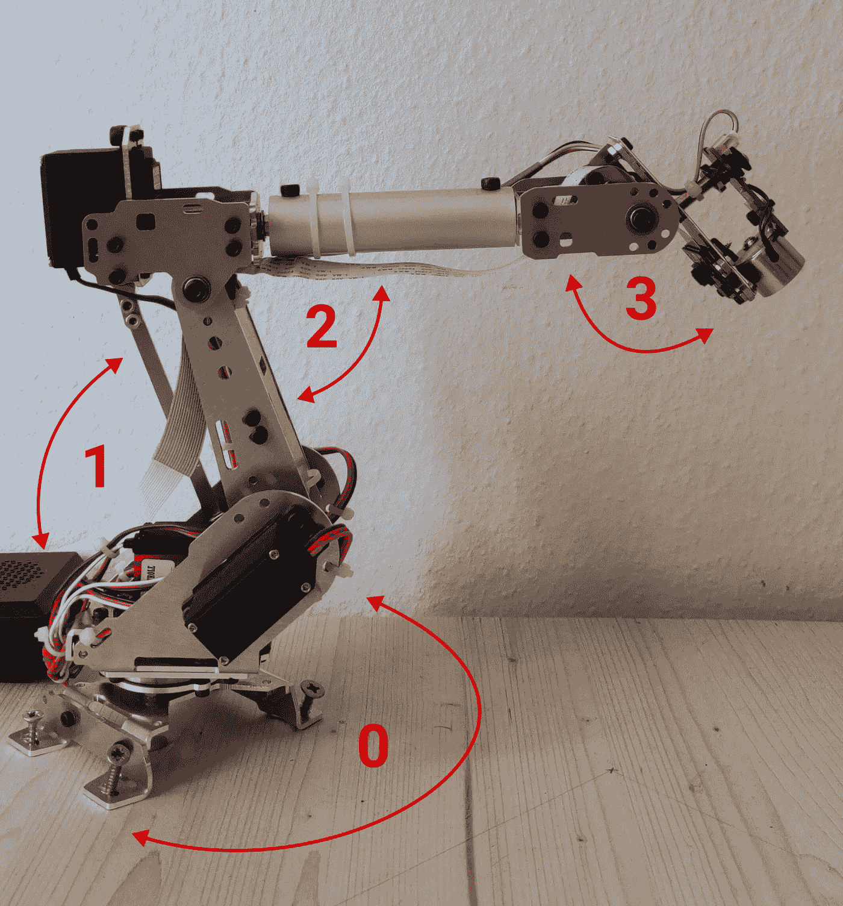
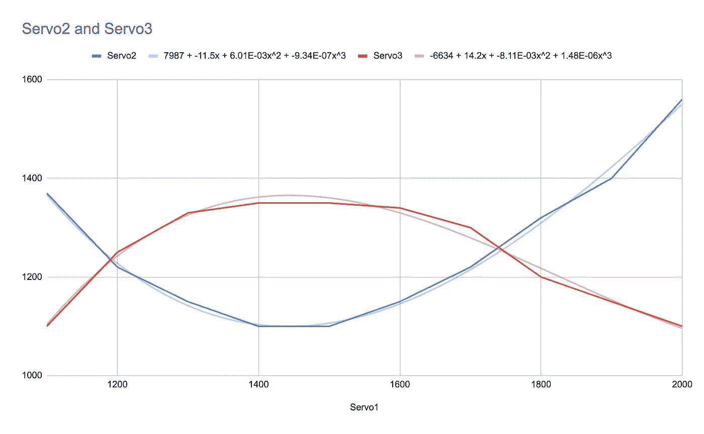

# 分拣机器人—第二部分

> 原文：<https://towardsdatascience.com/web-application-to-control-a-swarm-of-raspberry-pis-with-an-ai-enabled-inference-engine-part-2-73804121c98a?source=collection_archive---------24----------------------->

## *一个基于网络的解决方案，用于控制一群覆盆子 pi，具有实时仪表盘、深度学习推理机、一键式云部署和数据集标记工具。*

我最近在 SharpestMinds 完成了一个人工智能导师项目，其核心要素是建立一个项目，或者更好的是一个完整的产品。我选择后者，在这篇文章中，我写了我构建了什么，我是如何构建的，以及我一路走来学到了什么。

[*上接第 1 集……*](https://medium.com/swlh/web-application-to-control-a-swarm-of-raspberry-pis-with-an-ai-enabled-inference-engine-b3cb4b4c9fd)

这是由三部分组成的 SorterBot 系列的第二篇文章。

*   [第 1 部分——项目概述和网络应用](https://medium.com/swlh/web-application-to-control-a-swarm-of-raspberry-pis-with-an-ai-enabled-inference-engine-b3cb4b4c9fd)
*   第 2 部分—控制机械臂
*   [第 3 部分—迁移学习和云部署](https://medium.com/@simon.szalai/web-application-to-control-a-swarm-of-raspberry-pis-with-an-ai-enabled-inference-engine-part-3-77836f9fc4c2)

GitHub 上的源代码:

*   [控制面板](https://github.com/simonszalai/sorterbot_control) : Django 后端和 React 前端，运行在 EC2 上
*   [推理机](https://github.com/simonszalai/sorterbot_cloud):使用 PyTorch 进行对象识别，运行在 ECS 上
*   [覆盆子](https://github.com/simonszalai/sorterbot_raspberry):控制机械臂的 Python 脚本
*   [安装程序](https://github.com/simonszalai/sorterbot_installer) : AWS CDK、GitHub 动作和一个 bash 脚本来部署解决方案
*   [标签工具](https://github.com/simonszalai/sorterbot_labeltool):使用 Python 和 OpenCV 的数据集标签工具

# 机械臂

组装前的机器人(作者拍摄)

来自全球速卖通的[机械臂](https://www.aliexpress.com/item/32959456853.html?spm=a2g0s.9042311.0.0.71384c4dhp0oP1)没有特定的品牌，被宣传为 DIY 玩具，这使它成为一个负担得起的选择，只花了我 118 美元(40 美元的关税)。由于用机器人手臂抓取物体需要很高的精度，我不可能指望这个价格类别的手臂，我决定使用[磁铁](http://wiki.seeedstudio.com/Grove-Electromagnet/)将物体移动到容器中。我花 11 美元从 Grove 订购了一个，专门为树莓派设计的。它自带控制电子设备，因此可以使用 GPIO(通用输入/输出)引脚来开关它。至于相机，我花了 45 美元买了一台[黑色派 V2 相机](https://www.raspberrypi.org/products/pi-noir-camera-v2/)，安装起来也很容易。为了运行我的软件并控制上述所有设备，我购买了最新版本的树莓 Pi，这是树莓 Pi 4 Model B，内存为 4 GB。我以 130 美元的价格订购了一个套装，连同 SD 卡、外壳、散热器和电源适配器。硬件总共花了我 344 美元。

## 控制手臂

手臂运到时是碎片，我不得不自己组装。我原以为这不成问题，但这比我想象的要有挑战性。首先，说明书是中文的，但是有图片。我没有任何问题地完成了最初的几个步骤，然后零件的图片开始出现在我没有的说明中。起初我认为我的工具包不完整，但后来我注意到我有类似的零件，但大小不同，孔在不同的地方，等等。我看了看手册所在的网站，还有一些其他型号，其中一些型号的零件与我的完全相同。我试图弄清楚我是否会收到一个不同的模型，但不幸的是没有:我有来自不同手臂的混合零件。从这一点来看，说明是完全无用的。因为手臂用了将近一个月的时间才到达，所以订购一个不同的并不是一个真正的选择，我不得不从我现有的开始工作。经过 8 个小时的努力，在不同的地方钻孔，在不同的地方弯曲金属片，我成功地组装了一个功能正常的手臂。它并不完美，但做得足够好了。

这个机械臂有 6 个自由度，这意味着它有 6 个伺服系统。我只需要其中的 4 个，这是幸运的，因为当我试图用手转动它时，其中一个伺服系统立即坏了，另一个则根本不起作用。

精确控制伺服系统不是一项简单的任务。当它们收到信号时，它们会尽可能快地移动到想要的位置，然后保持在那里，直到另一个信号到来。这种行为更适合像遥控飞机这样的应用，其中伺服系统用于控制飞机的鳍。相反，在机器人应用中，这可能会导致非常突然和不稳定的运动，但通过基于软件的运动平滑，这种情况可以得到缓解。

伺服系统由 PWM 控制，PWM 代表脉宽调制。PWM 有一个周期时间(T ),在模拟伺服的情况下通常为 50 赫兹。这个频率意味着所需的伺服位置每秒更新 50 次(每 20 毫秒一次)。为了设置轴角，必须向伺服系统施加电脉冲，其宽度在 0.5 至 2.5 毫秒之间，称为占空比。如果施加 0.5 毫秒的脉冲宽度，伺服将移动到最逆时针的位置，在 1.5 毫秒时，它将移动到中间(中间)位置，在 2.5 毫秒时，它将移动到最顺时针的位置。通常，伺服系统可以移动 180 度，但它会因型号而异。脉冲必须在每个周期中重复，以指示伺服机构保持该位置。如果没有施加脉冲，伺服机构关闭，轴可以自由移动。

在我将我的伺服系统连接到 Pi 并 SSH'd 到它之后，我安装了控制 GPIO 管脚的默认库: [RPi。GPIO](https://pypi.org/project/RPi.GPIO/) 。这是非常容易使用，我只是设置了一个引脚作为 PWM 输出，设置一个脉冲宽度和伺服已经在移动。它立即全速前进，然后突然停止。由于机器人手臂比遥控飞机的鳍重得多，我担心这些突然的运动最终会损坏伺服系统中的小齿轮，特别是承载最大重量的底部齿轮。我遇到的另一个问题是 RPi。GPIO 提供软件定时 PWM，这意味着脉冲由 Pi 的 CPU 产生。如果 Pi 同时在做其他工作，脉冲可能会明显延迟甚至失真。如果它用于使 LED 闪烁，这可能不是问题，但在我的情况下，我需要尽可能从系统中挤出所有的精度。解决方案是使用另一个提供硬件定时 PWM 的库，它更加精确(精确到几微秒)并且独立于 CPU 负载。一个提供这个特性的流行库是 [PiGPIO](http://abyz.me.uk/rpi/pigpio/) 。

## 执行命令

arm 从推理机接收的每个命令都是一对绝对极坐标。第一个坐标总是项目，第二个是容器。为了将物品移动到容器，手臂必须移动到物品，打开磁铁，移动到容器上方，然后关闭磁铁。为此，必须解决两个任务:

1.  以适当的速度尽可能平稳地移动单个伺服系统。
2.  坐标 4 伺服移动手臂到所需的位置。

以天真的方式控制伺服，仅仅立即发送目标脉冲宽度会导致不可接受的快速和突然的移动。减慢这种运动的唯一方法是生成中间点，并以小间隔将它们发送到伺服系统，从而有效地减慢运动。

原始控制(左)，较慢，但线性轨迹(中)，正弦平滑(右)

为了进一步平滑移动，可以应用正弦平滑来代替线性轮廓。

线性(蓝色)和正弦(红色)轨迹

为了从 x 值产生红线，可以使用以下等式:

生成正弦平滑轨迹的方程

这种技术在开始后和停止前减慢运动，这有助于实现平稳的运动。

为了将手臂移动到特定的位置，所有的伺服系统必须同步移动。通常，如果所有伺服系统同时移动(并行控制)，速度会更快，但在某些情况下，例如，在拾起一个物体后，最好先向上移动机械臂(串行控制)，否则磁铁会撞到附近的物体。由于移动手臂包括以小间隔向伺服系统发送命令，并在伺服系统执行命令时休眠，因此并行控制多个伺服系统需要多线程方法。

控制手臂的最后一部分是计算出哪些伺服角度属于从推理引擎接收的坐标。接收到的位置是一个绝对极坐标:第一部分是以脉冲宽度( **γ** 表示的手臂基伺服角度，第二部分是以像素表示的手臂基轴和图像中心点之间的距离( **d** )。

由于 **γ** 是用脉宽表示的，所以可以直接送到伺服。弄清楚哪些伺服角度属于所需距离， **d** 是一项更艰巨的任务。在最佳情况下，当机器人臂的精确尺寸已知并且关节基本上没有间隙时，可以使用基本的三角学来计算伺服角度。在我的情况下，不知道尺寸，也缺乏适当的工具来测量它们，我决定采取一种实验方法:我手动移动手臂到 7 个位置，均匀分布在操作范围内，并记录每个位置的伺服角度。

显示伺服数字的照片

由于 **d** 主要取决于伺服 1 的角度，我绘制了伺服 2 和伺服 3 的角度作为伺服 1 位置的函数，对应于记录的 7 个点。

伺服 2 和伺服 3 的脉冲宽度值作为伺服 1 的函数，对应于所需位置

如上图所示，给定 servo1，三次多项式给出了相当好的拟合，并产生了可在代码中用于计算 servo2 和 servo3 的位置的方程。servo1 的角度可以通过特定于手臂的常数来计算，即以像素为单位测量的相机视野中心和手臂基轴之间的距离，以及对应于极坐标中最小和最大距离的 servo1 的脉冲宽度值。这些值可以通过粗略的测量来估计，比如使用尺子，然后通过反复试验来微调。

完成以上所有操作后，手臂就可以直接移动到任意坐标。唯一需要调整的是处理容器上方的落物，此时臂需要停在更高的位置。简单地用负值偏移 servo1 就可以实现。

感谢您的阅读，如果您有任何问题、意见或建议，请告诉我！

在第三部分也是最后一部分，我将讲述我如何使用迁移学习，以及我如何将解决方案部署到 AWS。

[*未完待续第三部……*](https://medium.com/swlh/web-application-to-control-a-swarm-of-raspberry-pis-with-an-ai-enabled-inference-engine-part-3-77836f9fc4c2)