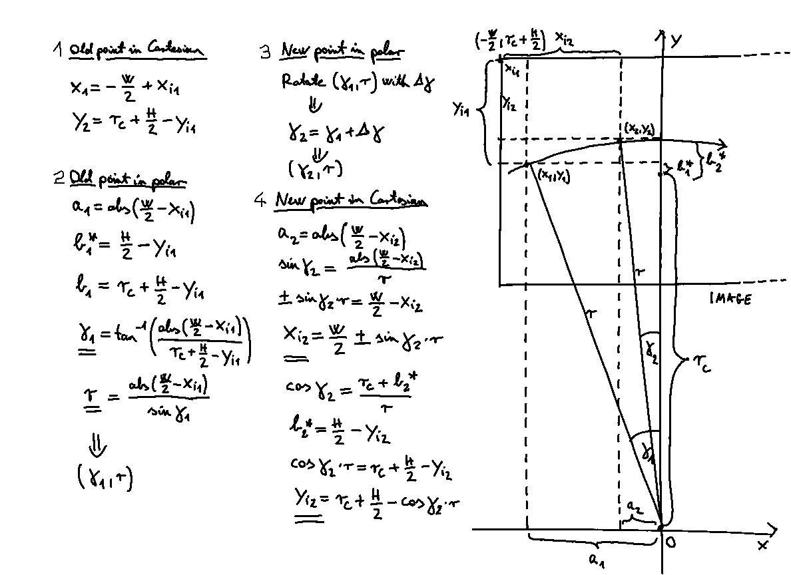
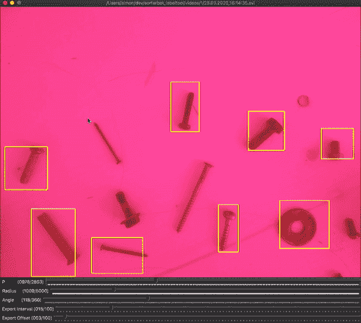
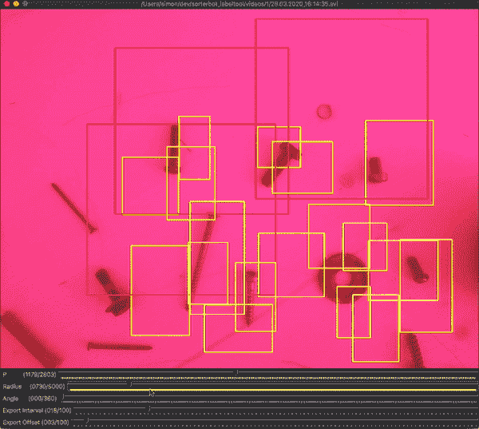
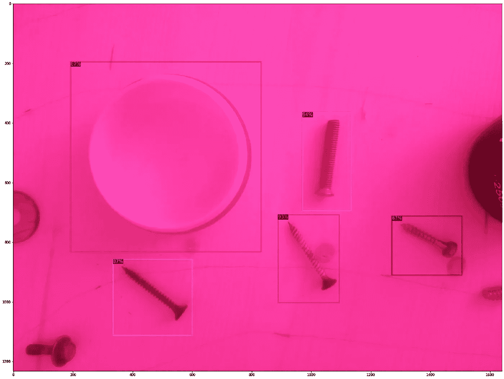

# 分拣机器人—第三部分

> 原文：<https://towardsdatascience.com/web-application-to-control-a-swarm-of-raspberry-pis-with-an-ai-enabled-inference-engine-part-3-77836f9fc4c2?source=collection_archive---------40----------------------->

*一个基于网络的解决方案，用于控制一群覆盆子 pi，具有实时仪表盘、深度学习推理机、一键式云部署和数据集标记工具。*

这是由三部分组成的 SorterBot 系列的第三篇文章。

*   [第一部分——项目概述和网络应用](https://medium.com/swlh/web-application-to-control-a-swarm-of-raspberry-pis-with-an-ai-enabled-inference-engine-b3cb4b4c9fd)
*   [第二部分——控制机械臂](https://medium.com/@simon.szalai/web-application-to-control-a-swarm-of-raspberry-pis-with-an-ai-enabled-inference-engine-part-2-73804121c98a)
*   第 3 部分—迁移学习和云部署

GitHub 上的源代码:

*   [控制面板](https://github.com/simonszalai/sorterbot_control) : Django 后端和 React 前端，运行在 EC2 上
*   [推理机](https://github.com/simonszalai/sorterbot_cloud):运行在 ECS 上的 PyTorch 对象识别
*   [树莓](https://github.com/simonszalai/sorterbot_raspberry):控制机械臂的 Python 脚本
*   [安装程序](https://github.com/simonszalai/sorterbot_installer) : AWS CDK、GitHub 动作和一个 bash 脚本来部署解决方案
*   [标签工具](https://github.com/simonszalai/sorterbot_labeltool):使用 Python 和 OpenCV 的数据集标签工具

# 推理机的迁移学习

所有的 Detectron2 模型都是在 ImageNet 上训练的，ImageNet 包括像人、狗、树等类别，但不包括小的金属物体，所以我需要定制训练模型来识别我想要使用的物体。为了节省训练时间和减少必要的数据集大小，我从预先训练的权重开始(迁移学习)。

## 创建数据集

对于我的用例，我需要几千张带标签的训练图片。在创建训练集时，我应用了两个策略来减少花费的精力。我的第一个想法是，我将录制一个视频，并从中抓取帧，而不是拍照。首先，我试图相对快速地移动手臂，但这样一来，大多数图像最终都很模糊，因为 Pi 相机在最大分辨率下只能提供 30 fps。为了克服这一点，我试图将手臂移动得更慢，但由于手臂的质量较差，这导致了不均匀、不平稳的运动。解决方法是移动手臂，等待一秒钟直到它稳定下来，然后进一步移动。由此产生的视频被用作我的数据集创建工具的输入。

为了减少用户必须绘制的边界框的数量，我计算了一个点在视频中出现的轨迹。

用于计算训练视频上项目的表观轨迹的绘图和方程(图片由作者提供)

最初，边界框是在笛卡尔坐标系中定义的，其原点在图像的左上角。这个计算的目标是在手臂旋转了**δγ**之后，检索一个点的新坐标。为此，我定义了两个额外的坐标系:一个极坐标系统和另一个笛卡尔坐标系。它们的两个原点都被定义为手臂的基轴，在这两个原点中，图像的中心点的坐标为(0，rc)，其中 rc 是特定于手臂的半径常数。

为了进行计算，首先我在新的笛卡尔坐标系中表示旧的点(图上的点 1)，然后将其转换为极坐标(点 2)。在我有了旧点的极坐标之后，我简单地把手臂的旋转加到它上面(点 3)，然后把它转换回原来的笛卡尔系统(点 4)。使用这种方法，我可以计算出物品在摄像机视口中移动时的表观轨迹。这种方法的好处是，我可以为每个视频绘制一个边界框，然后为其余的帧计算它的位置，而不是抓取每个帧并在其上手动绘制边界框。这将标注数据集所花费的时间减少了至少十分之一。

绘制边界框，然后在数据集标注工具上调整旋转滑块(图片由作者提供)

在数据集创建工具中，有两个滑块定义边界框的轨迹:半径(以像素为单位)和角度(以度为单位)。半径表示机器人的基轴和摄影机视口中心之间的距离。而角度代表最逆时针和最顺时针位置之间的角度。设置这些滑块定义了边界框的位置，因此用户应该找到边界框适合实际对象的值。首先，半径滑块的值应该是近似值，然后角度滑块应该移动，直到边界框处于正确的位置。

在数据集标注工具中调整角度和半径滑块(图片由作者提供)

另外两个滑块用来定义应该抓取哪些帧:间隔和偏移。用户应该以一种方式设置它们，以确保在手臂不移动时的短暂停顿中抓取帧。为了使这更容易，当当前帧被设置为抓取时，边界框的颜色将变为白色。

即使我想出了所有的软件技巧，一些图片还是模糊不清，或者边框放错了位置。为了避免这些出现在数据集中，我创建了另一个简单的工具，它允许我浏览整个数据集，并通过按键来保留或删除图像。这增加了数据集创建的时间，但也提高了结果的质量。验证后，创建的数据集由标记工具上传到 AWS S3 桶，以便于培训。

## 训练网络

培训是在 DeepNote 上进行的，使用的是[这个](https://beta.deepnote.com/project/c8dd74da-b3cc-415c-a801-364e8433357a)笔记本。我基本上遵循了 Detectron2 文档中描述的标准训练程序。作为我的第一次尝试，学习率为 2.5e-4，批量大小为 512，训练花费了大约 5 分钟，在 600 次迭代后停止。这导致平均精度(AP)为 33.4，明显低于在 ImageNet 上测量的相同网络的基准 AP(40.2)，但我使用这些权重测试了应用程序，它工作得非常好，即使对象不在训练数据集中。这样做的原因大概是用磁铁抓取一个物品并不需要很大的精度，基本上，如果磁铁接触到物品的任何地方，它都可以捡起来。这意味着即使边界框偏离了很大一部分，磁铁仍然可以完成它的工作。最有可能的是，我可以通过更长的训练、更多的数据和超参数调整来显著提高精度，但为了避免试图修复没有损坏的东西的错误，我决定将我的努力集中在其他地方。

训练结束后，我将网络设置为推理模式，并使用验证集中的一些图片来可视化网络的表现。

可视化的预测边界框(图片由作者提供)

正如您在上面的图片中看到的，所有的物品和容器都以相对较高的置信度(87–94%)被识别，这远远高于我定义的 70%的阈值。左下角的螺钉无法识别，因为它的边界框会在图片之外。这是有意的，我从训练集中移除了每个这样的边界框，以避免边界框的中心发生位移，因为它被裁剪以适应图片。您还可以注意到，螺钉周围留有一些衬垫，这也是有意为之。我决定在物体周围画稍微大一点的边界框，以适应不完美的硬件造成的小偏差。由于磁铁被移动到边界框的中间，只要填充均匀分布在对象周围，这不会阻止手臂拾取对象。

最后，训练好的权重被上传到另一个 AWS S3 桶，GitHub Actions CI 管道可以方便地访问它们。

# 部署到 Amazon Web 服务

为了将整个解决方案部署到 AWS，必须创建和配置 43 个资源。首先，我使用 AWS 控制台手动完成了它，还编写了一个[逐步指南](https://github.com/simonszalai/sorterbot_installer/blob/master/MANUAL_DEPLOY.md)来跟随。该指南有 100 个步骤，手动完成所有步骤大约需要 3 个小时，这给错误留下了很大的空间。为了确保没有人(包括我)必须再次经历这个过程，我决定利用 [AWS CDK](https://aws.amazon.com/cdk/) 和一个冗长的 [bash 脚本](https://github.com/simonszalai/sorterbot_installer/blob/master/scripts/deploy_prod.sh)来自动化部署。CDK(云开发工具包)允许用户使用传统的编程语言来定义、配置和部署 AWS 资源。目前支持 Javascript、Python、C#和 Java，我选择 Python。bash 脚本用于编排流程，也用于管理秘密，因为 CDK 不支持该功能。

## 自动化部署

在 sorterbot_installer 存储库中，有两个 CDK 堆栈:一个用于开发，一个用于生产。开发堆栈是生产的子集，它提供 S3 桶和 PostgreSQL 实例，因此解决方案的全部功能也可以在开发模式下访问。除此之外，生产栈还包括一个 EC2 t2.micro 实例(包含在自由层中)来运行 SorterBot 控制面板，一个 ECR 存储库来存储推理引擎的 Docker 图像，一个 ECS FarGate 集群来部署推理引擎，以及这些组件协同工作所需的一些附加基础设施，如 VPC、安全组和 IAM 角色/策略。还包括用于部署和销毁开发和生产版本的脚本。开发脚本主要是生产脚本的子集，所以我不会在这里详细描述它们。部署到生产环境时，脚本执行以下步骤:

*   环境变量是从。env 文件和一些其他变量是显式设置的。必须由用户设置的环境变量如下:AWS 帐户 ID、GitHub 用户名、GitHub 个人访问令牌、训练模型权重的 S3 URL 以及用于登录控制面板的用户/密码组合(也用作 Django 管理凭证)。除此之外，将部署解决方案的 AWS 区域是从本地系统的默认配置文件中检索的，可以使用“aws configure”命令进行设置。
*   为了存储机密，使用 AWS 简单系统管理器(SSM)的参数存储。这是一个免费的选项(相对于 AWS Secrets Manager，每个秘密每月花费 0.40 美元)，如果选择 SecureString 选项，秘密将被加密存储。
*   AWS CLI 用于创建一个 SSH 密钥对，稍后可用于访问已部署的 EC2 实例。
*   授予 GitHub 操作工作流对 AWS 帐户的访问权限。为此，首先创建一个 AWS IAM 用户，然后将一个提供必要权限的策略附加到该用户。最后，为这个用户创建一个访问密钥，使用 GitHub API 将它作为 GitHub 秘密保存到 sorterbot_cloud 存储库中。
*   CDK 部署生产堆栈，它提供和配置上述所有资源。
*   检索新创建的 EC2 实例的主机，并通过 SSH 在其上执行 bash 脚本，以安装运行控制面板所需的依赖项:Git LFS、Python、Docker、Docker Compose 等。
*   安装完依赖项后，控制面板的 Docker 映像就构建好了。
*   为了避免使用密码作为 Docker 构建参数时出现的安全问题，Django 迁移和用户创建在 Docker 之外执行。为此，requirements.txt 中列出的 pip 包也安装在 Docker 容器之外。
*   设置控制面板时，在 sorterbot_cloud repo 中创建了一个新的版本，它触发了 GitHub Actions 工作流，该工作流将推理引擎的 Docker 映像部署到 ECS。
*   最后，在创建了发行版之后，控制面板开始使用 Docker Compose。DNS 地址被打印到日志中，用户可以使用。部署前的 env 文件。

## 部署推理引擎的 CI 工作流

将推理引擎部署到 AWS ECS 的 CI 工作流被定义为 GitHub 动作。它可以通过在 GitHub repo 中创建一个新版本来触发，这是在生产部署脚本运行时自动完成的。工作流首先检查主分支，使用 flake8 链接它，安装依赖项(或者如果 requirements.txt 文件没有改变，从缓存中加载它们)，然后使用 pytest 运行测试。如果所有测试都通过了，部署就开始了。

首先，通过 Git LFS 检查主分支，因此如果没有提供模型权重 URL，可以使用默认的样本权重，这些权重被提交给存储库。然后，下一个操作配置 AWS 凭证，这些凭证用于登录 ECR。之后，Docker 映像被构建、标记并推送到 ECR。接下来，创建任务定义的新版本，最后，部署任务定义。使用此工作流可以轻松替换模型权重。在新的权重被上传到适当的 S3 存储桶之后，只需要创建一个新的发布，Github Actions 会自动部署它，无需用户进一步输入。

# 结论和未来工作

在这个项目中，我构建了一个易于部署和管理的 web 应用程序。它可以控制任意数量的机械臂。目前的架构可能可以处理同时运行的几个分支，但如果超过这一水平，由于缺乏适当的多处理，很可能会导致严重的延迟。因为在这个项目中，我的目标不是处理许多 arm，而且我不想花钱购买具有 1 个以上内核的更强大的 ECS 实例，所以我没有太关注扩展推理引擎。由于它部署在 ECS 上，因此通过设置自动扩展或将图像处理转移到每个图像的单独流程，以及购买多核实例，可以轻松实现可扩展性。

到目前为止，最大的问题是机械臂的低质量。为了避免它的缺点，我在软件中实现了一些额外的逻辑，如果使用高质量的 arm，可以省略这些逻辑。此外，神经网络的准确性仍然可以提高，但由于硬件的准确性受到严重限制，致力于改善模型可能不会导致太多的整体改善，如果有的话。

下一步，我计划用 3D 打印技术自己制造一个机器人手臂。高精度 3D 打印变得非常实惠，Elegoo Mars 树脂打印机的价格不到 400 美元，精度不到 50 微米。结合创成式设计，就像 [Autodesk](https://www.autodesk.com/solutions/generative-design) 提供的设计，一个精确、轻便、看起来像有机体的机械臂就能被制造出来。

另一个限制是抓握:使用磁铁会限制手臂抓握金属物体。为了解决这个问题，可以使用另一种抓取机制，像【Festo 的这个(灵感来自变色龙抓住猎物时的舌头)。

感谢您的阅读，如果您有任何问题、意见或建议，请告诉我！