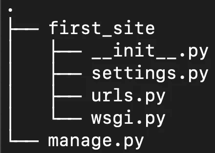
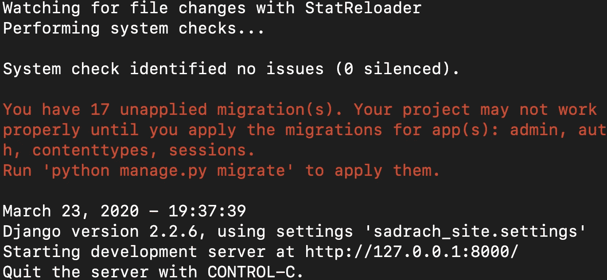
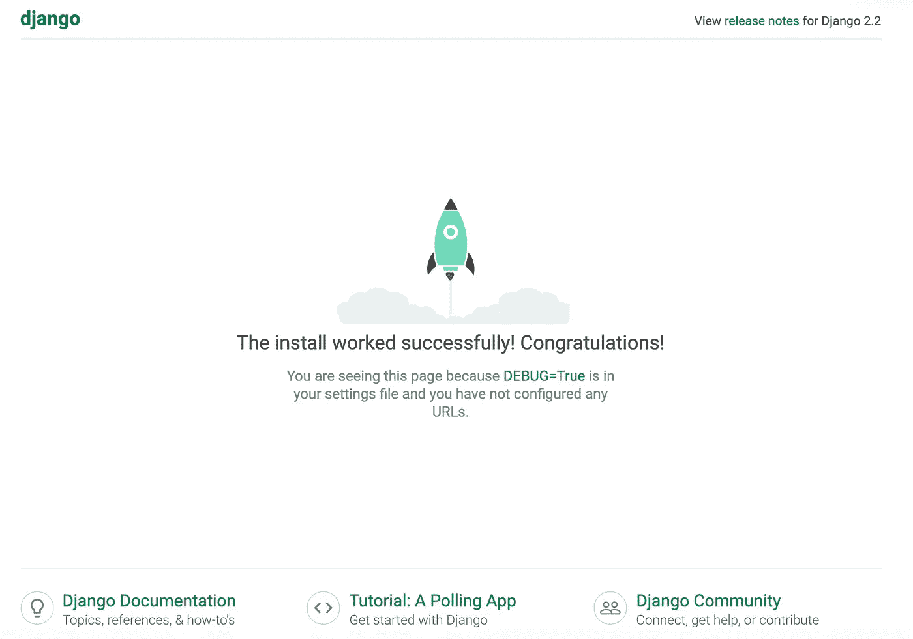
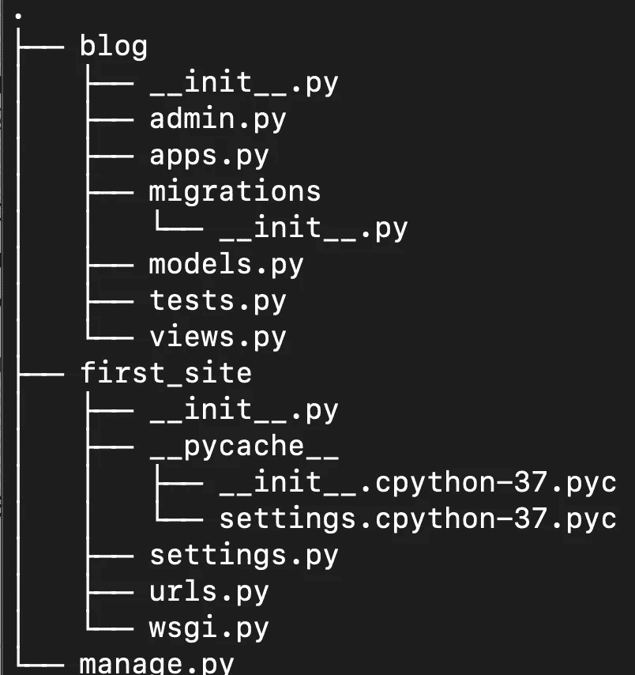
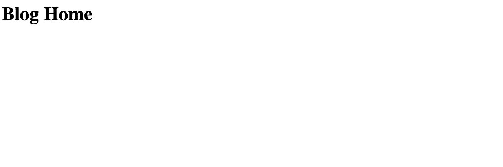
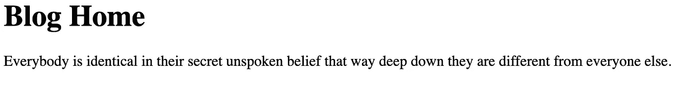
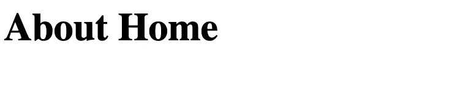

# Python 中的 Web 应用程序

> 原文：<https://towardsdatascience.com/web-applications-in-python-a1a7edcb5b9e?source=collection_archive---------8----------------------->

## Django 入门


[来源](https://www.pexels.com/photo/five-bulb-lights-1036936/)

Django 是一个基于 python 的开源 web 框架，可以轻松创建数据库驱动的网站。使用 Django 的网站包括 Instagram、Mozilla 和 Bitbucket。

在这篇文章中，我们将介绍用 Django 构建一个简单的 web 应用程序的步骤。Django 的文档可以在[这里](https://docs.djangoproject.com/en/3.0/)找到。

我们开始吧！

我们需要做的第一件事是确保我们已经安装了 Django。要安装 Django，打开终端并执行以下 pip 命令:

```
pip install django
```

然后我们可以显示 Django 的版本:

```
python -m django --version
```

在我写这篇文章的时候，我使用的版本是 2.2.6。现在，让我们在桌面上创建一个名为“first_site”的新目录:

```
mkdir first_site
cd first_site
```

让我们在“first_site”文件夹中创建 Django 项目:

```
django-admin startproject first_site
```

我们可以看看创建的文件的结构，我们看到:



我们有一个“manage.py”文件和一个 Django 项目目录“first_site”。“manage.py”文件是命令行实用程序，它允许我们执行管理任务。

' __init__ '“py”文件是一个空文件，它告诉 python 我们的应用程序是一个 python 包。“setting.py”文件允许我们更改设置和配置。“url.py”允许我们指定从 url 到我们将用户发送到的位置的映射。“wsgi.py”用于允许我们的服务器和 web 应用程序之间的通信。

现在，让我们打开每个新项目的默认网站。在我们的终端中，我们运行:

```
python manage.py runserver
```

我们应该看到以下内容:



我们看到我们的网站正在运行。我们可以通过“http://127.0.0.1:8000/”访问我们的网站，这对应于我们的本地计算机。我们应该看到以下内容:



这是 Django 为我们创建的默认网站。Django 框架背后的思想是，在创建一个网站项目时，它本身就是一个应用程序，我们可以在我们的 web 应用程序中创建额外的应用程序。你可以把每个应用程序想象成我们网站上它自己的部分，比如博客部分、商店部分等等。这个框架的好处在于，在创建应用程序时，您可以在后续的 web 应用程序中重用代码。

我们将继续为我们的网站创建一个博客应用程序。首先，按“control”+“C”来关闭运行我们的 web 应用程序的服务器:

接下来，为了创建我们的博客应用程序，我们要做以下事情:

```
python manage.py startapp blog
```

我们可以在创建新应用程序时查看我们的项目结构:



现在，让我们进入博客目录，打开“views.py”文件。我们应该看到以下内容:

```
from django.shortcuts import render# Create your views here.
```

让我们也导入 HttpResponse。让我们也创建一个名为“home”的新功能，它将允许我们处理来自我们博客主页的流量:

```
from django.shortcuts import render
from django.http import HttpResponsedef home(request):
    return HttpResponse('<h1>Blog Home</h1>')# Create your views here.
```

接下来，我们需要将我们的 url 模式映射到这个‘view’函数。我们转到我们的博客应用程序目录，创建一个名为“urls.py”的新文件。在该文件中，我们复制并粘贴以下内容:

```
from django.urls import path
from . import viewsurlpatterns = [
path('', views.home, name='blog-home'),
]
```

现在我们有了一个映射到视图文件中 home 函数的博客主页的 url 路径。

为了充分发挥作用，我们需要修改主项目目录“first_site”中的“urls.py”模块。这个模块告诉我们的网站哪些网址会把我们发送到我们的博客应用程序。

让我们打开“first_site”目录中的“urls.py”文件:

```
from django.contrib import admin
from django.urls import pathurlpatterns = [
path('admin/', admin.site.urls),
]
```

我们看到有一条路由映射到我们的管理站点 URL。我们现在需要指定映射到我们博客 URL 的路由。我们需要从 django.urls 导入 include 函数，并为我们的博客 url 添加一个额外的路径:

```
from django.contrib import admin
from django.urls import path, includeurlpatterns = [
path('admin/', admin.site.urls),
path('blog/', include('blog.urls'))
] 
```

现在让我们试着运行服务器。在尝试运行服务器时，我经常遇到以下错误:


要解决此问题，请执行:

```
ps -ef | grep python
```

并使用以下命令终止适当的进程:

```
kill -9 procees_id
```

现在尝试运行服务器:

```
python manage.py runserver
```

如果我们键入 http://127.0.0.1:8000/blog/我们应该会看到以下内容:



我们可以进一步编辑博客主页的内容。让我们引用我最喜欢的小说之一，戴维·福斯特·华莱士的《无限玩笑》:

```
from django.shortcuts import render
from django.http import HttpResponsedef home(request):
    return HttpResponse('<h1>Blog Home</h1><p1>Everybody is identical in their secret unspoken belief that way deep down they are different from everyone else.</p1>')
```



我们还将为我们的博客添加一个关于页面。在“views.py”模块中，让我们定义一个名为“about”的函数:

```
from django.shortcuts import render
from django.http import HttpResponsedef home(request):
    return HttpResponse('<h1>Blog Home</h1><p1>Everybody is identical in their secret unspoken belief that way deep down they are different from everyone else.</p1>')def about(request):
    return HttpResponse('<h1>About Home</h1>')
```

现在，让我们在博客应用程序的“urls.py”模块中为“关于”部分添加一个新路径:

```
from django.urls import path
from . import viewsurlpatterns = [
path('', views.home, name='blog-home'),
path('about/', views.about, name='blog-about')
]
```

现在如果我们去[http://127 . 0 . 0 . 1:8000/blog/about](http://127.0.0.1:8000/blog/about)我们应该会看到:



我将在这里停下来，但是您可以随意摆弄博客主页的内容以及我们的 web 应用程序的各个部分。此外，了解 Django 的一个很好的资源是科里·斯查费的 YouTube 教程，你可以在这里找到。

# 结论

总之，在这篇文章中，我们讨论了如何使用 Django 构建 web 应用程序和定义 url 路由。首先，我们讨论了用 Django 创建新的 web 应用程序时生成的特定文件。然后，我们在项目中创建了一个博客应用程序，并定义了视图函数，这允许我们指定用户看到的内容。我们还展示了如何在我们的博客应用程序中添加额外的 url 路由和视图。我希望你觉得这篇文章有用/有趣。感谢您的阅读！