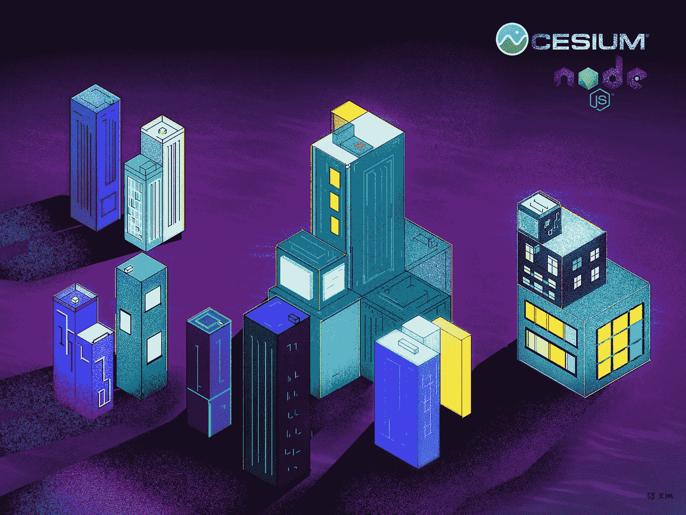
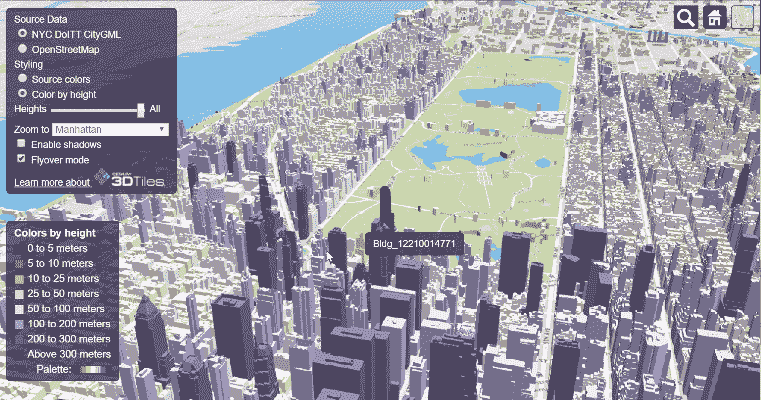
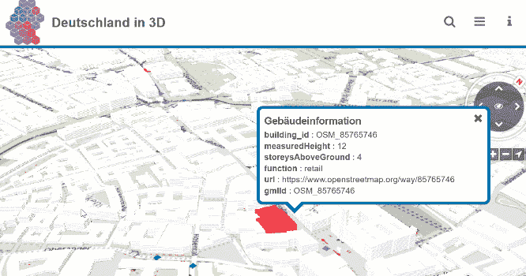
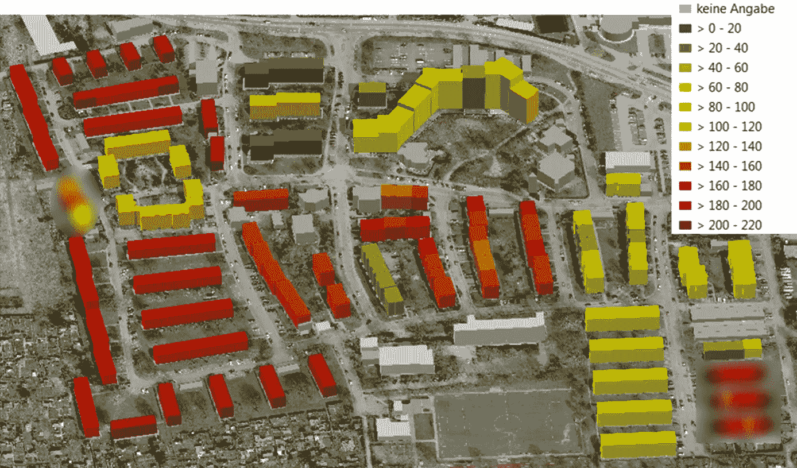
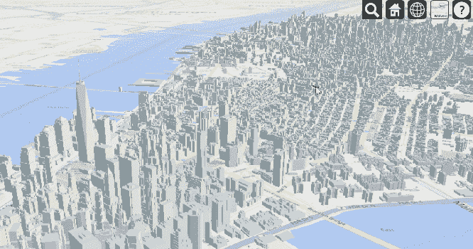

# 利用 CityGML 城市模型实现基于 Web 的三维数据可视化

> 原文：<https://towardsdatascience.com/web-based-3d-data-visualization-with-ciytgml-city-models-f0796b37e9f5?source=collection_archive---------26----------------------->

## 3D 数据可视化基本指南

## 分步指南-可视化纽约市曼哈顿的 3D 城市模型



插图作者:金彩云

在这篇文章中，我将向您展示一种在基于 web 的应用程序上使用 **Node.js** 和**铯. js** web globe 库可视化 **CityGML** 3D 城市模型的简单方法，并以**曼哈顿**、**纽约市区域**为例。在本简短教程结束时，您将能够构建一个看起来或多或少像这样的 web 应用程序:



关于铯应用的纽约曼哈顿 3D 城市模型(现场演示:[铯](https://demos.cesium.com/NewYork/)

# CityGML 简介

在我们开始之前，我想向您介绍一下 **CityGML** 3D 城市模型。 **CityGML** 是一种开放的标准化数据模型和交换格式，用于存储 OGC(开放地理空间联盟)推出的城市和景观的数字 3D 模型。CityGML 的特殊之处在于它是一个语义城市模型，包含属性和几何数据。



CityGML 德国慕尼黑带有属性数据的语义 3D 城市模型。(现场演示:[3D 德国](https://deutschland.virtualcitymap.de/)

CityGML 模型的几何形状和属性允许各种模拟建筑能源需求、光伏潜力等等。



使用 CityGML 对德国路德维希堡—格伦布尔的建筑能源需求进行建模的示例(能源建模使用 [SimStadt2](http://www.simstadt.eu/en/examples.jsp) 软件进行计算)

好消息！！世界上有几个城市有自己的 CityGML，其中许多城市都以开源数据集的形式提供了它们的 CityGML。

# 从 CityGML 构建基于网络的 3D 应用程序

## 1.准备 3D 数据集

纽约市 DoITT 以 CityGML 格式发布了纽约市的语义 3D 城市模型，包括纽约市的每一栋建筑。在这里随意下载[。从这个数据集中，我们将只关注曼哈顿地区(*DA12 _ 3D _ Buildings _ merged . GML*~ 48，000 栋建筑)，并使用它来创建 3D web 应用程序。](https://www1.nyc.gov/site/doitt/initiatives/3d-building.page)

虽然 CityGML 适合交换和存储 3D 建筑模型，但它不能直接在 web 上可视化。因为我们将在我们的 web 应用程序中使用铯，所以我们需要将 CityGML 转换为 3D Tiles 格式。FME 工作台是我所知道的最好的工具，对学生和开源研究项目也是免费的。

或者，你可以跳过这一步，从下面我的 GitHub 项目中下载已经转换好的 3D 图片。

## 2.设置 Web 服务器

对于 web 服务器，使用以下依赖项创建一个项目文件夹和 Node.js 项目:

```
$ **npm init** #initiate node project
$ **npm install express** #install express framework
$ **npm install compression** #install compression 
```

然后，用 Express 为 Node.js 创建一个简单的 *server.js* 文件。

带有 Express Framework 的简单 Node.js 示例

您可以通过`$ node server.js`命令来试运行您的服务器。

## 3.使用 CesiumJS 的 3D 应用程序

我们将使用 CesiumJS 来渲染我们的 3D 建筑模型。这是一个开源的 JavaScript 库，用于 web 浏览器中的 3D 地球仪和 2D 地图。

现在，让我们在`public`文件夹中创建一个*index.html*文件，并放置以下代码:

index.html(用于铯 3D 纽约应用)

这个 HTML 基本上从 cesium.com 加载铯依赖项，并创建一个铯容器。变量`tileset`通常指的是 3D 瓦片数据集。只需在此处用您的本地零件替换`url`值即可转换为 3D 图块。搞定了。

从这里，当你运行`$ node server.js`并前往`http://localhost:3000`，你已经可以看到曼哈顿的 3D 模型了。如果你想要一些建筑模型的颜色/样式，可以通过 tileset 样式添加。下面的示例脚本显示了如何基于建筑高度设置建筑模型的样式。

colorbyHeight.js(按建筑高度设置 3D 图块样式)



耶！我们对纽约城市模型的最终应用

差不多就是这样！我为挑选功能添加了一些代码，如果你感兴趣，可以从我的 GitHub 这里查看全部代码:

[](https://github.com/JoeThunyathep/NYC3D_CesiumJS) [## JoeThunyathep/NYC3D_CesiumJS

### 纽约市三维城市模型。在…上创建一个帐户，为 JoeThunyathep/NYC3D_CesiumJS 的发展做出贡献

github.com](https://github.com/JoeThunyathep/NYC3D_CesiumJS) 

# **奖金**

如果你想继续开发这个应用程序，你可以用铯和 3D 城市模型做更多很酷的事情。请在此查看一些资源:

*   **CesiumJS** API 文档:[链接](https://cesium.com/docs/cesiumjs-ref-doc/) /一些好看的展示:[链接](https://www.cesium.com/blog/categories/userstories/)
*   掌握你的**铯式表情**文档:[链接](https://github.com/CesiumGS/3d-tiles/tree/master/specification/Styling)
*   **开放 CityGML 数据**
    -美国纽约市所有建筑的 CityGML【LOD 2】([链接](https://www1.nyc.gov/site/doitt/initiatives/3d-building.page) )
    -美国所有建筑的 City GML！！！！【LOD 1】([链接](https://github.com/opencitymodel/opencitymodel) )
    -德国北莱茵-威斯特伐利亚州所有建筑的 CityGML【LOD 1，2】([链接](https://www.opengeodata.nrw.de/produkte/geobasis/3dg/))
    -TU-Delft 多个城市开放 CityGML 数据列表([链接](https://3d.bk.tudelft.nl/opendata/opencities/) )
    )【无 city GML，无忧。查看 FME 的《城市地图指南》
*   **3DCityDB** :开源地理数据库，用于存储、表示和管理虚拟 3D 城市模型:([链接](https://www.3dcitydb.org/3dcitydb/))
*   更多关于 OGC**city GML**的信息([链接](https://www.ogc.org/standards/citygml))
*   **真实世界应用**:请查看 VCS 公司提供的使用铯+ CityGML( [链接](https://www.virtualcitysystems.de/en/))的智能 Cites 解决方案

# 作者消息:

总的来说，本教程涵盖了使用铯. js 和 3D 城市模型创建 3D 基于 web 的应用程序的基础。我希望你喜欢这篇文章，并发现它对你的日常工作或项目有用。

关于我&查看我所有的博客内容:[链接](https://joets.medium.com/about-me-table-of-content-bc775e4f9dde)

安全**健康**健康**！💪**

**感谢您的阅读。📚**