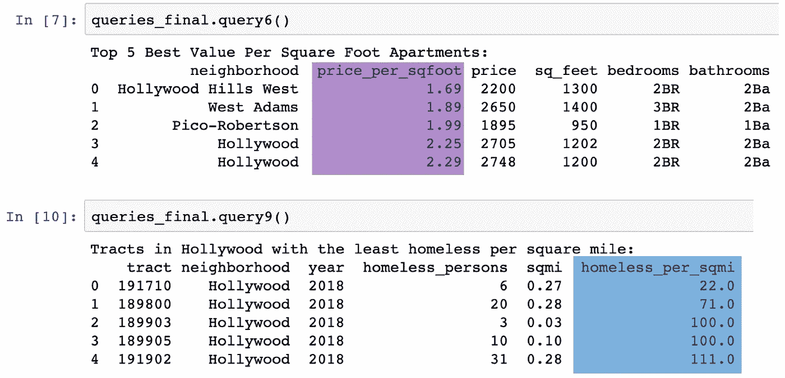

# 带有洛杉矶公寓和社区搜索工具的网络搜索工具

> 原文：<https://towardsdatascience.com/web-scraper-with-search-tool-for-los-angeles-apartments-neighborhoods-4b1958ef7500?source=collection_archive---------40----------------------->


概念验证公寓和邻居指标

作为一名洛杉矶的常住居民，我发现在这个城市找到符合你要求的出租房可能会很棘手。在像 Craigslist 和 apartments 这样的网络数据库中，帖子包含了关于公寓本身的丰富信息。然而，**缺少邻居数据…** 为了全面了解公寓邻居，用户必须建立单独的邻居数据库，并手动交叉引用公寓列表。另一个障碍是，像 Craigslist 和 Apartments.com**这样的网站不提供每套公寓的指标**或邻居基准，这使得用户在选择他们在洛杉矶想要的公寓和邻居时，无法做出**完全知情的**决定

## 拟议解决方案

为了解决洛杉矶出租房屋信息的缺口，我创建了一个 **Craigslist 公寓搜索工具和增强的搜索工具**。该项目使用 Python & SQLite 构建，将洛杉矶 Craigslist 公寓与社区经济和无家可归者指标相结合。概念验证(POC)现已在我的 Github 页面上提供用户友好的指南- > [**此处**](https://github.com/mann-brinson/LA_Apartments_Scraper) 。

POC 目前包括:

*   **Python 脚本的存储库**，它执行 web 抓取、数据库生成和测试查询。
*   **Python Jupyter Notebook** ，它显示查询结果、一些简单的生成指标散点图，以及对这些指标的数据进行排序的可能性

下面我将提供 python 代码每个组件设计背后的一些细节，突出优点和缺点。该项目基于 2019 年秋季南加州大学维特比工程学院应用数据科学硕士项目的一门课程的作业，由 Jeremy Abramson 教授提供建议。我也从 Julio Malegria 的 [python-craigslist 模块](https://github.com/juliomalegria/python-craigslist)和 [Riley Predum](https://medium.com/u/9c5141816177?source=post_page-----4b1958ef7500--------------------------------) 的 [Craigslist 网页抓取教程](/web-scraping-craigslist-a-complete-tutorial-c41cea4f4981)中获得了灵感。我从这些已有的知识中学到了很多，并希望能在此基础上更上一层楼！

## 脚本驱动程序

为了给 python 脚本和结果数据库创建一些组织，我用两个子文件夹构建了存储库:

*   **src** —保存用于生成数据库的所有脚本，包括:驱动文件、python 模块需求、公寓刮刀、邻居刮刀和测试查询
*   **数据** —保存 SQLite 数据库，该数据库包含公寓和邻居抓取脚本的结果


python 脚本、数据、查询和图形的报告结构

## 使用驱动程序获取数据

下载存储库并导航到终端内的“src”文件夹后，用户可以使用远程或本地数据调用驱动程序文件“LA_Apartment_Analysis.py”。可以输入的两个命令是:

```
$ python3 LA_Apartment_Analysis.py local
$ python3 LA_Apartment_Analysis.py remote
```

*   **本地** —用本地数据库(缓存)运行程序，如果有的话。如果本地数据库不存在，您将需要远程运行程序，以便在分析(也称为查询)完成之前生成一个本地数据库。
*   **remote** —首先从‘neighborhoods _ API . py’和‘apartments _ scrape . py’中的远程 web 源创建数据库，然后运行程序。

从命令行调用的驱动程序文件“LA_Apartment_Analysis.py”，用于调用抓取器和查询

## Craigslist 网页抓取

司机调用公寓抓取器‘apartments _ scrape . py’后，Craigslist 公寓抓取就开始了。代码被彻底地注释了，所以人们可以在那里回顾每一步，但是我在下面强调了 scraper 的主要步骤。这里使用的主要 python 库是:requests、BeautifulSoup、pandas 和 sqlite3。

**步骤 1:创建一个 craigslist 公寓搜索查询，并获得所有公寓链接的列表。**

为了验证概念，我的默认搜索是洛杉矶有照片的公寓，今天发布的租金价格在 1800-2800 美元之间，距离邮政编码 90036(贝弗利-费尔法克斯区)3 英里。如果用户的查询有超过 120 个结果，应该激活第 201–212 行，以便从包含许多公寓列表的多个页面中获取链接。

get_link_list(url_query)生成包含嵌入公寓链接的 html 对象列表

**步骤 2:对于每个公寓链接，从链接的 html 对象中解析公寓属性，并存储在字典列表中。**

名为‘process _ links(link _ list)’的函数获取每个链接，并发送一个对该链接的 html 对象的请求。请求成功完成后，代码提取嵌入在 hmtl 对象中的有意义的公寓属性，比如:卧室、浴室、价格、平方英尺、纬度和经度。

在当前代码中，大约 70–80%的公寓列表的公寓抓取是成功的。如果一个单元属性不能被抓取，代码继续尝试抓取下一个单元。这就是为什么我们在处理请求时实现了大量的异常处理。在未来的迭代中，我希望将所有公寓房源的成功率提高到 100%。

处理链接的速度可以接受，但是速度可以通过 [**python 并发**](https://realpython.com/python-concurrency/) 来提高。使用 python 实现并发性将允许在同一台计算机的多个处理器中同时执行任务。这应该是提高处理速度的可行途径，但我们也必须尊重 Craigslist 的限速政策，以避免该网站可能维持的任何 IP 禁止政策。

process_links(link_list)接受一个链接列表，并为每个单元链接创建一个一行的单元属性表

**步骤 3:对于每个公寓纬度&经度，获取人口普查区域 ID。**

这一步对于实现到洛杉矶邻居表的连接至关重要。为此，我们必须在一个 GET API 请求中向 geocoding.geo.census.gov 发送每个公寓的纬度和经度。由于 census 提供的这个 API 的性能较慢，这个步骤比 Craigslist 抓取花费的时间要长得多…在未来的版本中，我将实现一些 python 并发来减少处理时间。这仍然不会对人口普查地理编码器 API 的缓慢产生影响。

request _ tractid(apt _ tractid _ URL _ list)接受一个人口普查 api urls 列表，并返回具有 apartment tract_id 的相关 json 对象。

步骤 4:在 SQLite 表中存储公寓属性和人口普查区域 id。

为了序列化收集的数据，代码获取字典列表，并将它们转换成 pandas 数据帧。接下来，代码移动到/data 存储库中，并创建名为“la_apartments.db”的 SQLite 数据库和一个名为“apartment”的表。最后，公寓数据帧的每一行都被复制到“公寓”表中。

存储熊猫数据帧中的公寓表

## 洛杉矶邻里 API

在这一步中，我们使用“neighborhoods_api.py”脚本构建一个邻域表。邻域表将包含每年每个人口普查区域 ID 的一行。邻域属性从两个独立的站点获取，都是通过 **API 功能**。由于这些站点提供 API 服务来获取数据，因此创建“邻居”表所需的时间比创建“公寓”表要少得多。

用于收集邻域数据的两个来源如下:

*   **洛杉矶市—** 该站点包含基本的社区属性，如 TRACT_ID、COUNTY、YEAR、POPULATION。到数据集和 API 文档的链接是 [**这里是**](https://geohub.lacity.org/datasets/enriched-la-county-census-tracts-2015/data?geometry=-118.704%2C33.941%2C-117.894%2C34.140)
*   **南加州大学社会创新价格中心—** 该网站包含一系列不同的社区数据集，按人口普查区域 ID 排列。使用的主要数据集:平均租金价格数据集— [**此处**](https://usc.data.socrata.com/Los-Angeles/Rent-Price-LA-/4a97-v5tx)；无家可归数据集— [**此处**](https://usc.data.socrata.com/Los-Angeles/Homelessness-LA-/e7n7-i6jm)

通过 API 收集邻域数据后,“neighborhoods_api.py”使用 pandas 来转换数据，以组合来自三个来源的属性。然后，该表作为“邻居”表写入 SQLite 数据库。

存储熊猫数据帧中的邻居表

## 查询和散点图

在数据库中创建了“公寓”和“邻居”表之后，驱动程序从“查询 _ 来自 _ 终端. py”中调用测试查询。结果显示在终端中，显示一些关于关系数据库的基本查询。

如果用户愿意，他们可以通过 Jupyter 笔记本“mann_mark.ipynb”查看查询结果和一些额外的散点图。查询和绘图提供了对公寓搜索过程至关重要的先前未回答的问题的洞察力。最终，这个数据库和查询可以构建到单页面 web 应用程序中的交互式搜索工具中。



来自 Jupyter 笔记本“mann_mark.ipynb ”,显示计算指标，如“价格每平方英尺”和“无家可归者每平方英尺”


散点图展示了如何根据计算出的指标可视化公寓数据

## 未来版本

将来，我希望创建一个连接到这个公寓和邻居数据库的 web 应用程序。在 web 应用程序中，用户可以查询他们自己对洛杉矶公寓的偏好。将有一个选项供用户设置重复工作(每天，每周，每月)和发送电子邮件时，数据被刷新。还可以选择从数据库下载标准化报告，或者公寓和邻居表本身。

突出显示人口普查区域和公寓位置的地图工具也会有所帮助。在这个工具中，用户可以根据邻居的度量标准，比如每平方英里无家可归的人数，来给邻居着色。下面是一个工具的例子，我想在未来创造。


每平方英里的无家可归者地图，每个区域 id。使用 datawrapper [ [链接](https://datawrapper.dwcdn.net/e1Wqn/1/)创建的映射

如果你已经做到这一步，感谢你的阅读！我乐于接受问题、评论或反馈。

*原载于 2020 年 1 月 9 日*[*【https://medium.com】*](https://medium.com/@mann.brinson/web-scraper-with-search-tool-for-los-angeles-apartments-neighborhoods-c218835eff2a)*。*