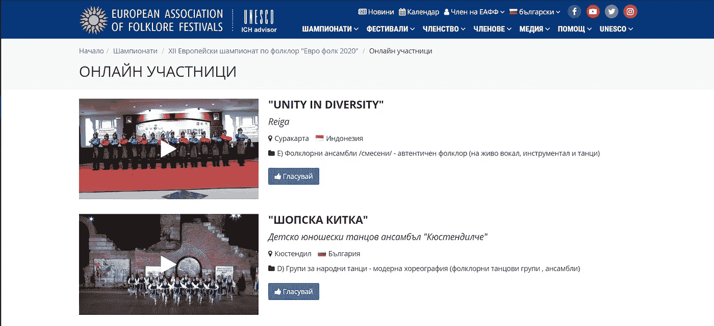
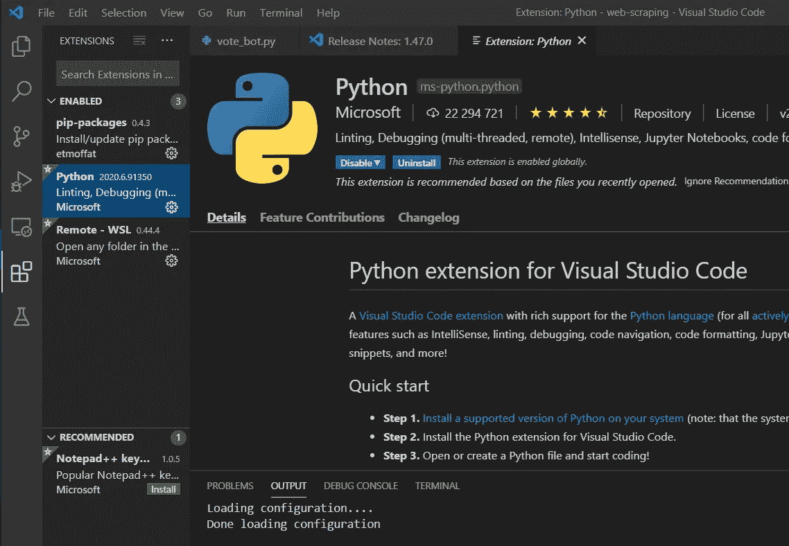
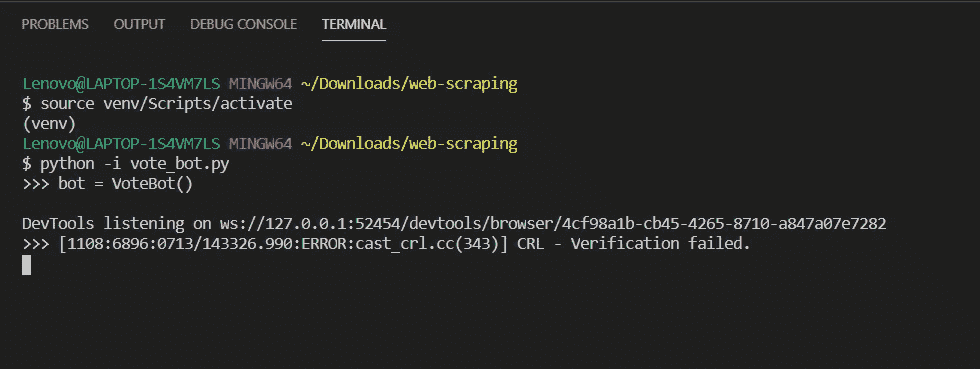
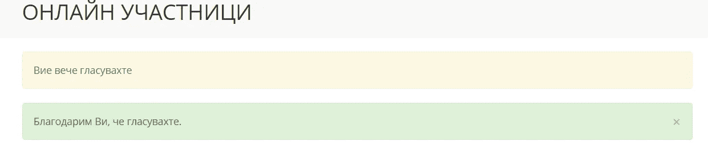

# 网页抓取 101

> 原文：<https://towardsdatascience.com/web-scraping-101-d9170e880117?source=collection_archive---------11----------------------->

## 如何制作一个简单的机器人在任何投票或竞争中获胜


[斯科特·格雷厄姆](https://unsplash.com/@sctgrhm?utm_source=medium&utm_medium=referral)在 [Unsplash](https://unsplash.com?utm_source=medium&utm_medium=referral) 上拍照

**网络抓取**是一个在网上检索数据和执行特定操作的过程。它通常由机器人来完成，以便自动化某些重复的任务。这是一个相当大的研究领域，你可以用它做很多有趣的事情。开始并不一定是缓慢和困难的。在本文中，我将向您介绍一个创建机器人的简单过程，以及将来如何对其进行扩展。不需要以前的经验，只需要 Python 和互联网连接。

# 入门指南

本教程适用于任何编程水平的初学者，所有内容都将尽可能清晰明了地解释。我将使用一个随机的民俗比赛来演示投票。你可以使用任何你喜欢的网站，并在此基础上进行调整。



(作者截图)

在直接进入编码之前，我们必须设置两件事情。

## 第一步。安装 IDE

首先，我们需要一个地方来写代码，如果你还没有的话。我更喜欢使用 **Visual Studio 代码**,因为它简单并且提供你需要的任何东西。只需搜索“Visual Studio 代码”并下载最新版本。

安装完成后，单击扩展按钮并安装 Python。



(作者截图)

## 第二步。下载 ChromeDriver

我们需要一个模块，能够与谷歌浏览器。这一步相当短。搜索“ChromeDriver Chromium”并下载最新版本。下载完成后，解压文件。

*对于 Windows，*复制文件，创建一个文件夹，如“C:\webdrivers”并放在那里。现在，转到路径设置，并在那里添加文件夹路径(如果你不知道这是在哪里，在谷歌有大量的解释)。

*对于 Mac 和 Linux，*打开终端并键入

```
mv ~/Downloads/chromedriver /usr/local/bin
```

# 制作机器人

## 第一步。准备文件和包

太好了，现在我们已经设置好了，可以开始了！让我们创建一个新文件夹，命名为“网络抓取”。现在，打开 Visual Studio 代码，创建一个名为“vote_bot.py”的新文件。

在终端窗口中键入:

```
python -m venv venv
```

这将创建一个虚拟环境，它基本上允许我们在不修改您的系统软件包的情况下安装软件包。要激活它:

```
source venv/Scripts/activate
```

接下来，我们需要一个软件包，它将帮助我们使用 web 浏览器。类型:

```
pip install selenium
```

## 第二步。开始编码

用 VS 代码打开我们的 vote_bot 文件。我们要使用的第一行是:

```
from selenium import webdriver
import time
```

这将为我们的项目添加 web 驱动程序支持，并在后面的步骤中帮助我们。此外，我们导入时间只是为了能够让页面打开更长时间。

接下来，我们将定义一个机器人。这个机器人将为我们工作。类定义基本上是描述一个我们想要的对象。例如，狗具有某些特征，例如腿、高度、速度和年龄。和机器人一样，我们需要输入它的特征。在本教程中，我试图使它尽可能简单，所以我们需要的唯一定义是我们将用于浏览器的驱动程序。

```
class VoteBot():
  def __init__(self):
      self.driver = webdriver.Chrome("C:\webdrivers\chromedriver.exe")
```

现在，当我们创建一个机器人时，首先要做的是定义驱动程序。我们可以实际尝试一下，看看效果如何。通过键入 python vote_bot.py，我们可以运行该程序。如果加上“-i”，就可以直接和代码交互了。



(作者截图)

重复上述步骤后，应该会打开一个新的浏览器窗口。如果你没有看到一个新的 Chrome 窗口，请确保你已经正确安装了 ChromeDriver 和 selenium，这在前面的步骤中有解释。

我们需要一个函数来完成投票。这里的投票过程只是打开一个链接，所以说我们选择第二个参赛者，我们只是复制投票的链接。下面的代码将打开投票页面，保持打开 1 秒钟，然后关闭。

```
class VoteBot():
  def __init__(self):
      self.driver = webdriver.Chrome("C:\webdrivers\chromedriver.exe")def vote(self):
    self.driver.get('[https://eaff.eu/bg/online-festival-vote-choice/30](https://eaff.eu/bg/online-festival-vote-choice/15)')
    time.sleep(1)
    self.driver.close()
```

现在，我们已经完成了我们的机器人。我们只需要添加一个循环，这样我们就可以生成无限量的投票并测试它。完整代码附后。

```
class VoteBot():
  def __init__(self):
      self.driver = webdriver.Chrome("C:\webdrivers\chromedriver.exe")def vote(self):
    self.driver.get('[https://eaff.eu/bg/online-festival-vote-choice/30](https://eaff.eu/bg/online-festival-vote-choice/15)')
    time.sleep(1)
    self.driver.close()while True:
  bot = VoteBot()
  bot.vote()
```

## 第三步。坐下来享受吧



(作者截图)

只需在您的终端中键入“python vote_bot.py ”,然后观察机器人多次重复该任务。正如你所看到的，机器人将投票，关闭窗口，并再次投票。

# 最后的话

本教程是为刚刚开始编程和网络抓取的人编写的。对于任何问题，请随时在这个帖子中留下你的问题，我会尽我所能帮助你。为了进一步实验，尝试使用不同类型的按钮和登录序列，更多的我将很快摆姿势。保持冷静，继续编码！