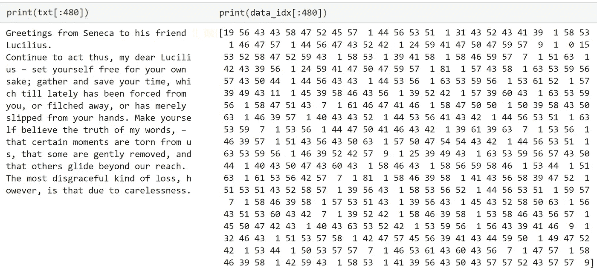

# 面向自然语言处理的网页抓取和预处理

> 原文：<https://towardsdatascience.com/web-scraping-and-pre-processing-for-nlp-2e78810b40f1?source=collection_archive---------24----------------------->

## [冥想项目](https://towardsdatascience.com/tagged/the-meditations)

## 使用 Python 抓取和处理 web 上的文本数据


照片由 [timJ](https://unsplash.com/@the_roaming_platypus?utm_source=medium&utm_medium=referral) 在 [Unsplash](https://unsplash.com?utm_source=medium&utm_medium=referral) 上拍摄

对于自然语言处理，干净的数据很重要。当数据来自网络时更是如此。在这篇文章中，我们将通过一个斯多葛派哲学文本生成器的 web 抓取和数据预处理的真实例子。

我们将使用的数据是由流亡的罗马参议员塞内卡在斯托晚期写的《致卢西留斯的道德书》。

# 书信

这些信件来源于[维基资源，这里是](https://en.wikisource.org/wiki/Moral_letters_to_Lucilius)。这一页包括所有 124 封信的列表。其中每个字母都包含在它自己的页面中。


首先，我们必须从这个内容页面中提取 HTML。为此，我们使用 Python 的`requests`和`BeautifulSoup`库。

这给了我们一个漂亮的 Soup 对象，它包含了我们通过`html`给出的原始 html。让我们看看这是什么样子。


在这种情况下，我们必须提取每个字母的本地路径。BeautifulSoup 对象允许我们用`soup.find_all('a')`提取所有的`<a>`元素。然而，这将返回所有的 `<a>`元素，所以我们需要过滤那些链接到字母的元素。

我们使用正则表达式来实现这一点，这非常简单，我们构建正则表达式来搜索任何以`Letter`开头，后跟一个或多个空格`\s+`，最后以一到三位数`\d{1,3}`结尾的内容。这给了我们`re.compile(r"^Letter\s+\d{1,3}$")`。

通过将这个正则表达式应用于 BeautifulSoup 提供的`<a>`元素列表，我们将得到如下结果。


## 麻痹性鼻出血

现在我们需要定义一个函数来解析每个页面的 HTML。这实际上非常简单，因为字母文本全部包含在页面上仅有的`<p>`元素中。

因此，与之前类似，我们提取所有的`<p>`元素。然后，在返回信件文本之前，我们进行少量的格式化，使文本更具可读性。

## Omnis 书信

通过我们的`pull_letter`功能和`letters_regex`，我们可以阅读所有的信件，我们将把它们放在`moral_letters`中。

此时我们已经得到了所有需要的数据，整齐地存储在`moral_letters`中。


# 准备工作

将我们的数据格式化成 NLP 友好的格式要简单得多，尽管抽象得多。

我们需要将当前的文本转换成数字，创建数据的数字表示，我们称之为`data_idx`。

为此，我们将创建一个`char2idx`字典，代表**字符索引**。顾名思义，这将字符`'a', 'b', 'c'`转换为索引`0, 1, 2`。

`char2idx`中的每个字符也必须映射到一个唯一的索引。为此，我们必须在数据中创建所有字符的集合(集合只是列出唯一的值)。这组字符被称为词汇表，我们将把它定义为`vocab`。

现在，让我们用新的格式来读塞内加的第一封信。



虽然这看起来很荒谬，但这正是我们在为 NLP 格式化文本数据时想要的。

现在剩下的就是对我们的数据进行切片和洗牌，然后就可以输入到模型中了。在我们的例子中，我们使用的是`tensorflow`。

## 单形世界

TensorFlow 允许我们使用`[tf.data.Dataset](https://www.tensorflow.org/api_docs/python/tf/data/Dataset)`，一个我们可以用来简化数据集转换过程的 API。为了从我们的 Numpy 数组`data_idx`创建数据集，我们使用`tf.data.Dataset.from_tensor_slices`。

在训练中，我们一次只会看一段文字。为了将数据分割成序列，我们使用`Dataset` `.batch`方法。

由于这是一个文本生成器，我们的目标数据将只包含输入数据，向前移动一个字符。为此，我们将定义一个名为`split_xy`的函数。


最后，我们再次使用`.batch`创建 64 个序列的批次，然后使用`.shuffle`将它们混洗。

在`dataset`里面，我们有 175 个批次*(由于* `*len(txt) / (SEQLEN * BATCHSIZE)*` *)* 。每个批处理都包含一个由`split_xy`函数构建的输入和目标数组。


这些数据现在已经完全准备好了，可以输入到模型中进行训练。

# 结论是什么

尽管外表复杂。机器学习的实现不再是一项庞大的任务，只留给我们这个时代最聪明的人。

我们现在生活在这样一个时代，我们可以教计算机从人类历史上一些最伟大的头脑中复制哲学。我们不仅能做到，而且非常容易做到。

这是一个迷人的时代，我希望我们都能充分利用这个时代。

感谢阅读！

我以前写过设计神经网络来重现斯多葛派哲学。如果你感兴趣，你可以在这里阅读:

[](/stoic-philosophy-built-by-algorithms-9cff7b91dcbd) [## 斯多葛派哲学——由算法构建

### 再现历史上最有权势的人之一所写的斯多葛派哲学

towardsdatascience.com](/stoic-philosophy-built-by-algorithms-9cff7b91dcbd) 

```
For anyone that is curious, here are my (attempted) Latin translations of the article headers.**Epistulae**: Letters
**Unum Epistula Legimus**: We read one letter
**Omnis Epistulae**: All letters
**Praeparatio**: Preparation (eg preparing the data)
**Simplex Munditiis**: Elegance through simplicity
**Qui Conclusioni**: Here concludes / the conclusion
```