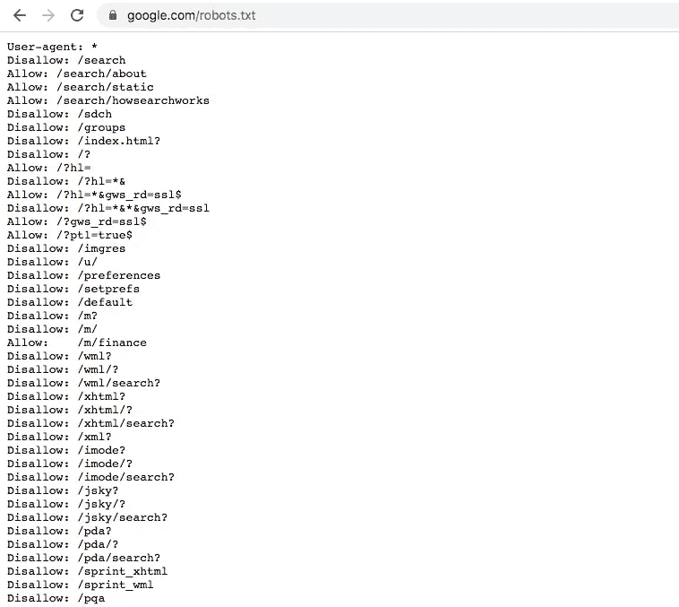
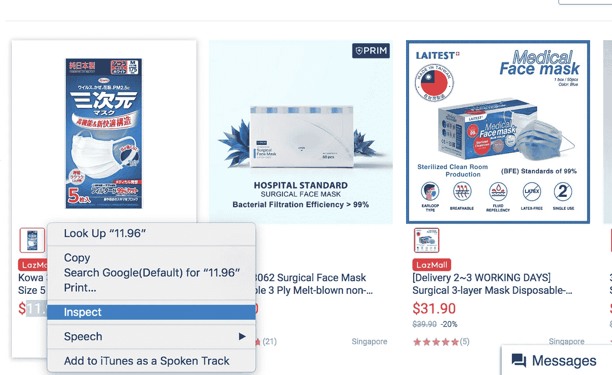
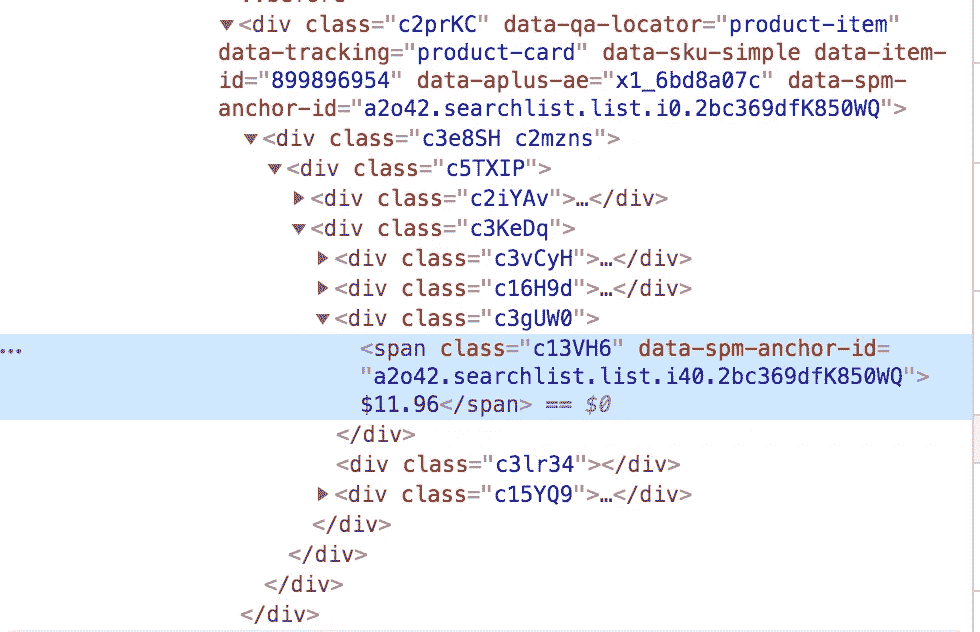
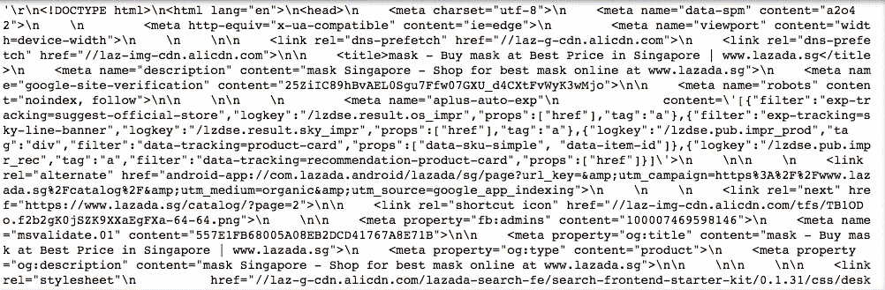
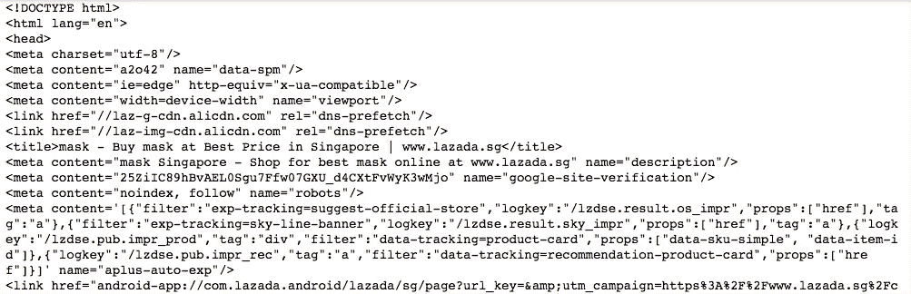
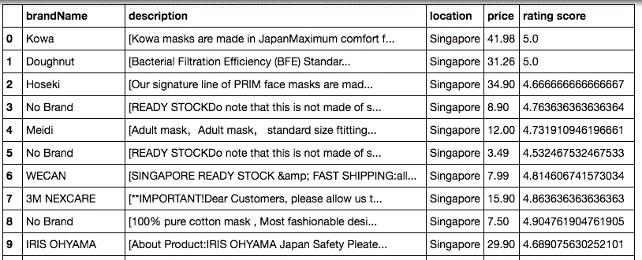
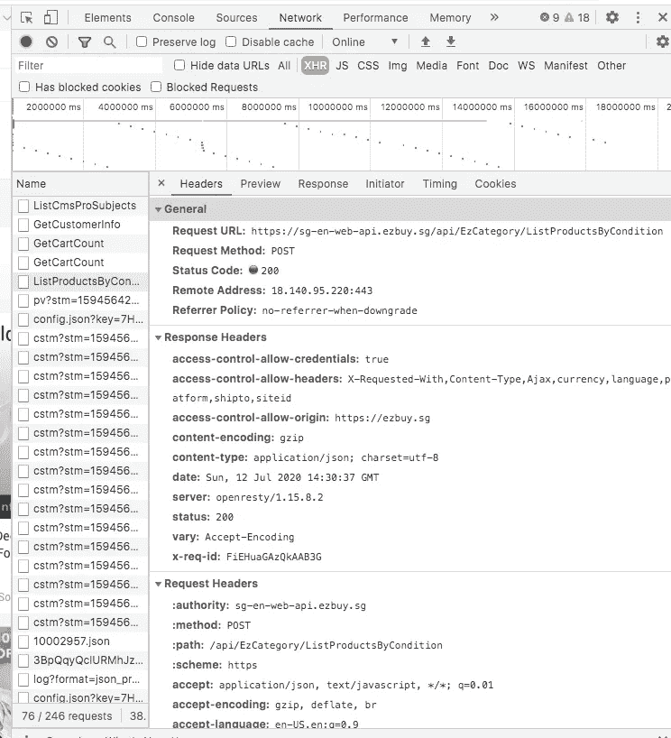
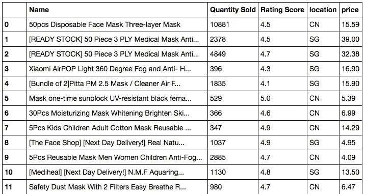

# 网页抓取基础知识

> 原文：<https://towardsdatascience.com/web-scraping-basics-82f8b5acd45c?source=collection_archive---------0----------------------->

## 如何用 Python 从网站上抓取数据


照片由弗朗克五世从 [Unsplash](https://unsplash.com/photos/U3sOwViXhkY)

在数据科学中，我们总是说“垃圾进垃圾出”。如果你没有好的质量和数量的数据，很可能你不会从中获得很多见解。Web 抓取是自动检索第三方数据的重要方法之一。在这篇文章中，我将介绍 web 抓取的基础知识，并用两个例子来说明用 Python 实现 web 抓取的两种不同方式。

## 什么是网络抓取

Web 抓取是一种从网站检索非结构化数据并以结构化格式存储它们的自动方式。比如你想分析什么样的面膜能在新加坡卖的更好，你可能想在 Lazada 这样的电商网站上把所有的面膜信息都刮下来。

## 你能从所有的网站上搜集信息吗？

抓取使网站流量激增，并可能导致网站服务器崩溃。因此，并不是所有的网站都允许人们刮。如何知道哪些网站是允许的，哪些是不允许的？你可以看看网站的‘robots . txt’文件。你只需简单地把 robots.txt 放在你想抓取的网址后面，你就会看到网站主机是否允许你抓取网站的信息。

> 以 Google.com 为例



Google.com 的 robots.txt 文件

你可以看到谷歌不允许它的许多子网站进行网络抓取。然而，它允许像“/m/finance”这样的路径，因此如果你想收集金融信息，这是一个完全合法的地方。

另一个注意事项是，您可以从 User-agent 上的第一行看到。在这里，谷歌为所有用户代理指定了规则，但网站可能会给某些用户代理特殊权限，所以你可能想参考那里的信息。

## 网页抓取是如何工作的？

网络抓取就像一个机器人浏览网站的不同页面，并复制粘贴所有的内容。当您运行代码时，它将向服务器发送一个请求，数据包含在您得到的响应中。然后您要做的是解析响应数据并提取出您想要的部分。

## 我们如何做网页抓取？

好了，我们终于到了。根据网站内容的结构，有两种不同的方法来抓取网页。

> **方法 1:** 如果网站将所有信息都存储在 HTML 前端，你可以直接用代码下载 HTML 内容，从中提取有用的信息。

**大致有以下 5 个步骤:**

1.  检查您要爬网的网站 HTML
2.  使用代码访问网站的 URL，并下载页面上的所有 HTML 内容
3.  将下载的内容格式化为可读格式
4.  提取有用的信息，并将其保存为结构化格式
5.  对于显示在网站多个页面上的信息，您可能需要重复步骤 2-4 以获得完整的信息。

这种方法的利弊:简单直接。然而，如果网站的前端结构发生变化，那么你需要相应地调整你的代码。

> **方法二:**如果网站将数据存储在 API 中，用户每次访问网站时网站都会查询 API，那么您可以模拟请求，直接从 API 中查询数据

**步骤:**

1.  检查您要爬网的 URL 的 XHR 网络部分
2.  找出为您提供所需数据的请求-响应
3.  根据请求的类型(post 或 get)以及请求头和负载，在您的代码中模拟请求并从 API 中检索数据。通常，从 API 获得的数据格式非常简洁。
4.  提取出你需要的有用信息
5.  对于对查询大小有限制的 API，您需要使用“For 循环”来重复检索所有数据

**这种方法的利与弊:**如果您能找到 API 请求，这绝对是一种首选方法。你收到的数据会更加结构化，更加稳定。这是因为与网站前端相比，公司不太可能改变其后端 API。但是，它比第一种方法稍微复杂一些，尤其是在需要身份验证或令牌的情况下。

## web 抓取的不同工具和库

有许多不同的不需要任何编码的抓取工具。然而，大多数人仍然使用 Python 库来做 web 抓取，因为它易于使用，而且你可以在它的大社区中找到答案。

Python 中网页抓取最常用的库是**美汤、请求、硒**。

**Beautiful Soup:** 它帮助您将 HTML 或 XML 文档解析成可读的格式。它允许您在文档中搜索不同的元素，并帮助您更快地检索所需的信息。

**请求:**这是一个 Python 模块，您可以在其中发送 HTTP 请求来检索内容。它通过发送 Get 或 Post 请求来帮助您访问网站 HTML 内容或 API。

**Selenium:** 它广泛用于网站测试，它允许你自动化网站上的不同事件(点击、滚动等)以获得你想要的结果。

你要么用 Requests +美汤，要么用 Selenium 做网页抓取。**如果你需要与网站交互(JavaScript 事件)，Selenium 是首选，如果不是，我会首选请求+漂亮的汤，因为它更快更容易**。

## 网页抓取示例:

> **问题陈述:**我想了解一下当地的面膜市场。我对网上面膜的价格、折扣、评分、销售量等很感兴趣。

> **方法 1 示例(下载所有页面的 HTML)—laza da:**

**第一步:检查网站(如果使用 Chrome，可以右键单击并选择检查)**



检查 Chrome 上的 Lazada 页面



Lazada 上价格的 HTML 结果

我可以看到我需要数据都用惟一的类名包装在 HTML 元素中。

**第二步:使用代码访问网站的 URL，下载页面上所有的 HTML 内容**

```
# import library
from bs4 import BeautifulSoup
import requests# Request to website and download HTML contents
url='https://www.lazada.sg/catalog/?_keyori=ss&from=input&q=mask'
req=requests.get(url)
content=req.text
```



在应用美丽的汤之前请求内容

我使用请求库从一个网站获取数据。你可以看到，到目前为止，我们得到的是无结构的文本。

**第三步:将下载的内容格式化为可读格式**

```
soup=BeautifulSoup(content)
```

这一步非常简单，我们所做的只是将非结构化的文本解析成漂亮的汤，你得到的如下。



使用美汤后的 HTML 内容

输出是一种可读性更强的格式，您可以在其中搜索不同的 HTML 元素或类。

**第四步:提取出有用的信息并保存成结构化的格式**

这一步需要一些时间来理解网站结构，并找出数据存储的确切位置。对于 Lazada，它以 JSON 格式存储在脚本部分。

```
raw=soup.findAll('script')[3].text
page=pd.read_json(raw.split("window.pageData=")[1],orient='records')
#Store data
for item in page.loc['listItems','mods']:
    brand_name.append(item['brandName'])
    price.append(item['price'])
    location.append(item['location'])
    description.append(ifnull(item['description'],0))
    rating_score.append(ifnull(item['ratingScore'],0))
```

我创建了 5 个不同的列表来存储我需要的不同字段的数据。我在这里使用了 for 循环来遍历内部 JSON 文档中的项目列表。之后，我将这 5 列合并到输出文件中。

```
#save data into an output
output=pd.DataFrame({'brandName':brand_name,'price':price,'location':location,'description':description,'rating score':rating_score})
```



Python 数据帧格式的最终输出

**步骤 5:对于显示在网站多个页面上的信息，您可能需要重复步骤 2-4 以获得完整的信息。**

如果你想收集所有的数据。首先，你应该了解卖家的总数。然后，您应该通过使用有效负载到 URL 传递递增的页码来遍历页面。下面是我收集的完整代码，我循环了前 50 页来获取这些页面上的内容。

```
for i in range(1,50):
    time.sleep(max(random.gauss(5,1),2))
    print('page'+str(i))
    payload['page']=i
    req=requests.get(url,params=payload)
    content=req.text
    soup=BeautifulSoup(content)
    raw=soup.findAll('script')[3].text
    page=pd.read_json(raw.split("window.pageData=")[1],orient='records')
    for item in page.loc['listItems','mods']:
        brand_name.append(item['brandName'])
        price.append(item['price'])
        location.append(item['location'])
        description.append(ifnull(item['description'],0))
        rating_score.append(ifnull(item['ratingScore'],0))
```

> 方法 2 示例(直接从 API 查询数据)— Ezbuy:

**第一步:检查您想要抓取的 URL 的 XHR 网络部分，并找出提供您想要的数据的请求-响应**



网络下的 XHR 部分—产品列表 API 请求和响应

我从网络上看到，所有的产品信息都列在这个叫做‘按条件列出产品’的 API 里。该响应提供了我需要的所有数据，并且是一个 POST 请求。

**步骤 2:根据请求的类型(post 或 get)以及请求头&有效负载，在您的代码中模拟请求并从 API 中检索数据。通常，从 API 获得的数据格式非常简洁。**

```
s=requests.session()#Define API url
url_search='[https://sg-en-web-api.ezbuy.sg/api/EzCategory/ListProductsByCondition'](https://sg-en-web-api.ezbuy.sg/api/EzCategory/ListProductsByCondition')#Define **header** for the post request
headers={'user-agent':'Mozilla/5.0 (Macintosh; Intel Mac OS X 10_11_6) AppleWebKit/537.36 (KHTML, like Gecko) Chrome/83.0.4103.116 Safari/537.36'}#Define **payload** for the request form
data={
    "searchCondition": 
        {"categoryId":0,"freeShippingType":0,"filter: [],"keyWords":"mask"},
        "limit":100,
        "offset":0,
        "language":"en",
        "dataType":"new"
    }req=s.post(url_search,headers=headers,json=data)
```

这里我使用请求库创建 HTTP POST 请求。对于 post 请求，您需要定义请求头(请求的设置)和有效负载(与这个 post 请求一起发送的数据)。有时这里需要令牌或身份验证，在发送 POST 请求之前，您需要先请求令牌。这里不需要检索令牌，通常只需遵循网络中请求有效载荷的内容，并为报头定义“用户代理”。

这里要注意的另一件事是，在有效负载中，我将 limit 指定为 100，offset 指定为 0，因为我发现它一次只允许我查询 100 个数据行。因此，我们稍后可以做的是使用 for 循环来改变偏移量并查询更多的数据点。

**第三步:提取出你需要的有用信息**

```
#read the data back as json file
j=req.json()# Store data into the fields 
for item in j['products']:
    price.append(item['price'])
    location.append(item['originCode'])
    name.append(item['name'])
    ratingScore.append(item['leftView']['rateScore'])
    quantity.append(item['rightView']['text'].split(' Sold')[0]#Combine all the columns together
output=pd.DataFrame({'Name':name,'price':price,'location':location,'Rating Score':ratingScore,'Quantity Sold':quantity})
```

来自 API 的数据通常非常整洁和结构化，因此我所做的只是以 JSON 格式读取它。之后，我将有用的数据提取到不同的列中，并将它们组合在一起作为输出。您可以在下面看到数据输出。



EZbuy 面罩数据输出

**第四步:对于查询大小有限制的 API，您需要使用‘For 循环’来重复检索所有数据**

```
#Define API url
url_search='[https://sg-en-web-api.ezbuy.sg/api/EzCategory/ListProductsByCondition'](https://sg-en-web-api.ezbuy.sg/api/EzCategory/ListProductsByCondition')#Define header for the post request
headers={'user-agent':'Mozilla/5.0 (Macintosh; Intel Mac OS X 10_11_6) AppleWebKit/537.36 (KHTML, like Gecko) Chrome/83.0.4103.116 Safari/537.36'}for i in range(0,14000,100):
    time.sleep(max(random.gauss(3,1),2))
    print(i)
    data={
        "searchCondition":
       {"categoryId":0,"freeShippingType":0,"filters":
        [],"keyWords":"mask"},
        "limit":100,
        "offset":i,
        "language":"en",
        "dataType":"new"
    }
    req=s.post(url_search,headers=headers,json=data)
    j=req.json()
    for item in j['products']:
        price.append(item['price'])
        location.append(item['originCode'])
        name.append(item['name'])
        ratingScore.append(item['leftView']['rateScore'])
        quantity.append(item['rightView']['text'].split(' Sold')[0])#Combine all the columns together
output=pd.DataFrame({'Name':name,'price':price,'location':location,'Rating Score':ratingScore,'Quantity Sold':quantity})
```

下面是在 Ezbuy 中抓取所有面膜数据行的完整代码。我发现总行数是 14k，因此我编写了一个 for 循环来遍历增量偏移量以查询所有结果。这里需要注意的另一件重要事情是，我在每个循环的开始放置了一个**随机超时**。这是因为我不希望非常频繁的 HTTP 请求损害网站的流量，并被网站发现。

## 最后，推荐

如果你想抓取一个网站，我建议**先用 inspect 在网络部分**检查 API 的存在。如果您可以找到对请求的响应，并为您提供所需的所有数据，那么您就可以构建一个稳定而简洁的解决方案。如果在网络中找不到数据，应该尝试使用 requests 或 Selenium 下载 HTML 内容，并使用 Beautiful Soup 格式化数据。最后，请使用超时来避免过于频繁地访问网站或 API。这可以防止你被网站屏蔽，有助于缓解网站的流量。

如果你有兴趣了解更多关于使用 Python 中的 Scrapy 进行网络抓取的知识，可以参考我下面的最新文章

[](https://songhaowu.medium.com/web-scraping-in-scrapy-c2d87796f677) [## Python 中使用 Scrapy 的 Web 抓取

### 如何检索新加坡的二手车信息

songhaowu.medium.com](https://songhaowu.medium.com/web-scraping-in-scrapy-c2d87796f677)