# 使用 Selenium、BeautifulSoup、Requests、lxml 和 Scrapy 的网络抓取 Boardgamegeek.com

> 原文：<https://towardsdatascience.com/web-scraping-boardgamegeek-com-using-selenium-beautifulsoup-requests-lxml-and-scrapy-1902d478ecde?source=collection_archive---------48----------------------->

## 用 3 种不同的方法刮 boardgamegeek.com

左图:[马库斯·斯皮斯克](https://unsplash.com/@markusspiske?utm_source=unsplash&utm_medium=referral&utm_content=creditCopyText)在 [Unsplash](/?utm_source=unsplash&utm_medium=referral&utm_content=creditCopyText) 拍摄的照片。右图:[罗伯特·科埃略](https://unsplash.com/@robert_coelho?utm_source=unsplash&utm_medium=referral&utm_content=creditCopyText)在 [Unsplash](/?utm_source=unsplash&utm_medium=referral&utm_content=creditCopyText) 拍摄的照片

这是一个使用 5 种不同工具以 3 种方式进行网络抓取的教程:Selenium、BeautifulSoup、Requests、LXML 和 Scrapy。我们将从同一个网站[boardgamegeek.com](https://www.boardgamegeek.com/)收集数据。

# 目标

1.  抓取大约 20，000 个棋盘游戏，解析数据，然后将数据转换为 CSV 文件。
2.  学习 3 种不同的 web 抓取方法:Selenium + BeautifulSoup、Python 请求库+ lxml 库和 Scrapy 框架。

# 关于 Boardgamegeek.com

该网站存储了近 120，000 款桌游的数据，包括游戏元数据、论坛数据、在线市场数据、玩家社区数据等。你可以说 Boardgamegeek.com 是桌游的 IMDB。

该网站提供了一个排名列表。下图是排名前 10 的游戏。你可以在右上方看到，排名列表有 1180 页。每页有 100 个游戏。**截至 2020 年 6 月 16 日，该数据库存储了 118，066 款桌游。**然而，并不是所有的博弈都有完整的信息。**只有 19023 场比赛有排名数据。**排名值是根据玩家的投票计算的。没有排名意味着没有人为这个游戏投票。在这个项目中，我们将只收集 19，023 个有可用排名数据的游戏。

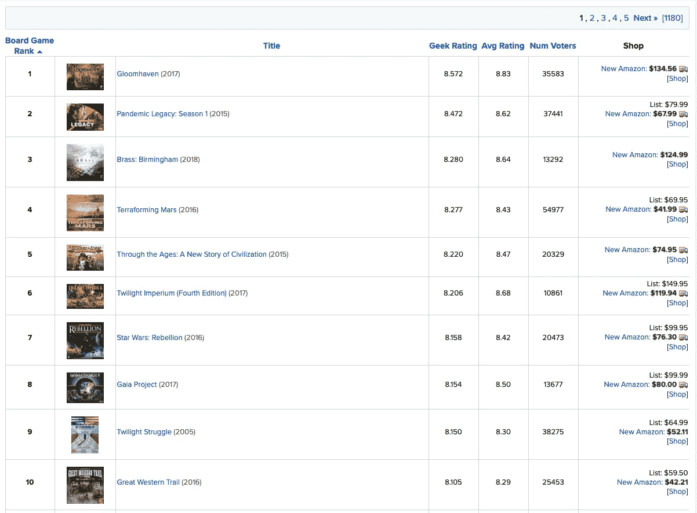

boardgamegeek.com 十大游戏

BGG 也有 API。每个游戏都有自己的 XML 页面。下面是游戏‘gloom haven’的 XML 文件的部分截图。

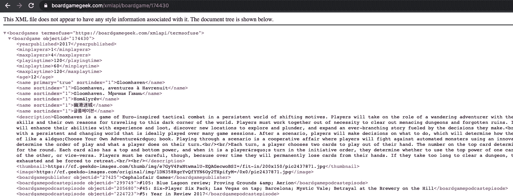

来自 BGG API 的游戏“Gloomhaven”的 XML 文件

# 方法和工具介绍

每个工具或语言库都是为了满足特定的用例而发明的。基于网站设计和数据量/复杂性，利用不同的工具将使工作更容易或更快。

简而言之，web 抓取是请求网页，然后解析 HTML 中包含的数据的过程。

## 请求阶段:

**Python 请求库:**

> **优点:**是最常用的 Python 库。它简单易学。用 API 连接网站的绝佳选择。
> 
> **缺点:**不能用来模拟人类交互，比如点击按钮。

**硒:**

> **优点:**它可以通过模仿人类的动作，如点击和拖动，与网站进行交互。对于用动态 Javascript 编写的网站来说，这是一个很好的选择。
> 
> 缺点:它需要一个 chrome 驱动程序才能工作，并且必须与你的 Chrome 版本完全匹配。这降低了代码的可移植性。它的速度也很慢。

**刺儿头:**

> **优点:**它速度快，结构化，功能丰富。它使用并行处理来快速收集数据。它拥有能够在同一个工具中抓取和处理数据的工具。
> 
> 缺点:学习曲线很陡。

## 解析阶段:

**美丽组图:**

> **优点:**对破损的 HTML/XML 文件非常宽容。简单易学，有据可查。直接从网站而不是 API 文件获取 html 的最佳选择。
> 
> **缺点:**比 lxml 慢一点。

**Python lxml 库:**

> **优点:**专门解析 XML。Python 内置 ElementTree 的强大扩展，具有完整的 xpath 特性。好用。
> 
> **缺点:**没有刺儿头快。仅适用于 XML 文件。

**刺儿头:**利弊同上请求阶段

# 项目步骤:

要获得最高排名的 19，023 场比赛，我们需要做如下工作:

## 第一步:获取前 19，023 个游戏的游戏 id 列表

BGG API 不提供排名信息，所以我们需要先抓取排名页面。然后我们从每个游戏的 URL 中提取 gameID，这样我们就可以使用包含 gameID 的 URL 调用 API 来请求每个游戏的页面。我们需要先抓取排名网页的 HTML。

## 步骤 2:下载每个游戏的 XML 文件并解析数据

有了 gameID 列表，我们将能够请求每个游戏的 XML 文件，将它们下载到本地计算机，然后将数据解析到数据帧中，并保存到 CSV 文件中。

## 第三步:试着只用一个工具 Scrapy 来做上面的所有事情

有一种方法可以使用 Scrapy 做上面的所有事情。我们将试一试。

# 第一步:用硒+美容素刮痧

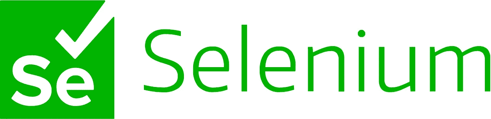

左:来自硒。右:来自 https://funthon.wordpress.com/2017/05/21/beautiful-soup-4/

## 为什么选择这些工具？

我们正在抓取网站的 HTML。网站包含 Javascript，所以需要 Selenium。此外，我们不确定 HTML 是否有任何错误，因为直接来自网页的数据不像来自 API 的数据那样结构化。因此，选择 BeautifulSoup 来解析数据。

## 设置硒

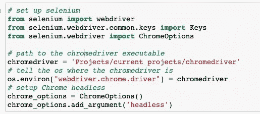

设置硒

## 写解析函数

用 Selenium 和 BeautifulSoup 解析函数

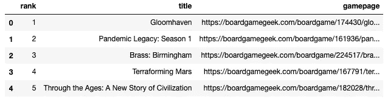

游戏排名列表的前 5 行

游戏 id 在 URL 里面。为了下一步，我们需要将它们提取到一个列表中。

# 步骤 2:使用 Python 的请求库+ lxml 库进行抓取

左:来自 pipy.org 右:来自 lxml.de

## 为什么选择这些工具？

我们将通过 BGG API 请求 XML 页面。这是一个简单的任务，不需要类似人类的互动。所以 Python 的请求库可以很好地完成这项工作。在我们获得 xml 文件之后，使用 lxml 解析它们是一个好方法，因为 lxml 专门用于 XML 解析，具有完整的 Xpath 特性和相对较快的速度。

## 请求 XML API 并将文件保存在本地

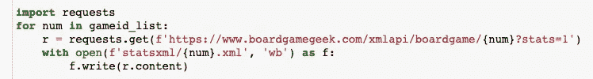

使用 Python 的请求库下载 XML 文件

## 编写解析函数

有 47 个标记后来被转换为数据框列。实际的解析代码非常长。下面是一些示例代码，涵盖了 BGG XML 文件中不同的标签情况。

这很好地展示了如何使用 lxml。

使用 lxml 解析函数的示例代码

## 通过连接步骤 1 和步骤 2 中的两个表获得最终的 CSV

由于 XML 文件没有排名信息或游戏 URL，我们需要连接两个表来获得最终的数据框。

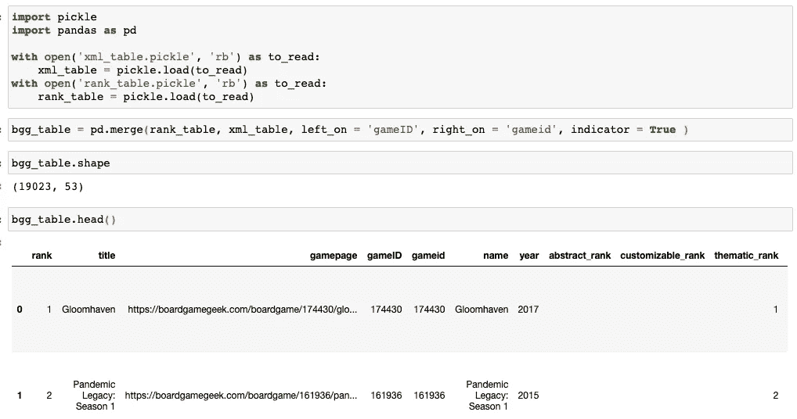

连接两个数据框

我们需要删除包含重复数据的列，然后将数据框保存到 CSV 文件中。我们的最终数据有 50 列和 19023 行。

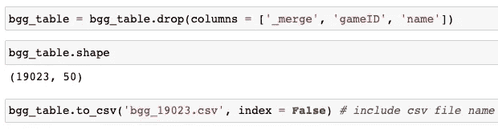

删除重复的列并保存到 csv 中

# 第三步:零碎的框架

来自 Scrapy.org

## 为什么用 Scrapy？

Scrapy 是一个强大的抓取框架。我们在步骤 1 和 2 中所做的所有工作都可以通过使用 Scrapy 来完成。此外，它还有许多优点:

1.  它超级快！Scrapy 使用多线程，这使得它比使用其他一些 Python 库要快得多。例如，第一步中使用硒和 BeautifulSoup 的刮擦需要大约 20 分钟，但 Scrapy 只需要大约 90 秒！
2.  一切都在一个地方，井井有条，非常适合复杂项目
3.  与 BeautifulSoup、lxml 解析器和 Xpath 兼容

## Scrapy 怎么编码？

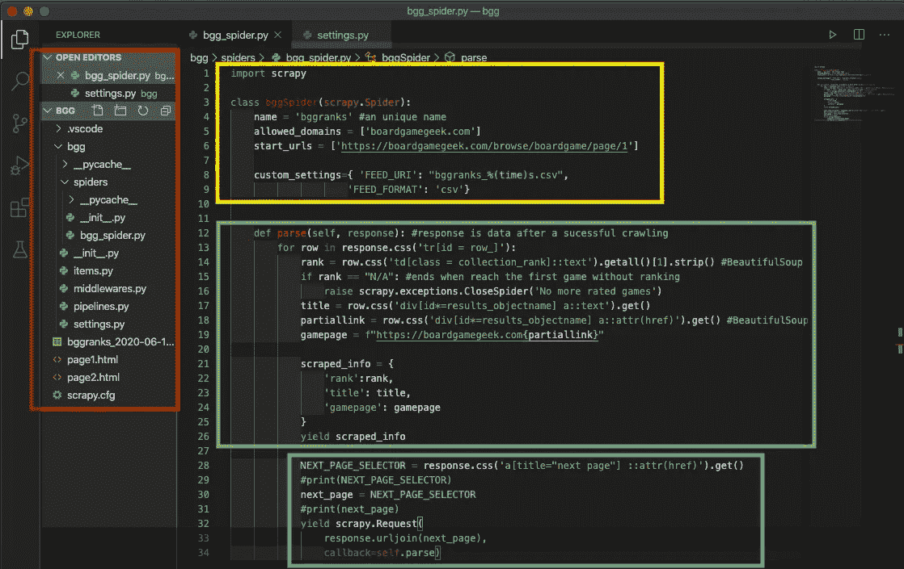

VS 代码中的碎片

## **1。安装 Scrapy 并创建一个新项目**

首先打开命令行终端，键入**“pip install scrapy”**。然后导航到保存项目文件的文件夹，在终端中键入:

**BGG scrapy start project(或你的项目名)**

## **2。红区:好有条理！**

在终端中创建新项目后，Scrapy 会在项目文件夹中自动生成一组文件。当您在代码编辑器中加载文件夹时，您可以在红色正方形区域中看到文件结构。

Scrapy 用“蜘蛛”来刮。在 spiders 文件夹中，您可以创建一个新的蜘蛛文件，这将是一个 Python 脚本。另一个包括。py 文件为您提供了各种用途的代码结构，有助于您以后的编码，例如将所有自定义设置分组到“settings.py”中，或者用于构建数据管道。为了方便起见，输出文件也组织在这个区域中。

## **3。黄色区域:一切都以蜘蛛类**开始

现在我们将编写蜘蛛 Python 脚本。为了刮擦，所有 Scrapy 需要的是一个蜘蛛类。首先，需要定义两个变量:“name”和“start_urls”。注意他们的名字是预先确定的，你不能用其他名字。“名称”用于稍后运行蜘蛛，start_urls 显示要抓取的第一个页面。

## **4。绿色区域:实际执行工作的解析函数**

在 BS4 和 lxml 中，我们操作的对象是“汤”和“树”。在 Scrapy 中，它是“响应”。Scrapy 的与众不同之处在于它的语法。它只使用。css 和。xpath 作为它的选择器。考虑到新的语法，编写解析函数实际上类似于使用 BS 或 lxml。以下是 Scrapy 文件中的引文:

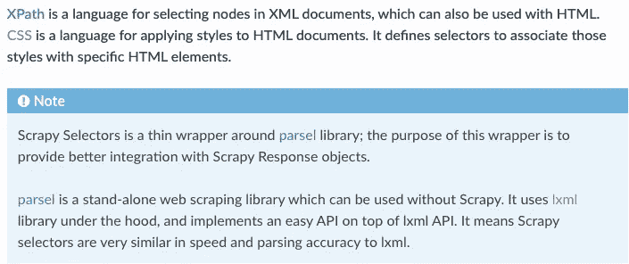

XPath 和 CSS 选择器

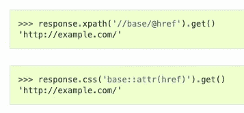

css 和 XPath 之间的语法差异

另一个区别是我们如何存储输出。我们需要创建一个字典来存储数据。我们需要用“收益”而不是“回报”。“yield”会将每次迭代的解析数据结果发送到 Scrapy，然后返回到循环中继续解析下一行数据。Scrapy 将保存所有迭代的结果，然后将数据保存到 setting.py 文件中定义的四种文件类型之一:CSV、JSON、JSON Lines 或 XML。

## **5。蓝色区域:请下一页！**

当我们使用其他库时，我们通常定义一个输入页数的函数。而使用 Scrapy，你只需要告诉它的网址开始，然后它会使用一个下一页选择器继续点击下一页，直到结束或到达页面限制你在代码中设置。这是一个自我回调函数，也就是几行代码。

## 6.是时候坐下来享受了！

最后一步是运行蜘蛛脚本。在终端中，键入

**scrapy crawl BG ranks(或你的‘name’变量的字符串)**

轻轻一点，就能见证 Scrapy 的超级爬行速度。下图显示了生成的 CSV 文件。短短 90 秒就刮出了 19000 个游戏排名记录！

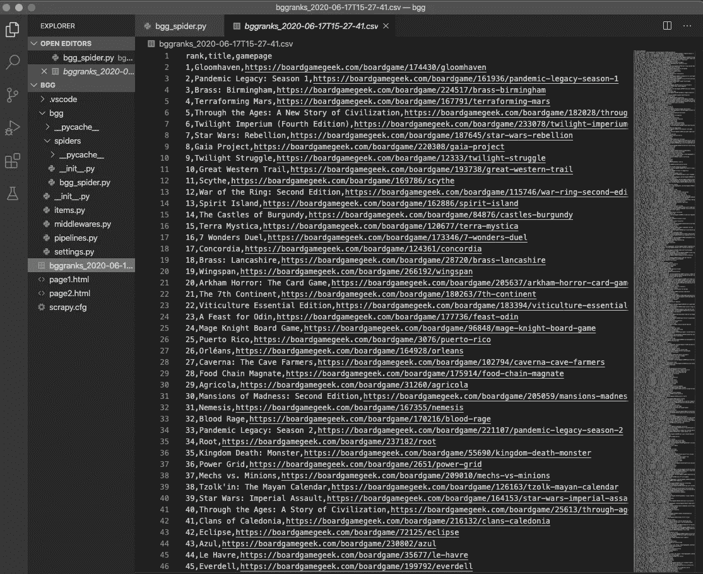

生成的 CSV 文件的预览

# 摘要

在本文中，我们了解了多种 web 请求工具和 XML/HTML 解析工具之间的区别。在现实中，人们通常出于习惯而坚持使用某些工具。然而，了解多种工具可以使你的网络抓取更快，更容易处理复杂的项目。感谢您的阅读！