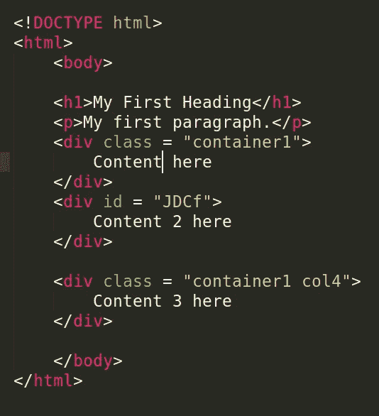
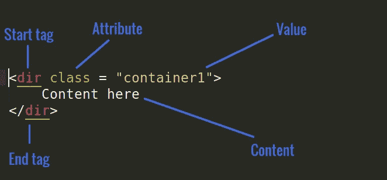
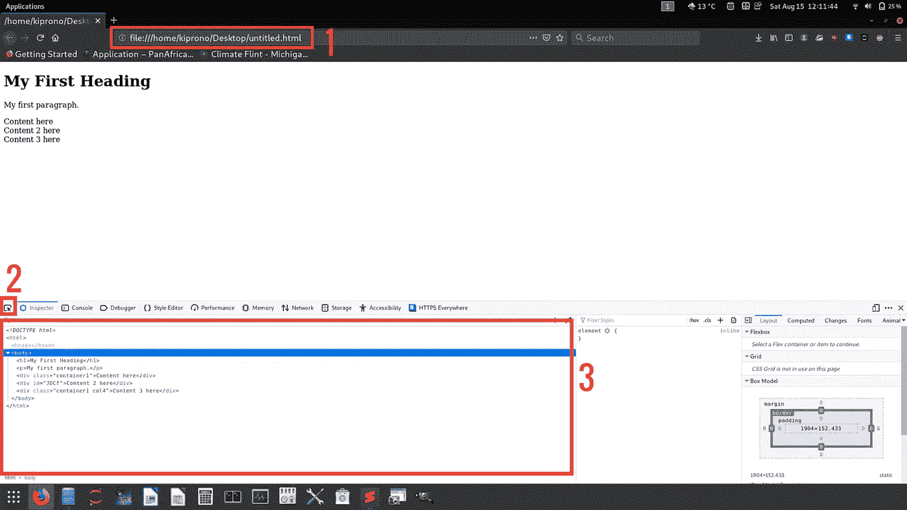
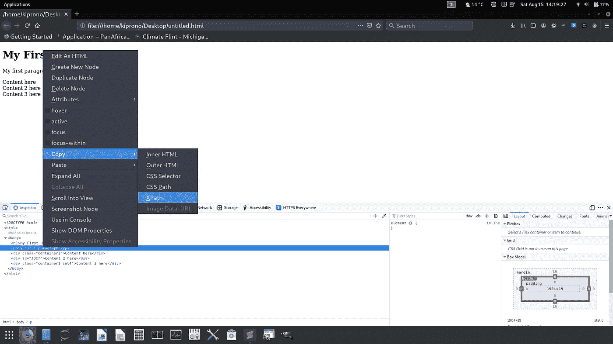
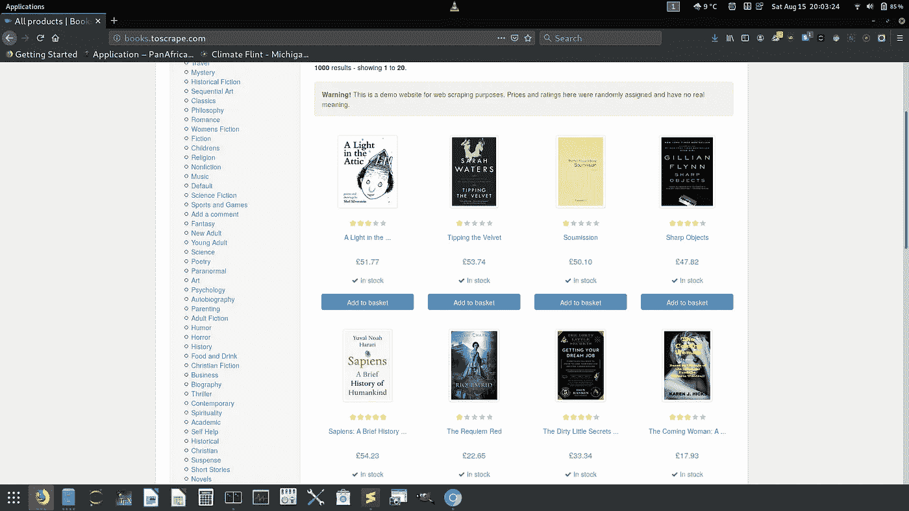
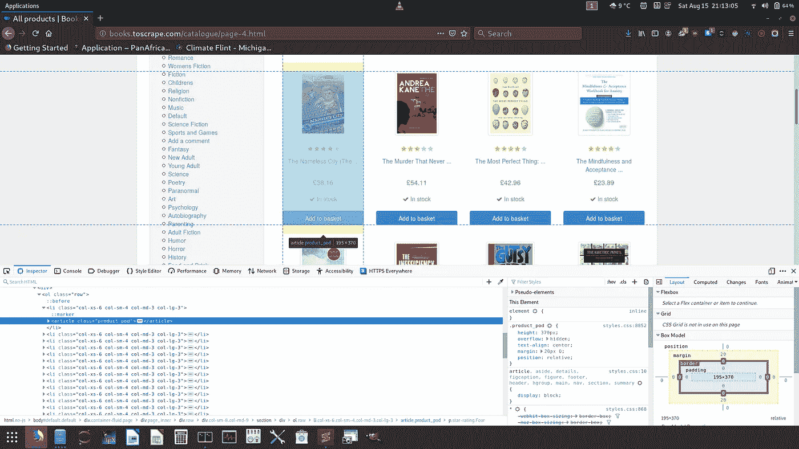
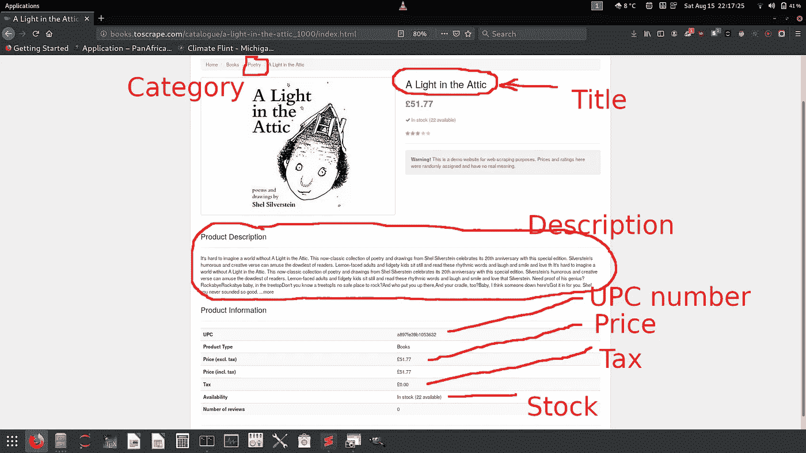
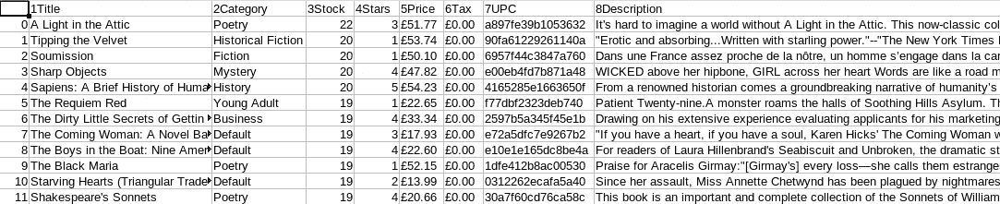

# 使用 Selenium 的网页抓取

> 原文：<https://towardsdatascience.com/web-scraping-e-commerce-website-using-selenium-1088131c8541?source=collection_archive---------12----------------------->

## 抓取网上书店的一个简单例子。


Christopher Gower 在 [Unsplash](https://unsplash.com/s/photos/web-scraping?utm_source=unsplash&utm_medium=referral&utm_content=creditCopyText) 上的照片

在这篇文章中，我们将通过一个电子商务网站的网页抓取过程。我设计了这篇特别的帖子，是为了方便初学者。因此，如果您没有 web 抓取或 Selenium 方面的知识，您仍然可以继续学习。

为了理解网络抓取，我们需要理解 HTML 代码的基础知识。我们也会谈到这一点。

# HTML 基础

关于 HTML 基础知识有很多东西要谈，但是我们将把重点放在对网络抓取有帮助的东西上(至少大多数时候)。



图 1，**左**:一个简单的 HTML 代码，**右** : HTML 元素，来源:作者

*   **HTML 元素**(图 1 右侧)—HTML 元素是开始标签、其属性、结束标签以及它们之间的所有内容的集合。
*   **属性** —是在开始标签中使用的特殊单词，用于控制元素的行为。属性及其值一起用于引用标记及其内容进行样式化。我们将在网络抓取中使用的最重要的属性包括`class`、`id`和`name`。
*   `**class**` **和** `**id**` **属性** — HTML 元素可以有一个或多个类，用空格分隔(见上图 1 左)。另一方面，HTML 元素必须有唯一的`id`属性，也就是说，一个`id`不能用于引用多个 HTML 元素。

# 简单的网页抓取

在我们进入电子商务网站的实际抓取之前，让我们抓取下图所示的网站(来自图 1 左边的 HTML 代码)



图 2:现场

从上图(图 2)中，请注意以下几点:

1.  这是统一资源定位符( **URL** )。对于这种特殊的情况，定位器指向本地存储的 HTML 代码。
2.  当您在页面中悬停以识别您感兴趣的元素时，标记为 2 的按钮非常重要。一旦您感兴趣的对象被突出显示，标签元素也将被突出显示。
3.  这是页面源代码。它只是像图 1 左边的 HTML 代码。您可以通过单击 **Ctrl+Shift+I** 来检查页面，或者在站点上右键单击并选择选项上可用的**检查元素**或**检查**来查看该页面源代码。

# 先决条件

为了进行网页抓取，我们需要`selenium` Python 包(如果你没有这个包，用`pip`安装)和浏览器`webdriver`。为了让`selenium`工作，它必须能够访问驱动程序。从这里下载与你的浏览器匹配的 web 驱动: [Chrome](https://sites.google.com/a/chromium.org/chromedriver/downloads) 、 [Firefox](https://github.com/mozilla/geckodriver/releases) 、 [Edge](https://developer.microsoft.com/en-us/microsoft-edge/tools/webdriver/) 和 [Safari](https://webkit.org/blog/6900/webdriver-support-in-safari-10/) 。下载 web 驱动程序后，保存它并记下路径。默认情况下， `selenium`会在当前工作目录下寻找驱动程序，因此你可能想把驱动程序保存在 Python 脚本所在的目录下。然而，您没有义务这样做。您仍然可以保存它，并在下面的第 5 行提供可执行文件的完整路径

代码片段 web 抓取的基本示例

*   **1 号线和 2 号线**导入必要的库。
*   **Line 4 an 5** —定义你下载的 web 驱动的路径，实例化一个 Chrome 驱动。我用的是 Chrome 网络驱动，但你也可以用 Firefox、Microsoft Edge 或 Safari。
*   **第 6 行** —驱动程序在 5 中启动一个 Chrome 会话，并在 6 中获取 url 源。
*   **第 7 行和第 8 行** —这一行暂停 Python 执行 5 秒钟，然后在第 8 行关闭浏览器。暂停是很重要的，这样你就可以对浏览器上发生的事情有一个粗略的了解，而关闭可以确保浏览会话结束，否则我们将会有很多 Chrome 会话窗口。等待页面加载时，睡眠时间也可能非常重要。然而，还有另一种开始等待的适当方法。

# 定位元素

这是网络抓取最重要的部分。在这一节中，我们需要学习如何通过使用不同的属性来获取 HTML 元素。

**回忆** : **网页的元素可以用** `**class**` **、** `**id**` **、** `**tag**` **、** `**name**` **或/和** `**xpath**` **来标识。id 是唯一的，但类不是。这意味着给定的** `**class**` **可以标识多个 web 元素，而一个** `**id**` **只能标识一个元素。**

可以使用以下任何一种方法来标识一个 HTML 元素

*   driver.find_element_by_id
*   驱动程序.按名称查找元素
*   driver.find_element_by_xpath
*   driver.find _ element _ by _ 标签 _ 名称
*   driver . find _ element _ byclass _ name

可以使用以下任何一种方法来标识多个 HTML 元素(结果是找到的元素列表)

*   驱动程序.按名称查找元素
*   driver.find_elements_by_xpath
*   driver . find _ elements _ by _ tag _ name
*   driver . find _ elements _ by _ class _ name

**注意:** `**id**` **不能用于识别多个元素，因为** `**id**` **只能识别一个元素。**

Snipet 2:定位元素

输出:

```
Element identified by id: **Content 2 here**
Element identified by class: **Content here**
Element identified by class: **Content 3 here**
Element identified by tag name: **My First Heading**
Element identified by xpath: **My first paragraph.**
```

*   **第 8 行** —注意`container1`是标识两个元素的类属性值，`drive.find_element_by_class_name`返回找到的第一个元素。
*   为了从 HTML 元素中提取文本，我们使用了`.text`函数，如上面的代码片段所示。
*   **第 11 行** —通过`xpath`检查站点元素来定位元素，右键单击与感兴趣的元素匹配的源代码，并复制 XPath，如下图所示(图 3)



图 3:获取特定元素的 XPath

我们可以识别并循环通过由`container1`类识别的两个元素，如下所示

代码片段 3:定位多个元素

输出:

```
Content here
Content 3 here
```

# 抓取实际站点

现在，您已经了解了 selenium 的工作方式，让我们继续前进，清理我们应该清理的实际站点。我们将刮网上书店[ [链接](http://books.toscrape.com/) ]。



图 4:我们想要抓取的网站(来源:作者)

我们将如下进行。

*   在页面上刮掉每本书的细节。每页 20 本书。利用每张卡片上的网址可以找到每本书的详细内容。因此，要获得这本书的详细信息，我们需要这个链接。
*   把书的每一页都刮下来。这意味着我们将有一个循环来抓取页面中的每本书，还有一个循环来遍历页面。
*   从一个页面移动到另一个页面需要修改 URL，这使得预测到任何页面的链接变得很容易。

以下是页面:

*   第一页网址:[http://books.toscrape.com/](http://books.toscrape.com/)。以下链接也适用于第 1 页:[http://books.toscrape.com/catalogue/page-1.html](http://books.toscrape.com/catalogue/page-1.html)
*   第二页网址:[http://books.toscrape.com/catalogue/page-2.html](http://books.toscrape.com/catalogue/page-2.html)
*   第三页网址:[http://books.toscrape.com/catalogue/page-3.html](http://books.toscrape.com/catalogue/page-3.html)
*   第四页网址:[http://books.toscrape.com/catalogue/page-4.html](http://books.toscrape.com/catalogue/page-4.html)
*   等等

显然，我们可以注意到一个模式，它暗示着在页面中循环将会很简单，因为我们可以在循环过程中生成这些 URL。

# **刮一本书**



图 5:一本书的元素检查。

在检查网站时，这里是突出显示区域的 HTML 代码(代表一本书)

```
<article class="product_pod">
 <div class="image_container">
  <a href="the-nameless-city-the-nameless-city-1_940/index.html">
   
   </a>
  </div>
  <p class="star-rating Four">
   <i class="icon-star"></i>
   <i class="icon-star"></i>
   <i class="icon-star"></i>
   <i class="icon-star"></i>
   <i class="icon-star"></i>
  </p>
  <h3>
   <a href="the-nameless-city-the-nameless-city-1_940/index.html" title="The Nameless City (The Nameless City #1)">The Nameless City (The ...</a>
  </h3>
  <div class="product_price">
   <p class="price_color">£38.16</p>
   <p class="instock availability">
    <i class="icon-ok"></i>

        In stock</p>
   <form>
    <button type="submit" class="btn btn-primary btn-block" data-loading-text="Adding...">Add to basket</button>
   </form>
  </div>
 </article>
```

在我们开始编码之前，让我们做一些观察

*   有问题的书在`article`标签里面。值为`product_prod`的类属性标签
*   我们在这张卡中需要的是获取 URL，也就是 `a`标签中的`href`。要进入`href`，我们需要向下移动层次如下:`class= “product_prod”` > `h3`标签> `a`标签和`href`属性的 get 值。
*   事实上，所有页面中的所有书籍都属于同一个类别`product_prod`并带有`article`标签。



图 6:一本书的详细信息页面(添加了注释以显示我们感兴趣的细节)

片段 4:搜集一本书的细节

让我们浏览几行代码，这样你就能理解代码实际上在做什么

*   **第 16 行到第 18 行—** 我们沿着 HTML 代码向下移动，以获得这本书的 URL。一旦我们得到链接，我们在 **19 打开。**注意 **16** 定位页面中所有的书，因为所有的书都属于同一个类`product_prod`，这就是为什么我们对它进行索引(索引 0)以只获得一本书**。**
*   同样值得注意的是，一本书的星级数是作为`p`标签的属性而来的。这是这颗星的位置:

```
<p class="star-rating Four">
   <i class="icon-star"></i>
   <i class="icon-star"></i>
   <i class="icon-star"></i>
   <i class="icon-star"></i>
   <i class="icon-star"></i>
  </p>
```

这本书被评为 4 星级，但这一事实被隐藏为 class 属性的值。你用`get_attribute(class)`来获取这样一个信息。在使用文本函数**、**提取第**行第 24** 行的内容时，您将得到这样一个字符串

```
star-rating Four
```

因此，我们必须在使用第 28–38 行中的函数之前拆分字符串，以获得实际的星号。

*   如果你在 **23** 中提取文本内容，你会得到这样的字符串

```
In stock (22 available)
```

我们需要的只是数字 22，这意味着我们有 22 份拷贝。我们通过第 25 行实现了这一点，在这里我们使用正则表达式来提取数字。

```
re.findall("\d+","In stock (22 available)")Output:
['22']
```

*   在正则表达式中,`\d` 表示值[0–9 ],而`+`表示一个字符在该类中出现一次或多次，也就是说，在我们的例子中，我们希望捕获字符串中的任何数字(不考虑数字的数量)。

# **把所有的书都刮到一页**

回想一下上面的第 16 行定位页面中的所有书籍。因此，为了在一页中抓取所有的书，我们需要循环遍历该行中生成的列表，如下所示

片段 5:把所有的书都刮到一页。一页里有 20 本书。

一旦你理解了前面抓取一本书的例子，那么这本书应该很容易理解，因为唯一的区别是我们想要遍历所有的书来提取链接(**第 33 行到第 38 行**)，然后遍历这些链接来提取我们需要的信息(**第 42–84 行**)。

在这个代码片段中，我们还引入了 try-except 块来捕捉我们想要的信息不可用的情况。具体来说，有些书漏掉了`description`一节。

我相信您也会喜欢看到 selenium 在您观看时打开页面。尽情享受吧！

# **抓取所有页面的所有书籍**

这里要理解的关键概念是，我们需要循环遍历每一页中的每一本书，也就是说，这里涉及到两个循环。如前所述，我们知道页面 URL 遵循某种模式，例如，在我们的例子中，我们有

*   第 1 页:[http://books.toscrape.com/index.html](http://books.toscrape.com/index.html)或[http://books.toscrape.com/catalogue/page-1.html](http://books.toscrape.com/catalogue/page-2.html)
*   第 2 页:[http://books.toscrape.com/catalogue/page-2.html](http://books.toscrape.com/catalogue/page-2.html)
*   第三页:[http://books.toscrape.com/catalogue/page-3.html](http://books.toscrape.com/catalogue/page-2.html)
*   等等，直到第 50 页(我们有 50 页的网站)。

我们可以很容易地创建一个 Python for-loop 来生成这样的 URL。让我们看看如何生成前 10 个

代码片段 6:通过修改页面 URL 生成 URL

输出:

```
[http://books.toscrape.com/catalogue/category/books_1/page-1.html](http://books.toscrape.com/catalogue/category/books_1/page-1.html)
[http://books.toscrape.com/catalogue/category/books_1/page-2.html](http://books.toscrape.com/catalogue/category/books_1/page-2.html)
[http://books.toscrape.com/catalogue/category/books_1/page-3.html](http://books.toscrape.com/catalogue/category/books_1/page-3.html)
[http://books.toscrape.com/catalogue/category/books_1/page-4.html](http://books.toscrape.com/catalogue/category/books_1/page-4.html)
[http://books.toscrape.com/catalogue/category/books_1/page-5.html](http://books.toscrape.com/catalogue/category/books_1/page-5.html)
[http://books.toscrape.com/catalogue/category/books_1/page-6.html](http://books.toscrape.com/catalogue/category/books_1/page-6.html)
[http://books.toscrape.com/catalogue/category/books_1/page-7.html](http://books.toscrape.com/catalogue/category/books_1/page-7.html)
[http://books.toscrape.com/catalogue/category/books_1/page-8.html](http://books.toscrape.com/catalogue/category/books_1/page-8.html)
[http://books.toscrape.com/catalogue/category/books_1/page-9.html](http://books.toscrape.com/catalogue/category/books_1/page-9.html)
[http://books.toscrape.com/catalogue/category/books_1/page-10.html](http://books.toscrape.com/catalogue/category/books_1/page-10.html)
```

因此，我们可以像下面这样简单地将所有页面中的所有书都刮掉

代码片段 7:抓取所有页面中的所有书籍(50 页，每页 20 本= 1000 本要抓取的书籍)

这个代码片段与上一个代码片段之间的唯一区别是，我们从第 34 行开始循环遍历页面，并且我们还将所有搜集到的信息写入一个名为`all_pages.csv`的 CSV 文件中。

我们还使用 try-expect 来处理在抓取过程中可能出现的异常。如果出现异常，我们只需退出并关闭浏览器(**第 94 行**)



图 7:生成的 CSV 文件(all_pages.csv)的主视图

# 结论

Web 抓取是从互联网上收集数据的一个重要过程。不同的网站有不同的设计，因此没有一个特定的刮刀可以用于任何特定的网站。最基本的技能是在高层次上理解 web 抓取:知道如何定位 web 元素，并能够在出现错误时识别和处理错误。当我们在不同的网站上练习网络抓取时，这种理解就产生了。

以下是更多网页抓取示例:

[](/web-scraping-scraping-table-data-1665b6b2271c) [## 网页抓取:抓取表格数据

### 在这篇文章中，我们将学习如何使用 Python 抓取 web 数据。简化。

towardsdatascience.com](/web-scraping-scraping-table-data-1665b6b2271c) [](https://medium.com/analytics-vidhya/web-scraping-covid-19-data-using-beautifulsoup-in-python-1bc087918980) [## 使用 Python 中的 BeautifulSoup 对新冠肺炎数据进行网络抓取

### 网络搜集是数据收集最重要的概念。在 Python 中，BeautfiulSoup、Selenium 和 XPath 是…

medium.com](https://medium.com/analytics-vidhya/web-scraping-covid-19-data-using-beautifulsoup-in-python-1bc087918980) 

最后，一些网站不允许他们的数据被抓取，尤其是抓取和发布结果。因此，在抓取之前检查站点策略是很重要的。

在 https://medium.com/@kiprono_65591/membership[加入媒体](https://medium.com/@kiprono_65591/membership)以获取媒体上的所有报道。

你也可以在我发文章的时候通过这个链接把文章发到你的邮箱里:[https://medium.com/subscribe/@kiprono_65591](https://medium.com/subscribe/@kiprono_65591)

一如既往地感谢您的阅读:-)