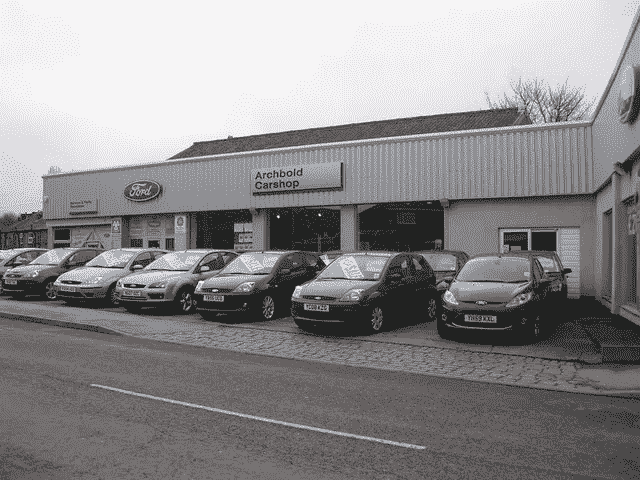
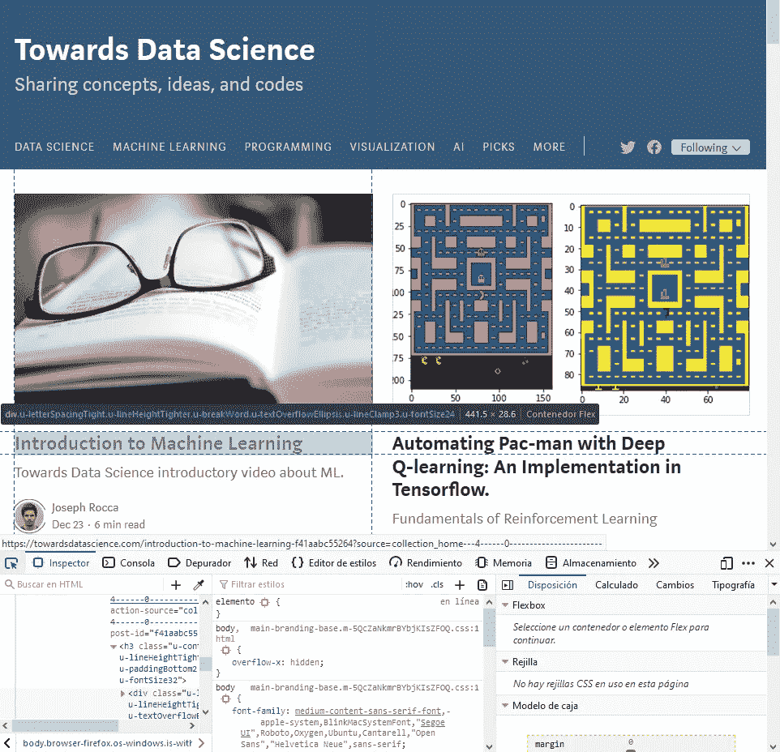
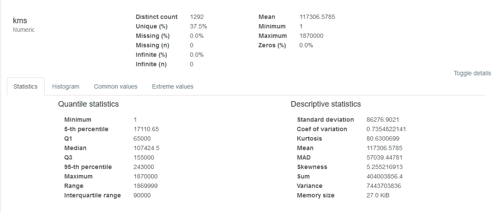
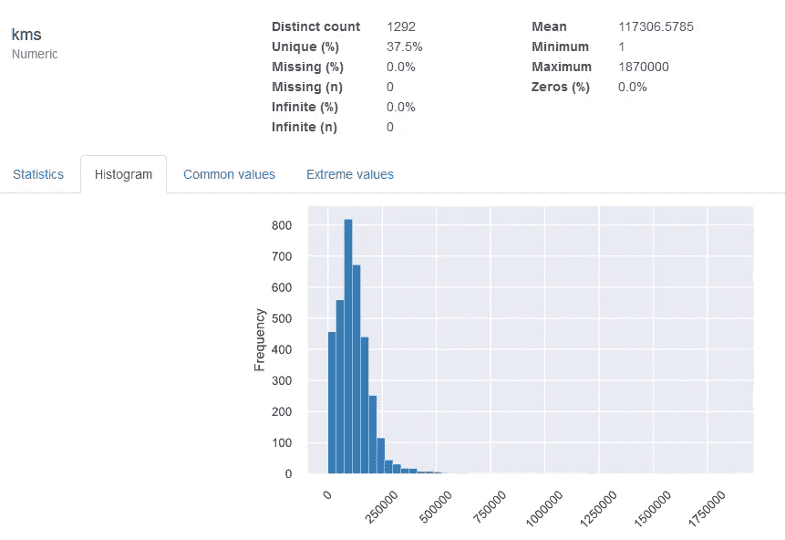
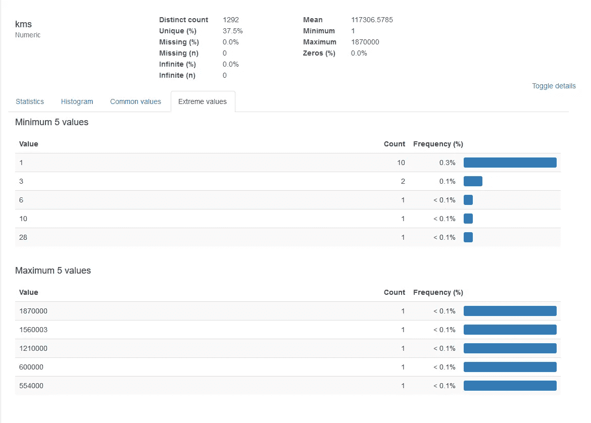
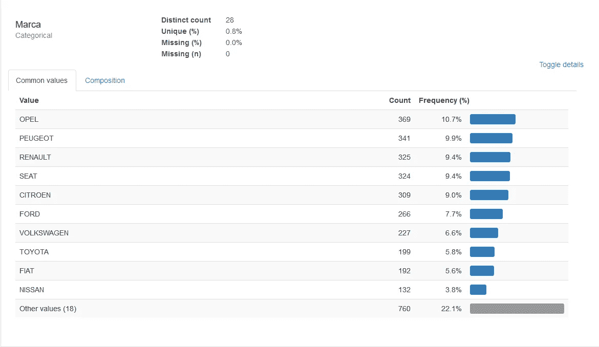
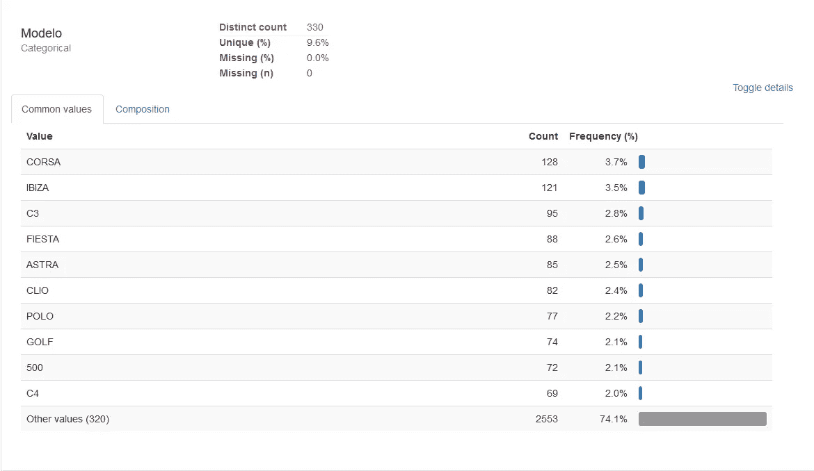
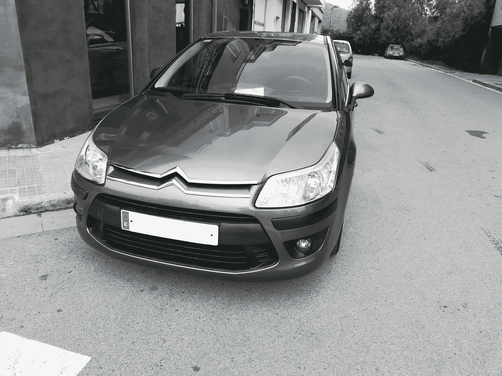

# 用于机器学习的网页抓取

> 原文：<https://towardsdatascience.com/web-scraping-for-machine-learning-5fffb7047f70?source=collection_archive---------14----------------------->



图片作者贝蒂·隆巴顿/ *阿奇博尔德汽车商店——教堂街* / [CC BY-SA 2.0](https://creativecommons.org/licenses/by-sa/2.0/)

买东西有个普遍规律，*“少花钱不如多花钱”*。出于个人原因，我需要买一辆二手车，但我并不着急，我有时间考虑并找到最好的交易。

在检查当地的二手车商店时，他们向我展示了价格在 7，000 至 10，000 欧元之间的汽车。这是一大笔钱，所以我想我应该利用我的数据科学技能来找到最好的交易。

# 数据采集

机器学习项目首先需要的是数据。你可以猜到，西班牙市场上没有二手车数据的数据集，即使有，也会因为价格不断变化而每个月都过时。

我从西班牙最受欢迎的二手车分类广告页面获得数据。出于隐私原因，我将对我使用的页面名称保密。用于搜索的限制如下:

*   **距离我:**不到 100 公里
*   **车龄:**10 年以下
*   **价格:**低于 10.000 欧元

让我们检查一下用于从这些网站收集数据的工具:

*   **urllib.request:** 使用 Python 标准库中的这个模块来下载网站的 html 代码。
*   **BeautifulSoup4:** 用这个模块解析 html 代码，找到相关信息。

我们需要下载两件东西，一个页面包含我们限制的可用汽车列表，另一个页面包含汽车的所有信息。

对于汽车列表，一些示例 URL 可能是:

[*https://www.adspage/cars-search/?location=Barcelona&最高价格=10000 &年起=2010*](https://www.adspage/cars/?location=Barcelona&uptoprice=10000&yearfrom=2010)

对于某辆汽车，URL 可能是这样的:

[【https://www.adspage/cars/?carid】](https://www.adspage/cars/?location=Barcelona&uptoprice=10000&yearfrom=2010)*= 141238*

我们使用 urllib 下载并保存这些页面:

```
from urllib.request import urlopendef download_and_save_page(url, file):
    html_code = urlopen(url).read()#.decode('utf-8')
    f = open(file, 'wb')
    f.write(html_code)
    f.close()
    return html_code
```

首先，我们删除包含汽车列表的页面，找到所有可用汽车的链接并下载它们。这很容易用 BeautifulSoup 的 **find_all** 方法完成

```
links = soup.find_all('a', href=True, class_='car-link')
for link in links:
    print(link['href'])
```

请记住，分类广告页面通常遵循分页系统，因此在每个页面中，我们都会列出一定数量的汽车(例如 20 辆)，为了让所有汽车可用，我们需要了解分页系统是如何工作的。通常我们只需在 URL 上添加一个页码，例如:

[*https://www.adspage/cars-search/?location=Barcelona&up price = 10000&year from = 2010&page*](https://www.adspage/cars/?location=Barcelona&uptoprice=10000&yearfrom=2010)*= 7*

使用此代码，我们可以创建一个汽车链接数据库，并将它们提供给下载功能，以使我们的 scraper 运行并下载包含所有可用汽车信息的页面。

下一步是处理所有下载的页面并提取汽车的相关信息。所有信息都保存在一个 CSS 文件中。我决定保存的数据是:

*   广告网址(以便以后我发现有趣的东西时手动检查)
*   汽车品牌
*   汽车模型
*   卖家类型(私人/专业)
*   价格
*   描述
*   年
*   Kms
*   出版日期
*   带图片的 URL 列表

我最终没有使用一些字段(描述和图片),因为它们增加了很多复杂性，但是它们可以包含相关信息，你可以通过查看图片来了解汽车的状况，描述多次谈到汽车的额外功能，可以提供相关信息(发动机损坏的部分)

提取数据主要是通过 BeautifulSoup 的 *find* 和 *find_all* 方法完成的，搜索页面上的相关字段。

```
soup.find('div', class_='car-price').get_text()
```

找到正确的类名很重要，我用 Firefox 的开发工具做到了这一点(用 Ctrl+Shift+C 打开检查器)。



使用检查器选择网站栏

使用检查器，我们选择页面上的所有相关字段，并记录它们的信息。

*   是元素、

    元素还是什么样的元素？

*   如何从所有同类元素中识别它们(惟一 id 或惟一类名)

连接所有这些元素，我们可以创建一个包含所有汽车数据的 CSV 文件。在我的例子中，CSV 文件是 5 MB，包含 3487 辆汽车的数据。该数据仅适用于 2019 年 12 月销售的汽车，并且符合我之前描述的搜索标准。获得更老的数据会很有趣，但在网上无法获得。

# 数据分析

现在到了有趣的部分，我们打开我们的 Jupyter 笔记本，开始分析数据。

```
#Load data
df = pd.read_csv('data/car_data.csv')
```

让我给你介绍一下 [Pandas Profiling](https://github.com/pandas-profiling/pandas-profiling) ，这是一个 python 模块，可以从 Pandas 数据帧生成报告。该报告为我们提供了数据集中所有变量的统计数据的快速可视化。

```
from pandas_profiling import ProfileReport
prof = ProfileReport(df)
prof.to_file('output.html')
```



kms 变量的统计信息



公里直方图



在极端值上，我们可以看到输入错误的值(超过一百万公里的汽车)

一些有趣的统计数据是在西班牙销售的最常见的品牌和型号:



快速可视化之后，我检查了数据集上不太常见的品牌，发现一些汽车品牌只有几个条目。我把它们删除了，因为这么少的数据会让它过度适合这些特定的品牌。

然后对品牌和型号应用一个热编码，最终得到 371 个变量。

使用训练/测试分割来检查 ML 模型的准确性，并使用 RMSE 来评估它们的性能。目标变量是汽车的价格。

我想谈论的车型是 XGBoost，它为 RMSE 和 KNN 提供了最佳价值，我发现这个应用程序很有趣，因为我们在搜索汽车价格时直观地将它与其他在售的类似汽车进行比较。

XGBoost:

```
import xgboost as xgb
model=xgb.XGBRegressor(random_state=1, n_estimators=5000, learning_rate=0.01)
model.fit(X_train, y_train)sqrt(mean_squared_error(y_val, model.predict(X_val)))
```

得到了 1.288，39 的 RMSE。请注意，这一幅度相当于欧元误差。这是一个很高的值，请记住，我们只查看价格超过 10.000 欧元的汽车，平均值为 7.226 欧元。

KNN:

```
from sklearn.neighbors import KNeighborsRegressor
knn = KNeighborsRegressor(n_neighbors=5)
knn.fit(X_train, y_train)sqrt(mean_squared_error(y_val, model.predict(X_val)))
```

即使我期望从这个模型的直观方法中得到好的结果，它也悲惨地失败了，给出了 7.242 的 RMSE。

# 结论

我从这个项目中得到的主要收获是，我可以找到与我在附近商店看到的一样好的汽车，并获得更好的价格，能够找到 4，000 至 5，000 英镑范围内的汽车，这是目前最划算的价格。

最后，我买了一辆我非常满意的雪铁龙 C4。



我买的车

我想提到的一些事情是，从分类广告页面提取的数据并不意味着以某一价格发布的汽车最终以该价格售出。大多数情况下，卖家在与买家谈过之后会降低价格，而这并没有反映在网站上。其他卖家可能会开出一个高得离谱的价格，但却无人问津，因为没有人愿意以这个价格购买他们的汽车。所有这些都使算法偏向于给出比真实价格更高的价格。

有很多广告缺少一些信息，有时他们缺少车龄，有时缺少公里数等。其他时候数据格式不佳，卖家没有在适当的字段中引入数据，最终导致数据点缺少大部分功能，但是他们在描述中以自己的格式引入所有这些数据，这是算法无法解释的。所有这些都会影响数据的质量，从而影响我们的结果。

改善这种分析的其他方法包括使用 NLP 从描述中添加信息，卖家有时会谈到汽车中包含的额外功能，有时会谈到汽车的发动机或状况，有时会说有机械问题。我相信从这些描述中可以提取出许多有趣的信息。另一种方法是使用计算机视觉从贴有广告的汽车图片中获得额外的信息，有时你可以看到汽车受到了一些影响，有时你可以看到汽车的内部，有时没有图片，这是一个不好的迹象。

这些仅仅是可以持续改善这个项目结果的许多途径中的一部分，然而在买了车之后，我感觉不到继续在这个项目上工作的动力。