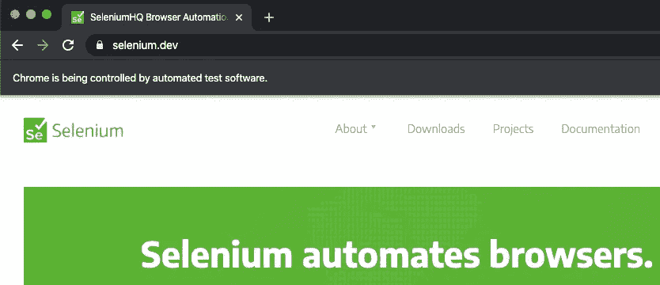

# Web 抓取:如何用 Selenium 处理日历

> 原文：<https://towardsdatascience.com/web-scraping-how-to-handle-a-calendar-with-selenium-862ce689a7d7?source=collection_archive---------5----------------------->


照片由[贾兹敏·奎诺尔](https://unsplash.com/@jazminantoinette?utm_source=unsplash&utm_medium=referral&utm_content=creditCopyText)在 [Unsplash](https://unsplash.com/search/photos/week?utm_source=unsplash&utm_medium=referral&utm_content=creditCopyText) 拍摄

## 学习使用 Python 工具来抓取 web

❝ … *时间过得很慢，但却过得很快…*❞—·爱丽丝·沃克

我坐在我最喜欢的沙发上看电视。嗯，说实话，我在频道冲浪。

也许没有什么有趣的东西可看，或者我太分心去想我在工作中不能解决的问题。

我把视线从电视上移开一分钟来回答一条信息。当我回头看屏幕时，它就在那里。我反复看的电影之一。

*等一下。等等，博士，你是说你用一辆德罗宁造了一台时光机？马蒂·小飞侠说*

"*依我看，如果你要把时间机器做成一辆汽车，为什么不做得有点风格呢？*”—医生回答

时间旅行。很多电影都在讲这个话题。我相信这是朋友们深夜闲聊的话题。

起初，我很高兴找到这部电影，因为我非常喜欢它。但后来，它提醒了我一个我无法解决的问题。

我并没有试图建造一台时间机器或者进行时间旅行。

我只是想在一个特定的网站上搜集历史数据。这个页面总是有相同的网址。但是当你从日历中选择不同的日子时，内容就变了。


如果选择新的日期，内容将会改变。但是，URL 地址将保持不变。

我当时真的很挣扎。我以前用 Scrapy 制作过刮刀(*如果你想了解更多，请阅读我的* [*以前的帖子*](/how-to-extract-online-data-using-python-8d072f522d86) )。

但是我知道这个 Python 框架有一些限制。其中之一是处理 Javascript。

我决定停止浏览频道。我开始阅读，突然，我找到了解决办法:*硒。*

S **elenium** 是一款方便的网络浏览器自动化工具。它能够打开选择的浏览器并模仿人类行为。

这意味着它可以执行点击按钮、填写表格或在网站上搜索信息等任务。很酷，*对不对*？

安装包也非常容易。我们需要使用正常的 pip 语法:`pip install selenium`。

但是还有一个额外的步骤需要完成。我们需要下载 [**Chrome 驱动**](https://sites.google.com/a/chromium.org/chromedriver/home) **。**这个 WebDriver 是一个用于自动化测试的开源工具，它提供了导航到网页、用户输入、JavaScript 执行等功能。

*注意下载与你的浏览器版本兼容的 ChromeDriver 版本*

***开始编码吧！***

首先，我们将导入我们需要的模块。

*   使用正则表达式的模块`re`
*   `BeautifulSoup`从网站上提取数据
*   `selenium.webdriver`启动浏览器
*   `selenium.webdriver.[ActionChains](https://www.selenium.dev/selenium/docs/api/py/webdriver/selenium.webdriver.common.action_chains.html)`实现鼠标移动等低级交互的自动化。

之后，我们需要创建一个新的 google chrome 实例。

我们将使用`webdrive.Chrome()`传递指向我们下载 ChromeDrive 的位置的 ***确切路径*** 作为参数。

然后，我们使用`.get()`方法将所需的 URL 作为参数传递。

如果我们运行这个，我们会看到一个新窗口打开，显示图例`Chrome is being controlled by automated test software`。



刮网站首先要做的是了解网站的结构。特别是，我们如何指示硒，如何选择不同的日期。

让我们检查网页 HTML 代码，重点是日历元素。

我们想取消过去两年网站的内容。这里有许多可以遵循的策略。

我们将指示 WebDriver 点击 n 次前一个`<`按钮。所以如果我们在`March 2020`想去`March 2018`，就要按 24 次按钮。

让我们重温一下关于 XPath 的知识。

[**XPath**](/how-to-extract-online-data-using-python-8d072f522d86#b874)**代表 XML 路径语言。跟网页抓取有什么关系？我们将学习如何识别 HTML 元素。但是现在出现的问题是*我如何向刮刀指出元素？答案是 XPath。***

**XPath 是一种特殊的语法，可用于浏览 XML 文档中的元素和属性。此外，它将帮助我们获得某个 HTML 元素的路径并提取其内容。**

**让我们看看这个[语法是如何工作的](https://devhints.io/xpath)。**

**`/`用于向前移动一个代，`tag-names`给出哪个元素的方向，`[]`告诉我们选择哪个兄弟姐妹，`//`查找所有后代，`@`选择属性，`*`是通配符，表示我们想要忽略标签类型？**

**如果我们看到下面的 XPath:**

```
Xpath = '//div[@class="first"]/p[2]'
```

**我们会理解，从所有(`//`)带有`class`"*"*"(`div[@class="first"]`)的`div`元素中，我们想要第二个(`[2]`)段落(`p`)元素。**

**幸运的是，web 浏览器有一种简单的方法来获取元素的 XPath。**

****

**我们复制元素的 XPath 并将其传递给函数`[.find_element_by_xpath()](https://selenium-python.readthedocs.io/locating-elements.html)`。**

**现在，是时候告诉 WebDriver 去点击这个元素了。我们通过从`ActionChains()`链接以下函数来实现:**

*   **`.click()`即会点击元素**
*   **`.perform()`即会执行动作**

****

**web 驱动程序应该如何按时返回**

**一旦日历回到 24 个月前，我们应该告诉 selenium 每天点击并抓取内容。**

**为了理解如何指向日元素，让我们再次检查网站。**

****

**看 HTML 代码。我们可以观察到不同的日期属性被赋予了不同的类值。**

**以灰色出现的日子，有`day disable`类。黑色的那一天，有类别`day`，选择的那一天(当前日期)有类别`active day`。**

**最后一个类对于当前日期属性是唯一的，所以我们可以用它从日历中选择当前日期。**

**首先，我们将列出所有具有包含单词`day`的 class 属性的元素。**

**这一次，我们将使用函数`[.find_element_by_class_name()](https://selenium-python.readthedocs.io/locating-elements.html)`指向这些元素。当我们想通过类属性名定位一个元素时，这很方便。**

**一旦我们有了那个列表，我们将循环这个列表。对于我们找到的每个元素，我们获取它的属性并询问它是否严格等于`day`。如果是，我们会告诉 webdriver 点击它。**

**我们将等待 5 秒钟，以便可以加载网站。**

**之后，我们将使用`BeautifulSoup`浏览网站。在这里，我们可以插入任何代码来删除网站的内容。我们可以使用`find()`或`findall()`方法。**

**一旦我们删除了内容，循环将移动到找到的下一个`day`元素。**

**请注意，我们每个月都需要这样做。所以一旦这个月的所有元素都循环了，我们就需要进入下个月。该过程与我们对上一个按钮所做的完全相同。**

**现在，我们将这个脚本保存在一个文件中(例如`selenium_script.py)`)。为了运行脚本并开始废弃，我们打开一个新的终端窗口。**

**我们需要转到文件所在的文件夹，然后键入:**

**`python3 selenium_script.py`**

**之后会弹出一个 Chrome 窗口。开始自动点击不同的日期。我们会看到这样的情况:**

****

**网络驱动程序将模拟选择不同的日期**

**一旦所有的网站和日期都被废弃，我们将在终端中看到以下消息:**

**`Process finished with exit code 0`**

**这意味着一切顺利，没有遇到错误。**

**如果我们指定了一个文件来保存网站的内容，我们现在可以转到该文件并检查废弃的内容。**

## ***现在，轮到你用 Selenium 刮网站了！***

**如果你想了解更多关于这个话题的内容，请查看以下帖子:**

**[使用 Selenium 的网页抓取简介](https://medium.com/the-andela-way/introduction-to-web-scraping-using-selenium-7ec377a8cf72)**

**[使用 Selenium-Python 进行网页抓取](/web-scraping-using-selenium-python-8a60f4cf40ab)**