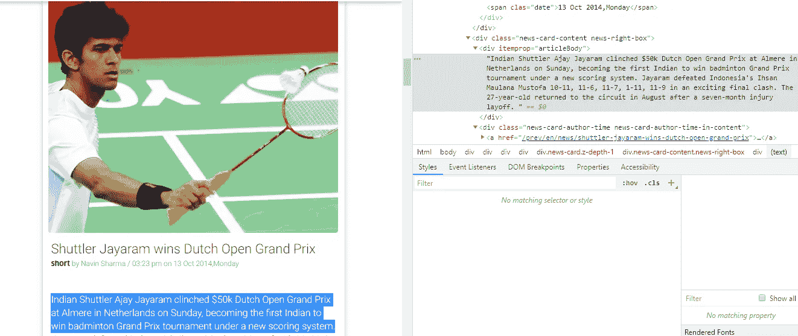
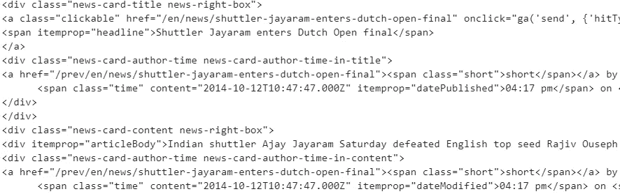
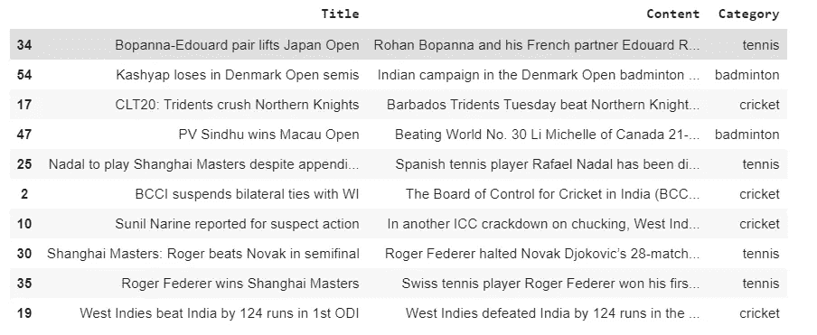

# 3 分钟内完成网页抓取

> 原文：<https://towardsdatascience.com/web-scraping-in-3-minutes-1c37830a29c1?source=collection_archive---------24----------------------->

# 简介:

数据，或任何种类的信息，是 21 世纪最宝贵的东西之一。数据是如此强大，以至于可以在许多方面利用它，例如预测未来的销售趋势以获取利润，在医疗保健行业中用于早期诊断结核病，从而挽救患者的生命，等等。因此，从不同来源提取有价值的数据是数据科学家应该掌握的关键技能之一。

在本文中，我们将学习如何使用 python 中的不同库从网站中提取数据。我们将使用 shorts 网站中的 [**来提取与板球、羽毛球和网球等不同运动相关的新闻文章。**](https://inshorts.com/)


照片由 [Florian Olivo](https://unsplash.com/@rxspawn?utm_source=medium&utm_medium=referral) 在 [Unsplash](https://unsplash.com?utm_source=medium&utm_medium=referral) 上拍摄

# 步骤 1:导入相关库

# 步骤 2:用漂亮的汤发出 Web 请求并解析

我们来看看某一类新闻的源代码[**这里**](https://inshorts.com/en/read/badminton) **。**

进入这个网页后，我们将看到不同的新闻，让我们集中在一个特定的新闻和它的源代码提取使用美丽的汤。

我们可以在右边看到新闻文章及其各自的源代码。我们将使用请求库和使用。在 url 上获取()以从网页访问 HTML 脚本。然后，我们将使用漂亮的 soup 库来解析 python 中的 HTML 语言。然后，进一步根据我们想要提取的信息类型，我们可以使用不同的 html 标签过滤信息，如使用

、。find()函数。

在完成上述步骤并解析 HTML 语言后，这个特定新闻的部分如下所示



在这种情况下，我们可以看到文章的标题位于这个类下-<**div class = " news-card-title news-right-box ">。**我们可以进一步看到标题存在于带有 attributes= "itemprop "和" headline "的< span >标签中。这可以通过使用。find()函数。

```
news1=soup.find_all('div', class_=["news-card-title news-right-box"])[0]title=news1.find('span',attrs={'itemprop':"headline"}).stringprint(title)We get the following output given below-Shuttler Jayaram wins Dutch Open Grand Prix
```

同样，如果我们要访问新闻内容，它位于这个类 **<下 div class = " news-card-content news-right-box ">。**我们可以进一步看到新闻的主体在于带有 attributes= "itemprop "和" articleBody "的< div >标签。这可以通过使用。find()函数。

```
news1=soup.find_all('div', class_=["news-card-content news-right-box"])[0]content=news1.find('div',attrs={'itemprop':"articleBody"}).stringprint(content)Indian Shuttler Ajay Jayaram clinched $50k Dutch Open Grand Prix at Almere in Netherlands on Sunday, becoming the first Indian to win badminton Grand Prix tournament under a new scoring system. Jayaram defeated Indonesia's Ihsan Maulana Mustofa 10-11, 11-6, 11-7, 1-11, 11-9 in an exciting final clash. The 27-year-old returned to the circuit in August after a seven-month injury layoff.
```

以类似的方式，我们可以提取任何信息，无论是图像、作者姓名、时间等。

# 步骤 3:构建数据集

让我们为 3 个不同的类别实现这一点，并将所有的文章、各自的内容和类别存储在一个数据框中。在本节中，我们将使用三个不同的 Url，然后我们将对每个 Url 执行相同的过程，并将所有文章、其内容、类别存储到一个列表中。

输出-



# 结论:

我们可以看到使用漂亮的 soup 库在 python 中实现 web-screwing 是多么容易。使用这种技术，我们可以轻松地收集优秀的数据，以便开始任何数据科学项目。

# 感谢阅读！

如果你喜欢我的工作，想支持我。支持我的最好方式就是在**媒体上关注我。**