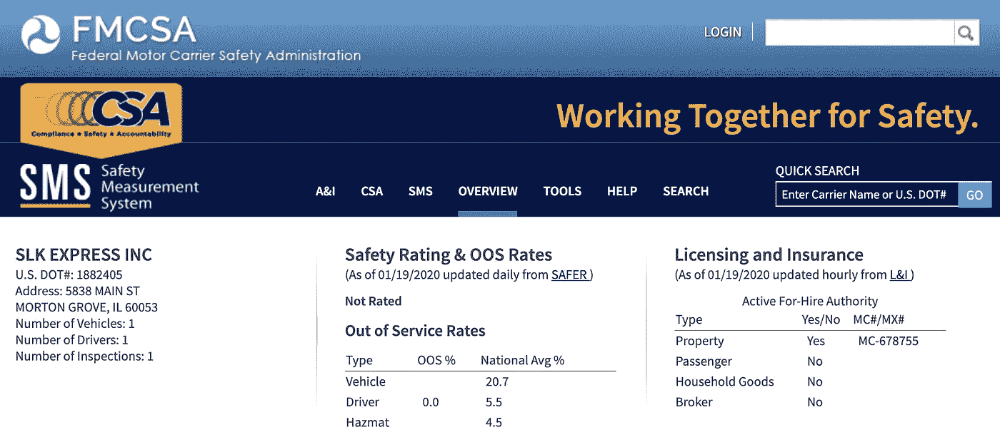
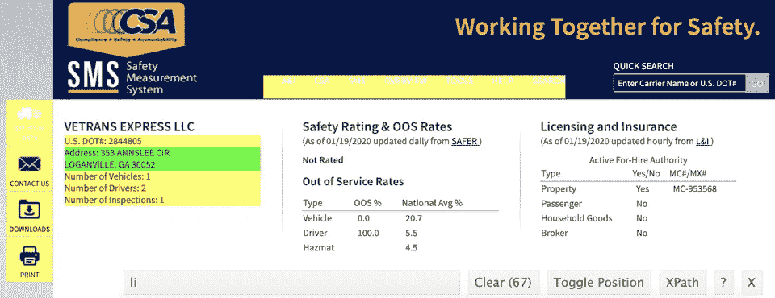
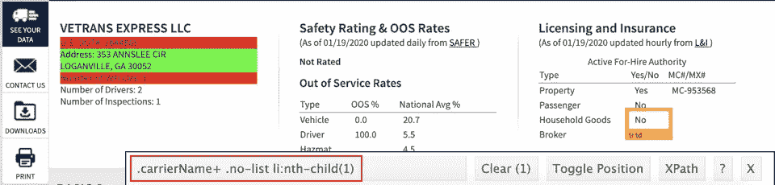
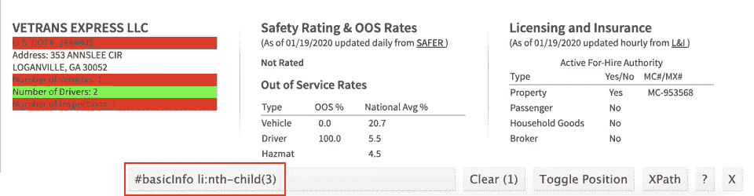
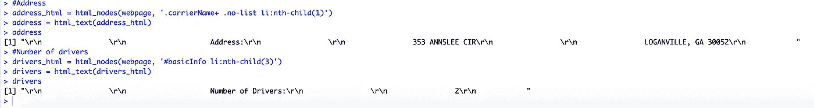
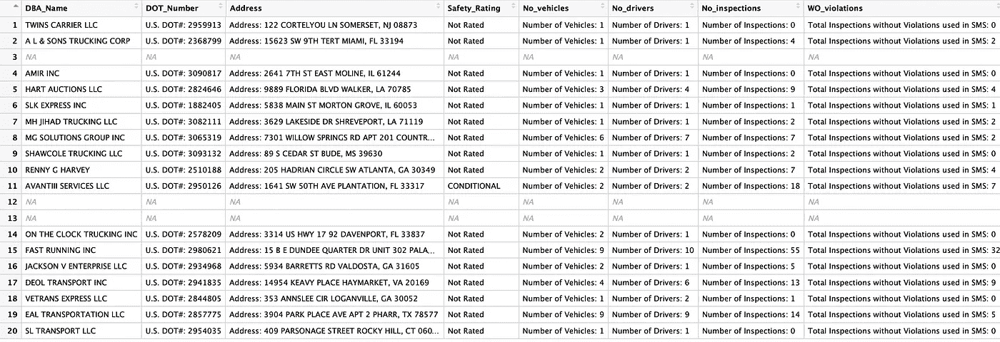
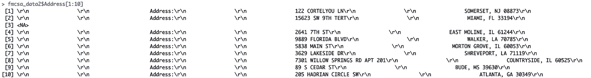
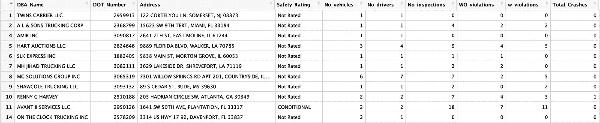

# 使用 CSS 选择器在 R 中抓取网页

> 原文：<https://towardsdatascience.com/web-scraping-in-r-using-rvest-and-selectorgadget-5fc5124547e?source=collection_archive---------17----------------------->

## *又名当客户做空你时如何获得更多数据*

*R 中的 Web 抓取比你想象的要容易——像 CSS 选择器和抓取库这样的工具可以快速完成工作。事实上，“最困难”的部分是识别元素的 CSS 路径，但是我将向您展示如何轻松地到达那里！*

我曾经有一个客户(美国的一家商业保险经纪公司)，他想要一个数据科学解决方案来提高他们的销售和转化率。看似直白？客户给我们的数据非常少——只有客户的唯一许可证号、销售结果(保单状态)和保费价格。

我开始在网上寻找相关数据的其他来源。客户的唯一许可证号是由美国政府交通部(DOT)颁发的 DOT 号。联邦汽车运输安全管理局(FMCSA)对与 DOT 编号相关的车辆和司机进行例行检查，并在其网站上发布报告。这是公共信息，不需要登录/密码即可访问。

*一个点号的 FMCSA 安全报告部分截图。*

像报告的撞车次数、车辆/驾驶员危险率这样的数据可以帮助优化保单保费，以增加客户购买保单的几率。

获得这一点需要 3 个步骤:

1.  识别感兴趣的元素，并获取它们的 CSS 路径。
2.  将抓取的元素压缩成一个数据帧。
3.  清理输出，然后将其连接到现有数据(由客户端提供)。

## 包和工具

我使用了 [rvest](https://cran.r-project.org/web/packages/rvest/rvest.pdf) 库和 CSS 选择器 [SelectorGadget](https://selectorgadget.com/) 来抓取网页。该工具可以作为浏览器的扩展下载，这样可以更容易地确定网页上每个元素的 CSS 路径。

## 定义 URL 和网页

我开始使用单点编号报告。报告的 URL 包含点号本身，这对于以后遍历点号列表非常有用。

## 检查感兴趣的元素

首先，我想收集每个点号的注册地址，以及它们拥有的驱动程序的数量。我需要这些元素的 CSS 路径——这告诉 scraper 要抓取的元素的精确位置。一个地址，如果你愿意的话。

打开 SelectorGadget 扩展——浏览器底部会出现一个框。选择屏幕上列出地址的区域。该工具将在屏幕上突出显示许多其他元素——此时它已经选择了 67 个其他元素。只需点击黄色元素，直到只剩下绿色的地址部分。(这只需要 3 到 4 次点击)。额外元素的每次“取消选择”都会将 CSS 路径更新到地址的精确位置。

现在 address 元素的 CSS 路径可用了。截图自[此处](https://ai.fmcsa.dot.gov/SMS/Carrier/2844805/Overview.aspx?FirstView=True)

现在“地址”是唯一突出显示的元素。红框里看似乱码的文字就是这个元素的 **CSS 路径**，这就是我们要传递给 rvest 去刮取的东西。

类似地，要获得驱动程序数量的 CSS 路径:

截图自[此处](https://ai.fmcsa.dot.gov/SMS/Carrier/2844805/Overview.aspx?FirstView=True)

将 CSS 路径传递给 rvest:

我们有产出了！它必须被清洗，很多，但它的工作！

现在我将为所有的点号刮取更多的元素。

## 遍历所有的点号

我利用了 URL 反映点号的事实-[https://ai . fmcsa . DOT . gov/SMS/Carrier/2844805/complete profile . aspx](https://ai.fmcsa.dot.gov/SMS/Carrier/2844805/CompleteProfile.aspx)

我创建了一个包含每个点号的 URL 的向量。

## 现在，刮！

最后一步将所有不同的元素组合成一个数据帧，称为 fmcsa_data。这将需要一些时间，取决于你有多少迭代。我建议把电脑插上电源，给自己泡杯茶。

## 清洁数据框

产生的数据帧并不美观——大量无关的文本隐藏了相关的信息。还有一些缺失的数据——FMCSA 网站还没有一些点号的报告，所以什么也没有收集到。

对数据的进一步观察也揭示了许多不可见的特征。

清理这些数据是一个简单的过程:

1.  删除空行。将每一列从因子转换为字符类型。
2.  删除地址的不可见字符。
3.  仅提取除地址、姓名和安全等级之外的所有列的数字。

清理后的 dataframe 就懂事多了！

这就是我们从成千上万份报告中整理出来的简洁明了的数据框架。

*我是帕洛阿尔托 ScoreData 公司的数据科学家。我非常热衷于有效的沟通——我热衷于将统计数据转化为对业务友好的、可操作的见解。我想让这个博客成为一个分享我一路走来所学到的一些东西的空间，所以一起来吧！*

[*https://www.linkedin.com/in/namrata-date/*](https://www.linkedin.com/in/namrata-date/)