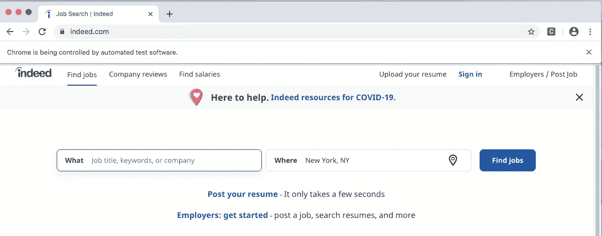
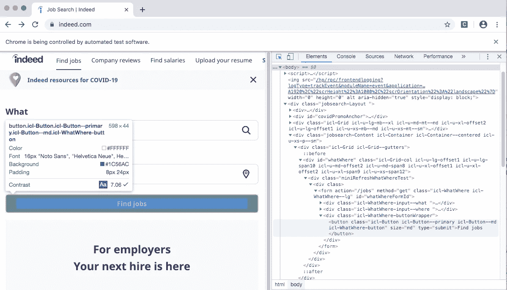
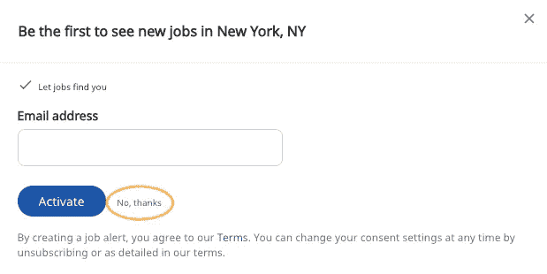
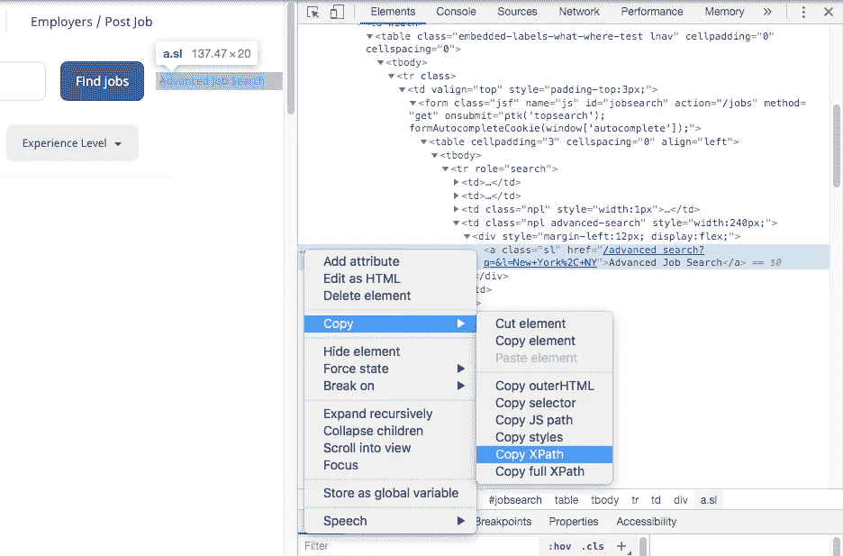
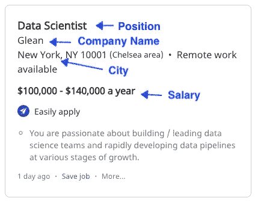

# 使用 Selenium 从 Indeed.com 收集招聘信息

> 原文：<https://towardsdatascience.com/web-scraping-job-postings-from-indeed-com-using-selenium-5ae58d155daf?source=collection_archive---------21----------------------->

## 使用 NLP 和神经网络的工作工资预测项目的第一部分


戴安娜·奥雷在 [Unsplash](https://unsplash.com/s/photos/web-scraping?utm_source=unsplash&utm_medium=referral&utm_content=creditCopyText) 上的照片

我希望在我的数据科学之旅的早期就知道如何进行网络搜集！这是一个非常方便的工具，打开了很多酷项目的大门。对于刚接触编码的人来说，这听起来可能有点难以接受。但是相信我，这比你想象的更容易，更直观！

这篇文章是我最近完成的一个更大项目的第一部分**，该项目旨在预测数据相关领域(数据科学、商业智能、分析等)的工作薪水。)通过文本分类和深度学习。为了构建模型，我需要收集大量的职位发布以及与职位发布相关的工资。**

因此，我决定从 Indeed.com 那里刮乔布斯。我正在使用的 API 叫做 [Selenium](https://selenium-python.readthedocs.io/installation.html) 。Selenium 广泛用于 web 自动化，它实际上非常容易安装和使用。您可以像这样安装 selenium:

```
pip install selenium
```

Selenium 需要一个驱动程序来连接 web 浏览器。你可以在这里找到 Chrome，Edge，Firefox 或者 Safari 的驱动。下载后，确保驱动程序与您的浏览器应用程序在同一路径。

## 进口硒

```
from selenium.webdriver.common.by import By
from selenium import webdriver
from selenium.webdriver.common.keys import Keysfrom selenium.webdriver.support.ui import WebDriverWait
from selenium.webdriver.support import expected_conditions as EC#specify driver path
DRIVER_PATH = '/Users/bonniema/Desktop/chromedriver'
driver = webdriver.Chrome(executable_path = DRIVER_PATH)
```

## 浏览页面

*driver.get* 方法将导航到 URL 给出的页面。执行此操作后，您将看到一个网页打开，表明 web 浏览器正在被控制。

```
driver.get('[https://indeed.com'](https://indeed.com'))
```



下一步是找工作。使用 Selenium 的一个好处是可以通过 ***id、名称或者 xpath*** 来识别一个项目或者按钮。在这种情况下，我想单击“查找工作”按钮。如果你检查页面，你可以看到 HTML 的“寻找工作”按钮。正如下图中突出显示的，我们可以看出按钮元素在一个<按钮>标签中，该标签在一个分隔线< div >下，该分隔线在 id="whatWhereFormId "的表单下。虽然您可以有不同的方法来标识按钮，但我将使用该表单 ID 来标识按钮。最好使用一个足够唯一的项目或属性(比如类),但是不要随时间而改变。



```
initial_search_button = driver.find_element_by_xpath
(‘//*[[@id](http://twitter.com/id)=”whatWhereFormId”]/div[3]/button’)initial_search_button.click()
```

## 关闭弹出窗口

单击“搜索”按钮后，会显示一个弹出窗口。我们可以用



```
close_popup = driver.find_element_by_id("popover-close-link")
close_popup.click()
```

## 执行高级搜索

在稍微摆弄了一下页面之后，我知道我想要执行高级工作搜索，在这里我可以指定搜索术语并设置每页显示的工作数量。查看 HTML 结构，看起来“高级工作搜索”被包装在一个标签中。一种方法是使用“contains”通过文本定位 xpath。

```
advanced_search = driver.find_element_by_xpath("//a[contains(text(),'Advanced Job Search')]")advanced_search.click()
```

另一种方法是右键单击该路径，检查是否可以直接复制 XPath。



似乎这个 XPath 不够通用，不能在这里使用。

```
//*[[@id](http://twitter.com/id)="jobsearch"]/table/tbody/tr/td[4]/div/a
```

## 输入搜索值

接下来，我们需要向搜索表单发送值。下面这段代码发送位置关键字，设置显示限制，并按日期对结果进行排序

```
#search data science 
search_job = driver.find_element_by_xpath('//input[[@id](http://twitter.com/id)="as_and"]')
search_job.send_keys(['data science'])#set display limit of 30 results per page
display_limit = driver.find_element_by_xpath('//select[[@id](http://twitter.com/id)="limit"]//option[[@value](http://twitter.com/value)="30"]')
display_limit.click()#sort by date
sort_option = driver.find_element_by_xpath('//select[[@id](http://twitter.com/id)="sort"]//option[[@value](http://twitter.com/value)="date"]')
sort_option.click()search_button = driver.find_element_by_xpath('//*[[@id](http://twitter.com/id)="fj"]')
search_button.click()
```

## 找到工作卡，立刻获得所有信息



我们的目标是从一个工作卡中获取职位、公司名称、城市和公司评级、工资(如果有的话)以及工作 url，然后迭代该页面上的所有工作卡。然后到下一页去刮更多的数据。

下面这段代码使用 for 循环遍历每页中的工作卡，并将相关信息保存在一个列表中。

现在繁重的提升部分已经完成了！

## 从个人网址获取职位描述

```
descriptions=[]
for link in links:

    driver.get(link)
    jd = driver.find_element_by_xpath('//div[[@id](http://twitter.com/id)="jobDescriptionText"]').text
    descriptions.append(jd)
```

把它们放在一个数据框里！

```
df_da=pd.DataFrame()
df_da['Title']=titles
df_da['Company']=companies
df_da['Location']="Palo Alto, CA"
df_da['Link']=links
df_da['Review']=reviews
df_da['Salary']=salaries
df_da['Description']=descriptions
```