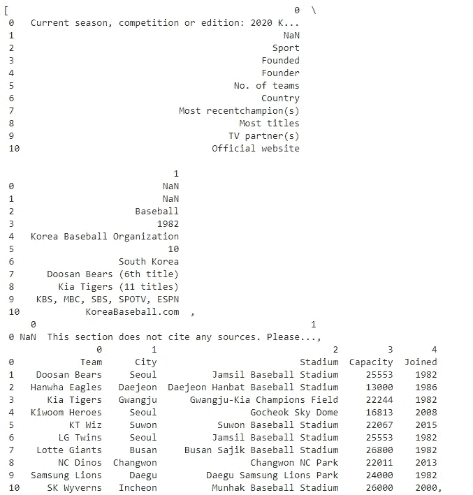
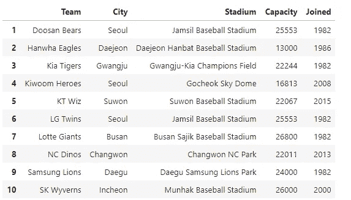
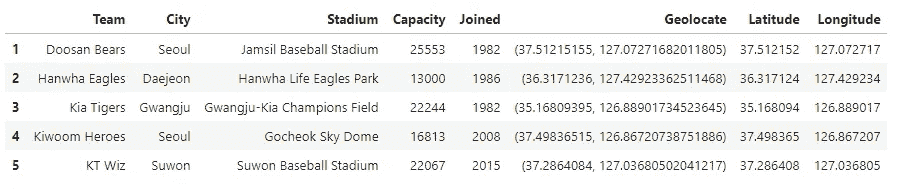
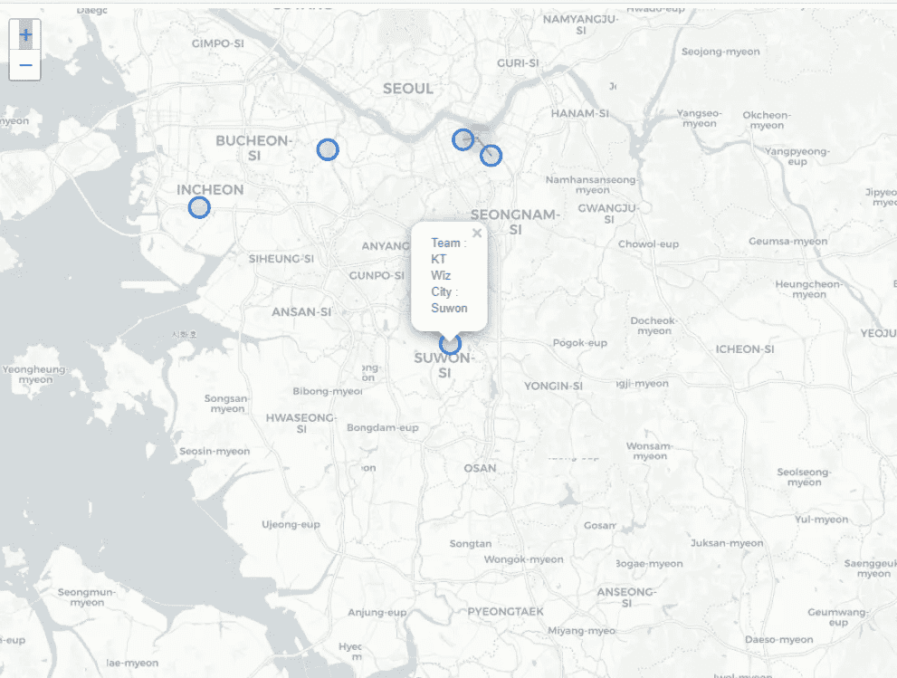
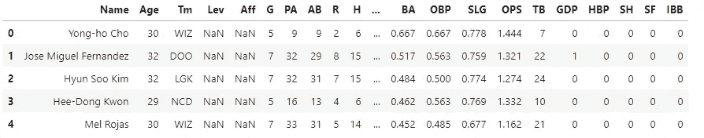
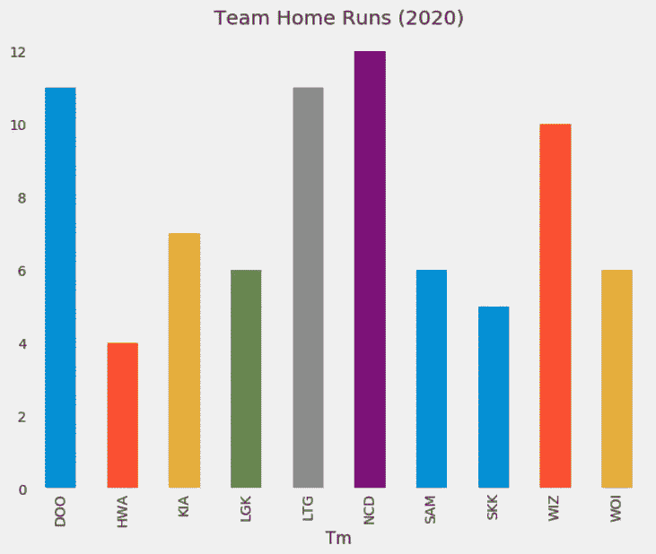

# 网页抓取—朝鲜棒球组织(KBO)

> 原文：<https://towardsdatascience.com/web-scraping-korea-baseball-organization-kbo-40bf6210a267?source=collection_archive---------65----------------------->

## 抓取网页，创建一个体育场的地图，球队发挥和可视化击球统计


[南韩蚕室棒球场](https://unsplash.com/s/photos/jamsil-baseball-stadium%2C-south-korea)(照片由[晓星崔](https://unsplash.com/@hyoshining)在 [Unsplash](https://unsplash.com/?utm_source=medium&utm_medium=referral) 上拍摄)

大约一周前，ESPN 开始转播朝鲜棒球组织(KBO)的比赛，自 3 月以来首次提供现场体育比赛。渴望现场表演的粉丝们，它提供了一些东西。除非你是丹([文](https://www.espn.com/mlb/story/_/id/29154712/meet-stay-home-dad-turned-international-expert-korean-baseball))那样的铁杆球迷，否则你不会对 KBO 队或球员很熟悉。因此，我尝试用数据科学和 Python 编程来介绍 KBO。

# KBO 队在哪里比赛？

KBO 是南韩最高的职业棒球联盟。它从 1982 年开始有六个队参加比赛，后来扩大到 10 个队。这是十支 KBO 球队和他们主场比赛的城市。

*   斗山熊队(首尔)
*   韩华鹰队(大田)
*   起亚老虎队(光州)
*   基武姆英雄(首尔)
*   KT Wiz(水原)
*   LG 双胞胎(首尔)
*   乐天巨人(釜山)
*   数控恐龙(昌原)
*   三星雄狮(大邱)
*   SK 双足飞龙(仁川)

**废弃 Wiki 页面以检索体育场名称**

KBO 维基页面提供了几个表格，其中一个包含球队名称和他们比赛的体育场。我们可以使用 Pandas 的 read_html 废弃这些表。Pandas 的 read_html 提供了一种将表读入 DataFrame 对象列表的简洁方法。

[](https://en.wikipedia.org/wiki/KBO_League) [## KBO 联赛

### KBO 联赛(韩语:KBO 리그)，原名韩国棒球锦标赛(韩语:한국야구선수권대회；罗马化…

en.wikipedia.org](https://en.wikipedia.org/wiki/KBO_League) 

```
wikipage = "[https://en.wikipedia.org/wiki/KBO_League](https://en.wikipedia.org/wiki/KBO_League)"
result = pd.read_html(wikipage)
result
```

检查结果后，我们可以看到第三个表包含球队、城市、体育场、容量和加入。



在选择了第三个表并用第一行替换了标题之后，我们有了一个显示体育场信息的熊猫数据帧。

```
#df = third table
df = result[2]#change top row to header
df.columns = df.iloc[0]
df = df[1:]
df
```



**从体育场名称获取地理编码**

使用 geopy 的地理编码器，我们可以只传递体育场的名称来检索纬度和经度。我不得不把“大田汉巴特棒球场”替换为“韩华生命鹰公园”，因为地理定位器无法识别前者。

```
def geolocate(loc):
    try:
        loc = geolocator.geocode(loc)
        # Return latitude and longitude
        return (loc.latitude, loc.longitude)
    except:
        # Return missing value
        return np.nandf['Geolocate'] = df['Stadium'].apply(geolocate)
```



**创建地图**

在我们检索了每个体育场的纬度和经度之后，我们可以使用 yellow 来创建球队比赛的地图。

```
import folium
from folium.plugins import MarkerCluster

#empty map
m= folium.Map(tiles="cartodbpositron")marker_cluster = MarkerCluster().add_to(m)for i in range(len(df)):
        lat = df.iloc[i]['Latitude']
        long = df.iloc[i]['Longitude']
        radius=10
        popup_text = """Team : {}<br>
                     City : {}<br>"""
        popup_text = popup_text.format(df.iloc[i]['Team'],
                                   df.iloc[i]['City']
                                   )
        folium.CircleMarker(location = [lat, long], radius=radius, popup= popup_text, fill =True).add_to(marker_cluster)#show the map
m
```

五个队在汉城或附近比赛，另外五个队在韩国南部比赛。


周围的首尔区域被缩放，并且显示了带有球队名称和城市的 folium 标记。



# 刮 KBO 统计

这篇文章([网络搜集 NBA 数据](/web-scraping-nba-stats-4b4f8c525994))提供了一个从篮球参考网站搜集 NBA 数据的极好的教程。类似地，我们可以删除 Baseball-Reference.com 的棒球统计数据，因为该网站提供了包括 KBO 在内的全面的球队和球员统计数据。

下面的代码块将 2020 年 KBO 的击球统计数据抓取到一个熊猫数据帧中。

然而，抓取的熊猫数据帧的数据类型是对象。我们可以将非对象类型转换成数字，以便以后可视化。



我们现在可以可视化团队本垒打或任何其他你想要的统计数据。



# 摘要

总而言之，从维基百科中抓取一个表格，然后用于创建一个地图，从棒球参考中抓取当前击球数据。希望这能提供一些有价值的信息。下面你可以找到更多的资源，如如何观看。希望你也喜欢这些现场棒球比赛！

[](https://www.espn.com/mlb/story/_/id/29136672/kbo-espn-schedule-how-watch-teams-korea-baseball-league-more) [## ESPN 时间表上的 KBO，如何观看，朝鲜棒球联盟的球队等等

### 韩国棒球组织的常规赛季正在进行中，这意味着是时候进行一些现场棒球比赛了——

www.espn.com](https://www.espn.com/mlb/story/_/id/29136672/kbo-espn-schedule-how-watch-teams-korea-baseball-league-more) [](http://www.mykbo.net/) [## MyKBO.net

### 致力于韩国棒球组织(KBO)和韩国棒球的一个地点。韩国棒球时间表，统计数据…

www.mykbo.net](http://www.mykbo.net/) [](https://www.nytimes.com/2020/05/05/sports/baseball/coronavirus-baseball-korea-opening.html) [## 在电视上看韩国棒球？让我们来帮忙

### 有很多蝙蝠翻转，但吐痰是不允许的。这里有一批球员要留意谁可能会登陆…

www.nytimes.com](https://www.nytimes.com/2020/05/05/sports/baseball/coronavirus-baseball-korea-opening.html)