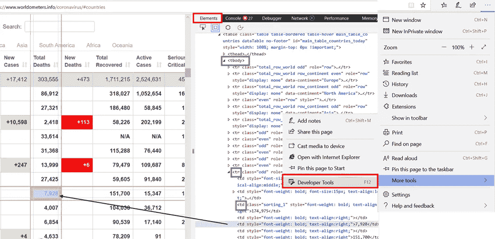

# 网页抓取—制作您自己的数据集

> 原文：<https://towardsdatascience.com/web-scraping-make-your-own-dataset-cc973a9f0ee5?source=collection_archive---------21----------------------->


图片鸣谢:[巨蟒](https://www.python.org/about/)、[请求](https://requests.readthedocs.io/en/master/)、[巨蟒](https://jupyter.org/)、[美瞳](https://www.crummy.com/software/BeautifulSoup/)

尽管有许多资源可以获得所需的数据集，但最好还是有一个自己创建的数据集。在当前新冠肺炎的场景中，我发现了关于[worldometers.com](https://www.worldometers.info/coronavirus/#countries)的有趣数据。它显示了一个包含案例总数、已执行测试总数、已关闭案例总数等的表格。该表每天更新。

出于好奇，我想在自己的数据集中包含这些新冠肺炎数据。在基本 python 库、pandas、numpy 和 BeautifulSoup 的帮助下，我决定将这些数据收集到我自己的数据集中。由于我成功地创建了数据集，我想与大家分享我的故事。因此，我将带你浏览我的笔记本。

> *网页抓取是从网页中收集信息的过程*。

当手动收集大量数据时，需要大量的时间和精力。如果要收集的数据来自定期更新的网页，这将是非常激烈的。因此，最好有一个脚本，它可以自动从网页中提取数据，并以所需的格式存储。

你所需要的是一个 python 包来解析来自网站的 HTML 数据，以表格形式排列它，并做一些数据清理。有几十个软件包可以完成这项工作，但我的故事继续与 BeautifulSoup。

**美丽组图**

它是一个 python 库，使我们能够从网页中抓取所有内容。假设有一个网页包含一些有趣的信息，但没有提供直接下载数据的方法。BeautifulSoup 提供了一套工具来从网页中提取数据，并定位隐藏在 HTML 结构中的内容。

*让我们开始创建自己的数据集……*

**第一步:安装所需的软件包**

您需要 *requests* 包，它允许您使用 Python 发送 HTTP 请求。如果你已经预装了，你只需要导入它。否则，您需要使用 pip 安装程序来安装它。

```
pip install requests
pip install beautifulsoup4
```

我使用 Python 内置的 HTML 解析器将网站输入的文本数据转换成复杂的解析树，可以进一步处理得到所需的数据。如果你想使用不同的解析器，在这里[你可以找到一个](https://www.crummy.com/software/BeautifulSoup/bs4/doc/#installing-a-parser)助手。

一旦你安装了所有的包，把它们导入到你的脚本中。

```
import pandas as pd
import numpy as np
import requests
from bs4 import BeautifulSoup
```

**第二步:BeautifulSoup 构造器**

BeautifulSoup 构造函数接受 2 个输入参数

*   字符串—它是您要解析的标记。这个标记是使用 python `requests`包的 get()方法获得的。这个 get()方法返回包含服务器对 HTTP 请求的响应的`requests.Response()`对象。此外，此响应对象的 text 方法获取响应的内容。整个字符串作为 BeautifulSoup 构造函数的第一个参数传递。
*   解析器—它是您想要用来解析标记的方法。您需要提供解析器的名称。我使用了 python 内置的 HTML 解析器。

```
website='[https://www.worldometers.info/coronavirus/#countries'](https://www.worldometers.info/coronavirus/#countries')
website_url=requests.get(website).text
soup = BeautifulSoup(website_url,'html.parser')
```

好了..在 3 行代码中，您将所需网页的所有内容都输入到了笔记本中。



图 1:开发者工具中的信息

开发者工具中来自元素标签(红色标记)的所有 HTML 文本都将存储在 BeautifulSoup 对象`soup`中。如上图 1 所示，当你在元素标签中滚动特定行时，它会在网站的实际表格中高亮显示相应的单元格。

**第三步:熊猫数据框**

为了制作 Pandas DataFrame，我们需要将对象`soup`中的所有文本数据转换成表格格式。在上面的图片 1 中，我还标记了 3 个绿色矩形。这些是你需要在汤里找到的术语。

让我们简单理解一下，这些术语是什么意思—

*   `<tbody>`:指定网页上的表格。
*   `<tr>`:指向该表中的特定行。
*   `<td>`:指向该行的特定单元格。

在 python 脚本中，您将使用 object `soup`的方法在解析的文本中查找这些术语。

```
my_table = soup.find('tbody')
```

变量`my_table`将包含网页上的表格，但仍然是 HTML 格式。它包含另外两个术语`<tr>`和`<td>`，分别指向单独的行和单元格。在下面的代码中，您将把这个`my_table`转换成包含列和值的实际表格。

请注意，下面这段代码是 2020 年 4 月写的。稍后，请检查网站上的列的顺序，并相应地修改代码。

```
table_data = []for row in my_table.findAll('tr'):
    row_data = [] for cell in row.findAll('td'):
        row_data.append(cell.text) if(len(row_data) > 0):
        data_item = {"Country": row_data[0],
                     "TotalCases": row_data[1],
                     "NewCases": row_data[2],
                     "TotalDeaths": row_data[3],
                     "NewDeaths": row_data[4],
                     "TotalRecovered": row_data[5],
                     "ActiveCases": row_data[6],
                     "CriticalCases": row_data[7],
                     "Totcase1M": row_data[8],
                     "Totdeath1M": row_data[9],
                     "TotalTests": row_data[10],
                     "Tottest1M": row_data[11],
        }
        table_data.append(data_item)
```

现在您得到了`table_data`，它实际上是一个包含列和值的表。这个表现在将被转换成一个熊猫数据帧`df`。

```
df = pd.DataFrame(table_data)
```

注意，在这个数据帧中，所有的列都是 object 类型。此外，这些物品中还有一些不需要的字符，如 `/`、`\n`、`|`、`+`。所有常用的数据清理过程现在都可以在上面使用。

根据个人需求，您可以从原始数据帧中提取不同的列和行，根据需求对其进行清理和转换。

这种数据的收集、评估、清理和转换被称为*数据争论*过程。这里有一个关于数据争论过程的有趣的可视化快速阅读。

[](/data-wrangling-raw-to-clean-transformation-b30a27bf4b3b) [## 数据争论—从原始到干净的转变

### 简单的三个字的解释

towardsdatascience.com](/data-wrangling-raw-to-clean-transformation-b30a27bf4b3b) 

**第四步:导出到 Excel**

然后，可以使用 pandas 将经过清理和转换的最终数据帧导出到 excel。

```
df.to_excel('Covid19_data.xlsx', index=True)
```

总之，您为新冠肺炎创建了自己的数据集。

您还可以通过抓取不同的网页来创建多个数据集，并最终将所有数据集组合在一起。想了解更多关于组合不同数据集的信息吗？？

在这里，我有一个关于 Python Pandas 中合并选项的简单的 4 分钟阅读。你需要记住的只是下面文章的最后一张图，解释了所有类型的数据集 join 操作。

[](/join-the-tables-ab7fd4fac26b) [## 加入表格

### 了解 Python pandas 中的 merge()和 concat()

towardsdatascience.com](/join-the-tables-ab7fd4fac26b) 

使用 Matplotlib Python 库可以很容易地可视化这种自行创建的数据集，并且可以很容易地定制可视化，如下文所述。

[](https://medium.com/analytics-vidhya/matplotlib-a-layered-data-visualization-library-870d992ff4b5) [## matplotlib——一个分层的数据可视化库

### 使用 Matplotlib 了解地块定制的简单方法

medium.com](https://medium.com/analytics-vidhya/matplotlib-a-layered-data-visualization-library-870d992ff4b5) 

**通过我的故事……**

我带你通过 4 个简单的步骤将一个网页抓取到一个 excel 表格中。我演示了如何使用简单易用的 BeautifulSoup 包抓取网页，并将这些数据转换成熊猫数据帧。完整的笔记本可以在我的 [Github](https://github.com/17rsuraj/COVID-19_Analyse/blob/master/COVID-19_Data.ipynb) 个人资料中找到。

这里有一些资源，可以帮助你解决这个问题

*   [美丽组图](https://www.crummy.com/software/BeautifulSoup/)
*   [请求](https://requests.readthedocs.io/en/master/)
*   熊猫
*   [网页抓取](https://developer.ibm.com/technologies/analytics/tutorials/scrape-data-from-the-web-using-watson-studio/)

欢迎您随时提出反馈意见，并通过 [LinkedIn](https://www.linkedin.com/in/surajgurav17/) 与我联系！！！