# 网络抓取 NBA 2k 数据

> 原文：<https://towardsdatascience.com/web-scraping-nba-2k-data-d7fdd4c8898c?source=collection_archive---------40----------------------->


照片来自 Pixabay，作者为 [Rochigb](https://pixabay.com/users/rochigb-232681/)

## 这是一个学习宝贵的数据科学技能的实践示例

并不是所有值得分析的数据都打包好了(我正看着你呢，Kaggle)。最终，在您的数据科学之旅中，您会发现自己在寻找一个并不存在的数据集。是吗？

进入:网页抓取。

网络抓取是从网页中获取数据的一个非常有价值的工具。抓取不是手动收集信息，而是自动获取和存储数据。它涉及一个网页:

*   从语法上分析
*   重新格式化
*   复制到电子表格中

**入门**

此时，您可能想知道可以使用哪些库来开始 web 抓取。有多种选择，但最常见的库和框架是:

*   要求
*   美味的汤
*   硒
*   Scrapy
*   LXML

在本教程中，我们将使用以下库:

*   熊猫
*   要求
*   美丽的声音
*   有平面的

第一步是导入上面的内容:

**查看网页**

网站包含许多不同的元素，因此检查网页以了解 python 代码应该以哪些元素为目标非常重要。

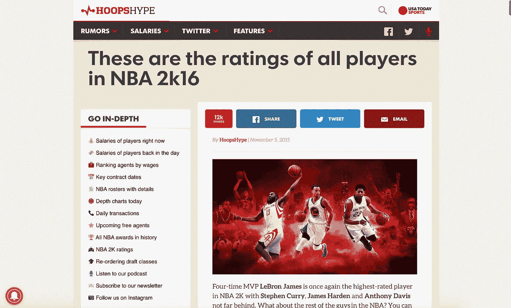

像 HoopsHype 这样的网站定期收集体育数据并发布。

我们将关注 2016 年 NBA 2K 收视率。这将是基于篮球评级的数据可视化或机器学习项目的伟大先驱。

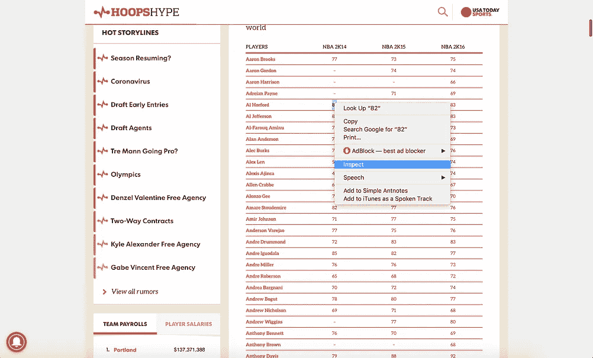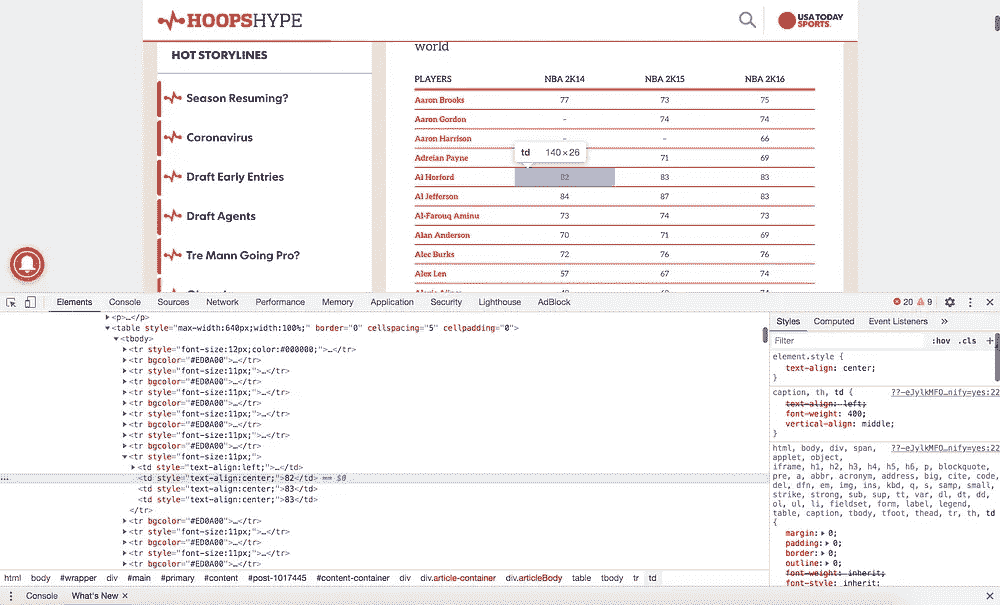

检查一个网站将揭示其源代码

要轻松检查网站，请将光标放在包含数据的元素中或突出显示该元素。然后，右键单击并选择“Inspect”来访问站点的源代码。如果数据存储在一个表中，您将会知道，因为像表行()和数据单元格()这样的标记不是实际的元素。

下面是一个数据单元格标签示例:

```
<td style=”text-align:center;”>71</td>
```

下面是一个表格行标签的例子:

```
<tr style=”font-size:11px;”></tr>
```

**解析网页**

解析的第一步是获取你想要抓取的网页的 url。接下来，使用 requests get()方法查询页面。这将返回一个请求。响应对象。

让我们创建一个漂亮的对象。这将表示已解析的页面。使用“美化”方法可以让我们更好地看到嵌套标签，但这不是必需的。LXML 是 BeautifulSoup 可以使用的 XML 和 HTML 解析器。这增加了额外的功能，尤其是涉及字符串处理的功能。

调用 BeautifulSoup 对象应该会产生页面的源代码:

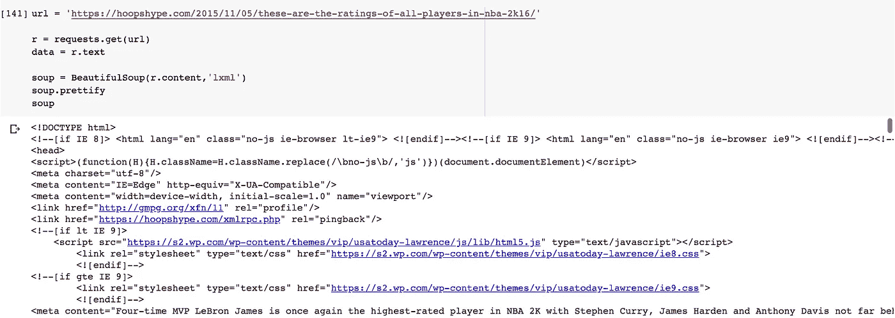

解析页面的最后一步是定位我们想要的表。我们需要选择源代码中的第一个表(因此是[0])。如果您的目标表是源代码中的第二个表，您应该使用[1]等等。

Pandas 中的 read_html 方法返回一个数据帧列表，这对下一步很重要。

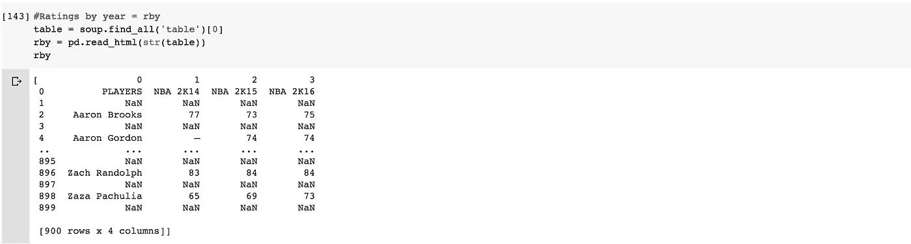

**重新格式化数据**

现在我们有了一个数据帧的列表，我们需要以一种有意义的方式重新格式化数据。让我们打印 read_html 方法返回的内容:

调用 to_json 方法会将传递的对象转换成一个 *JSON 字符串*。orient 参数告诉方法预期的 *JSON 字符串*格式。我们选择'*记录*指示，因为我们知道 read_html 方法返回一个列表，并且列表相对容易操作。处理其他适应症是可行的，但更困难。

因为我们最终想要一个有不同数据行的数据帧，我们需要*制表*(排列)数据。

我们将数据帧列表的第一个元素(唯一的数据帧)制成表格。

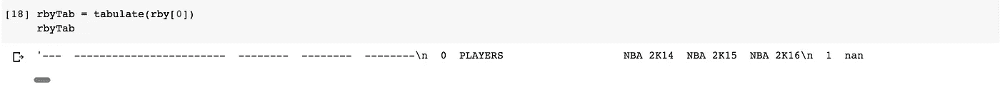

因为我们现在可以看到新的行字符(\n)，所以让我们将每一行拆分到它自己的列表中。

数据开始变得越来越清晰。

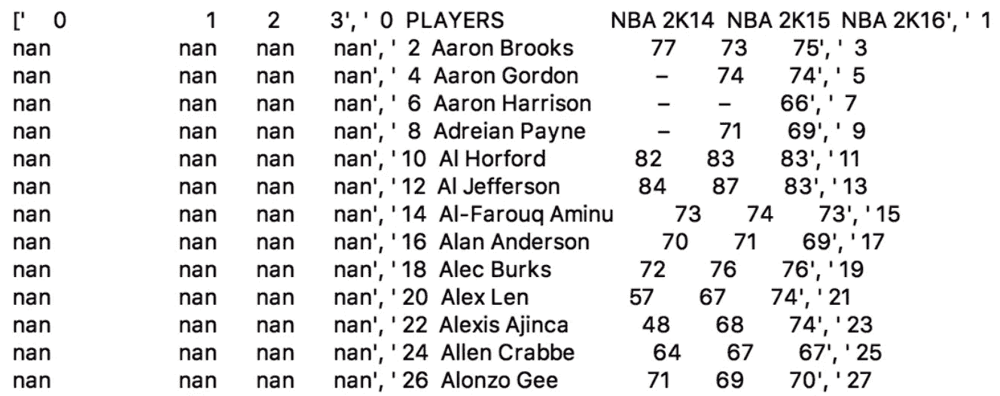

现在每一行都是一个列表元素

最后，让我们通过按空格字符拆分来将每一行拆分成单元格。

这导致破折号*和*成为额外的第一行。

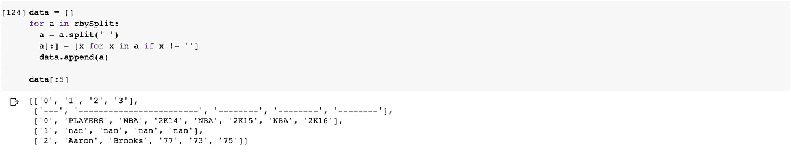

我们可以使用 pop()函数轻松删除行。

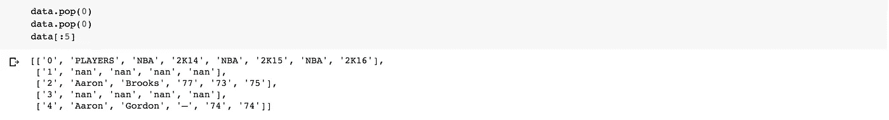

**将数据复制到数据帧中**

将数据复制到 Pandas 数据帧并检查输出非常简单。

我们还需要几个步骤来准备这个表，以便进行分析。

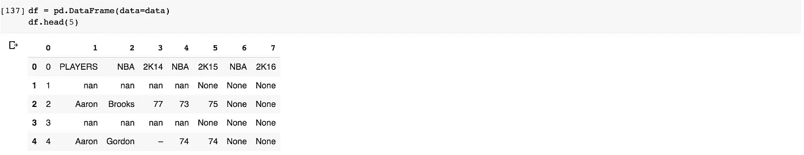

首先，每隔一行用 NaN 值填充。让我们重新定义 DataFrame，只取每隔一行。

我们还需要删除第一列、最后两列和第一行，因为它包含标题值。

DataFrame 现在没有多余的列或行了！

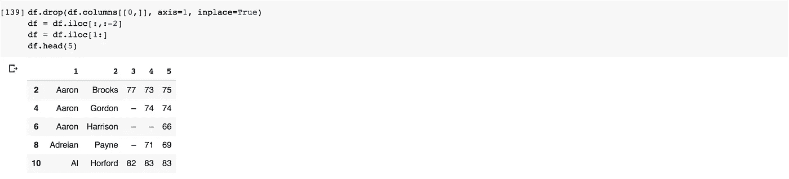

如果需要，您可以重命名这些列。

该表现在可以进行分析了！

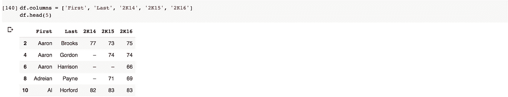

如果您想将数据帧写入 csv，可以通过 to_csv 函数来完成。

现在我们已经有了分数和球员的名字，我们可以绘制这些数据了。我用了 Plotly。

这里没有惊喜。

2016 年得分最高的球员是**勒布朗詹姆斯**。现在它已经被清理了，您可以用这些数据做更多的事情！

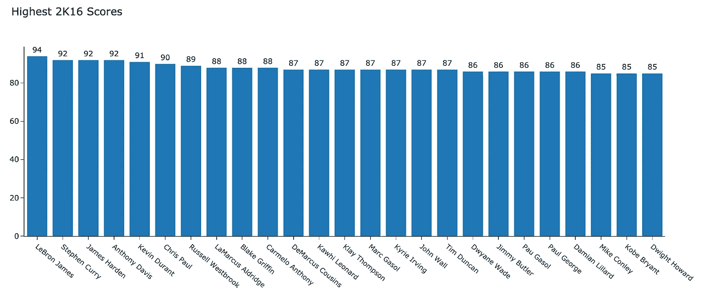

**结论**

以下是最终代码:

本教程涵盖了:

*   常见的 web 抓取库
*   使用 BeautifulSoup 和 LXML 解析 HTML
*   将数据复制到熊猫数据框架中
*   修复网页抓取的常见错误
*   导出 web 抓取的数据

网络抓取是利用数据和练习熊猫技能的好方法。这是为机器学习或可视化项目获取数据的一种很好的方式。