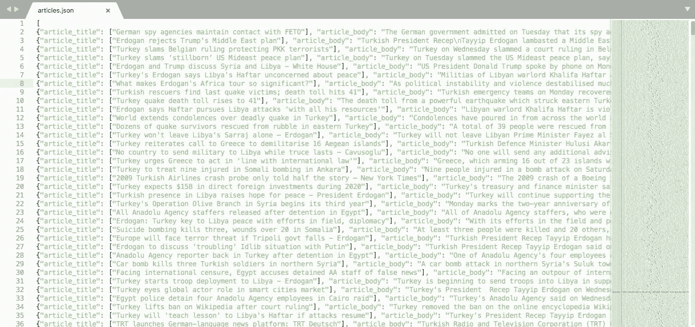
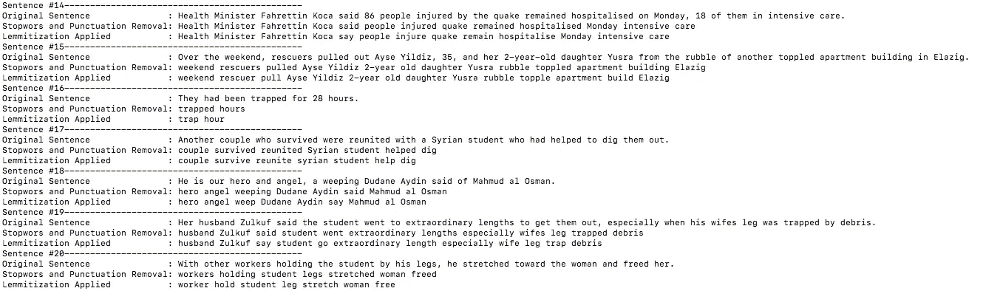
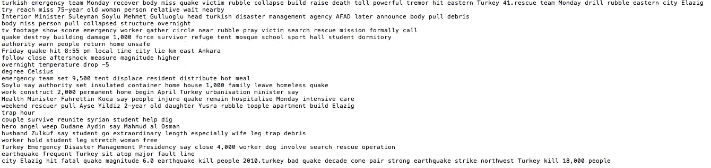
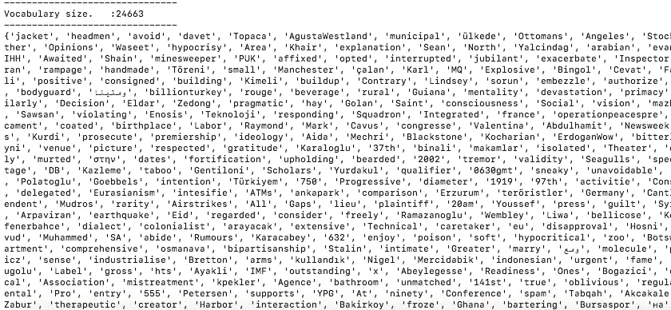
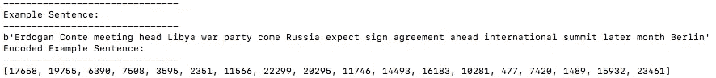
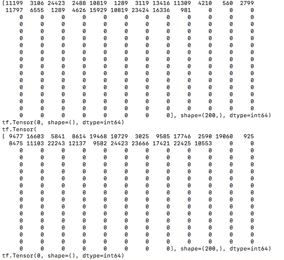
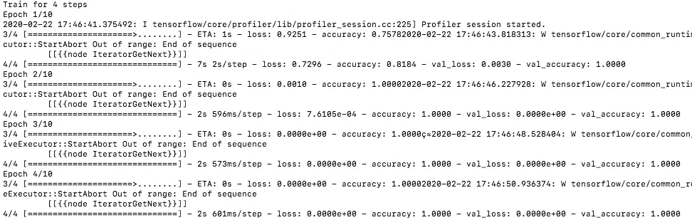

# Web 抓取新闻文章以构建 NLP 数据管道

> 原文：<https://towardsdatascience.com/web-scraping-news-articles-to-build-an-nlp-data-pipeline-92ec6083da2?source=collection_archive---------7----------------------->

## Tensorflow 2.0、Scrapy 和 SpaCy 的 3 个简单步骤！


照片由 [Marija Zaric](https://unsplash.com/@simplicity?utm_source=medium&utm_medium=referral) 在 [Unsplash](https://unsplash.com?utm_source=medium&utm_medium=referral) 上拍摄

尽管可以使用现成的数据集进行实验，但是生成 NLP 数据管道可以进一步提高您的技能，并在项目选择上给予您更多的自由。

在这篇文章中，我将从头到尾解释我的 NLP 数据工作流程。我在下面列出了我在工作流程中使用的三个开源 Python 框架；

*   [**刺儿**](https://scrapy.org/) 用于从网页中提取原始文本数据
*   [**空间**](https://spacy.io/) 用于清理和规范化文本
*   [**tensor flow 2.0**](https://www.tensorflow.org/)用于构建数据管道

完整的工作流程将通过 3 个易于遵循的步骤进行解释。我的 [GitHub 资源库中提供了完整的源代码。](https://github.com/eisbilen/NLPDataPipeline)

让我们从第一步开始。

# 步骤 1 — Web 抓取:从 Web 中提取原始文本数据

我决定从 [**TRT World 网站**](https://www.trtworld.com) 上抓取新闻文章，使用抓取的文本数据来试验几种 NLP 算法和数据管道概念。

我的目标是收集大约 2000-3000 篇文章，并将它们存储在一个 JSON 文件中。

为此，我创建了一个 **Scrapy** 项目并生成了 2 个蜘蛛；一个用于提取文章链接，另一个用于提取文章标题，以及使用上一步中捕获的链接的正文。

让我们安装 Scrapy 并开始我们的 Scrapy 项目。

```
**# Install the scrapy**
$ pip install scrapy**# Start web scraping project with scrapys**
$ scrapy startproject TRTWorld
$ cd TRTWorld**TRTWorld $** scrapy genspider Articles trtworld.com
**TRTWorld $** scrapy genspider ArticleScraper trtworld.com
```

我们的第一个蜘蛛是 **"Articles.py"** ，它将通过访问 500 个网页来获取文章链接。它将提取每个页面上可用的文章链接的 href 信息，并将它们存储在一个 JSON 文件中。

```
**# Spider 1 
# Articles.py which scrape article links****# imports**
import scrapy
from scrapy.http import Request
from TRTWorld.items import TrtworldItemclass ArticlesSpider(scrapy.Spider):
 name = 'Articles'
 allowed_domains = ['trtworld.com']
 start_urls = ['http://trtworld.com/']def start_requests(self):**# Hardcoded URL that contains TURKEY related subjects**
  url="https://www.trtworld.com/turkey?page={}"link_urls = [url.format(i) for i in range(0,500)]**# Loops through 500 pages to get the article links**
  for link_url in link_urls:print(link_url)**# Request to get the HTML content**
    request=Request(link_url, cookies={'store_language':'en'}, 
    callback=self.parse_main_pages)yield requestdef parse_main_pages(self,response):item=TrtworldItem()**# Gets HTML content where the article links are stored**
  content=response.xpath('//div[@id="items"]//div[@class="article- 
  meta"]')**# Loops through the each and every article link in HTML 'content'**
  for article_link in content.xpath('.//a'):**# Extracts the href info of the link to store in scrapy item**
   item['article_url'] =    
   article_link.xpath('.//@href').extract_first()item['article_url'] =   
   "https://www.trtworld.com"+item['article_url']yield(item)def parse(self, response):
  pass
```

在我们完成我们的第一个蜘蛛后，我们现在可以用下面的命令运行它来生成“article _ links”JSON 文件。

```
**TRTWorld $** scrapy crawl -o article_links.json -t json Articles
```

下一步是使用存储在 JSON 文件中的链接抓取新闻文章。为此，让我们创建我们的第二个蜘蛛是“文章刮刀”。

```
**# Spider 2
# ArticleScraper.py which scrape article headlies and bodies****# imports**
import scrapy
from scrapy.http import Request
from TRTWorld.items import TrtworldItemimport jsonclass ArticlescraperSpider(scrapy.Spider):
 name = 'ArticleScraper'
 allowed_domains = ['trtworld.com']
 start_urls = ['[http://trtworld.com/'](http://trtworld.com/')]def start_requests(self):

  **# Open the JSON file which contains article links** with open('/Users/erdemisbilen/Angular/TRTWorld
  /article_links.json') as json_file:

   data = json.load(json_file)

   for p in data:
    print('URL: ' + p['article_url'])**# Request to get the HTML content**
    request=Request(p['article_url'],
               cookies={'store_language':'en'},
               callback=self.parse_article_page)
    yield requestdef parse_article_page(self,response):item=TrtworldItem()
 a_body=""**# Extracts the article_title and stores in scrapy item**
 item['article_title']=response.xpath('//h1[[@class](http://twitter.com/class)="article-
 title"]/text()').extract();**# Extracts the article_description and stores in scrapy item**
 item['article_description']=response.xpath('//h3[[@class](http://twitter.com/class)="article-
 description "]/text()').extract();**# Extracts the article_body in <p> elements**
 for p in response.xpath('//div[[@class](http://twitter.com/class)="contentBox bg-w 
 noMedia"]//p/text()').extract():

   a_body=a_body+p
   item['article_body']= a_body
   yield(item)def parse(self, response):
  pass
```

下面的命令运行**文章抓取器**蜘蛛并生成一个包含 3000 篇新闻文章的 JSON 文件。您可以在下面看到蜘蛛生成的 JSON 文件的内容。

```
**TRTWorld $** scrapy crawl -o article_body.json -t json ArticleScraper
```



' article_body.json '文件，包含 3000 篇世界新闻文章

# 步骤 2 —文本预处理:归一化和去噪

既然我们的 JSON 文件中存储了大约 3000 篇文章，我们可以开始考虑在我们的实验性 NLP 研究中使用它们。

要在 NLP 应用程序中使用任何文本数据，我们必须将文本转换成数字，因为计算机很难理解这些单词。

在此之前，我们应该清理和规范化我们的文本。这一步将我们的文本转换为更简单和结构化的形式，以便机器学习算法可以更有效和更好地执行。

在我们的例子中，我们有包含结构良好的句子的新闻文章，所以我们可能不需要应用下面列出的所有预处理。请参见下面的示例文章。


任何预处理之前的示例新闻文章

让我们从安装[**空间**](https://spacy.io/usage) 和它所需的依赖项开始。

```
**# Install the spaCy**
pip install -U spacy**# Install the spaCy Lemmatization** pip install -U spacy-lookups-data**# Install the spaCy English Model**
python -m spacy download en_core_web_sm
```

为了清理和规范文本，我们将在文本中应用以下流程:

*   **句子分割**

首先，我们将把每篇文章分成句子。然后我们将在 [**spaCy 库的帮助下清理和规范化每个句子。**](https://spacy.io/)

```
**# Splitting text into sentences using spaCy**
def split_sentences(document):
 sentences = [sent.string.strip() for sent in doc.sents]
 return sentences
```

*   **删除停用词**

停用词是语言中最常用的词，对自然语言处理任务(如情感分析或文本分类)没有帮助。因此，您可以考虑将它们从文本中删除，以提高模型的速度和准确性。

在我们的例子中，我使用了 spaCy 的内置停用词。您可以根据特定领域的要求自定义默认停用词。

```
**# Removes stopwords from a sentence using spaCy (token.is_stop)**
def remove_stopwords(sentence):
 sentence = nlp(sentence)
 processed_sentence = ' '.join([token.text for token in sentence if token.is_stop != True ])
 return processed_sentence**# Removes stopwords from spaCy default stopword list**
nlp.Defaults.stop_words -= {"my_stopword_1", "my_stopword_2"}**# Adds custom stopwords into spaCy default stopword list** nlp.Defaults.stop_words |= {"my_stopword_1", "my_stopword_2"}**# Prints spaCy default stopwords**
print(nlp.Defaults.stop_words)
```

*   **删除标点、引号、括号、货币字符和数字**

通常，我们只需要 NLP 管道中的单词，这意味着我们必须从句子中删除标点符号和其他特殊字符，包括数字。

```
**# Removes punctuation and special chars from a sentence using spaCy** 
def remove_punctuation_special_chars(sentence):
 sentence = nlp(sentence)
 processed_sentence = ' '.join([token.text for token in sentence 
 if token.is_punct != True and 
     token.is_quote != True and 
     token.is_bracket != True and 
     token.is_currency != True and 
     token.is_digit != True])
 return processed_sentence**# spaCy - List of special charecters to be removed
_currency = r"\$ £ € ¥ ฿ US\$ C\$ A\$ ₽ ﷼ ₴"
_punct = (
    r"… …… , : ; \! \? ¿ ؟ ¡ \( \) \[ \] \{ \} < > _ # \* & 。 ？ ！ ， 、 ； ： ～ · । ، ۔ ؛ ٪" )
_quotes = r'\' " ” “ ` ‘ ´ ’ ‚ , „ » « 「 」 『 』 （ ） 〔 〕 【 】 《 》 〈 〉'**
```

*   **词汇化**

词汇化是将单词还原成它的基本形式。这是通过把一个词的屈折和派生的相关形式简化为它的基本形式来实现的。

词汇化旨在减少词汇量并使单词规范化。

```
**# Lemmatization process with spaCy**
def lemmatize_text(sentence):
    sentence = nlp(sentence)
    processed_sentence = ' '.join([word.lemma_ for word in 
    sentence])

    return processed_sentence
```



空间化和降噪处理后的例句

你可以在上面看到在词汇化和停用词删除后句子是如何被修改的。

根据手头的 NLP 任务，您可以考虑不应用某些清理和规范化过程，因为在上述每个过程中都会有一定程度的信息丢失。

在某些情况下，我们可能希望看到词频来理解文本的内容。**【spaCy】**提供易于应用的工具来实现这一点。下面，您可以看到包含文本预处理和词频计算功能的完整 Python 脚本。

```
**# JSONtoTXT.py****# Reads news articles from a JSON file
# Splits the content into sentences
# Cleans and normalizes the content
# Write each processed sentence into a text file**import json
import spacy
from spacy.lang.en import English # updated
from spacy.lang.en.stop_words import STOP_WORDS
from collections import Counter
import re**# Loads the spaCy small English language model**
nlp = spacy.load('en_core_web_sm')**# Removes stopwords from spaCy default stopword list** nlp.Defaults.stop_words -= {"my_stopword_1", "my_stopword_2"}**# Adds custom stopword into spaCy default stopword list** nlp.Defaults.stop_words |= {"my_stopword_1", "my_stopword_2"}print(nlp.Defaults)**# Calculates the frequency of words in a document**
def word_frequency(my_doc):**# all tokens that arent stop words or punctuations**
 words = [token.text for token in my_doc if token.is_stop != True 
 and token.is_punct != True]**# noun tokens that arent stop words or punctuations**
 nouns = [token.text for token in my_doc if token.is_stop != True 
 and token.is_punct != True and token.pos_ == "NOUN"]**# verb tokens that arent stop words or punctuations**
 verbs = [token.text for token in my_doc if token.is_stop != True 
 and token.is_punct != True and token.pos_ == "VERB"]**# five most common words**
 word_freq = Counter(words)
 common_words = word_freq.most_common(5)
 print("---------------------------------------")
 print("5 MOST COMMON TOKEN")
 print(common_words)
 print("---------------------------------------")
 print("---------------------------------------")**# five most common nouns**
 noun_freq = Counter(nouns)
 common_nouns = noun_freq.most_common(5)
 print("5 MOST COMMON NOUN")
 print(common_nouns)
 print("---------------------------------------")
 print("---------------------------------------")**# five most common verbs**
 verb_freq = Counter(verbs)
 common_verbs = verb_freq.most_common(5)
 print("5 MOST COMMON VERB")
 print(common_verbs)
 print("---------------------------------------")
 print("---------------------------------------")**# Removes stopwords from a sentence using spaCy (token.is_stop)**
def remove_stopwords(sentence):
 sentence = nlp(sentence)
 processed_sentence = ' '.join([token.text for token in sentence if 
 token.is_stop != True ])
 return processed_sentence**# Removes punctuation and special chars from a sentence using spaCy** def remove_punctuation_special_chars(sentence):
 sentence = nlp(sentence)
 processed_sentence = ' '.join([token.text for token in sentence 
  if token.is_punct != True and 
     token.is_quote != True and 
     token.is_bracket != True and 
     token.is_currency != True and 
     token.is_digit != True])
 return processed_sentence**# Lemmatization process with spaCy**
def lemmatize_text(sentence):
    sentence = nlp(sentence)
    processed_sentence = ' '.join([word.lemma_ for word in 
    sentence])
    return processed_sentencedef remove_special_chars(text):
 bad_chars = ["%", "#", '"', "*"] 
 for i in bad_chars: 
  text = text.replace(i, '')
 return text**# Splitting text into sentences using spaCy**
def split_sentences(document):
 sentences = [sent.string.strip() for sent in doc.sents]
 return sentencessentence_index = 0with open('/Users/erdemisbilen/TFvenv/articles_less.json') as json_file:
 data = json.load(json_file)

 with open("article_all.txt", "w") as text_file:
  for p in data:
   article_body = p['article_body']
   article_body = remove_special_chars(article_body)doc = nlp(article_body)sentences = split_sentences(doc)
   word_frequency(doc)for sentence in sentences:
    sentence_index +=1
    print("Sentence #" + str(sentence_index) + "-----------------")
    print("Original Sentence               : " + sentence)
    sentence = remove_stopwords(sentence)
    sentence = remove_punctuation_special_chars(sentence)
    print("Stopwors and Punctuation Removal: " + sentence)
    sentence = lemmatize_text(sentence)
    print("Lemmitization Applied           : " + sentence)
    text_file.write(sentence + '\n')

 text_file.close()
```

您可以在下面看到，脚本在处理新闻文章后产生的内容。



既然我们已经清理并规范化了我们的文本，并将其拆分成句子，现在是时候用 **Tensorflow 2.0** 构建一个数据管道了。

# 步骤 3 —构建数据管道:tf.data API

在许多情况下，将文本内容直接输入 NLP 模型并不是管理数据输入过程的有效方式。

tensor flow '[**TF . data API**](https://www.tensorflow.org/guide/data)**'**考虑到灵活性和效率，提供了更好的性能。如果你想了解为什么'**TF . data '**比传统的数据管道更好，我鼓励你观看这个视频。

我将使用 tensor flow["**TF . data . textline dataset API "**](https://www.tensorflow.org/api_docs/python/tf/data/TextLineDataset)来构建我的 NLP 数据管道。

让我们从安装“张量流”和“张量流-数据集”开始。

```
**# Install the tensorflow with pip**
$ pip install tensorflow**# Install the tensorflow-datasets with pip**
$ pip install tensorflow-datasets
```

我将主要按照 TensorFlow 提供的 [**【加载文本】**](https://www.tensorflow.org/tutorials/load_data/text) 教程来开发我的数据管道。

首先，我们将使用**" TF . data . textline dataset "**和我们在前面步骤中生成的" articlesTXT.txt "文件来构建我们的数据集。

虽然我们的数据管道中只有一个 txt 文件，但是下面的代码提供了加载和标记几个 txt 文件的能力。

```
parent_dir = "/Users/erdemisbilen/Angular/TRTWorld/articlesTXT"
FILE_NAMES = ['article_all.txt']BUFFER_SIZE = 2000
BATCH_SIZE = 128
TAKE_SIZE = 200def labeler(example, index):
  return example, tf.cast(index, tf.int64)labeled_data_sets = []for i, file_name in enumerate(FILE_NAMES):
  lines_dataset = tf.data.TextLineDataset(os.path.join(parent_dir, 
  file_name))
  labeled_dataset = lines_dataset.map(lambda ex: labeler(ex, i))
  labeled_data_sets.append(labeled_dataset)all_labeled_data = labeled_data_sets[0]for labeled_dataset in labeled_data_sets[1:]:
  all_labeled_data = all_labeled_data.concatenate(labeled_dataset)

all_labeled_data = all_labeled_data.shuffle(
    BUFFER_SIZE, reshuffle_each_iteration=False)
```

然后我们会使用**" tfds . features . text . tokenizer "**将句子拆分成记号，构建我们的词汇集。

```
tokenizer = tfds.features.text.Tokenizer()vocabulary_set = set()for text_tensor, _ in all_labeled_data:
  some_tokens = tokenizer.tokenize(text_tensor.numpy())
  vocabulary_set.update(some_tokens)vocab_size = len(vocabulary_set)print("Vocabulary size.   :" + str(vocab_size))
print("-------------------------------")
print(vocabulary_set)
print("-------------------------------")
```



词汇量和我们词汇中的单词

一旦我们创建了词汇表，下一步就是通过为词汇表中的每个单词分配一个惟一的整数值来对词汇表中的每个单词进行编码。这是一个基于索引的编码过程，它用唯一的索引号映射每个单词。

```
encoder = tfds.features.text.TokenTextEncoder(vocabulary_set)example_text = next(iter(all_labeled_data))[0].numpy()
print(example_text)encoded_example = encoder.encode(example_text)
print(encoded_example)
```

然后，我们可以使用映射函数对整个数据集进行编码。

```
def encode(text_tensor, label):
  encoded_text = encoder.encode(text_tensor.numpy())
  return encoded_text, labeldef encode_map_fn(text, label):
  encoded_text, label = tf.py_function(encode, 
                                       inp=[text, label], 
                                       Tout=(tf.int64, tf.int64))
  return encoded_text, labelall_encoded_data = all_labeled_data.map(encode_map_fn)
```



句子的编码形式

我们的数据集包含不同长度的句子。现在，最后一步是将每个数据集项目填充到特定大小的向量，因为许多 NLP 模型使用固定长度的向量维度。

同时，我们将以 128 的批处理大小对数据集的内容进行批处理。这将是我们在训练过程的每次迭代中输入到模型中的数据集项目的数量。

```
train_data = all_encoded_data.skip(TAKE_SIZE).shuffle(BUFFER_SIZE)
train_data = train_data.padded_batch(BATCH_SIZE, padded_shapes=([200],()))test_data = all_encoded_data.take(TAKE_SIZE)
test_data = test_data.padded_batch(BATCH_SIZE, padded_shapes=([200],()))sample_text, sample_labels = next(iter(test_data))sample_text[0], sample_labels[0]
```

填充后，我们数据集中的所有句子都表示为一个向量(大小为 200)，如下所示。



填充后的数据集项

现在我们的数据管道已经准备好了，我们可以开始构建一个 LSTM 模型来测试我们的数据管道。

```
**#Training a LSTM model to test the data pipeline**
vocab_size += 1model = tf.keras.Sequential()
model.add(tf.keras.layers.Embedding(vocab_size, 64))
model.add(tf.keras.layers.Bidirectional(tf.keras.layers.LSTM(64)))for units in [64, 64]:
  model.add(tf.keras.layers.Dense(units, activation='relu'))# Output layer. The first argument is the number of labels.
model.add(tf.keras.layers.Dense(3, activation='softmax'))optimizer = tf.keras.optimizers.Adam(learning_rate=0.005, amsgrad=True)model.compile(optimizer= optimizer,
              loss='sparse_categorical_crossentropy',
              metrics=['accuracy'])log_dir="logs/fit/" + datetime.datetime.now().strftime("%Y%m%d-%H%M%S")tensorboard_callback = tf.keras.callbacks.TensorBoard(log_dir=log_dir, histogram_freq=1)model.fit(train_data, epochs=10, steps_per_epoch=4, validation_data=test_data, callbacks=[tensorboard_callback])eval_loss, eval_acc = model.evaluate(test_data)print('\nEval loss: {:.3f}, Eval accuracy: {:.3f}'.format(eval_loss, eval_acc))
```



用 Tensorflow 训练 LSTM 模型

从上面可以看到，数据通过我们构建的数据管道成功地输入到模型中。

# 摘要

在这篇文章中，我试图解释我从零开始构建 NLP 数据管道的方法。我希望我的文章能帮助你构建你的 NLP 应用程序。