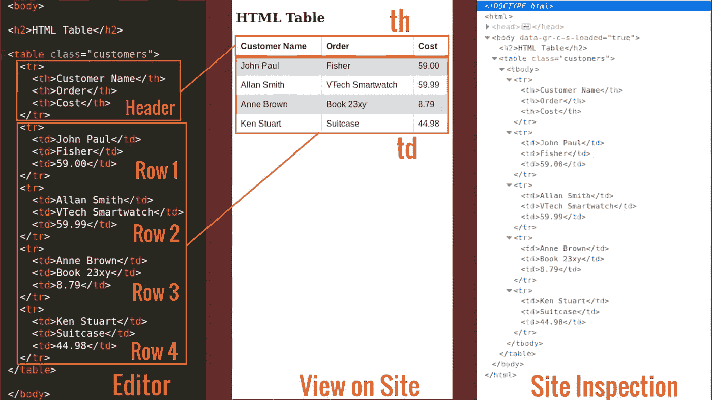
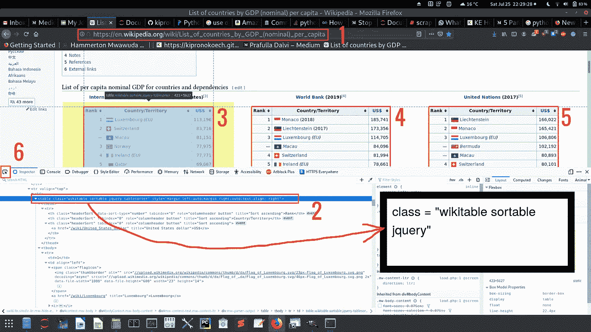
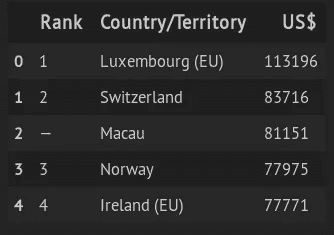

# Web 抓取 1:抓取表格数据

> 原文：<https://towardsdatascience.com/web-scraping-scraping-table-data-1665b6b2271c?source=collection_archive---------7----------------------->

## 在这篇文章中，我们将学习如何使用 Python 从 web 上抓取表格数据。简化。


由[卡洛斯·穆扎](https://unsplash.com/@kmuza?utm_source=medium&utm_medium=referral)在 [Unsplash](https://unsplash.com?utm_source=medium&utm_medium=referral) 上拍摄的照片

网络搜集是数据收集最重要的概念。在 Python 中， **BeautifulSoup** 、 **Selenium** 和 **XPath** 是可以用来完成网页抓取任务的最重要的工具。

在本文中，我们将重点关注 BeautifulSoup 以及如何使用它从[维基百科页面](https://en.wikipedia.org/wiki/List_of_countries_by_GDP_(nominal)_per_capita)获取 GDP 数据。我们在这个网站上需要的数据是表格的形式。

# 概念的定义

请看下图，然后我们可以继续定义 HTML 表格的组成部分



图 2

**从上图我们可以推断出如下:**

标签定义了一个 HTML 表格。

一个 HTML 表格由一个元素和一个或多个、

| 和 | 元素组成。 |

元素定义了表格行，元素定义了表格标题，元素定义了表格单元格。

一个 HTML 表格也可以包括、、、和元素。

我们感兴趣的是检查给定站点的元素(在这种情况下，是我们想要废弃的站点——图 1 的最右边显示了站点的元素)。在大多数电脑中，你访问网站并点击 **Ctrl+Shift+I** 来检查你想要废弃的页面。

**注意:网页的元素通过使用标签上的 class 或 id 选项来识别。id 是唯一的，但类不是。这意味着一个给定的类可以标识多个 web 元素，而一个 id 只能标识一个元素。**

现在让我们看看我们想要刮的网站的图像



图 3

从该图中，请注意以下几点:

1.  这是统一资源定位符( **URL** )。我们需要这个。
2.  感兴趣对象的标签元素。该对象由**类**定义，而不是由 **id** : `class = “wikitable sortable jquery”`定义。注意，tag 元素包含 3 个标识一个表的类(类之间用空格分隔)。除了我们将在这里使用的站点元素的一般引用外，**类**和**id**被用作支持使用 CSS 等语言的样式的引用。
3.  现场共有 3 张桌子，上图中编号为 **3** 、 **4** 和 **5** 。为了这篇文章，我们将通过如何刮表 **3** ，你可以很容易地找出如何做 **4** 和 **5** 。
4.  当你在页面中悬停以识别你感兴趣的元素时，标有 6 的按钮非常重要。一旦您感兴趣的对象被突出显示，标签元素也将被突出显示。例如，对于我们的案例，标签 **2** 与标签 **3** 相匹配。

# 实际刮削

必需的包: **bs4，lxml，pandas 和 requests。**

一旦你有了所说的包，我们现在可以通过代码。

在这个代码片段中，我们导入必要的包并解析站点的 HTML 内容。

片段 1

检查代码片段 1 中的站点元素和/或`soup`变量后，您会发现图 3 中显示的三个表属于同一个类`wikitable`。

片段 2

```
OUTPUT: 
Number of tables on site:  3
```

为了废弃第一个表，我们只需要从`gdp`获得第 0 个索引。下面代码片段中的`body` 变量包含表格的所有行，包括标题。标题将在`body[0]`中，所有其他行将在列表`body[1:]`中

片段 3

```
OUTPUT:
['Rank', 'Country/Territory', 'US$']
```

标题看起来没错。

接下来，我们需要如下循环其余的行

片段 4

此时，我们在标题上有了标题，在 all_rows 上有了所有其他行，从这里我们可以将这些数据和标题作为 Pandas 数据帧传递



图 4

[完整代码](https://github.com/kipronokoech/Web-Scraper/tree/master/gdp-data)

# 警告

网络内容受版权保护，在大多数情况下，版权限制内容的复制、分发、传输和采用。当你打算删除这样一个网站时，你可能需要获得内容所有者的明确许可，否则你未经适当同意的删除行为可能会给你带来违约的麻烦。

然而，一些网站在[知识共享许可](https://creativecommons.org/)下提供其内容，允许您毫无问题地复制、修改和分发这些内容，尽管一些网站可能对此类内容的商业化提供限制。

底线是在抓取网页之前，你需要确定你有权利这样做。

# 结论

网络搜集是从网络上收集数据的最重要的工具。要了解更多关于网络抓取的信息，你可以浏览这个包含更多例子的知识库。

加入 https://medium.com/@kiprono_65591/membership[的媒体](https://medium.com/@kiprono_65591/membership)，全面了解媒体上的每个故事。

你也可以在我发文章的时候通过这个链接把文章发到你的邮箱里:【https://medium.com/subscribe/@kiprono_65591 

感谢阅读。