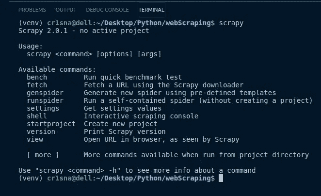

# 网页抓取工具比较—入门所需的一切

> 原文：<https://towardsdatascience.com/web-scraping-tools-comparison-all-you-need-to-get-started-915f1d0d57d8?source=collection_archive---------13----------------------->

## 一个简单而简洁的美丽的汤，硒，和羊瘙痒的回顾。完成实际的网页抓取例子。

每种工具都有其优点和缺点

> 我希望您的反馈能让我知道您想阅读什么样的项目——请花几秒钟时间在最后的投票中留下您的答案！谢谢大家！

# 什么是网页抓取？

网络抓取在当今变得越来越重要。我在这里大胆地说一下，假设你已经听说过“数据是新的石油”这句话。如果我们将网络抓取定义为从几乎任何网站快速收集各种数据的能力，就不难理解为什么会有如此多的企业和工具提供网络抓取服务。

> 在你开始自己的项目之前，最好记住什么是好的[网页抓取礼仪](https://bit.ly/34rLVCy)。

## 极限是天空

你可以使用网络抓取来获取各种各样的数据，如文本、数字、图像、视频、声音等等。并不是所有的网站都提供无缝获取数据的 API，所以我们通常不得不创造性地使用一些好的老式抓取方法。

更复杂的网站结构将需要更先进的抓取技术，但你会惊讶地发现，收集数据和从零开始构建自己的数据集是多么容易。如果您希望自己的数据科学产品组合脱颖而出，这一点尤其有用！

## 网络抓取三位一体

本文将重点介绍三个不同的 Python 库，对于您开始第一个项目来说，这已经足够了:

*   **美汤**
*   **硒**
*   **刺儿头**

我将介绍它们的主要特性和局限性，并提供一些何时使用其中一种的例子。

# 如何做出一道漂亮的汤

如果你之前没有经验，美丽的汤可以说是开始你的网络抓取之旅的最佳方式。了解一两件关于 Python 的事情会有所帮助，比如如何遍历列表或字典，以及一点点 *pandas* 来处理你提取的数据。

它是最友好的用户界面，但这是有代价的——它也是最不灵活的，它不能与使用 JavaScript 的网站一起工作——稍后会详细介绍。

## 它是如何工作的

网站是用 HTML 代码构建的(至少大部分是这样！).如果你想看到你喜欢的网站背后的代码，在 Chrome 上按 CTRL+U 就可以了(在其他浏览器上找“查看源代码”)。您将看到一个 HTML 文档，其中包含您正在浏览的页面的结构。这些 HTML 代码是我们注入到美丽的汤里的。

该过程的第一步通常是使用*请求*模块和*获取*命令来获取 HTML 代码并将其放入变量中。一旦完成，您就可以提取您需要的信息了。

你所需要做的就是煮一些**汤** …明白了吗？！

这实际上是一个很好的类比，可以理解下面的例子中发生了什么。一旦您获得了带有页面代码的变量，您就可以将它转换成一个漂亮的 Soup 对象，让您选择想要的任何配料。

在本例中，该对象是 *soup* 变量，我们将尝试打印页面的标题。在一个普通的 HTML 页面中，主标题总是一个“h1”标签，所以你可以看到对我来说，要汤，要配料是多么容易。

一些成分——我指的是 HTML 标签——将需要一些**尝试和错误**！每次的逻辑都一样。唯一的区别将是网站的结构如何，以及你如何定义你想要的标签。

## 多给我看看！

有一个非常好的[视频](https://bit.ly/3cZrfpF)很好地解释了这个问题，如果你决定更深入地研究这个问题，你也可以查看我的[个人资料](https://bit.ly/3ngDB1r)。你会对我们如何从页面中获取特定的标签有一个更好的了解。

> 如果你试图抓取一个使用 **JavaScript** 来加载内容的网站，那么到目前为止我们所看到的**还不够。为此，我们将不得不使用硒！**

# 用硒赢得你的条纹

当你进入网络抓取的世界时，你最终会到达一个包含 JavaScript 来加载内容的网站。这意味着是时候远离美味的汤，摄入硒了。

如果您对 JavaScript 不熟悉，可以考虑交互式网站，它需要您展开和/或点击对象来显示新信息。预订是一个很好的例子，一个有很多按钮和下拉菜单的网站……你明白了吧！

> 请务必检查**网站是否允许刮擦**，并查看 robots.txt 文件。

## 它是如何工作的

Selenium 是作为自动化测试(web 应用程序和网站)的工具而创建的。简单地说，它就像一个自动化的浏览器窗口。它会打开一个浏览器窗口，让你浏览网站，并随时获取信息。

要使用 Selenium，您需要安装一个模拟浏览器窗口的 web 驱动程序。不同的浏览器有不同的网络驱动程序，但是你应该首先使用你熟悉的浏览器！我的大多数项目都使用了 Chrome 浏览器的网络驱动程序，但是你也可以为 Firefox 和 IE 浏览器安装一个。

对于一个在浏览器窗口没有真正打开的情况下运行 Selenium **的选项，检查一下 [PhantomJS](https://phantomjs.org/) 的 webdriver 尽管使用起来有点棘手。**

> 如果您对使用 JavaScript 的网站不确定，请在检查页面时寻找包含 JS 代码的标签(右键单击页面，并选择*检查*)。

在您完成设置后，是时候刮点东西了！自动化浏览器窗口打开后，**您将通过 web 驱动程序**与浏览器互动。

## 多给我看看！

从这里开始，如果你已经和美丽的汤一起工作过，那么接下来应该很容易。您将使用相同的逻辑在包含页面的变量中查找 HTML 标记。你有一个名为“webdriver”的浏览器窗口，而不是一个“汤”。

我试着把上面的代码分成易于阅读的代码块。当您调用 *webdriver 时，自动浏览器窗口将会打开。铬合金()。*

窗口打开后，您可能会认出获取 *somewebsite* 页面的 *get* 方法。它在页面上查找“用户名”字段，并在该字段中发送“您的用户名”。

与“密码”字段相同。然后单击登录。很直接，对吧？诀窍是能够**找到标签**！

值得一提的是，尽管 Selenium **并不是为 web 抓取**而构建的，但它可以成为一个非常有趣的工具！

# 和 Scrapy 一起拥有互联网

然后我发现了 Scrapy……我看过关于它的视频和教程，但是不得不使用 shell 终端在当时有点吓人。我结束了使用 BS 和硒很长一段时间，直到我决定探索 Scrapy。

一旦我理解了这个概念并释放了我的第一只蜘蛛……嗯，只能说感觉整个世界的可能性刚刚打开。

> 有一个微小的机会，它甚至会让你*觉得*像一个黑客，因为你将使用终端，它会在忙的时候打印出很多东西。那肯定是有意义的，对吧？！

## 它是如何工作的

很快，它的速度快得不可思议。这不是偶然的，因为 Scrapy 是使用 Twisted Python 框架构建的。这个框架给了它**异步**能力，这使得 Scrapy 没有必要单独等待每个响应。但是这可能比你现在需要知道的还要多！

它也**不需要依赖**，所以它是一个非常便携的解决方案，你可以在任何安装了 Python 的地方实现。

请放心，您不需要理解它背后的框架就能够使用它。如果您以前见过命令提示符，并且不怕在终端中键入内容，这会很有帮助！

> 我先解释一下，不需要任何代码，然后我会分享一个简短的视频来展示它的作用。

## 爬行的蜘蛛

为了创建你的第一个蜘蛛(蜘蛛是你创建来抓取网页的小机器人),你**在命令提示符下告诉 Scrapy 生成一个新的蜘蛛**。

*如果你想知道，我说的* ***命令提示符*** *就是你在 Windows 开始菜单上输入“cmd”时得到的那个！*

该命令将创建几个**。您运行命令的文件夹中的 py** 文件。使用您最喜欢的 IDE，编辑蜘蛛并给它一些参数，如:

*   你希望蜘蛛从哪个域开始抓取
*   你希望**允许**蜘蛛抓取哪些域名
*   你希望蜘蛛从它访问的每一页中得到什么信息

我们**过滤**它跟随的链接，通过指定类似“只允许蜘蛛跟随包含 newspaper.com/economy/".的 url。这样，蜘蛛将只跟随有“经济”文章的链接！

设置好之后，回到 shell 终端，键入命令来运行 spider。它将从你的**初始页面**开始，并立即获得该页面上的每个链接。如果我们以报纸网站为例，在任何文章页面都会有不同的部分，甚至外部链接(如广告)。

在它跟随的每个链接中，它将试图**获取你之前定义的 HTML 标签**。这就像是服用了类固醇的美妙汤药，因为它有跟踪页面内部链接的能力。

您还可以在运行 spider 时键入的同一命令中定义将结果导出到哪里。

## 多给我看看！

不幸的是，在这一点上我没有任何公开的 Scrapy 项目可以炫耀！但是我可以分享我在网上找到的最容易跟随的视频之一。该频道甚至有一个专门为 Scrapy 播放的播放列表，这个家伙做了一个很棒的解释工作。

# 这是我所需要的吗？

我已经向您简单介绍了每个工具及其核心特性。无论你决定使用哪种工具，一定要阅读或观看一些教程，这样你就能理解如何选择 HTML 标签。不管你选择什么样的库，这都将是你最大的挑战。

所以如果你对 Python 没有太多的经验，我会从选择一个简单的网站开始，比如维基百科，然后开始**美丽的汤**。

当你对它感到舒适时，可以随意寻找更高级的项目来用 **Selenium** 解决。我已经留下了一些我自己项目的链接，所以从这里开始吧。

有一天你会醒来并决定你想从一份特定的在线报纸上抓取每一篇文章并进行 NLP 分析。这可能是你需要加载**刺儿头**的信号！

> 我希望这篇文章对你开始使用网络抓取有用，或者为你将来的项目提供不同的选择。我真的很想知道你对什么样的话题更感兴趣，所以**请花 5 秒钟回答下面的投票**！谢谢！

*感谢您的阅读！*

与往常一样，我欢迎反馈和建设性的批评。

*如果想取得联系，可以在这里***联系我* [***或者直接回复下面的文章。***](https://bit.ly/3lbTWCn)*