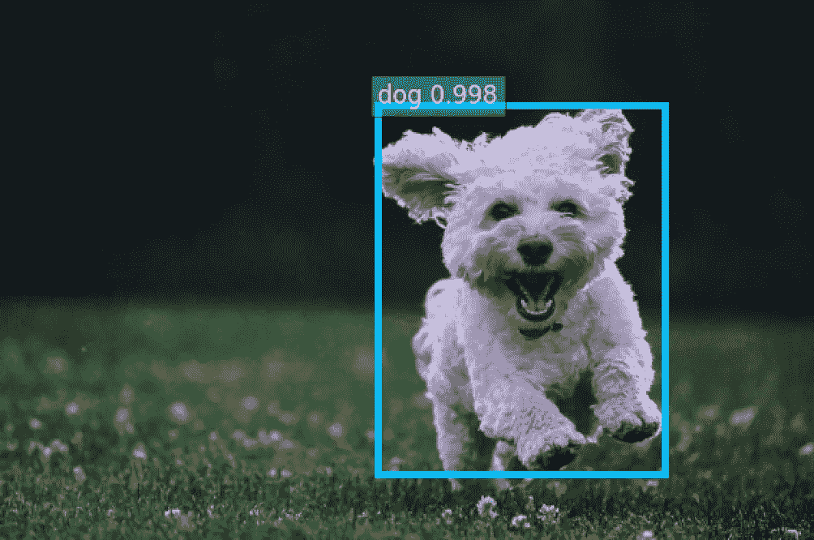
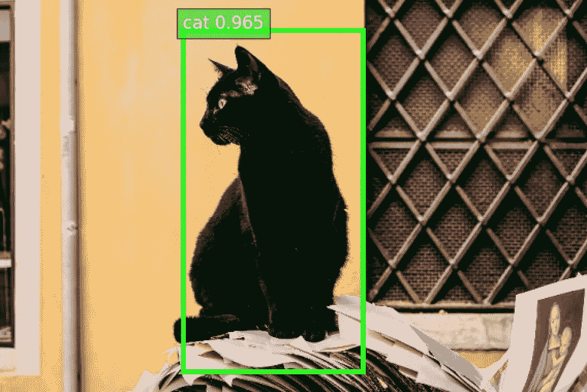
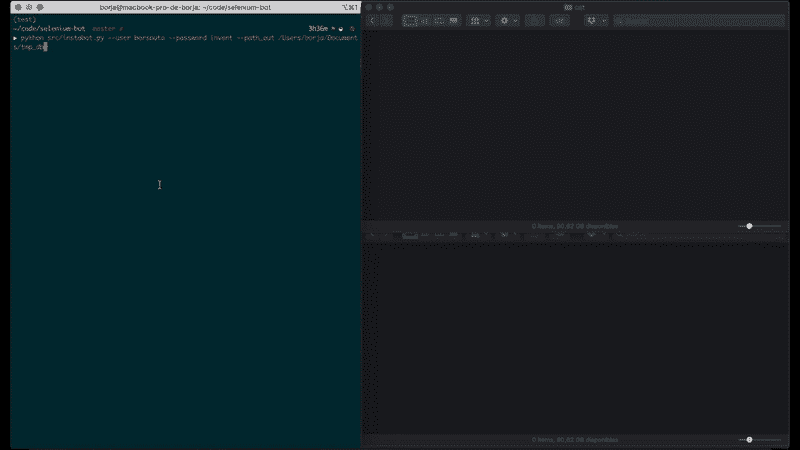

# 使用 Selenium 和 YOLO 构建计算机视觉数据集的 Web 抓取

> 原文：<https://towardsdatascience.com/web-scraping-using-selenium-and-yolo-to-build-computer-vision-datasets-73a23d1909d2?source=collection_archive---------48----------------------->

## 此工作流简化了构建数据集的繁重工作


尼古拉斯·皮卡德在 [Unsplash](https://unsplash.com?utm_source=medium&utm_medium=referral) 上拍摄的照片

如果我们向几位专家询问计算机视觉项目的关键(特别是如果我们想要一个真正的应用程序)，也许最重复的元素(在我看来也是最重要的)就是数据集。当我们问及最艰巨、最费力的任务时，问题就出现了，答案通常也是一样的:数据集。

组成数据集的任务可以概括为三个步骤:

1.  **捕捉图像**。
2.  **注释图像**:为一组类别标记样本。
3.  **验证**:检查标签是否正确。

我们要做的第一件事是求助于可以用于我们任务的最先进的数据集，但问题是我们并不总是能找到我们需要的东西。此时此刻，我们面临着一项艰巨而痛苦的任务。本文展示了如何避免这种手工操作。

使用 **Selenium** [1】(一个开源的基于 web 的自动化工具) **Instagram** (间接世界上最大的图像数据库之一)和 **YOLO** [2】(物体检测中最常用的深度学习算法之一)，我们可以自动生成数据集(唯一无法避免的是验证步骤)。为了展示一个简单的例子，我们将生成两个类的简单数据集:cat 和 dog。

我们将设计一个带有 Selenium 的机器人，它将自动访问 Instagram 并在其中移动。此外，我们将使用 YOLO，一个卷积神经网络来检测和排序我们需要的狗和猫。

# 环境设置

我们将要使用的编程语言是 Python 3.6，它允许我们轻松地使用 Selenium 和 YOLO。

我们将需要以下外部依赖:

*   [*GluonCV*](https://gluon-cv.mxnet.io/) :提供计算机视觉中最先进深度学习算法实现的框架。这个工具包为我们提供了大量预先训练好的模型。我们将使用其中的一个[3]。
*   [*枕*](https://python-pillow.org/) : Python 影像库。
*   [*【硒】*](https://www.selenium.dev/documentation/en/) :它是一个伞式项目，包含一系列工具和库，支持 web 浏览器的自动化。我们将使用该库提供的 Python 模块。
*   [*请求*](https://requests.readthedocs.io/en/master/) :是一个优雅简单的 Python HTTP 库。我们将用它来下载图像。

您可以使用以下命令安装这些依赖项:

```
pip install mxnet gluoncv Pillow selenium beautifulsoup4 requests
```

另外，你还需要 [**ChromeDriver**](https://chromedriver.chromium.org/home) 。这提供了从 Selenium 导航到 web 页面的能力。你要把它复制到`usr/local/bin`，瞧！您现在可以从 Selenium 控制您的 Chrome 浏览器了！

# 物体检测模块

正如我们已经提到的，我们将使用 [*YoloV3*](https://pjreddie.com/media/files/papers/YOLOv3.pdf) 作为检测模块(顺便说一下， [*YoloV4*](https://arxiv.org/pdf/2004.10934.pdf) 从一个月前就有了)。通过这种方式，我们将尝试寻找和区分猫和狗。

使用 GluonCV 和 MXNet 的 YoloV3 模块

概括地说，YOLO(你只看一次)基本上是一个单一的 CNN，它提供了多个预测(边界框),每个类别都有一个相关的概率。此外，NMS(非最大抑制)用于将多个检测合并为一个检测。我们面对的是一个实时工作的快速神经网络。



使用 YoloV3 模块检测狗和猫。狗:由[乔·凯恩](https://unsplash.com/@joeyc)在 [Unsplash](https://unsplash.com?utm_source=medium&utm_medium=referral) 上的基础图像。猫:基础图片由[内森·赖利](https://unsplash.com/@nrly)在 [Unsplash](https://unsplash.com?utm_source=medium&utm_medium=referral) 上制作

# 硒机器人模块

我们将使用 Selenium 对机器人进行编程，使其登录并通过 Instagram，使用检测模块自动下载图像。

正如您在`__call__()`方法中看到的，我们可以将代码分为 4 个主要步骤:

1.  **打开** **Instagram** 主页。
2.  **用你的用户名和密码登录 Instagram】。**
3.  放上你的标签来限制搜索，这里是**#宠物**，因为在这个例子中我们想要狗和猫。
4.  还有最重要的一步，**滚动和下载**图片。

在最后一步中，我们滚动并解析 HTML 以获得下载图像并使用 Pillow 对其进行合成所需的 URL。此时，我们检查图像是否包含一只狗、一只猫，或者什么都不包含，然后将它保存到每个类对应的文件夹中，或者丢弃该图像。

最后，您只需要担心验证样本。尽情享受吧！😉

如果您想轻松地启动这个代码，您可以在这个存储库中找到它。您只需按照自述文件中指示的步骤进行操作。

[](https://github.com/bsouto/selenium-bot) [## bsouto/selenium-bot

### 使用 Selenium 和 Yolo V3 从 Instagram 构建计算机视觉数据集的 Web 抓取。- bsouto/selenium-bot

github.com](https://github.com/bsouto/selenium-bot) 

在下面的 GIF 中，你可以看到数据集是如何自动生成的:机器人用用户名和密码访问 Instagram，输入#PETS 标签，滚动，同时只下载狗(底部文件夹)和猫(顶部文件夹)的图像。



操作程序

强调这是一个简单的例子，当然还有很多关于狗和猫的公开数据集。我们可以将我们想要的复杂性添加到我们的生成器中，这是一个概念验证，可能我们的任务不是那么简单，我们需要的数据也不是那么基本。

感谢阅读！

## 参考

[1][https://selenium-python.readthedocs.io/](https://selenium-python.readthedocs.io/)

[https://pjreddie.com/darknet/yolo/](https://pjreddie.com/darknet/yolo/)

[3][https://gluon-cv . mxnet . io/build/examples _ detection/demo _ yolo . html](https://gluon-cv.mxnet.io/build/examples_detection/demo_yolo.html)