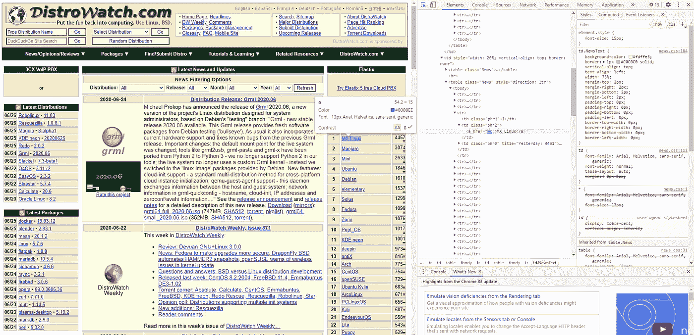
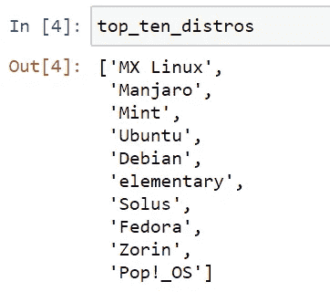

# 使用 Python 和 BeautifulSoup 进行网页抓取

> 原文：<https://towardsdatascience.com/web-scraping-with-python-beautifulsoup-40d2ce4b6252?source=collection_archive---------9----------------------->

## 如何从网站中提取数据


图片来自 [Pixabay](https://pixabay.com/?utm_source=link-attribution&utm_medium=referral&utm_campaign=image&utm_content=1076536) 詹姆斯·奥斯本

网络包含大量的数据。毫无疑问，从中提取你需要的信息的能力是有用的，甚至是必要的。当然，在 Kaggle 这样的地方，仍然有许多数据集可供你下载，但在许多情况下，你不会找到你特定问题所需的确切数据。然而，很有可能你会在网上的某个地方找到你需要的东西，你需要从那里提取。

网络抓取就是这样做的过程，从网页中提取数据。在这篇文章中，我们将看到如何用 python 进行 web 抓取。对于此任务，有几个库可供您使用。这其中，这里我们就用**美汤 4** 。这个库负责从 HTML 文档中提取数据，而不是下载数据。对于下载网页，我们需要使用另一个库:**请求**。

所以，我们需要两个包:

*   请求—用于从给定的 URL 下载 HTML 代码
*   美丽的汤——用于从 HTML 字符串中提取数据

# 安装库

现在，让我们从安装所需的包开始。打开终端窗口并键入:

```
python -m pip install requests beautifulsoup4
```

…或者，如果您使用的是 conda 环境:

```
conda install requests beautifulsoup4
```

现在，尝试运行以下命令:

```
**import** requests
**from** bs4 **import** BeautifulSoup
```

如果您没有得到任何错误，那么软件包安装成功。

# 使用请求&漂亮的汤来提取数据

从`requests`包中，我们将使用`get()`函数从给定的 URL 下载网页:

```
requests.get(url, params**=None**, ******kwargs)
```

其中参数为:

*   **url** —所需网页的 url
*   **params** —可选字典，查询字符串中要发送的元组或字节的列表
*   ****kwargs** —请求采用的可选参数

这个函数返回一个类型为`requests.Response`的对象。在这个对象的属性和方法中，我们最感兴趣的是由目标网页的 HTML 字符串组成的`.content`属性。

示例:

```
html_string **=** requests.get("http://www.example.com").content
```

在我们获得目标网页的 HTML 之后，我们必须使用`BeautifulSoup()`构造函数来解析它，并获得一个`BeautifulSoup`对象，我们可以用它来导航文档树并提取我们需要的数据。

```
soup = BeautifulSoup(markup_string, parser)
```

其中:

*   **标记 _ 字符串** —我们网页的字符串
*   **解析器** —由要使用的解析器的名称组成的字符串；这里我们将使用 python 的默认解析器:“html.parser”

注意，我们将第一个参数命名为“markup_string”而不是“html_string ”,因为 BeautifulSoup 也可以用于其他标记语言，不仅仅是 html，但是我们需要指定一个适当的解析器；例如，我们可以通过将“xml”作为解析器来解析 XML。

一个`BeautifulSoup`对象有几个方法和属性，我们可以用它们在解析过的文档中导航并从中提取数据。
最常用的方法是`.find_all()`:

```
soup.find_all(name, attrs, recursive, string, limit, ******kwargs)
```

*   **名称** —标记的名称；例如“a”、“div”、“img”
*   **attrs** —带有标签属性的字典；例如`{“class”: “nav”, “href”: “#menuitem”}`
*   **递归** —布尔；如果为 false，则只考虑直接子代；如果为 true(默认)，则在搜索中检查所有子代
*   **字符串** —用于在元素内容中搜索字符串
*   **限制** —将搜索限制在找到的元素的数量

示例:

```
soup.find_all("a", attrs**=**{"class": "nav", "data-foo": "value"})
```

上面的行返回一个列表，其中包含所有具有指定属性的“a”元素。

不能和这个方法的参数或者 python 的关键字混淆的 HTML 属性(比如“class”)可以直接作为函数参数使用，不需要放在`attrs`字典里面。HTML *类的*属性也可以这样使用，但是不要用`class=”…”`写`class_=”…”`。

示例:

```
soup.find_all("a", class_**=**"nav")
```

因为这个方法是用的最多的一个，所以它有一个捷径:直接调用`BeautifulSoup`对象和调用`.find_all()`方法效果一样。

示例:

```
soup("a", class_**=**"nav")
```

`.find()`方法类似于`.find_all()`，但它在找到第一个元素后停止搜索；将被返回的元素。它大致相当于`.find_all(..., limit=1)`，但它不是返回一个列表，而是返回一个元素。

`BeautifulSoup`对象的`.contents`属性是一个包含所有子元素的列表。如果当前元素不包含嵌套的 HTML 元素，那么`.contents[0]`将只是其中的文本。因此，在我们使用`.find_all()`或`.find()`方法获得包含我们需要的数据的元素后，我们需要做的就是访问`.contents[0]`来获得其中的数据。

示例:

```
soup **=** BeautifulSoup('''
    <div>
        <span class="rating">5</span>
        <span class="views">100</span>
    </div>
''', "html.parser")views **=** soup.find("span", class_**=**"views").contents[0]
```

如果我们需要的数据不在元素内部，而是作为属性值，那该怎么办？我们可以按如下方式访问元素的属性值:

```
soup['attr_name']
```

示例:

```
soup **=** BeautifulSoup('''
    <div>
        
    </div>
''', "html.parser")img_source **=** soup.find("img")['src']
```

# Web 抓取示例:获得前 10 个 linux 发行版

现在，让我们用上面的概念来看一个简单的 web 抓取示例。我们将从 DistroWatch 网站上抽取一个列表，列出最受欢迎的 10 个 linux 发行版。distro watch([https://distrowatch.com/](https://distrowatch.com/))是一个以 linux 发行版和运行在 linux 上的开源软件的新闻为特色的网站。这个网站的右边有一个最流行的 linux 发行版的排名。我们将从这个排名中抽取前 10 名。

首先，我们将下载网页并从中构造一个漂亮的 Soup 对象:

```
**import** requests
**from** bs4 **import** BeautifulSoup

soup **=** BeautifulSoup(
    requests.get("https://distrowatch.com/").content,
    "html.parser")
```

然后，我们需要找出如何在 HTML 代码中识别我们想要的数据。为此，我们将使用 chrome 的开发工具。右键点击网页中的某个地方，然后点击“检查”，或者按“Ctrl+Shift+I”来打开 chrome 的开发者工具。它应该是这样的:



然后，如果你点击开发者工具左上角的小箭头，然后点击网页上的某个元素，你应该在开发者工具窗口中看到与该元素相关的 HTML 片段。之后，您可以使用您在 dev tools 窗口中看到的信息来告诉 beautiful soup 在哪里可以找到该元素。

在我们的例子中，我们可以看到排名被构造成一个 HTML 表，每个发行版名称都在一个带有类“phr2”的 **td** 元素中。然后在 td 元素里面是一个包含我们想要提取的文本的链接(发行版的名称)。这就是我们在接下来的几行代码中要做的事情:

```
top_ten_distros **=** []
distro_tds **=** soup("td", class_**=**"phr2", limit**=**10)
**for** td **in** distro_tds:
    top_ten_distros.append(td.find("a").contents[0])
```

这是我们得到的结果:



*我希望这些信息对你有用，感谢你的阅读！*

这篇文章也贴在我自己的网站[这里](https://www.nablasquared.com/web-scraping-with-python-beautiful-soup/)。随便看看吧！