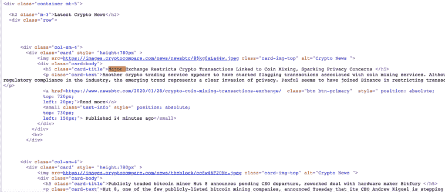
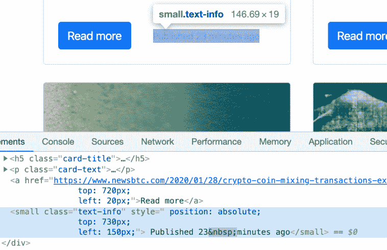

# 使用 Python 简化 Web 抓取

> 原文：<https://towardsdatascience.com/web-scraping-with-python-made-easy-f069ffaf7754?source=collection_archive---------15----------------------->

## 了解如何用 Python 抓取网站

Beautiful Soup 是一个 Python 库，便于从网站上抓取信息。在这篇文章中，我想向你展示一些基础知识，让你自己开始抓取网站。我们将一步一步地**构建一个 Python Web Scraper** 。这比听起来容易。


照片由[马库斯·斯皮斯克·temporausch.com](https://www.pexels.com/@markusspiske?utm_content=attributionCopyText&utm_medium=referral&utm_source=pexels)从[派克斯](https://www.pexels.com/photo/creative-internet-computer-display-2004161/?utm_content=attributionCopyText&utm_medium=referral&utm_source=pexels)拍摄

# 为什么使用 Python Web 抓取？

网络抓取包括通过程序或脚本从网站提取信息。抓取有助于自动提取数据，比我们手动提取信息要快得多。它真的可以节省数小时的手工和繁琐的工作。

例如，如果我们想获得一个包含上传到易贝“无线耳机”类别的所有产品名称的列表，我们可以编写一个 Python 脚本，并使用 Beautiful soup 自动完成这项任务。

# 如何装美汤？

在终端中运行 pip 命令可以安装 Beautiful Soup。查看官方[文档](https://pypi.org/project/beautifulsoup4/)了解更多详情。

`pip install beautifulsoup4`

在开始编写我们的代码之前，请注意，虽然抓取公共数据并不违法，但我们应该避免每秒向网站发出数百个请求，因为这可能会使网站服务器过载。此外，最好检查你打算删除的网站的条款，以了解它们是否允许删除。

# 创建我们的 Python 刮刀

好，我们开始吧。我们将抓取 [cryptonewsandprices.me](https://cryptonewsandprices.me/) 这是一个包含加密新闻库的网站。**我们的目标是从站点中提取出版的*标题*** 和*日期*。

首先，我们应该检查网页的 *html* 代码，以确定我们希望从站点中提取哪些元素。我们在这篇文章中删除的页面如下所示:


要查看该站点的页面源，右键选择“*查看页面源*”。然后，我们就可以看到我们将使用美汤**解析的站点的 *html* *源代码* *代码*。通过查看下面的 *html* *source* 的摘录，我们可以看到我们的标题被一个 ***h5 标签*** 和**类“card-title”**所包围。在 Beautiful Soup 及其强大的解析器的帮助下，我们将使用这些标识符来删除信息。**



我们需要做的第一件事是导入我们的库*请求*和 ***美丽组*** 。因为我们需要向要废弃的页面发送一个请求，所以我们需要使用请求库。然后，一旦我们得到来自站点的响应，我们将它存储在一个名为" *mainContent* 的变量中，稍后我们将解析它:

```
import requests
from bs4 import BeautifulSoupmainContent = requests.get("https://cryptonewsandprices.me/") print(mainContent.text)
```

我们的问题是，我们用 *requests.get* 得到的请求不是很用户友好，因此，我们需要把它转换成更容易理解的东西。注意，我们的 mainContent 变量包含了站点的整个 html 代码。

# 从一个元素中抓取信息

现在让我们摘录一下*新闻标题*。首先，我们需要将我们在*main content*变量中的字符串转换成一个 *soup* **Beautiful Soup**解析器能够理解(并解析)的“*Soup*”。可以选择不同的解析器来读取数据。在这篇文章中，我使用“ *lxml* ”，因为它是最通用和最快的解析器之一。

在下面的代码行中， *Soup* 包含了我们的 get 请求所指向的整个页面的 html 代码。然后，**美汤 lxml 解析器**让我们从 html 源代码中提取想要的信息。

Beautiful Soup 提供了一些方法来提取 *html* 标签、*类*或网站中其他元素中的文本。既然我们知道每条新闻的标题都使用了一个*H5*html 标签和类 *card-title* ，我们可以使用“find”在页面中定位它们，并将值提取到我们的 title 变量中。此外，我们使用“get_text()”只提取 html 标签 h5 和类“card-title”中的文本，而不提取 html 标记。

```
soup = BeautifulSoup(mainContent.text,'lxml')
title = soup.find('h5', class_='card-title').get_text()
print(title)
```

太好了，我们已经在页面上打印了第一篇新闻的标题。现在，让我们提取关于这篇文章何时发表的信息。为此，我们首先需要查看一下站点，了解我们可以使用哪个 html 元素来识别“*发布在*之前”的信息。

如下图所示，我们可以通过“ *small* 标签和“ *text-info* 类来识别元素。同样，我们可以使用方法 ***find*** 从我们的站点定位并提取对象。



```
published = soup.find('small', class_='text-info').get_text().strip()print(published)
```

太好了，现在我们有了发布的信息和最新文章中的图片。

# 从多个元素中抓取信息

如果能从所有新闻中获得所有标题*和发布的*信息，而不是只有一个新闻元素，那就更好了。为此，BS 有一个方法叫做 ***find_all*** 。其工作原理类似于 ***查找*** :**

```
titleall = soup.find_all('h5', class_='card-title')
print(titleall)##printed answer [<h5 class="card-title">Ex-UFC Fighter &amp; Bitcoin Bull Ben Askren: XRP is a Scam </h5>, <h5 class="card-title">Opporty founder calls SEC's ICO lawsuit 'grossly overstated' and 'untruthful' in an open letter </h5>,...]
```

**美汤*查找所有*方法**返回的是一个包含网站包含的所有新闻标题的列表。列表中的每个元素都是一个标题。然而，我们将 *html h5* 标签作为结果的一部分。

我们之前用来提取文本的 Get_text 方法不适用于列表。因此，为了获得没有 html 标签的每个标题，我们可以遍历列表，然后将 *get_text* 应用于列表的每次迭代，以将其附加到名为 title_list 的新列表中:

```
title_list =[]for item in titleall: 
   individualtitle = item.get_text() 
   title_list.append(individualtitle) print(title_list)
```

很好，现在我们得到了没有 html 标签的标题，只有文本。

# 完成我们的 Python Web Scraper

作为最后一步，如果我们能够提取标题并将其写入一个 *csv* 文件，那将会非常有趣。为此，我们可以使用 csv 库和 writer 方法:

```
import csv with open('pythonscraper.csv','w') as csvfile: 
     writer = csv.writer(csvfile)
     for item in title_list: 
        writer.writerow([item])
```

就像这样，我们在一个 *csv* 文件中获得标题新闻列表。你现在可以自己尝试并提取任何其他信息。

如果有什么不清楚的地方，请不要犹豫，在这里写下评论，或者观看下面的 Youtube 视频，在那里我一行一行地浏览脚本。

*原载于 2020 年 1 月 28 日 https://codingandfun.com*[](https://codingandfun.com/web-scraping-with-python/)**。**