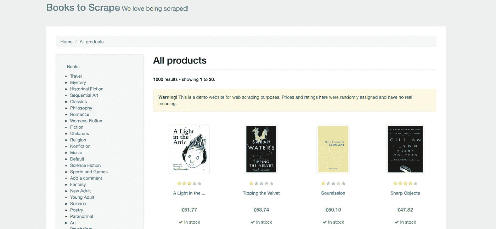
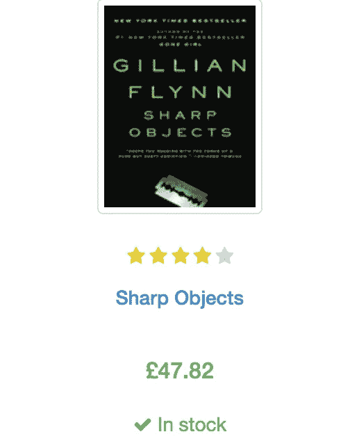
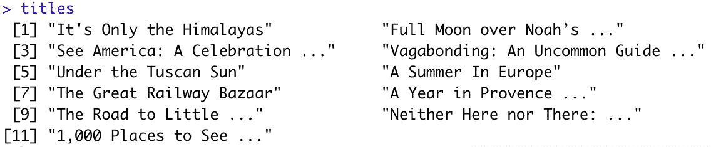
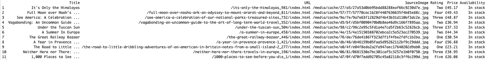
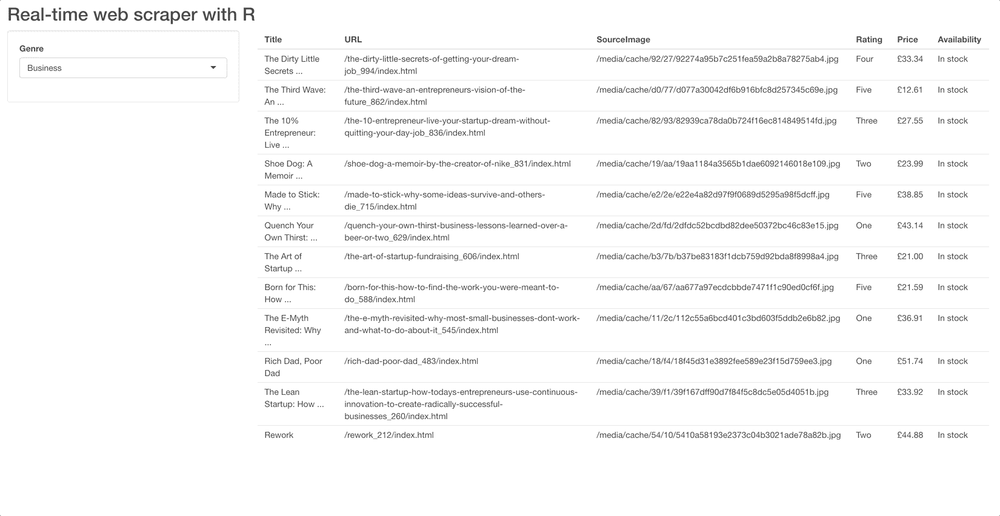

# 一步一步的使用 R 进行网页抓取的指南

> 原文：<https://towardsdatascience.com/web-scraping-with-r-easier-than-python-c06024f6bf52?source=collection_archive---------23----------------------->

## 让我们用 R 开发一个实时 web 抓取应用程序——比用 Python 简单多了


[rawpixel.com](https://www.freepik.com/vectors/technology)[创建的技术向量](http://www.freepik.com)

好的数据集很难找到。这是意料之中的，但没什么好担心的。像网络抓取这样的技术使我们能够随时随地获取数据——如果你知道怎么做的话。今天我们将探索用 *R* 抓取网络数据有多简单，并通过 R Shiny 漂亮的 GUI 界面来实现。

*那么，什么是网页抓取呢？*简单来说，就是从各种网站收集数据的技术。在以下情况下可以使用它:

*   没有可用于所需分析的数据集
*   没有可用的公共 API

尽管如此，你还是应该经常查看网站关于网络抓取的政策，以及这篇关于[网络抓取伦理](/ethics-in-web-scraping-b96b18136f01)的文章。在这之后，你应该能够用常识来决定刮擦是否值得。

**如果感觉不对，就不要做。**

幸运的是，有些网站完全是为了练习抓取网页而制作的。其中之一是[books.toscrape.com](http://books.toscrape.com/)，顾名思义，它列出了各种流派的书籍:



截图来自[http://books.toscrape.com](http://books.toscrape.com)

那么，我们接下来刮那个混蛋，好吗？

# 行动（或活动、袭击）计划

打开网页，点击任意两个类别(左侧边栏)，检查网址。以下是我们的选择:

```
http://books.toscrape.com/catalogue/category/books/**travel_2**/index.html
http://books.toscrape.com/catalogue/category/books/**mystery_3**/index.html
```

*这些网址有什么共同点？嗯，除了加粗的部分。那就是品类本身。不知道编号是怎么回事，但事实就是如此。每一页都包含一个书单，一本书看起来像这样:*



[推理类](http://books.toscrape.com/catalogue/category/books/mystery_3/index.html)单本书截图

我们的工作是获取一个类别中每本书的信息。这样做需要一点 HTML 知识，但它是一种简单的标记语言，所以我不认为这有什么问题。

我们想刮:

*   标题— **h3 > a >标题**房产
*   等级— **星级>等级**属性
*   价格— **部门产品价格>部门价格颜色>文本**
*   可用性— **部门产品价格>部门库存>文本**
*   图书 URL—**div . image _ container>a>href**属性
*   缩略图 URL—**div . image _ container>img>src**属性

你现在什么都知道了，所以接下来让我们从刮痧开始。

# 刮书

在 R 中使用`rvest`包来执行 web 抓取任务。由于管道操作员的使用和一般行为，它与著名的数据分析包`dplyr`非常相似。我们知道如何到达某些元素，但是如何在 R 中实现这个逻辑呢？

下面是一个如何在旅游类别中搜集书名的例子:

```
library(rvest)

url <- 'http://books.toscrape.com/catalogue/category/books/travel_2/index.html'
titles <- read_html(url) %>% 
  html_nodes('h3') %>%
  html_nodes('a') %>% 
  html_text()
```



作者图片

那不是很容易吗？类似地，我们可以刮去其他所有东西。剧本是这样的:

```
library(rvest)
library(stringr)

titles <- read_html(url) %>% 
  html_nodes('h3') %>%
  html_nodes('a') %>% 
  html_text()

urls <- read_html(url) %>%
  html_nodes('.image_container') %>% 
  html_nodes('a') %>% 
  html_attr('href') %>% 
  str_replace_all('../../../', '/')

imgs <- read_html(url) %>% 
  html_nodes('.image_container') %>%
  html_nodes('img') %>%
  html_attr('src') %>%
  str_replace_all('../../../../', '/')

ratings <- read_html(url) %>% 
  html_nodes('p.star-rating') %>% 
  html_attr('class') %>% 
  str_replace_all('star-rating ', '')

prices <- read_html(url) %>% 
  html_nodes('.product_price') %>% 
  html_nodes('.price_color') %>% 
  html_text()

availability <- read_html(url) %>% 
  html_nodes('.product_price') %>% 
  html_nodes('.instock') %>% 
  html_text() %>% 
  str_trim()
```

厉害！最后一步，让我们将所有这些粘合在一个单独的**数据帧**中:

```
scraped <- data.frame(
  Title = titles, 
  URL = urls, 
  SourceImage = imgs, 
  Rating = ratings, 
  Price = prices, 
  Availability = availability
)
```



作者图片

你可以在这里结束这篇文章，今天就到此为止，但是我们还可以在此基础上构建一些东西——一个简单易用的 web 应用程序。让我们接下来做那件事。

# 用于抓取的 Web 应用程序

r 有一个非常棒的 web/dashboard 开发库— `Shiny`。它比 Python 中任何类似的东西都容易使用，所以我们将坚持使用它。首先，创建一个新的 R 文件，并将以下代码粘贴到其中:

```
library(shiny)
library(rvest)
library(stringr)
library(glue)

ui <- fluidPage()

server <- function(input, output) {}

shinyApp(ui=ui, server=server)
```

这是每个闪亮的应用程序都需要的样板。接下来，让我们来设计 UI 的样式。我们需要:

*   标题——只是在所有内容之上的一个大而粗的文本(可选)
*   侧栏—包含一个下拉菜单，用于选择图书流派
*   中央区域—一旦数据被擦除，显示表格输出

代码如下:

```
ui <- fluidPage(
  column(12, tags$h2('Real-time web scraper with R')),
  sidebarPanel(
    width=3,
    selectInput(
      inputId='genreSelect',
      label='Genre',
      choices=c('Business', 'Classics', 'Fiction', 'Horror', 'Music'),
      selected='Business',
    )
  ),
  mainPanel(
    width=9,
    tableOutput('table')
  )
)
```

接下来，我们需要配置**服务器**功能。它必须将我们精心格式化的输入重新映射到一个 URL 部分(例如，“Business”到“business_35”)，并抓取所选流派的数据。我们已经知道如何这样做。下面是服务器函数的代码:

```
server <- function(input, output) {
  output$table <- renderTable({
    mappings <- c('Business' = 'business_35', 'Classics' = 'classics_6', 'Fiction' = 'fiction_10',
                  'Horror' = 'horror_31', 'Music' = 'music_14') 

    url <- glue('http://books.toscrape.com/catalogue/category/books/', mappings[input$genreSelect], '/index.html')

    titles <- read_html(url) %>% 
      html_nodes('h3') %>%
      html_nodes('a') %>% 
      html_text()

    urls <- read_html(url) %>%
      html_nodes('.image_container') %>% 
      html_nodes('a') %>% 
      html_attr('href') %>% 
      str_replace_all('../../../', '/')

    imgs <- read_html(url) %>% 
      html_nodes('.image_container') %>%
      html_nodes('img') %>%
      html_attr('src') %>%
      str_replace_all('../../../../', '/')

    ratings <- read_html(url) %>% 
      html_nodes('p.star-rating') %>% 
      html_attr('class') %>% 
      str_replace_all('star-rating ', '')

    prices <- read_html(url) %>% 
      html_nodes('.product_price') %>% 
      html_nodes('.price_color') %>% 
      html_text()

    availability <- read_html(url) %>% 
      html_nodes('.product_price') %>% 
      html_nodes('.instock') %>% 
      html_text() %>% 
      str_trim()

    data.frame(
      Title = titles, 
      URL = urls, 
      SourceImage = imgs, 
      Rating = ratings, 
      Price = prices, 
      Availability = availability
    )
  })
}
```

就这样，我们现在可以运行应用程序并检查行为！



作者 GIF

正是我们想要的——简单，但仍然完全可以理解。让我们在下一部分总结一下。

# 离别赠言

在短短几分钟内，我们从零到一个工作的网页抓取应用程序。扩展它的选项是无穷无尽的——添加更多的类别、处理视觉效果、包含更多的数据、更好地格式化数据、添加过滤器等等。

我希望你已经设法跟上，你能够看到网络抓取的力量。这是一个虚拟的网站和一个虚拟的例子，但是方法保持不变，与数据源无关。

感谢阅读。

[**加入我的私人邮件列表，获取更多有用的见解。**](https://mailchi.mp/46a3d2989d9b/bdssubscribe)

喜欢这篇文章吗？成为 [*中等会员*](https://medium.com/@radecicdario/membership) *继续无限制学习。如果你使用下面的链接，我会收到你的一部分会员费，不需要你额外付费。*

[](https://medium.com/@radecicdario/membership) [## 通过我的推荐链接加入 Medium-Dario rade ci

### 作为一个媒体会员，你的会员费的一部分会给你阅读的作家，你可以完全接触到每一个故事…

medium.com](https://medium.com/@radecicdario/membership) 

*原载于 2020 年 10 月 19 日*[*https://betterdatascience.com*](https://betterdatascience.com/r-web-scraping/)*。*