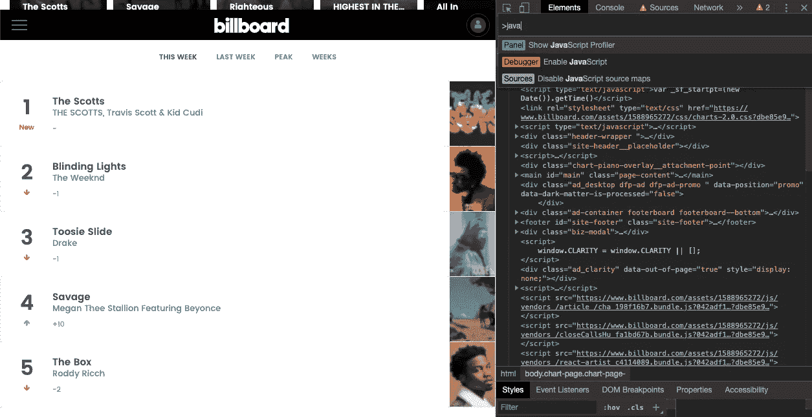
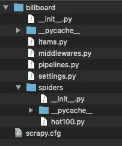
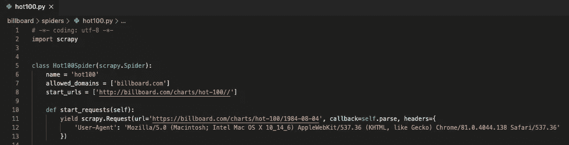
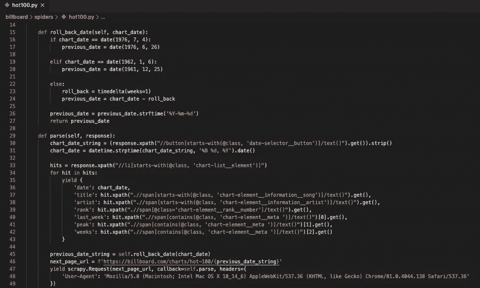

# 用 Scrapy 刮网

> 原文：<https://towardsdatascience.com/web-scraping-with-scrapy-8071fd627051?source=collection_archive---------34----------------------->

## 构建您的第一个网络爬虫


尼古拉斯·皮卡德在 [Unsplash](https://unsplash.com?utm_source=medium&utm_medium=referral) 上拍摄的照片

S crapy 是一个流行的用于网页抓取的 Python 框架。出于本教程的目的，我想使用一个我熟悉的网站。我以前做过一个项目，用 Billboard Hot 100 排行榜上的条目作为基本事实，对热门唱片进行分类。我当时使用了一个 python 包装器，它在获取我的数据集时非常有效。然而，我想展示使用 Scrapy 可以很容易地做到这一点。

**免责声明**:这仅用于培训和教育目的。请熟悉道德规范，因为它们与从网上抓取内容有关。

任何成功的网络抓取项目的第一步是审查要抓取的网站。试着理解发生在引擎盖下的*。在这一步，你的浏览器的网络开发工具将是必不可少的。确定要提取以包含在数据集中的信息。*

*我之前在一个项目中使用过 **Billboard Hot 100** 数据。为了给我的热门歌曲分类器建立真实点击率，我使用 billboard.py 提取每周图表数据。这个包是一个 python 包装器，它使用***Beautiful Soup***解析来自 Billboard 站点的 html 数据。因为我对这个数据集很熟悉，所以我认为演示如何使用 ***Scrapy*** 来构建您的第一个网络爬虫是一个不错的选择。*

*导航到[***https://billboard.com/charts/hot-100***](https://www.billboard.com/charts/hot-100)***/***。通过右键单击并选择检查或按下***option-command-I***打开浏览器的 web 开发工具。我在这里禁用 JavaScript，方法是按下***shift-command-P***，输入 ***javascript*** ，选择 ***禁用 JavaScript*** 选项。记得点击刷新按钮或者按下 ***command-R*** 来刷新页面。这一步对于决定创建网络爬虫是至关重要的，因为这可以让我看到 **Scrapy** 看到的页面。*

**

*网络开发工具的使用。*

*我决定从网站上收集以下数据:*

*   **图表日期**
*   **歌名**
*   **艺人**
*   **本周排名**
*   **上周排名**
*   **峰值位置**
*   **图表上的周数*。*

*我发现从 1958 年 8 月 4 日到 1961 年 12 月 25 日，图表每周出现*和每周一*编目。图表是在周六*之后公布的。以前图表的 url 遵循 base_url/date_string 的格式。例如，从 1999 年 12 月 25 日这一周的图表将在 https://billboard.com/charts/hot-100/1999–12–25.找到，我们稍后将需要它为我们的网络爬虫创建分页。****

***如果你还没有这样做，一定要安装 scrapy。***

```
***$ pip install scrapy***
```

***仍然在命令行中，选择一个您想要工作的目录，创建一个新项目，并创建一个基本的蜘蛛。***

```
***$ cd projects
$ scrapy startproject billboard
$ cd billboard
$ scrapy genspider hot100 billboard.com/charts/hot-100/***
```

***Scrapy 为你的网络爬虫创建了一个具有所有适当层次的新项目。***

******

***项目文件夹结构。***

***在 ***scrapy shell*** 命令和 ***web dev tools*** 之间，我可以发现如何最好地从 html 中提取我需要的数据。有 ***100 首歌*** 出现在每个周图中。它们可以在有序列表元素中找到。通过将这 100 个元素放入一个变量中，我可以遍历每个元素，从每个元素中提取相关信息。我选择使用***XPath***提取我的数据。如果你愿意，你可以使用 ***css 选择器*** 。这个简短的教程假设您对这两者都有一定的了解，所以我不会深入讨论。***

```
**$ scrapy shell billboard.com/charts/hot-100/>>> hit = response.xpath("//li[starts-with(@class, 'chart-list__element')]")>>> len(hit)
100>>> title = hit.xpath(".//span[starts-with(@class, 'chart-element__information__song')]/text()").get()>>> title
'The Scotts'**
```

**既然我已经对我想要抓取的每个项目有了一个好的想法，我将在我选择的文本编辑器中打开我的蜘蛛。我在这个例子中使用了 ***Visual Studio 代码*** ，但是任何代码都可以。我打开项目文件夹，然后打开我创建的名为 ***hot100.py*** 的蜘蛛。**

**我将***allowed _ domains***从“www.billboard.com/charts”稍微修改为“billboard.com”。我还在***start _ requests***函数中包含了开始 url，这样我就可以删除 start_urls 变量，因为它不再是必需的。还要注意，我已经包括了 ***用户代理*** 而不是允许 Scrapy 使用默认的，这有时会妨碍你的蜘蛛。**

****

**蜘蛛的初始设置。**

**接下来，我想指导蜘蛛如何抓取网站获取信息。我创建了一个变量， **hits，**，它包含了页面上所有的 100 次点击。然后我创建了一个循环来查找每次命中的变量。**

**最后，我指示蜘蛛如何前进到下一页。我根据图表的日期创建了一个 date 对象，以便轻松计算前一个图表的日期。该日期随后被转换成格式为 ***YYYY-mm-dd*** 的字符串对象。如果您还记得前面的内容，这就是我们需要添加到基本 url 中以获取前一周图表 url 的格式。一个 ***回调*** 用于通知蜘蛛回到 ***解析方法*** 。**

****

**解析方法。**

**按下 ***command-J*** ，在 ***VS 代码*** 中打开一个终端窗口。确保您位于预期的目录中。如果没有，请确保相应地更改目录。然后让你的蜘蛛爬出网站！我选择将我的记录保存在一个 ***中。csv*** 文件您可以将您的文件存储为任何您想要的结构化格式，例如 ***。json*** ，**，*。xml*** 等。总共我蜘蛛爬了大概 4 个小时 ***30 多万条记录*** ！**

```
**$ pwd
$ cd /projects/billboard
$ scrapy crawl -o hot100.csv**
```

**我遇到的挑战之一是超时错误。在 *Aminah Nuraini 关于 [***栈溢出***](https://stackoverflow.com/questions/43630434/how-to-handle-a-429-too-many-requests-response-in-scrapy) 的*解决方案的帮助下，我对我的 ***settings.py*** 和***middleware . py***文件进行了修改，使我的爬虫运行顺畅。如果她的解决方案适合你的个人情况，请随时查看。我不会深入细节，因为它们超出了这个简短教程的范围。****

你有它！你完全有能力创建你的第一个网络爬虫*来完成网络抓取的任务。完整的 ***源代码*** 可以在 [***这里找到***](https://github.com/SiphuLangeni/Billboard-Scrapy) 。如果你觉得这篇文章很有帮助，请联系我这里和/或 [***上***](https://www.linkedin.com/in/SiphuLangeni) 的链接。*