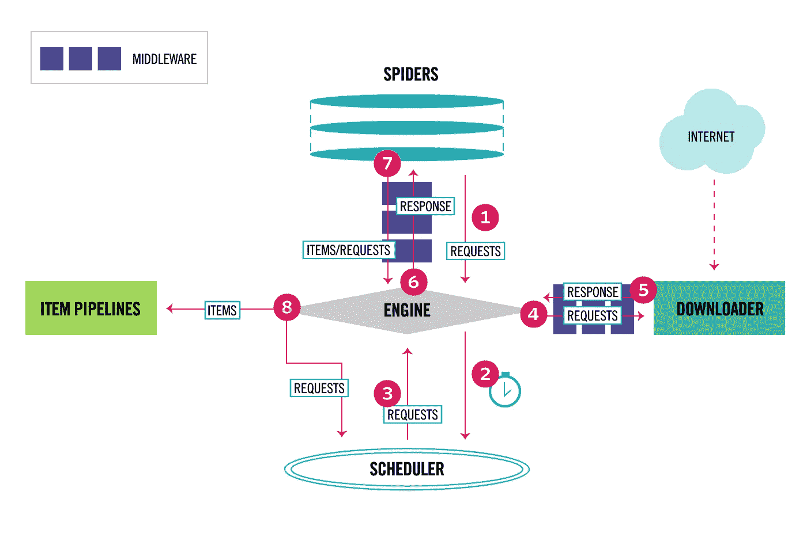
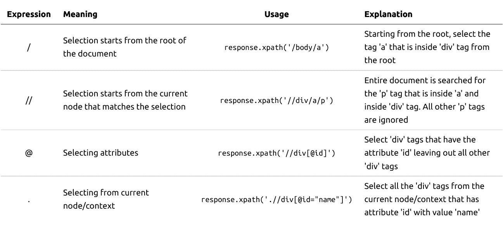

# Scrapy 网络抓取:理论理解

> 原文：<https://towardsdatascience.com/web-scraping-with-scrapy-theoretical-understanding-f8639a25d9cd?source=collection_archive---------4----------------------->

## 网刮系列

## Scrapy 入门


照片由 [timJ](https://unsplash.com/@the_roaming_platypus?utm_source=unsplash&utm_medium=referral&utm_content=creditCopyText) 在 [Unsplash](https://unsplash.com/s/photos/theory?utm_source=unsplash&utm_medium=referral&utm_content=creditCopyText) 上拍摄

在这个知识时代，数据就是一切。它或隐或显地驱动着我们的日常活动。在一个典型的数据科学项目中，数据收集和数据清理约占总工作的 80%。本教程和后续教程将集中在使用 Scrapy 通过网络搜集数据。Scrapy 是一个用于抓取网站和提取结构化数据的应用程序框架，可用于广泛的有用应用程序，如数据挖掘、信息处理或历史档案。

Scrapy 有许多优点，其中一些是:

*   比其他网页抓取工具快 20 倍
*   最适合开发复杂的网络爬虫和抓取工具
*   消耗更少的 RAM 并使用最少的 CPU 资源

尽管有其优势，Scrapy 有一个陡峭的学习曲线和不适合初学者的名声。但是，一旦掌握了，它将成为网络抓取的首选工具。这篇教程是我的一点小小的尝试，让它对初学者更友好。我的目标是让你理解 Scrapy 的工作方式，并让你有信心使用 Python 作为编程语言来使用 Scrapy。要自信地使用 Scrapy，首先必须了解它是如何工作的。

这是关于使用 Scrapy 和 Selenium 进行网络抓取的 4 部分教程系列的第一部分。其他部分可在以下网址找到

[第二部分:用 Scrapy 进行网页抓取:实用理解](/web-scraping-with-scrapy-practical-understanding-2fbdae337a3b)

[第 3 部分:用硒刮网](/web-scraping-with-selenium-d7b6d8d3265a)

[第 4 部分:硒刮网&刮网](https://medium.com/swlh/web-scraping-with-selenium-scrapy-9d9c2e9d83b1)

# 数据流概述



杂乱的数据流(来源:[https://docs.scrapy.org/en/latest/topics/architecture.html](https://docs.scrapy.org/en/latest/topics/architecture.html)

上图清晰简明地概述了 Scrapy 的工作。让我尽可能清晰简单地解释这些步骤。

1.  Scrapy 的主要*工具*蜘蛛向 Scrapy 引擎发送请求。该引擎负责控制框架所有组件之间的数据流，并在特定操作发生时触发事件。这些初始请求启动了抓取过程。
2.  引擎将请求发送给**调度器**，调度器负责收集和调度蜘蛛发出的请求。您可能会问，“为什么需要调度程序？刮难道不是一个直截了当的过程吗？”。这些问题将在下一节中回答。让我们继续工作流程。
3.  调度器将请求分派给引擎进行进一步处理。
4.  这些请求通过下载器中间件发送到**下载器**(在图中由引擎和下载器之间的深蓝色条表示)。关于[下载器中间件](https://docs.scrapy.org/en/latest/topics/architecture.html#component-downloader-middleware)的更多细节，请参考 Scrapy 文档。
5.  Downloader 然后下载请求的网页，生成响应，并将其发送回引擎。
6.  引擎通过蜘蛛中间件将响应从下载器发送到生成请求的相应蜘蛛(在图中由引擎和蜘蛛之间的深蓝色条表示)。你可以在 Scrapy 文档中了解更多关于[蜘蛛中间件](https://docs.scrapy.org/en/latest/topics/spider-middleware.html#topics-spider-middleware)的信息。
7.  Spider 通过提取所需的项来处理收到的响应，如果需要，从该响应生成进一步的请求，并将请求发送到引擎。
8.  引擎将提取的项目发送到项目管道，以供进一步处理或存储。请点击关于[项目管道](https://docs.scrapy.org/en/latest/topics/item-pipeline.html#topics-item-pipeline)的链接了解更多信息。引擎还将生成的请求发送给调度程序，并要求将下一个请求发送给下载器。
9.  重复上述步骤，直到调度器不再有请求可用。

## 为什么需要调度程序？

Scrapy 遵循异步处理，即请求进程不等待响应，而是继续执行进一步的任务。一旦响应到达，请求进程就开始操作响应。Scrapy 中的蜘蛛也以同样的方式工作。它们向引擎发出请求，这些请求又被发送到调度程序。可以有任意数量的蜘蛛，每个蜘蛛发送 *n* 个请求(当然有一个条件。您的硬件的处理能力是极限)。为了处理这些请求，调度程序使用了队列。它不断向队列中添加新请求，并在引擎请求时从队列中调度请求。既然您已经知道需要一个调度器，那么让我来详细说明 Scrapy 是如何处理请求和响应的。

## 处理单个请求和响应

在 Scrapy 中，提出请求是一个简单的过程。要生成请求，您需要想要从中提取有用数据的网页的 URL。你还需要一个*回调函数*。当有对请求的响应时，回调函数被调用。这些回调函数使 Scrapy 异步工作。因此，要发出请求，您需要:网页的 URL 和处理响应的回调函数。为了让您更好地理解，我将使用几行代码。典型的 Scrapy 请求如下所示。

```
scrapy.Request(url="abc.com/page/1", callback=self.parse_page)
```

这里，`url`是要抓取的网页的地址，下载网页后的响应会发送给`parse_page()`回调函数，参数是传递的`response`，如下图所示。

```
def parse_page(self, response):
    # Do your data extraction processes with the response
```

您可以使用 XPath 或 CSS 选择器从响应中提取所需的数据。这个提取过程将在后面的部分解释。蜘蛛可以发出任意数量的请求。最需要记住的是 ***每个请求必须有一个对应的回调函数。***

## 多请求和响应处理

从上一节中，您可能已经理解了如何处理一个请求及其响应。但是，在典型的 web 抓取场景中，会有多个请求。我会尽可能简单地让你理解它的工作原理。让我继续上一节的请求部分。即使这是一个请求，它仍然会被发送到调度程序。根据文档，使用 python 的`yield`关键字将请求创建为 *iterables* 。因此，用 python 的术语来说，请求是使用 python 生成器创建的。产生一个请求会触发引擎将它发送给调度程序，其工作原理前面已经解释过了。类似地，蜘蛛可以使用`yield`发出多个请求。下面是一个例子。

```
def make_requests(self, urls): for url in urls:
        yield scrapy.Request(url=url, callback=self.parse_url)
```

在上面的代码片段中，让我们假设`urls`中有 10 个 URL 需要废弃。我们的`make_requests()`将向调度程序产生 10 个`scrapy.Request()`对象。一旦对其中一个请求有了响应，`parse_url()`回调函数就会被调用。现在让我们深入了解响应处理的工作原理。像请求一样，回调函数也必须`yield`它从响应中提取的项目。让我用上面代码片段中的回调函数`parse_url()`来解释一下。

```
def parse_url(self, response):

    item_name = # extract item name from response using XPath or CSS selector
    item_price = # extract item price from response using XPath or CSS selector# yields a dictionary containing item's name and price
    yield {
        'name': name,
        'price': price,
    }
```

提取的项目可以在需要时使用，也可以存储以供持久使用。回调函数可以返回可迭代的请求、字典、项目对象、数据类对象、属性对象或什么都不返回。欲知详情，请点击[此处](https://docs.scrapy.org/en/latest/topics/items.html#topics-items)。

# Scrapy 的安装和基本操作

我希望你对 Scrapy 的工作原理有一个基本的了解，现在是你开始使用它的时候了。但首先，你需要安装 Scrapy。

## 安装刮刀

Scrapy 可以通过 anaconda 或 pip 安装。

```
conda install -c conda-forge scrapy
```

或者

```
pip install Scrapy
```

对于在其他操作系统上安装或任何其他安装查询，请点击[此处](https://docs.scrapy.org/en/latest/intro/install.html)。

## 创建新项目

现在你已经安装了 Scrapy，让我们创建一个新项目。Scrapy 提供了一个简单的方法来创建新的项目。导航到您想要创建新的 Scrapy 项目的目录，并键入以下命令。我已经将这个项目命名为`tutorial`。您可以自由命名您的项目。

```
scrapy startproject tutorial
```

这将创建一个名为`tutorial`的文件夹，其中包含以下文件和文件夹。

```
tutorial/
├── scrapy.cfg
└── tutorial
    ├── __init__.py
    ├── items.py
    ├── middlewares.py
    ├── pipelines.py
    ├── __pycache__
    ├── settings.py
    └── spiders
        ├── __init__.py
        └── __pycache__
```

让我把你的注意力引向`spiders`文件夹。这是你创造蜘蛛的地方。要了解每个生成文件的用途，请参考这个[链接](https://docs.scrapy.org/en/latest/topics/commands.html#default-structure-of-scrapy-projects)。

## 创造蜘蛛

Scrapy 再次提供了一条简单的线来创建蜘蛛。下面显示的语法使用您提供的参数为新的蜘蛛创建了一个模板。

`scrapy genspider [-t template] <name> <domain>`

有 4 种模板可用，即 4 种蜘蛛类型:`basic`、`crawl`、`csvfeed`、`xmlfeed`。在本教程中，我们将重点关注`basic`和`crawl`蜘蛛。`<name>`参数被设置为蜘蛛的名称，而`<domain>`参数用于生成`allowed_domains`和`start_urls`蜘蛛属性。这些`<name>`和`<domain>`参数都是强制性的。

## 创建一个基本的蜘蛛

要为域`example.com`创建一个基本的 spider，在 spider 项目的根目录下键入以下内容。

```
scrapy genspider -t basic example_basic_spider example.com
```

这将在`spiders`文件夹中创建一个文件名为`example_basic_spider.py`的基本蜘蛛。这个文件的内容应该是这样的。

```
# -*- coding: utf-8 -*-
import scrapyclass ExampleBasicSpiderSpider(scrapy.Spider):
    name = 'example_basic_spider'
    allowed_domains = ['example.com']
    start_urls = ['http://example.com/']def parse(self, response):
        pass
```

让我解释一下生成的模板的组件。

*   `name`:必须填写。Scrapy 通过蜘蛛的名字来识别它们。
*   `allowed_domains`:在抓取网页的过程中，你可能会碰到一个完全指向其他某个网站的 URL。这有助于限制蜘蛛爬行到不必要的域。您可以添加任意数量的想要爬网的域。
*   `start_urls`:指定蜘蛛抓取的起始 URL。您可以从多个 URL 开始。
*   `parse(self, response)`:这是默认的回调函数。您可以编写代码来操作和提取响应中的数据。

您现在可以自由地用您希望抓取的网页地址修改`start_urls`。

***等一下！！您可以看到响应，但是请求是如何生成的呢？(你可能还记得上一节的`scrapy.Request()`)。当 Scrapy 看到`start_urls`时，它会使用`start_urls`中的 URL 自动生成`scrapy.Request()`，并将`parse()`作为回调函数。如果您不希望 Scrapy 自动生成请求，您必须使用`start_requests()`功能来生成请求。我将修改为基本蜘蛛生成的相同代码来说明`start_requests()`。***

```
# -*- coding: utf-8 -*-
import scrapyclass ExampleBasicSpiderSpider(scrapy.Spider):
    """
    Modified Basic Spider to make use of start_requests()
    """
    name = 'example_basic_spider'
    allowed_domains = ['example.com']def start_requests(self):
        urls = ['http://example.com/']
        for url in urls:
            yield scrapy.Request(url=url, callback=self.parse)def parse(self, response):
        pass
```

请注意，Scrapy 生成的代码只是一个模板。它并不要求你遵守它。你可以随意改变它。你可以定义你的回调函数，但是记住在发出请求的时候使用它。

## 创建爬行蜘蛛

既然我们已经完成了基本的蜘蛛，让我们继续学习爬行蜘蛛。要创建爬行蜘蛛，请在蜘蛛项目的根目录下键入以下命令。

```
scrapy genspider -t crawl example_crawl_spider example.com
```

这将在`spiders`文件夹中创建一个文件名为`example_crawl_spider.py`的爬行蜘蛛。内容应该是这样的。

```
# -*- coding: utf-8 -*-
import scrapy
from scrapy.linkextractors import LinkExtractor
from scrapy.spiders import CrawlSpider, Ruleclass ExampleCrawlSpiderSpider(CrawlSpider):
    name = 'example_crawl_spider'
    allowed_domains = ['example.com']
    start_urls = ['http://example.com/']rules = (
        Rule(LinkExtractor(allow=r'Items/'), callback='parse_item', follow=True),
    )def parse_item(self, response):
        item = {}
        #item['domain_id'] = response.xpath('//input[@id="sid"]/@value').get()
        #item['name'] = response.xpath('//div[@id="name"]').get()
        #item['description'] = response.xpath('//div[@id="description"]').get()
        return item
```

你可能会奇怪看到这么多不同于基本的蜘蛛。爬行蜘蛛是一种特殊的基本蜘蛛，它提供内置的方式从`start_urls`中抓取网页，而基本蜘蛛没有这个功能。

你可能已经注意到了主要的区别:`rules`。规则定义了抓取网站的特定行为。上述代码中的规则由 3 个参数组成:

*   `LinkExtractor(allow=r'Items/')`:这是爬行蜘蛛最重要的方面。LinkExtractor 提取正在抓取的网页上的所有链接，并且只允许那些遵循由`allow`参数给出的模式的链接。在这种情况下，它提取以“Items/”开头的链接(`start_urls` + `allow`，即“http://example.com/Items/”)，并使用回调函数`parse_item`为这些提取的链接生成一个请求
*   `callback='parse_item'`:为 LinkExtractor 提取的链接生成的请求的回调函数。
*   `follow=True`:指定蜘蛛是否应该跟随提取的链接。如果设置为`False`，蜘蛛将不会爬行，仅通过`start_urls`停止。

如果你想了解更多的规则，你可以点击[这里](https://docs.scrapy.org/en/latest/topics/spiders.html#crawling-rules)。

***side note:****可以修改基本蜘蛛跨 URL 爬行。这将在本教程的* [***第二部分***](/web-scraping-with-scrapy-practical-understanding-2fbdae337a3b) *中举例说明。*

## 从响应中提取感兴趣的项目

有两种方法可以从响应(即下载的网页)中提取感兴趣的项目/数据。

*   使用 CSS
*   使用 XPath

响应将保持不变，区别只是从中提取数据的方式不同。在这里的例子中，我将使用 XPath 提取感兴趣的项目。选择 XPath 而不是 CSS 的原因是它们提供了更多的能力和功能。我强烈建议您使用 XPath 浏览一下关于[的零碎文档。这里还有一个关于 XPath 的优秀教程](https://docs.scrapy.org/en/latest/intro/tutorial.html#xpath-a-brief-intro)。
我将解释示例中使用的几个 XPath 表达式。



示例 XPath 表达式(图片由作者提供)

## 使用浏览器识别感兴趣项目的标签

打开包含您想要提取的数据的网页。右键点击网页上的任意位置，选择“检查”(Chrome)或“检查元素”(Firefox)。它将打开一个新的面板，显示网页的原始 HTML 版本。当您在 raw 版本上滚动时，网页上相应的元素会高亮显示。向上/向下滚动到要提取的项目，选择该项目，右键单击它，选择“复制”，然后从“新建”菜单中选择“XPath”。如果将复制的 XPath 粘贴到记事本或任何文本编辑器中，您将看到从根到当前项的完整 XPath。现在您已经有了感兴趣的项目的 XPath。您可以使用这个路径作为`response.xpath()`的参数并提取值。

## 使用 XPath 从感兴趣的项目中获取值

使用 XPath 从感兴趣的项目中获取值有两种方法。

`get()`

*   以字符串*的形式返回当前或第一个匹配标签/项目的值*
*   示例:`response.xpath('//div[@id="name"]').get()`使用属性“id="name "”返回“div”标记内的值

`getall()`

*   以列表*的形式返回匹配标签/项目的所有值*
*   示例:`response.xpath('//div[@id="name"]').getall()`返回一个列表，该列表包含属性为“id="name "”的所有“div”标记的值

## 追踪蜘蛛

如果你不能运行蜘蛛，所有这些工作都将是浪费，不是吗？不要担心。运行/执行蜘蛛只需要一行命令。你需要做的就是遵循这个语法:`scrapy crawl <spider_name>`。

让我试着运行我们刚刚创建的两个示例蜘蛛。
`scrapy crawl example_basic_spider`
`scrapy crawl example_crawl_spider`

当您运行蜘蛛时，如果一切正常，没有错误或异常，所有提取的数据将被转储到终端或控制台。要存储这些提取的数据，你需要做的就是给`scrapy crawl`命令添加一个选项。

语法:`scrapy crawl <spider_name> -o <output_file>`

Scrapy 可以以 JSON、CSV、XML 和 Pickle 格式存储输出。Scrapy 还支持更多存储输出的方式。你可以跟随这个[链接](https://docs.scrapy.org/en/latest/topics/feed-exports.html#feed-exports)了解更多。

让我用输出文件重新运行示例蜘蛛。
`scrapy crawl example_basic_spider -o output.json`
`scrapy crawl example_crawl_spider -o output.csv`

在典型的真实场景中，您可能需要使用许多蜘蛛来实现特定的目的。当你有很多蜘蛛时，你可能很难记住所有蜘蛛的名字。Scrapy 来救你了。它有一个命令来列出一个项目中所有可用的蜘蛛。

语法:`scrapy list`

***旁注*** *: Scrapy 有全局命令和项目专用命令。您可以参考这个* [*链接*](https://docs.scrapy.org/en/latest/topics/commands.html#available-tool-commands) *来了解这些命令及其功能。*

## 粗糙的外壳

你已经学会了如何创建、提取数据和运行蜘蛛。但是如何得到满足您需要的正确的 XPath 表达式呢？您不能对 XPath 表达式的每一次试验和调整都运行整个项目。为此，Scrapy 为我们提供了一个交互式 shell，您可以在其中摆弄 XPath 表达式，直到对提取的数据感到满意为止。下面是调用交互式 shell 的语法。

刺儿壳:`scrapy shell <url to scrape>`

一旦 Scrapy 下载了与提供的 URL 相关的网页，您将看到一个带有`In [1]:`的新终端提示。您可以开始测试您的 XPath 表达式或 CSS 表达式，无论您喜欢哪个，通过键入您的表达式与`response`如下所示。

```
scrapy shell [https://docs.scrapy.org/en/latest/index.html](https://docs.scrapy.org/en/latest/index.html)...In [1]: response.xpath('//div[@id="scrapy-version-documentation"]/h1/text()').get()
Out[1]: 'Scrapy 2.2 documentation'
```

您可以在这个交互式 shell 中试验 XPath 或 CSS 表达式。要脱离这个 shell，只需像在 python 交互式 shell 中一样键入`exit()`。我建议你首先利用这个 shell 来设计你的表达式，然后开始你的项目。

# 结束语

至此，本教程的理论部分已经结束。我们先从 [***中的实际例子开始下一部分***](/web-scraping-with-scrapy-practical-understanding-2fbdae337a3b) 。

在那之前，祝你好运。保持安全和快乐的学习。！