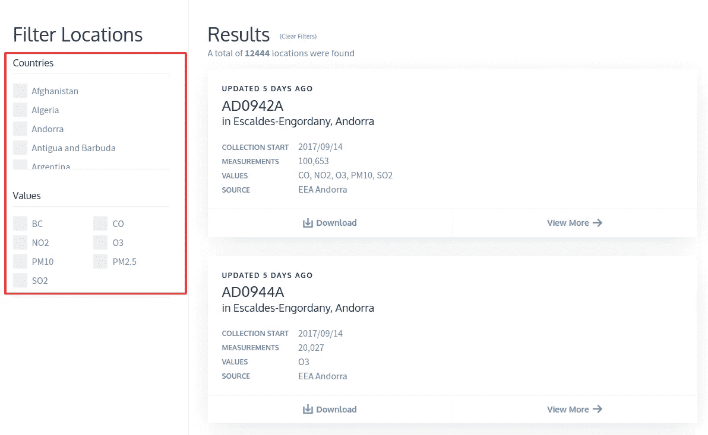
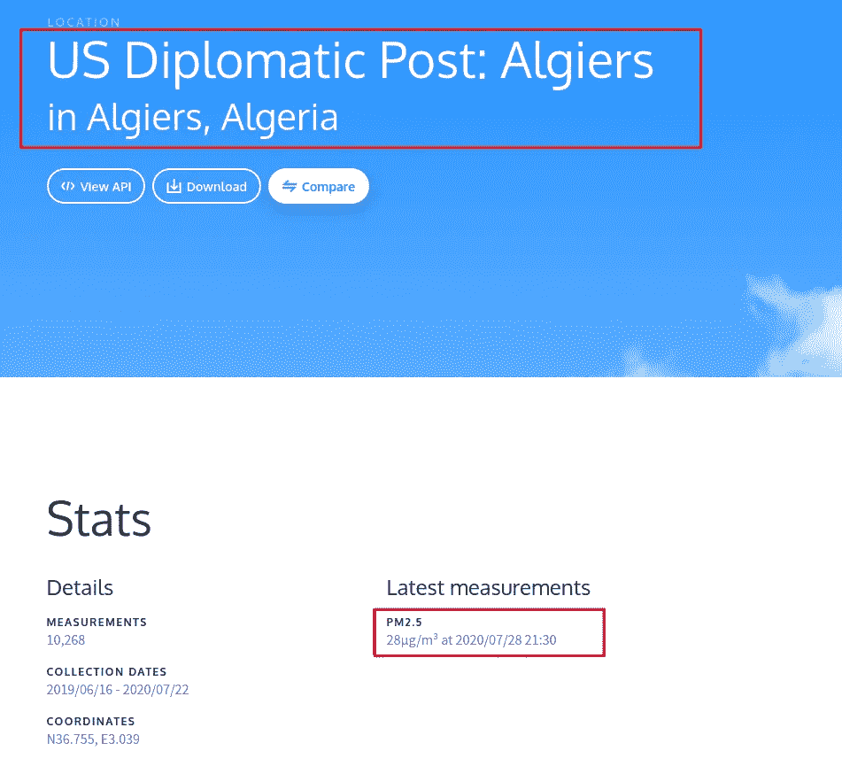

# 用硒刮网

> 原文：<https://towardsdatascience.com/web-scraping-with-selenium-d7b6d8d3265a?source=collection_archive---------7----------------------->

## 网刮系列

## 硒的实际操作


克里斯托夫·高尔在 [Unsplash](https://unsplash.com/s/photos/coding?utm_source=unsplash&utm_medium=referral&utm_content=creditCopyText) 上拍摄的照片

# 概观

Selenium 是用于测试 web 应用程序的可移植框架。它是在 Apache License 2.0 下发布的开源软件，可以在 Windows、Linux 和 macOS 上运行。尽管 Selenium 有其主要用途，但它也用作 web 抓取工具。在不深入研究 Selenium 的组件的情况下，我们将关注对 web 抓取有用的单个组件， ***WebDriver*** 。Selenium WebDriver 为我们提供了通过编程接口控制 web 浏览器来创建和执行测试用例的能力。

在我们的例子中，我们将使用它从网站上抓取数据。当网站动态显示内容，即使用 JavaScripts 呈现内容时，Selenium 就派上了用场。尽管 Scrapy 是一个强大的网络抓取框架，但它对这些动态网站毫无用处。本教程的目标是让您熟悉 Selenium 并使用它进行一些基本的 web 抓取。

让我们从安装 selenium 和一个 web 驱动程序开始。WebDrivers 支持 7 种编程语言:Python、Java、C#、Ruby、PHP、。Net 和 Perl。本手册中的示例是用 Python 语言编写的。互联网上有其他语言的教程。

这是关于使用 Scrapy 和 Selenium 进行网络抓取的 4 部分教程系列的第 3 部分。其他部分可在以下网址找到

[第 1 部分:带 Scrapy 的网页抓取:理论理解](/web-scraping-with-scrapy-theoretical-understanding-f8639a25d9cd)

[第 2 部分:用 Scrapy 进行网页抓取:实用理解](/web-scraping-with-scrapy-practical-understanding-2fbdae337a3b)

[第 4 部分:用硒刮网&刮屑](https://medium.com/swlh/web-scraping-with-selenium-scrapy-9d9c2e9d83b1)

# 安装 Selenium 和 WebDriver

## 安装 Selenium

在任何 Linux 操作系统上安装 Selenium 都很容易。只需在终端中执行以下命令，Selenium 就会自动安装。

```
pip install selenium
```

## 安装 web 驱动程序

Selenium 官方有针对 [5 网络浏览器的网络驱动。在这里，我们将看到两个最广泛使用的浏览器的 WebDriver 的安装:Chrome 和 Firefox。](https://www.selenium.dev/documentation/en/getting_started_with_webdriver/browsers/)

## 为 Chrome 安装 Chrome 驱动程序

首先，我们需要从 Chrome 的官方[网站下载 chromedriver 的最新稳定版本。](https://sites.google.com/a/chromium.org/chromedriver/)这将是一个 zip 文件。我们需要做的就是提取它，并把它放在可执行路径中。

```
wget [https://chromedriver.storage.googleapis.com/83.0.4103.39/chromedriver_linux64.zip](https://chromedriver.storage.googleapis.com/83.0.4103.39/chromedriver_linux64.zip)unzip chromedriver_linux64.zipsudo mv chromedriver /usr/local/bin/
```

## 为 Firefox 安装 Geckodriver

为 Firefox 安装 geckodriver 更加简单，因为它是由 Firefox 自己维护的。我们所需要做的就是在终端中执行下面的代码行，然后您就可以开始使用 selenium 和 geckodriver 了。

```
sudo apt install firefox-geckodriver
```

# 例子

有两个越来越复杂的例子。第一个将是一个更简单的网页打开和输入文本框和按键。这个例子展示了如何使用程序通过 Selenium 控制网页。第二个是更复杂的 web 抓取示例，包括鼠标滚动、鼠标按钮点击和导航到其他页面。这里的目标是让你有信心开始用 Selenium 进行 web 抓取。

## 示例 1 —使用 Selenium 登录脸书

让我们使用 Selenium 和 chromedriver 尝试一个简单的自动化任务，作为我们的训练轮练习。为此，我们将尝试登录一个脸书帐户，我们不会执行任何类型的数据搜集。我假设你对使用浏览器的开发工具识别网页中使用的 HTML 标签有所了解。下面是一段 python 代码，它打开一个新的 Chrome 浏览器，打开脸书主页，输入用户名和密码，然后点击登录按钮。

```
from selenium import webdriver
from selenium.webdriver.common.keys import Keysuser_name = "Your E-mail"
password = "Your Password"# Creating a chromedriver instance
driver = webdriver.Chrome()  # For Chrome
# driver = webdriver.Firefox() # For Firefox# Opening facebook homepage
driver.get("https://www.facebook.com")# Identifying email and password textboxes
email = driver.find_element_by_id("email")
passwd = driver.find_element_by_id("pass")# Sending user_name and password to corresponding textboxes
email.send_keys(user_name)
passwd.send_keys(password)# Sending a signal that RETURN key has been pressed
passwd.send_keys(Keys.RETURN)# driver.quit()
```

执行完这段 python 代码后，你的脸书主页将在一个新的 Chrome 浏览器窗口中打开。让我们研究一下这是如何成为可能的。

1.  这一切都始于为您的浏览器创建一个 webdriver 实例。由于我在使用 Chrome，所以我使用了`driver = webdriver.Chrome()`。
2.  然后我们用`driver.get("https://www.facebook.com")`打开[脸书](https://www.facebook.com)网页。当 python 遇到`driver.get(URL)`时，它会打开一个新的浏览器窗口，打开`URL`指定的网页。
3.  一旦主页被加载，我们使用它们的 HTML 标签的 id 属性来识别文本框以键入电子邮件和密码。这是使用`driver.find_element_by_id()`完成的。
4.  我们使用`send_keys()`发送用于登录脸书的`username`和`password`值。
5.  然后，我们通过使用`send_keys(Keys.RETURN)`发送相应的信号来模拟用户按下回车键的动作。

重要提示:
在程序中创建的任何实例都应该在程序结束时或者在它的目的完成后关闭。因此，每当我们创建一个 webdriver 实例时，必须使用`driver.quit()`终止它。如果我们不终止打开的实例，它就会开始耗尽 RAM，这可能会影响机器的性能并降低速度。在上面的例子中，这个终止过程已经被注释掉，以便在浏览器窗口中显示输出。如果终止，浏览器窗口也将关闭，读者将看不到输出。

## 示例 2 —从 OpenAQ 中收集污染数据

这是一个更复杂的例子。 [OpenAQ](https://openaq.org/) 是一个收集和分享空气质量数据的非营利组织，这些数据是公开的，可以通过多种方式访问。这一点从该网站的 [robots.txt](https://openaq.org/robots.txt) 中可见一斑。

```
User-agent: * 
Disallow:
```

我们的目标是收集 http://openaq.org 上列出的所有国家的 PM2.5 数据。 PM2.5 是指直径小于 2.5 微米的颗粒物(PM)，比人类头发的直径还要小。如果读者有兴趣了解更多关于 PM2.5 的信息，请点击此[链接。](https://blissair.com/what-is-pm-2-5.htm)

选择 Selenium 而不是 Scrapy 的原因是[http://openaq.org](http://openaq.org)使用 React JS 来呈现数据。如果是静态网页，Scrapy 会高效地抓取数据。为了收集数据，我们首先需要分析网站，手动导航页面，并记下提取数据所需的用户交互步骤。

## 了解[http://openaq.org](http://openaq.org)的布局

尽量少用网页导航刮总是比较好的。该网站有一个网页[https://openaq.org/#/locations](https://openaq.org/#/locations)可以作为抓取的起点。



来自 https://openaq.org/#/locations[的截图](https://openaq.org/#/locations)突出显示过滤选项

左侧面板上的过滤器位置选项用于过滤出每个国家的 PM2.5 数据。右侧面板上的结果显示了点击显示 PM2.5 和其他数据时打开新页面的卡片。


来自[https://openaq.org/#/locations](https://openaq.org/#/locations)的截图显示了选择国家和 PM2.5 后的结果

包含 PM2.5 数据的示例页面如下所示。从这个页面，我们可以提取 PM2.5 值，位置，城市，国家，日期和时间记录 PM2.5 值使用 XPATH 或 CSS。



来自 https://openaq.org[的截图](https://openaq.org)显示点击上一张图片中的位置后的 PM2.5 值

同样，左侧面板可用于过滤和收集包含 PM2.5 数据的所有位置的 URL。以下是我们为收集数据而手动执行的操作。

1.  打开 https://openaq.org/#/locations[的](https://openaq.org/#/locations)
2.  从左侧面板中，选择/单击国家/地区的复选框。让我们按字母顺序浏览一下这些国家。
3.  此外，在左侧面板中，选择/单击复选框 PM2.5。
4.  等待卡片装入右侧面板。每张卡片点击后都会打开一个新的网页，显示 PM2.5 和其他数据。

## 收集 PM2.5 数据所需的步骤

根据执行的手动步骤，从[http://openaq.org](http://openaq.org)收集数据分为 3 个步骤。

1.  收集 OpenAQ 国家网页上显示的国家名称。这将用于在过滤时选择适当的复选框。
2.  从每个国家收集包含 PM2.5 数据的 URL。一些国家包含从不同地点收集的 20 多个 PM2.5 读数。这将需要对网页进行进一步的操作，这将在代码部分进行解释。
3.  打开个人网址的网页并提取 PM2.5 数据。

## 抓取 PM2.5 数据

现在我们有了需要的步骤，让我们开始编码。该示例分为 3 个函数，每个函数执行与上述 3 个步骤相对应的任务。这个例子的 python 代码可以在我的 [***GitHub 资源库***](https://github.com/karthikn2789/Selenium-Project) ***中找到。***

## 获取 _ 国家()

有一个[https://openaq.org/#/countries](https://openaq.org/#/countries)网页，可以一次显示所有国家，而不是使用 OpenAQ locations 网页。从这个页面提取国家名称更容易。


来自[https://openaq.org/#/countries](https://openaq.org/#/countries)的显示国家列表的截图

```
from selenium import webdriver
from selenium.webdriver.common.by import By
from selenium.webdriver.support.ui import WebDriverWait
from selenium.webdriver.support import expected_conditions as EC
import jsondef get_countries():countries_list = []# driver = webdriver.Chrome() # To open a new browser window and navigate it# Use the headless option to avoid opening a new browser window
    options = webdriver.ChromeOptions()
    options.add_argument("headless")
    desired_capabilities = options.to_capabilities()
    driver = webdriver.Chrome(desired_capabilities=desired_capabilities)# Getting webpage with the list of countriesdriver.get("https://openaq.org/#/countries")# Implicit wait
    driver.implicitly_wait(10)# Explicit wait
    wait = WebDriverWait(driver, 5)
    wait.until(EC.presence_of_element_located((By.CLASS_NAME, "card__title")))

    countries = driver.find_elements_by_class_name("card__title")
    for country in countries:
        countries_list.append(country.text)driver.quit()# Write countries_list to json file
    with open("countries_list.json", "w") as f:
        json.dump(countries_list, f)
```

让我们了解代码是如何工作的。和往常一样，第一步是实例化 webdriver。这里，不是打开一个新的浏览器窗口，而是将 webdriver 实例化为一个无头窗口。这样，就不会打开新的浏览器窗口，从而减轻了 RAM 的负担。第二步是打开包含国家列表的网页。在上面的代码中使用了*等待*的概念。

*   **隐式等待**:当创建时，它是活动的，直到 WebDriver 对象终止。并且对于所有操作都是通用的。它指示 webdriver 在元素加载到网页之前等待一段时间。
*   **显式等待**:限制于特定 web 元素的智能等待，在本例中，用类名“card__title”标记。一般和`ExpectedConditions`一起使用。

第三步是使用类名为“card__title”的标签提取国家名称。最后，国家名称被写入一个 JSON 文件以便持久保存。下面是 JSON 文件的一瞥。

```
countries_list.json["Afghanistan", "Algeria", "Andorra", "Antigua and Barbuda", ... ]
```

## get _ urls()

获得国家列表后的下一步是获得记录 PM2.5 数据的每个位置的 URL。为此，我们需要打开 OpenAQ locations 网页，并利用左侧面板过滤出国家和 PM2.5 数据。一旦被过滤，右侧面板将被填入记录 PM2.5 数据的各个位置的卡片。我们提取与这些卡中的每一个对应的 URL，并最终将它们写入一个文件，该文件将在提取 PM2.5 数据的下一步中使用。一些国家有 20 多个地点记录 PM2.5 数据。例如，澳大利亚有 162 个位置，比利时有 69 个位置，中国有 1602 个位置。对于这些国家/地区，位置网页的右侧面板细分为多个页面。这是非常必要的，我们通过这些网页导航，并收集所有地点的网址。下面的代码有一个`while TRUE:`循环来执行页面导航的任务。

```
from selenium import webdriver
from selenium.webdriver.common.by import By
from selenium.webdriver.support.ui import WebDriverWait
from selenium.webdriver.support import expected_conditions as EC
from selenium.webdriver.common.action_chains import ActionChains
from logzero import logger
import selenium.common.exceptions as exception
import time
import jsondef get_urls():# Load the countries list written by get_countries()
    with open("countries_list.json", "r") as f:
        countries_list = json.load(f)

    # driver = webdriver.Chrome()

    # Use headless option to not open a new browser window
    options = webdriver.ChromeOptions()
    options.add_argument("headless")
    desired_capabilities = options.to_capabilities()
    driver = webdriver.Chrome(desired_capabilities=desired_capabilities)urls_final = []
    for country in countries_list:# Opening locations webpage
        driver.get("https://openaq.org/#/locations")
        driver.implicitly_wait(5)
        urls = []# Scrolling down the country filter till the country is visible
        action = ActionChains(driver)
        action.move_to_element(driver.find_element_by_xpath("//span[contains(text()," + '"' + country + '"' + ")]"))
        action.perform()# Identifying country and PM2.5 checkboxes
        country_button = driver.find_element_by_xpath("//label[contains(@for," + '"' + country + '"' + ")]")
        values_button = driver.find_element_by_xpath("//span[contains(text(),'PM2.5')]")

        # Clicking the checkboxes
        country_button.click()
        time.sleep(2)
        values_button.click()
        time.sleep(2)while True:
            # Navigating subpages where there are more PM2.5 data. For example, Australia has 162 PM2.5 readings from 162 different locations that are spread across 11 subpages.locations = driver.find_elements_by_xpath("//h1[@class='card__title']/a")for loc in locations:
                link = loc.get_attribute("href")
                urls.append(link)try:
                next_button = driver.find_element_by_xpath("//li[@class='next']")
                next_button.click()
            except exception.NoSuchElementException:
                logger.debug(f"Last page reached for {country}")
                breaklogger.info(f"{country} has {len(urls)} PM2.5 URLs")
        urls_final.extend(urls)logger.info(f"Total PM2.5 URLs: {len(urls_final)}")
    driver.quit()# Write the URLs to a file
    with open("urls.json", "w") as f:
        json.dump(urls_final, f)
```

记录运行时间超过 5 分钟的程序的输出总是一个好的习惯。为此，上面的代码使用了`logzero`。包含 URL 的输出 JSON 文件如下所示。

```
urls.json[
    "https://openaq.org/#/location/US%20Diplomatic%20Post%3A%20Kabul",
    "https://openaq.org/#/location/Kabul",
    "https://openaq.org/#/location/US%20Diplomatic%20Post%3A%20Algiers",
    ...
]
```

## get_pm_data()

从单个位置获取 PM2.5 数据的过程是一个直接的 web 抓取任务，即识别包含数据的 HTML 标签并通过文本处理提取它。在下面提供的代码中也会发生同样的情况。该代码提取国家、城市、位置、PM2.5 值、位置的 URL、记录 PM2.5 值的日期和时间。因为有超过 5000 个 URL 要打开，所以除非安装的 RAM 超过 64GB，否则 RAM 使用会有问题。为了让这个程序在最低 8GB 内存的机器上运行，每 200 个 URL 就终止并重新实例化 webdriver。

```
from selenium import webdriver
from selenium.webdriver.common.by import By
from selenium.webdriver.support.ui import WebDriverWait
from selenium.webdriver.support import expected_conditions as EC
from selenium.webdriver.common.action_chains import ActionChains
from logzero import logger
import selenium.common.exceptions as exception
import time
import jsondef get_pm_data():# Load the URLs list written by get_urls() 
    with open("urls.json", "r") as f:
        urls = json.load(f)# Use headless option to not open a new browser window
    options = webdriver.ChromeOptions()
    options.add_argument("headless")
    desired_capabilities = options.to_capabilities()
    driver = webdriver.Chrome(desired_capabilities=desired_capabilities)list_data_dict = []
    count = 0for i, url in enumerate(urls):
        data_dict = {}# Open the webpage corresponding to each URL
        driver.get(url)
        driver.implicitly_wait(10)
        time.sleep(2)try:
            # Extract Location and City
            loc = driver.find_element_by_xpath("//h1[@class='inpage__title']").text.split("\n")
            logger.info(f"loc: {loc}")
            location = loc[0]
            city_country = loc[1].replace("in ", "", 1).split(",")
            city = city_country[0]
            country = city_country[1]
            data_dict["country"] = country
            data_dict["city"] = city
            data_dict["location"] = locationpm = driver.find_element_by_xpath("//dt[text()='PM2.5']/following-sibling::dd[1]").textif pm is not None:
                # Extract PM2.5 value, Date and Time of recording
                split = pm.split("µg/m³")
                pm = split[0]
                date_time = split[1].replace("at ", "").split(" ")
                date_pm = date_time[1]
                time_pm = date_time[2]
                data_dict["pm25"] = pm
                data_dict["url"] = url
                data_dict["date"] = date_pm
                data_dict["time"] = time_pmlist_data_dict.append(data_dict)
                count += 1except exception.NoSuchElementException:
            # Logging the info of locations that do not have PM2.5 data for manual checking
            logger.error(f"{location} in {city},{country} does not have PM2.5")# Terminating and re-instantiating webdriver every 200 URL to reduce the load on RAM
        if (i != 0) and (i % 200 == 0):
            driver.quit()
            driver = webdriver.Chrome(desired_capabilities=desired_capabilities)
            logger.info("Chromedriver restarted")# Write the extracted data into a JSON file
    with open("openaq_data.json", "w") as f:
        json.dump(list_data_dict, f)logger.info(f"Scraped {count} PM2.5 readings.")
    driver.quit()
```

程序的结果如下所示。该程序从 4114 个单独的位置提取了 PM2.5 值。想象一下打开这些单独的网页并手动提取数据。总的来说，正是这种时候让我们欣赏网络抓取程序或机器人的使用。

```
openaq_data.json[
    {
        "country": " Afghanistan",
        "city": "Kabul",
        "location": "US Diplomatic Post: Kabul",
        "pm25": "33",
        "url": "https://openaq.org/#/location/US%20Diplomatic%20Post%3A%20Kabul",
        "date": "2020/07/31",
        "time": "11:00"
    },
    {
        "country": " Algeria",
        "city": "Algiers",
        "location": "US Diplomatic Post: Algiers",
        "pm25": "31",
        "url": "https://openaq.org/#/location/US%20Diplomatic%20Post%3A%20Algiers",
        "date": "2020/07/31",
        "time": "08:30"
    },
    {
        "country": " Australia",
        "city": "Adelaide",
        "location": "CBD",
        "pm25": "9",
        "url": "https://openaq.org/#/location/CBD",
        "date": "2020/07/31",
        "time": "11:00"
    },
    ...
]
```

# 结束语

我希望这篇教程已经给了你用 Selenium 开始 web 抓取的信心。示例的完整代码在我的 GitHub [***资源库***](https://github.com/karthikn2789/Selenium-Project) 中。在 [***下一篇教程***](https://medium.com/swlh/web-scraping-with-selenium-scrapy-9d9c2e9d83b1) 中，我将向你展示如何将硒与 Scrapy 整合。

在那之前，祝你好运。保持安全和快乐的学习。！