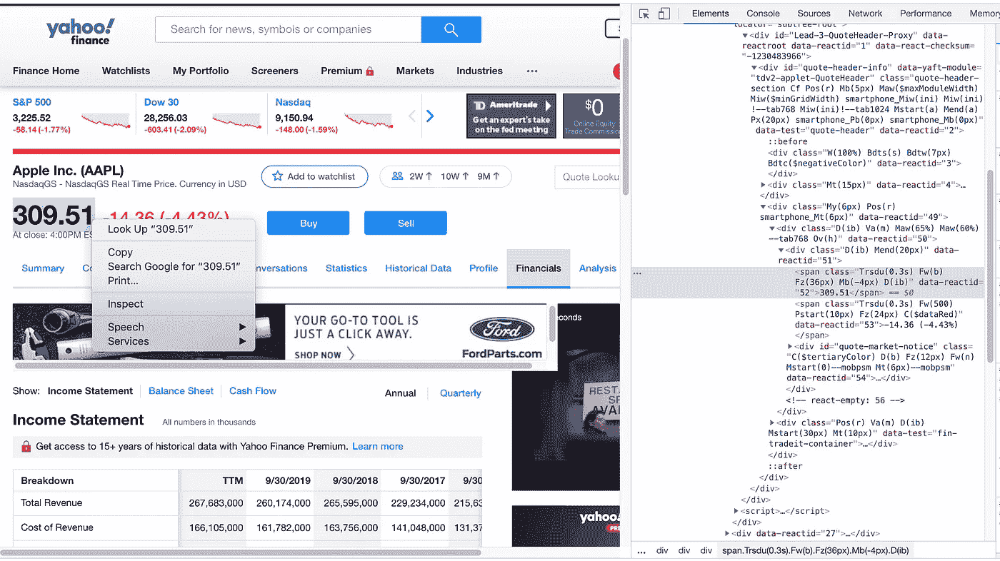
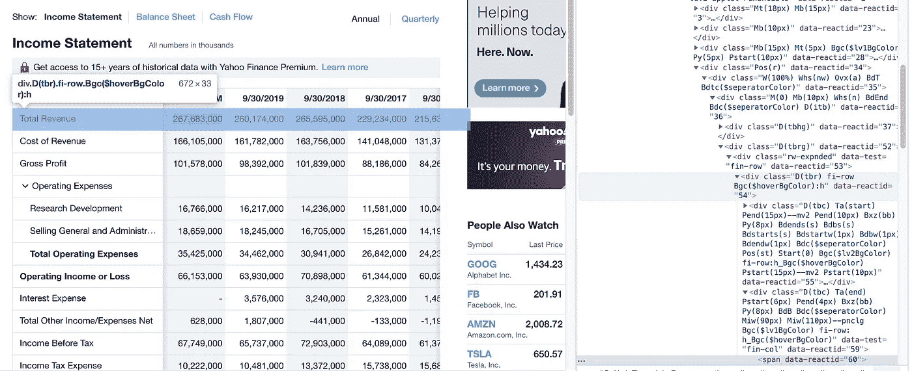
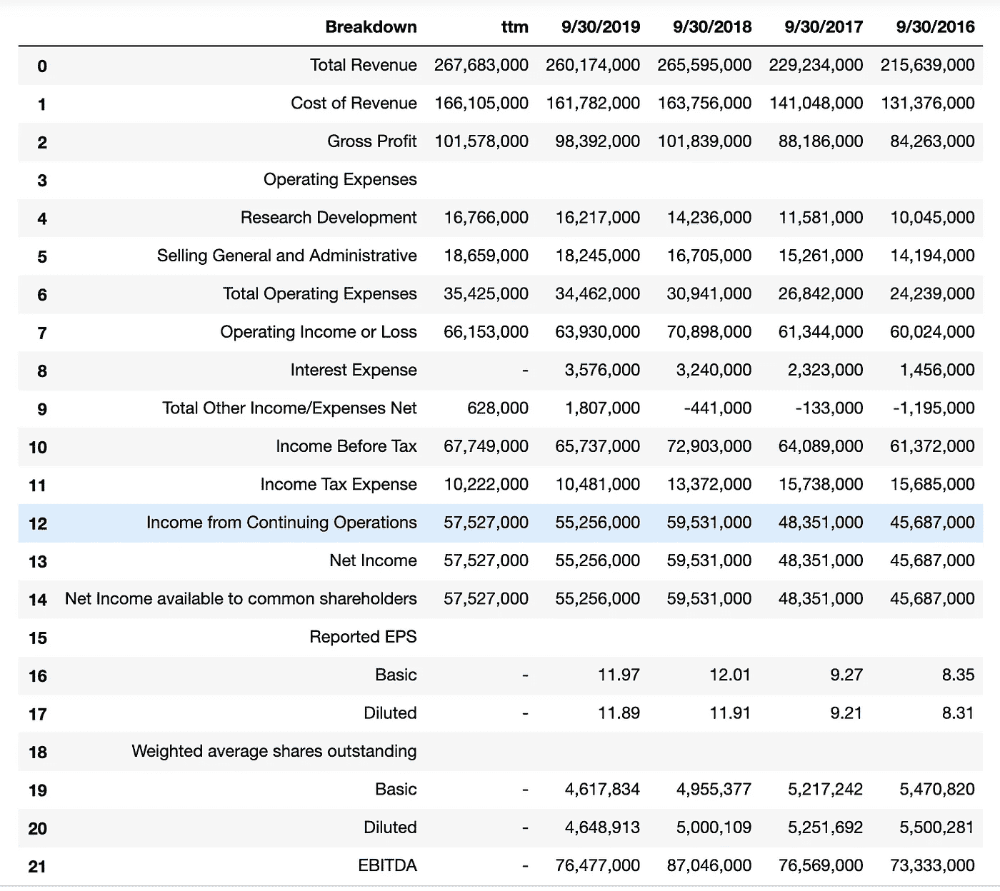
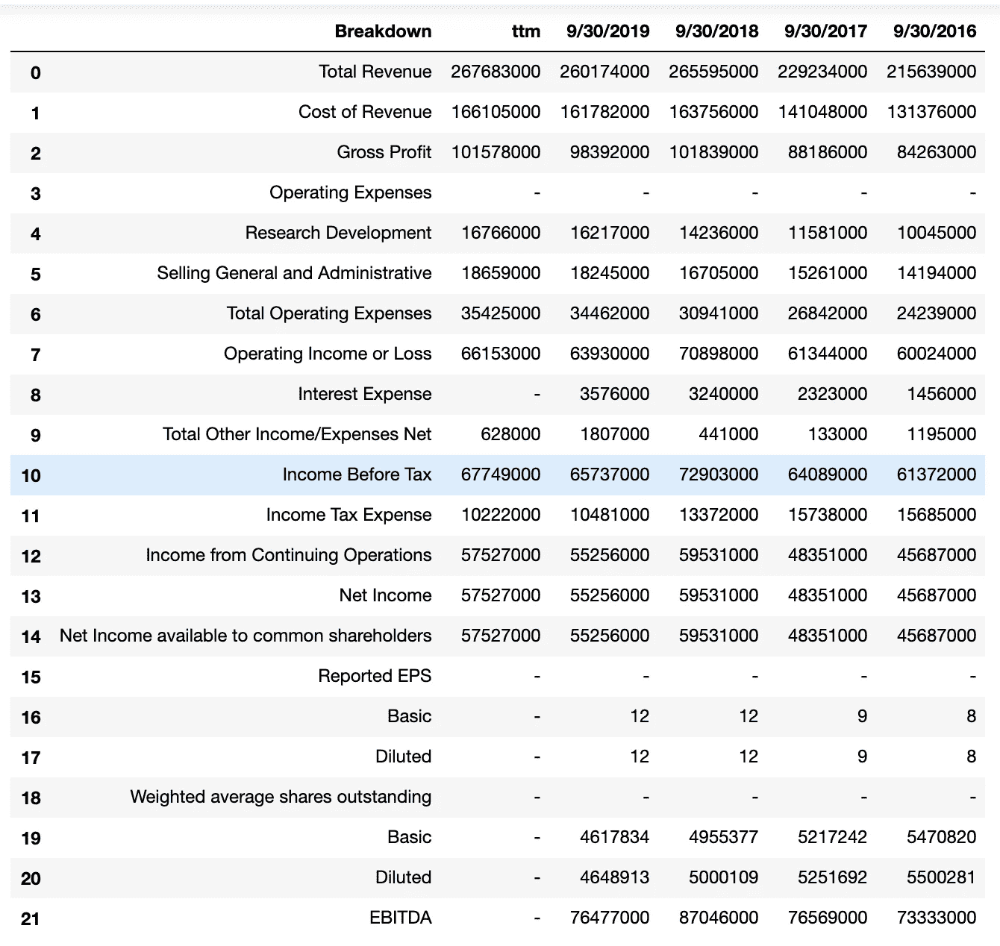

# 网页抓取雅虎财经

> 原文：<https://towardsdatascience.com/web-scraping-yahoo-finance-477fe3daa852?source=collection_archive---------5----------------------->

## 从任何公开交易的公司提取财务报表和股票数据


马库斯·斯皮斯克在 [Unsplash](https://unsplash.com/s/photos/finance?utm_source=unsplash&utm_medium=referral&utm_content=creditCopyText) 上的照片

*这个博客的代码可以在我的* [*GitHub*](https://github.com/rmacaraeg/yahoo_finance) *上找到。*

在商界，了解一家公司的财务状况很重要。查看财务报表是了解一家公司经营状况的好方法。

在这篇博客中，我将用 Python 从雅虎财经的数据库中提取任何公司的财务报表。因为 Yahoo Finance 使用 JavaScript，所以我们结合使用了 BeautifulSoup 和 Selenium

# 导入库

让我们从必要的库开始:

```
import pandas as pd
from bs4 import BeautifulSoup
import re
from selenium import webdriver
import chromedriver_binary
import stringpd.options.display.float_format = '{:.0f}'.format
```

# 设置并运行驱动程序

```
is_link = '[https://finance.yahoo.com/quote/AAPL/financials?p=AAPL'](https://finance.yahoo.com/quote/AAPL/financials?p=AAPL')driver = webdriver.Chrome()
driver.get(is_link)
html = driver.execute_script('return document.body.innerHTML;')
soup = BeautifulSoup(html,'lxml')
```

我更喜欢使用 Chrome 作为我的网络浏览器，但也可以随意使用你最熟悉的浏览器(Firefox、Safari 等)。).我也使用苹果公司作为我的示例公司，但是您可以更改链接中的 AAPL 股票代码到另一家公司的股票代码来更改数据。

上述代码将在虚拟浏览器中打开页面，并提取网站正文中的所有数据。由于 Yahoo Finance 是在 JavaScript 上运行的，所以通过这种方法运行代码会提取所有数据并保存，就像它是一个静态网站一样。这对于拉动股价很重要，因为这些是网页上的动态项目，可以定期刷新/更新。

为了提取股票数据，我们从获取股票价格的位置开始。通过将鼠标悬停在股票价格上，我们可以使用 Inspect 工具找到股票价格的确切语法。



将这些信息转移到 Python 中，代码将如下所示:

```
close_price = [entry.text for entry in soup.find_all('span', {'class':'Trsdu(0.3s) Fw(b) Fz(36px) Mb(-4px) D(ib)'})]
```

这段代码在所有 HTML 代码中搜索“span”标记，并查找与输入的属性相匹配的 class 属性。幸运的是，这只拉了一个数字，即收盘时的股价。

现在我们有了这个，我们可以继续看财务报表了。

# 提取财务报表数据

继续抓取，我们搜索页面以找到所有的 div 容器，并深入一点以找到我们想要使用的特性。我发现财务数据的每一行都存储在一个 div 容器中，该容器有一个公共的 class 属性 **'D(tbr)'** 。在下面的例子中，class 属性中有额外的数据，但是只要第一部分与我们要搜索的内容匹配，它就会提取这些数据。



财务报表上的每一行都存储在一个 div 中

```
features = soup.find_all('div', class_='D(tbr)')
```

这将拉出很多看起来杂乱的数据，让我困惑了一段时间。在深入研究提取的数据后，我使用 find 函数来查看我想要的每行数据在哪里。经过大量的试验和错误，我能够生成只提取财务数据的代码:

```
headers = []
temp_list = []
label_list = []
final = []
index = 0#create headers
for item in features[0].find_all('div', class_='D(ib)'):
    headers.append(item.text)#statement contents
while index <= len(features)-1:
    #filter for each line of the statement
    temp = features[index].find_all('div', class_='D(tbc)')
    for line in temp:
        #each item adding to a temporary list
        temp_list.append(line.text)
    #temp_list added to final list
    final.append(temp_list)
    #clear temp_list
    temp_list = []
    index+=1df = pd.DataFrame(final[1:])
df.columns = headers
```

头与数据的其余部分是分开的，因为当把所有数据放在一起时会引起一些问题。在为财务报表中的数据创建一个标题列表和多个列表后，它将所有内容组合在一起生成一个副本！



它看起来就像苹果的损益表(没有格式化)，但尽管看起来很完整，下一个问题是页面上的所有数字都保存为字符串。如果我们想对它做任何未来的计算，我们必须把它们都变成整数:

```
#function to make all values numerical
def convert_to_numeric(column): first_col = [i.replace(',','') for i in column]
    second_col = [i.replace('-','') for i in first_col]
    final_col = pd.to_numeric(second_col)

    return final_col
```

通过快速 for 循环，我们可以将所有数字字符串转换为整数:

```
for column in headers[1:]:

    df[column] = convert_to_numeric(df[column])final_df = df.fillna('-')
```

这会将所有带编号的字符串转换为实际数字，对于所有 nan，它会被一个破折号替换。

最终产品看起来非常好，现在可以用于计算！



最终损益表

虽然这只是从苹果公司提取损益表，但如果你在资产负债表或现金流量表上使用雅虎金融的链接，代码应该会提取所有细节，并像上面一样将报表放在一起。

我确信有很多额外的工作可以做，以清理这一点，我很乐意在不久的将来使它看起来更像一个官方声明。在继续这方面的工作的同时，我想对数据进行一些深入研究，以找到基本的财务比率，并检查公司估值、投资分析以及我可以从这些数据中挖掘出的其他趋势/发现。敬请期待！

我希望这段代码有所帮助，如果你有任何反馈或建议，我很乐意听到！